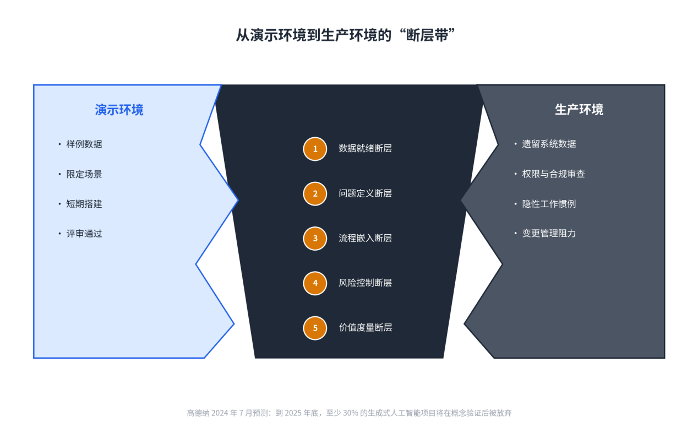
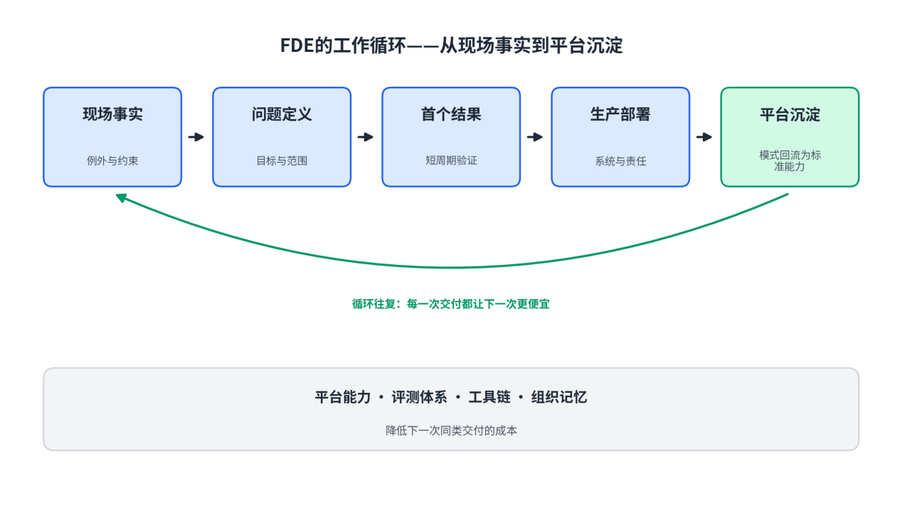
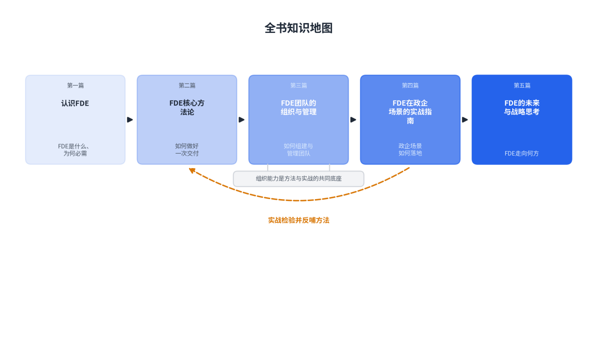
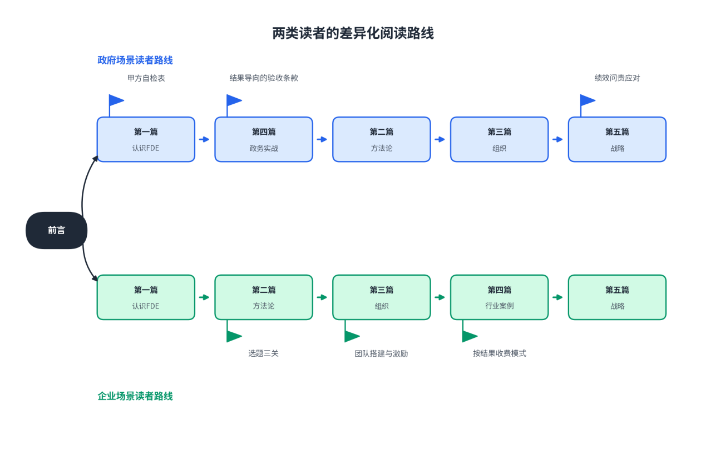

# 前言：为什么需要FDE？

**【本章导读】**

前言回答三个问题：为什么数字化转型在人工智能（Artificial Intelligence，AI）时代依然卡在“最后一公里”；前线部署工程师（Forward Deployed Engineer，FDE）为什么被硅谷与国内的实践者共同视为翻越这道墙的解法？以及这本书写给谁、应当怎样读？如果您是对AI项目部署结果负责的决策者，建议完整阅读本前言；已经熟悉FDE行业背景的读者，可以快速浏览后直接进入正文。

## 0.1 数字化转型的“最后一公里”难题

数字化转型（Digital Transformation）这个词，在中国的政策文件与企业战略里已经出现了十多年。从电子政务到数字政府，从企业资源计划系统上云到数据中台，组织在信息化与数字化上的投入以万亿元计。大语言模型（Large Language Model，LLM）出现之后，一个微妙的变化发生了：做出一个令人惊艳的Demo，变得越来越简单；把Demo变成客户财务报表上的一行数字，依旧空前困难。技术供给曲线陡然向上，价值兑现曲线却几乎平躺——两条曲线之间的那段距离，就是本书所说的“最后一公里”。先把账算清楚：这段距离有多宽，多少人折在里面，以及它为什么不是单靠技术就能填平的。

### （1）传统IT项目的失败率与痛点

信息系统建设项目的低成功率，在人工智能流行之前已是行业内的长期记录。美国Standish Group自1994年起发布CHAOS系列报告，首版统计了365家企业的8,380个项目：按“按期、按预算、按功能交付”的口径，完全成功的项目仅16.2%，53%超支、延期或功能缩水，31.1%在开发周期内被取消；2020年版的口径为约31%成功、50%受挫、19%失败。引用这组数字需要同时交代两点：报告全文为付费内容，上述比例为学界与行业长期转引的通行口径；其方法论存在公开争议，Eveleens与Verhoef在2010年的复现研究中指出，该报告对“成功”的界定仅依据项目初期的时间、预算与功能预测，统计结果容易被误读。这组数字的价值不在精确，而在方向：三十年来，IT项目“不完全成功”是常态而非事故。

中国的样本给出了同一方向上的更近证据。埃森哲与国家工业信息安全发展研究中心合作发布的《中国企业数字化转型指数》连续追踪了这一过程。以“转型成效显著”为口径，2018年首版中达标企业仅占7%，2022年版中这一比例升至17%——数字化转型的整体成功率在缓慢爬升，但始终处于少数派区间。2025年7月发布的最新一版调研了七大行业160余家企业，针对生成式人工智能给出了更细的分层：46%的受访中国企业正在规模化应用生成式人工智能，将其嵌入大部分业务与流程；但有能力以较快速度规模化应用的仅21%；达到“生产效率提升10%以上、收入或利润提升5%以上”这一显著价值标准的仅9%。从46%到21%再到9%的漏斗说明，采用已经不稀缺，稀缺的是把采用转化为结果的能力。

投入一侧的曲线仍在变陡。据中国信息通信研究院（中国信通院）《人工智能产业发展研究报告（2025年）》的公开披露口径，2024年我国人工智能核心产业规模突破9,000亿元，同比增长24%。同一机构在《人工智能发展报告（2024年）》中给出的阶段判断则是：以大模型为代表的通用智能应用仍处于初步探索阶段，行业应用呈现“两端快、中间慢”的特征，研发设计与运营管理环节推进较快，生产制造等核心环节渗透较慢。供给充裕与渗透缓慢并存，表明瓶颈不在技术的可获得性，而在交付过程本身。

把传统IT项目的交付链拆开看，价值损耗分布在每个环节的交接处，而非集中于某一次技术失误。

表0-1：传统IT项目交付链上的典型痛点与后果

| **交付环节** | **典型痛点** | **可观察的后果** |
| --- | --- | --- |
| 需求 | 需求经工单、纪要、周报层层转述，每转述一次失真一层 | 厂商对“翻译件”负责，而不是对痛点本身负责 |
| 采购与签约 | 以功能清单和演示效果作为主要评判依据 | 演示惊艳、领导点头的方案优先，值钱的问题靠边 |
| 实施 | 实施团队按既定方案配置，不接触真实工作流 | 系统功能齐全，但与员工的实际做法格格不入 |
| 验收 | 验收看“有没有”，不看“用不用” | 官方系统空转，员工不愿意使用 |
| 运营 | 交付完代码即离场，知识随人带走 | 人走系统停，续约靠缘分 |
| 厂商侧 | 为单个客户定制，做一单赔一单 | 行业集体沦为“甲方的外包公司”，无人积累产品 |

六个环节指向同一个结构性事实：建造系统的人与使用系统的人分处两个组织，对结果负责的人不参与建造，参与建造的人不对结果负责。需求、预算与验收标准沿链条逐段传递，现场的具体性在每一次交接中损耗一部分，最终建成的系统与真实业务痛点之间出现系统性偏差。这不是任何单一角色的失职，而是分工方式本身的代价。

### （2）AI落地中的“技术－业务”断层

大语言模型没有改变上述分工，反而先放大了它的后果。模型能力以服务的形式廉价供给之后，做出一个令人印象深刻的演示，与把系统接进企业真实的数据、权限体系、合规要求与工作习惯之间，难度相差一个数量级以上，企业人工智能项目因此大量淤积在概念验证（Proof of Concept，PoC）阶段。高德纳（Gartner）2024年7月的新闻稿预测：到2025年底，至少30%的生成式人工智能项目将在概念验证后被放弃，原因集中在数据质量差、风险控制不足、成本攀升与商业价值不明确四个方面；同一新闻稿给出的部署成本区间为500万至2,000万美元。演示的低成本与部署的高难度同时存在，是这一阶段最典型的不对称。

后续研究把项目中止的原因进一步指向数据与组织，而非算法。高德纳2025年2月的新闻稿给出两组数字：到2026年，缺乏“AI就绪数据”支撑的项目中60%将被放弃；基于2024年7月对1,203名数据管理负责人的调研，63%的组织不具备或不确定自己是否具备正确的AI数据管理实践。

把两组数据放在一起，可以看到一条清晰的断裂带：一侧是受控的演示环境，一侧是复杂的生产环境，多数项目中止于两者之间。

图0-1：从演示厅到生产环境的“断层带”

断层的日常形态，是两种评价语言的错位。技术团队汇报准确率、连通率与迭代速度，业务部门核算差错代价、周期变化与责任归属；两类指标之间没有固定的换算关系，项目便停留在“技术指标合格、业务结果缺席”的状态。

表0-2：企业人工智能项目中“技术－业务”断层的典型表现

| **议题** | **技术侧语言** | **业务侧语言** |
| --- | --- | --- |
| 目标 | 模型准确率、召回率 | 出错一次的损失、谁来担责 |
| 进度 | 功能完成度、迭代版本数 | 流程快了多少、人力省了几人 |
| 验收 | 系统可用性、接口连通 | 业务部门是否真的在用 |
| 风险 | 幻觉率、对抗测试 | 报表失真、合规事故 |
| 成功 | 演示惊艳、领导点头 | 工作方式被改变、结果写进报表 |

断层的财务后果，最终表现为投资回报率（Return on Investment，ROI）的缺口，而缺口并不妨碍投入继续增长。国际数据公司（IDC）2025年4月发布的《全球人工智能和生成式人工智能支出指南》显示：2024年全球人工智能IT总投资规模为3,158亿美元，预计2028年增至8,159亿美元，五年复合增长率32.9%；中国占亚太地区人工智能总支出的五成以上，预计2028年总投资突破1,000亿美元，五年复合增长率35.2%，其中生成式人工智能的投资占比将由2024年的18.9%升至30.6%；从行业分布看，软件与信息服务、通讯、银行是人工智能投资规模最大的三个行业。资本与算力供给持续扩张，相当比例的项目却停在概念验证之后，这一对照说明约束增长的已不是技术供给，而是把技术转化为业务结果的交付机制。数据治理、组织协同与变更管理这些“非技术”因素，恰恰是机制设计的对象。

### （3）从“交付项目”到“交付价值”的范式转变

对上述断层的回应，正在形成一种新的交付范式：交付的标的从系统功能转向业务结果，负责的对象从合同条款转向客户的经营指标。计价方式随之变化：按用量计费、按解决量计费、按业务效果分成的合同安排，在人工智能服务采购中开始出现，其共同点是把付款条件与可核验的运营指标绑定。两种范式的差异是系统性的，可以逐一对照。

表0-3：“交付项目”与“交付价值”两种范式的对照

| **维度** | **交付项目（旧范式）** | **交付价值（新范式）** |
| --- | --- | --- |
| 合同标的 | 功能清单、人天投入 | 可衡量的业务结果 |
| 成功定义 | 系统上线、验收签字 | 客户组织的行为改变 |
| 收费逻辑 | 按工时、按项目计价 | 按阶段交付、按结果验收 |
| 度量时点 | 验收时一次性判定 | 开工前锁定靶子，全程度量 |
| 最终裁判 | 信息部门的验收报告 | 业务部门的使用与续约 |
| 知识归属 | 随交付团队离场而流失 | 留在系统和客户团队里 |

新范式成立的前提是价值可度量。2024年2月27日，瑞典支付公司Klarna发布官方新闻稿，披露其基于OpenAI技术的人工智能客服助手上线首月的运行数据：完成230万次对话，占公司客服对话总量的三分之二；工作量相当于700名全职客服；重复咨询量下降25%；平均解决时长由11分钟降至2分钟以内；服务覆盖23个市场、35种以上语言；公司预估该助手将为2024年带来4,000万美元的利润改善。这组数据的参考价值在于口径完整：对话量、人力当量、质量、时效与财务影响同时给出，且4,000万美元明确标注为公司预估而非审计结果。价值一旦被写成这样一组可核验的数，计价与责任就有了对齐的基准：服务费与哪一项指标挂钩、达到什么水平算交付完成，都可以在开工之前约定。

市场一侧的变化同样可测。这一模式由Palantir首创，近年来被头部人工智能公司成建制采用：OpenAI与Anthropic的官方招聘均已开出前线部署工程师岗位，职责覆盖从发现问题到生产上线的完整链条，成功以生产环境的采纳度与可衡量的业务影响来度量；国内厂商也已开始招聘同类岗位。公开招聘文本表明，这一角色的工作方式——嵌入客户组织、依托既有产品平台、对客户的业务结果承担技术责任——是可观察、可核对的公开事实，而非个别公司的内部安排。这个角色的工作方式，可以进一步归纳为一个循环（图0-2）。

图0-2：FDE的工作循环——从现场事实到产品复利

这个循环是本书方法论的骨架。一次交付解决一个客户的具体问题；回流机制把这次交付中验证过的模式变成平台的标准能力，使下一次同类交付不必从零开始。检验循环是否成立的标准很直接：同类问题第二次交付的成本是否显著低于第一次。成本递减，说明交付组织在积累；成本不变，说明它仍停留在项目制。“最后一公里”不是靠一次冲刺走完的，而是靠这个循环一轮一轮缩短的。

## 0.2 这本书为谁而写

本书不面向初级工程师，也不解释编程入门知识。它预设读者具备企业信息化与软件工程的常识，论述重心是组织设计、方法论、管理机制与决策依据。具体说，本书写给四类读者。

表0-4：四类读者的典型痛点与本书回答的问题

| **读者** | **典型痛点** | **本书回答的问题** |
| --- | --- | --- |
| 政府信息化部门负责人 | 项目要过立项、审计与绩效评价，但“建成即闲置”屡见不鲜 | 如何把“结果”写进采购与验收，如何识别换马甲的驻场外包 |
| 企业CTO、技术VP、IT总监 | 功能清单漂亮、业务部门不认账；自建还是外购举棋不定 | 如何组织一支对结果负责的交付力量，如何让技术投入算得出账 |
| 数字化转型项目决策者 | 投过钱、踩过坑，面对新一波人工智能不敢再签 | 如何选对问题、设定毕业标准、设计按结果付费的合同 |
| 信息化企业负责人、FDE团队负责人、人力资源部负责人 | 项目制毛利被定制吃光；新岗位不会招、不会定薪、留不住人 | 这支队伍怎么设计、怎么招、怎么激励、怎么收费 |

对政府信息化部门负责人，本书首先是一副“甲方的眼镜”。政务项目的约束比商业项目更硬：财政资金的绩效问责、审计与巡视、安全合规审查、数据不出域的要求，任何一条都能让项目停摆。过去十几年，不少地方经历过“大屏建成了、数据躺着睡”的教训，面对供应商Demo的心态已经从期待变成麻木。本书提供的不是又一套技术名词，而是可操作的甄别与约束工具：AI项目在单位内部没有明确的业务负责人、只有信息部门在对接；连供应商都看得出这个项目没有真正的主人，财政评审更应该看得出。

对企业CTO、技术VP、IT总监，本书回答的是“账”的问题。技术负责人最尴尬的时刻，是在经营分析会上汇报功能清单与系统可用性，而业务负责人问“利润贡献了多少”“成本节约了多少”。有一个对照值得思考：企业自己关起门来建的系统，成功率只有外购成熟方案的约三分之一——但几乎每一家企业都在试图自己建系统，而自建恰恰是死得最多的那条路。这不是说自建一律错误，而是说决策必须建立在真实的成本与成功率上：组织内部有没有人对“接近真实工作”负责？现场学回来的东西能不能回流产品？本书给出的组织答案，是让同一个小团队扎在一线，发现问题、界定范围、构建部署，避免关键信息在交接缝隙里丢失。

对数字化转型项目决策者——董事长、总经理、首席信息官（CIO）——本书提供的是一套“选题与止损”的经验。经历过上一轮信息化投入的决策者，面对新一波人工智能热潮的普遍心态是：怕错过，更怕再错一次。本书给出的经验可以压缩为三问：这个问题是不是某个具体的人的具体的痛？解决这个问题值多少钱、能不能覆盖投入？以现在的数据现状能做到几分？三关都过，再谈立项；任何一关过不了，晚一点开始比错的时候开始便宜得多。

对信息化企业负责人、FDE团队负责人、人力资源部负责人，本书是一本组织培训手册。中国企业软件行业“项目制”的老大难——定制吃掉毛利、交付完代码作废、收入随人头线性增长——在人工智能时代有了换一种活法的机会，但机会只留给把组织设计对的人：岗位怎么定义，和售前、实施、咨询的边界划在哪里；人怎么招，为什么“能进一线大厂的工程师”只是入场券，面试为什么要用“问题拆解”代替八股；薪酬怎么定，为什么提成占比高的岗位多半是售前换了时髦头衔；以及最根本的，收入模式怎么从“按人头收钱”转向“按结果收钱”。这些问题没有标准答案，但本书给出了可被验证的方案。

## 0.3 本书结构与阅读指引

全书共五篇，沿着“认识—方法—组织—实战—战略”的逻辑展开。五篇的关系不是并列的专题拼盘，而是一个递进的论证：先看清这个角色为什么存在，再学会它做事的方法，然后解决组队与带队的问题，接着进入真实场景的约束里检验，最后抬头看这门生意与这个组织向何处去。

表0-5：全书五篇结构概览

| **章节** | **主题** | **回答的核心问题** |
| --- | --- | --- |
| 第一篇认识FDE | 角色的来龙去脉与企业人工智能项目的失败病理 | FDE是什么、从哪里来、为什么是现在 |
| 第二篇FDE核心方法论 | 一次真实交付的完整方法 | 如何找对问题、界定范围、验证价值、激活部署 |
| 第三篇FDE团队的组织与管理 | 团队形态、人才机制与商业模式 | 这支队伍怎么招、怎么管、怎么激励、怎么收费 |
| 第四篇FDE在政企场景的实战指南 | 政务与重点行业实战、失败复盘 | 在采购、安全、合规的硬约束下怎么干成 |
| 第五篇FDE的未来与战略思考 | 规模化、智能体时代的演进与指标体系 | 这门生意与这个组织向何处去 |

第一篇“认识FDE”回到角色的诞生现场：Palantir怎么被情报机构的保密墙逼出这套打法，这套打法怎么从应急之举升级为公司战略，以及它和企业人工智能项目“坟墓”之间的病理关系——读完后会明白，FDE不是换了个名字的售前，而是软件交付方式的一次改朝换代。

第二篇“FDE核心方法论”沿着一次真实交付的完整旅程展开：怎么在客户现场找到正确的问题，怎么界定范围、用最小的工程投入验证价值，怎么让系统真正被用起来，以及这个角色需要怎样的工具箱。这一篇是全书的操作核心。

第三篇“FDE团队的组织与管理”把视角从个人抬到组织：团队有哪些形态，岗位与相邻角色的边界怎么划，怎么招到并留住“既能进大厂、又坐得住客户现场”的人，薪酬与激励怎么设计，以及收入模式怎么从人天计价转向按结果收费。

第四篇“FDE在政企场景的实战指南”进入硬约束环境：政务场景里的采购、安全审查、数据合规与绩效问责怎么过，金融、制造等重点行业的交付各有什么坑，以及——同样重要的——失败项目长什么样，怎么避免掉入前人的坑。

第五篇“FDE的未来与战略思考”讨论更长的周期：智能体能力的进化会怎样改变交付，规模化靠什么实现，中国市场的本土化路径是什么，以及一套可以直接取用的指标体系与落地路线图。

图0-3：全书知识地图

不同背景的读者，可以选择不同阅读线路。

图0-4：两类读者的差异化阅读路线

政府场景读者的建议路线是：读完前言后，先读第一篇建立完整概念，随即跳到第四篇的政务实战部分——带着采购、安全与验收的现实问题去读，收获最大；然后回到第二篇补方法论，再按顺序读完第三篇与第五篇。政务读者的核心任务不是学会怎么交付，而是学会怎么买、怎么验、怎么问责——看懂乙方的打法，才能当好甲方。

企业场景读者的建议路线是顺序阅读：前言之后，第一篇认清角色与失败病理，第二篇掌握方法，第三篇解决组织与商业模式，第四篇对照行业案例校准自己，第五篇抬头看路。企业读者的核心任务是把“交付价值”从理念落成机制——包括让客户敢为结果付钱、让团队愿为结果负责、让每一次交付都能改善产品。

最后想说一句。整理这本书的材料时，一个朴素的道理反复浮现：复杂的事情，没法隔着屏幕解决，总得有人到场。前线部署工程师不过是把这句大实话，做成了一种职业。愿这本书，帮你把人工智能从演示电脑搬进真实世界。
