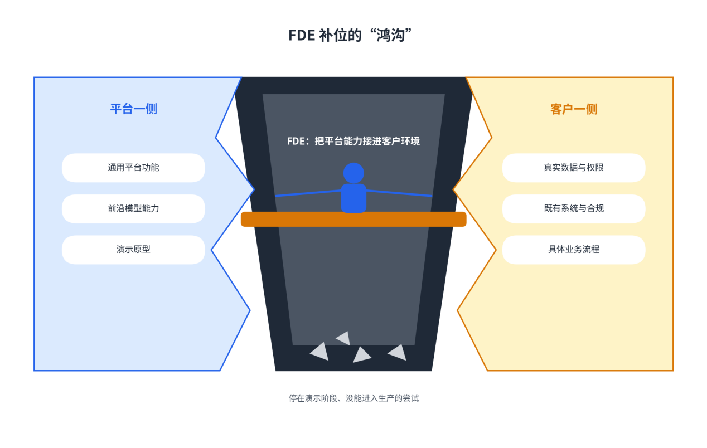
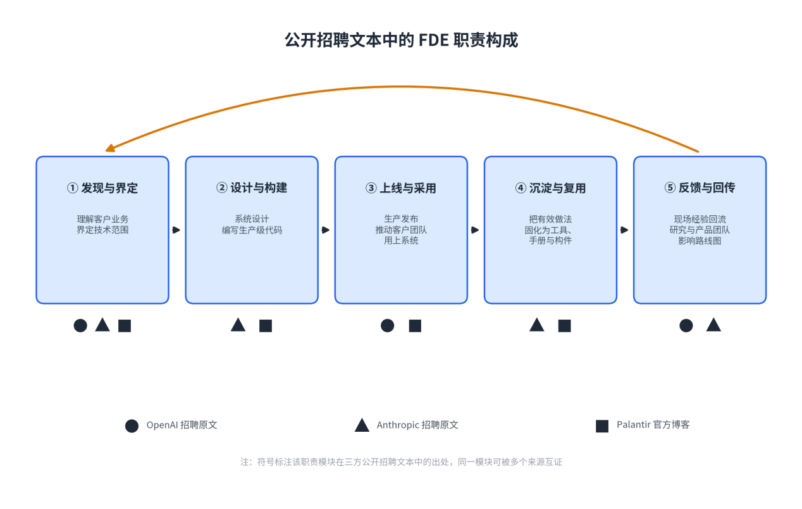
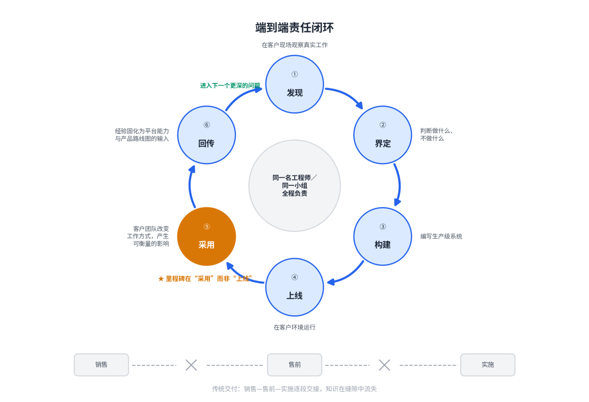
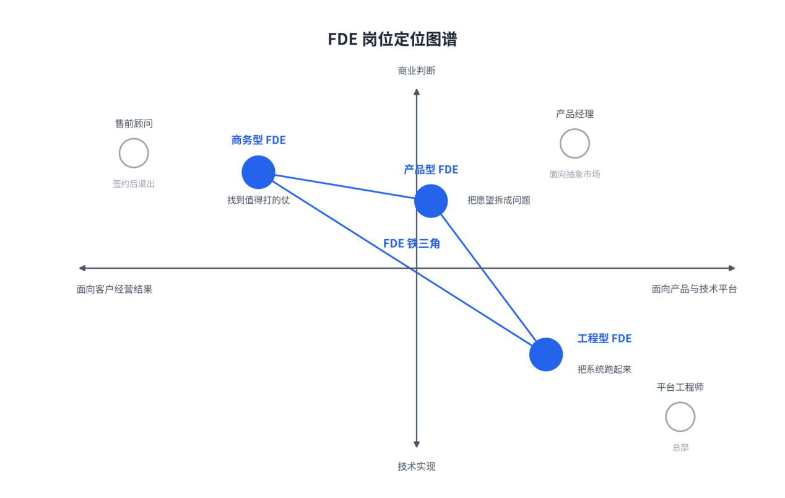
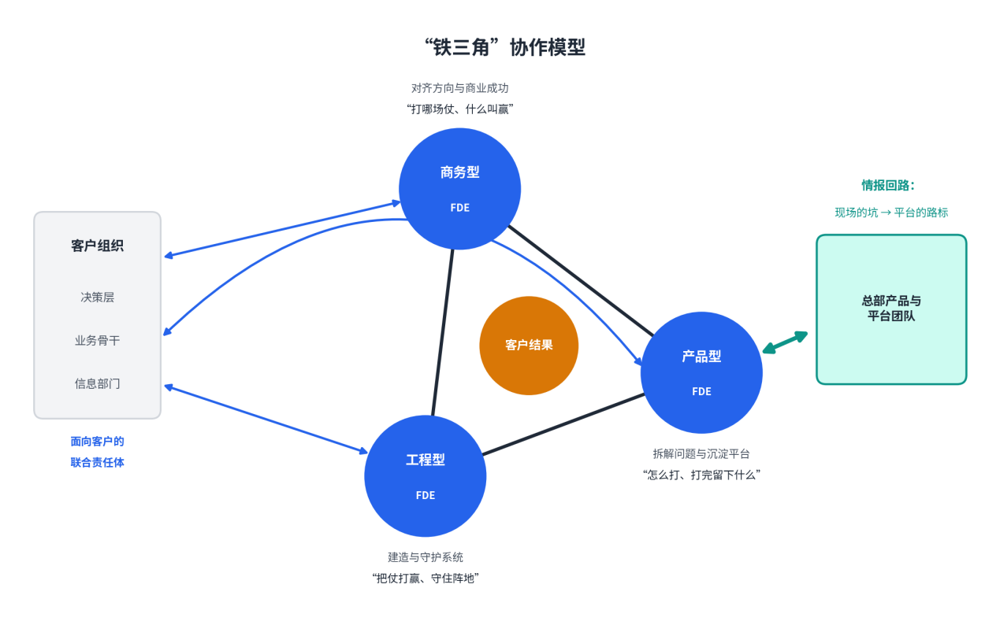

# 第一篇：认识FDE——AI时代的核心交付角色

# 第1章FDE：从概念到实践

**【本章导读】**

FDE是近两年科技行业增长最快的岗位名称，也是被误读最多的一个：有人把它当作售前的新头衔，有人把它当作驻场外包的洋名，也有人把它当作一个什么都要会一点的“超级工程师”。本章回答三个问题：FDE究竟是什么、从哪里来？在一个交付组织里，FDE可以分成哪几种定位、彼此如何协作：它与算法工程师、售前顾问、产品经理、项目经理以及驻场外包的边界各在哪里？本章是全书的概念基础，适合所有读者通读，对正在组建或重组交付团队的技术管理者与人力资源负责人尤为实用。

## 1.1 FDE的定义与内涵

界定一个岗位，最硬的材料不是回忆文章，而是它正被怎样招聘、怎样考核、怎样定价。本节据此分三步回答“什么是FDE”：先交代这个英文名称的由来，再处理中文译名的分歧，最后从公开的一手文本中归纳这个岗位三个稳定的特征。

### （1）Forward Deployed Engineer的原始含义

“Forward Deployed”借自军事用语，指把作战力量预先配置到前沿地带，而不是集中在后方基地；把它安在工程师头上，传达的意思很直白——让工程能力贴着问题工作。

这个名称作为正式岗位名，与Palantir直接相关，该公司官方博客的三篇文章留下了可查证的早期文本。2019年的文章把Forward Deployed Software Engineer定义为“把软件平台部署给客户”的工程师：隶属业务发展条线，任务是“为客户取得技术成果”，并与平台工程师形成分工——平台工程师是“一种能力，服务多个客户”，他们是“一个客户，调动多种能力”。文章同时划清与咨询的界限：咨询交付一次性的分析或建议，Palantir则与客户共建可以持续改进的长期方案。2020年的文章描述了这个角色的日常：直接嵌入客户，配置既有平台，解决客户“最棘手的问题”，所需技能横跨软件开发、数据工程、客户沟通与创造性解题。2022年的文章介绍了与其搭档的部署战略师（Deployment Strategist）角色：理论上一个偏产品经理、一个偏技术，实际工作中两者的边界经常高度模糊。三篇文章给出的画像是稳定的——这是一个嵌入客户、依托平台、为结果负责的工程角色，而不是咨询角色。

这个角色在大模型时代长什么样，头部人工智能公司的招聘文本给出了可核验的答案。OpenAI官方招聘系统在2026年检索时在招801个岗位，其中前线部署工程师系列有21个，分布在旧金山、纽约、西雅图、东京、悉尼、首尔、华盛顿等地，并覆盖政府、法律等垂直方向。团队定位写得明确：与客户合作，“把研究突破变成生产系统”，工作在“客户交付与核心平台开发的交叉点”（本书译）。岗位职责的原文表述是：与最重要的战略客户并肩，主导前沿模型在生产环境的复杂部署，“主导发现、技术范围界定、系统设计、构建与生产上线的全过程”，并“以生产采用、可衡量的工作流影响，以及能改变产品与模型路线图的评估反馈来度量成功”。职责条目还包括：从第一个原型到稳定生产，对多个部署项目的技术交付负责；紧密嵌入客户团队，理解需求并推动客户采用所构建的系统；在进度或理解取决于代码时直接动手写代码；把有效做法固化为工具、手册或他人可用的构件；把现场反馈带给研究与产品团队，说明模型在何处成功、在何处需要改进。任职要求随之抬高：五年以上包含面向客户工作的工程或技术部署经验，在快速变化或高度模糊的环境中界定并交付过复杂系统，能编写并评审生产级代码。

Anthropic官方招聘板挂出的岗位名为“前线部署工程师（应用人工智能方向）”，定位原文（本书译）是：作为应用人工智能团队的成员，“直接嵌入其最重要的战略客户，推动变革性的人工智能采用”，与客户团队协作，“交付解决真实业务问题的高级人工智能应用”；该岗位被描述为创始团队成员之一，要“帮助塑造公司的前线部署打法”。职责条目透露了这个角色在大模型时代的新内容：在客户系统内部用Claude模型构建生产应用；向客户交付可直接用于生产工作流的技术制品，例如连接模型与业务系统的服务组件、子智能体与智能体技能；为企业环境提供“白手套”式的部署支持；识别并固化可复用的部署模式，把洞察回传给产品与工程团队。任职要求包括三年以上面向客户的技术岗位经验与大语言模型生产经验，并强调“高自主性、能在模糊中推进”。

综合这三份一手文本，本书给出的工作定义是：前线部署工程师，是嵌入客户组织、依托可复用的平台底座、对“从发现问题到生产采用”全程负责的工程师。三个限定各有出处：“嵌入客户”，是三份文本中反复出现的embed；“平台底座”，对应Palantir的“配置既有平台”与OpenAI的“核心平台开发交叉点”；“全程负责”，对应OpenAI的“从第一个原型到稳定生产”与Anthropic的“白手套部署支持”。这个定义同时解释了角色的稀缺性：产品开箱即用的地方不需要他；平台能力与客户生产环境之间的落差越深，越需要他（图1-1）。

图1-1：FDE补位的“鸿沟”

把三份文本并排阅读，这个岗位的职责可以归纳为五个模块：发现与界定、设计与构建、上线与采用、沉淀与复用、反馈与回传（图1-2）。五个模块首尾相接，覆盖从“客户还没有把问题说清楚”到“问题被解决、经验被回收”的完整周期。

图1-2：FDE工作重心的四层叠加（2008—2020）

需求端的数字同样直接。36氪2025年9月的报道援引LinkedIn劳动力报告：2023至2025年两年间，全球FDE招聘岗位数量增长42倍，同期人工智能工程师岗位增长13倍。同一报道给出一个中文定义——“既要懂模型和技术，也要理解客户的数据、流程和业务痛点”，核心任务是“把AI从Demo变成各个职业自己的AI-native工作流”。国内市场已经跟进：字节跳动为豆包、飞书产品线招聘FDE，月薪3.5万至7万元、15薪。

### （2）FDE中文翻译辨析：“前线部署工程师”与“驻场交付工程师”

这个英文岗位名进入中文语境后，没有一个译名取得压倒性优势。两个主要译名背后是对岗位身份的两种理解，值得逐一检验。

“前线部署工程师”是直译，完整保留军事隐喻的三层信息：主动靠近问题，而不是等待问题上门；在贴近问题的位置工作；与后方平台保持联动。代价落在中文一侧：“部署”在软件行业已专有所指，意为把软件发布到运行环境，粗心的读者容易把这个岗位误读为“负责上线的运维工程师”；“前线”一词的语气，对偏好稳健表达的政企客户也偏强。国内科技媒体目前多采用这一直译，36氪2025年9月的报道即写作“前线部署工程师”；也有报道写作“前端部署工程师”（界面新闻2026年6月），而“forward”的军事原义是指向前沿配置，“前端”容易与软件开发的前端工种相混，本书不取。

“驻场交付工程师”是意译，好处是沟通成本几乎为零：国内政企客户长期与IT服务商打交道，一听便知道工作方式——人到现场，为交付负责。风险同样具体。“驻场”在国内有太长的使用史，长期与人力外包同义：按人头按月计费，人走事停。使用这个译名，开口之前就先继承了外包的价格预期。“交付”一词又只讲了一半：把系统交给客户是职责的一半，另一半是把现场学到的东西带回产品——后一半在“驻场交付”四个字里没有位置。

名称的不统一在英文一侧同样存在。Palantir官方博客使用“Forward Deployed Software Engineer”；OpenAI的招聘文本同时使用“Forward Deployed Engineer”与“Forward Deployed Software Engineer”；Anthropic的岗位名是“Forward Deployed Engineer, Applied AI”；部分国内报道则把英文名转写为“Forward Deployment Engineer”，与官方拼写有出入。各家修饰语不同，被始终保留的核心是“Forward Deployed”——它描述的是工作位置与姿态，与具体技术栈无关。

表1-1：“前线部署工程师”与“驻场交付工程师”译名对比

| **维度** | **前线部署工程师** | **驻场交付工程师** |
| --- | --- | --- |
| 翻译策略 | 直译，保留军事隐喻 | 意译，贴近国内IT服务语境 |
| 传达的重点 | 主动靠近问题、与平台联动、工程师身份 | 人在现场、为交付负责 |
| 主要歧义 | “部署”易被误解为软件发布上线 | “驻场”易与人力外包混淆 |
| 市场心智 | 新品类，需要解释，但无低价包袱 | 一听就懂，但先背上外包的价格预期 |
| 弱化的信息 | 对不熟悉军事隐喻的读者不够直观 | 弱化了“产品反哺”这半条使命 |
| 典型使用方 | Palantir系叙述、上海官方培训班、本书 | 部分国内服务商面向政企客户的沟通场合 |

本书的取舍是：全书统一使用“前线部署工程师”。理由有两条。其一，它保住了这个名称里最有信息量的部分——岗位的本质不是“人在客户那里”，而是主动贴着问题配置力量，身后还连着一个平台。其二，它与“驻场”在国内市场的外包历史切割，避免这个岗位在报价单上被自动归入人头计费的品类。需要承认，在政务与国企采购的沟通场合，“驻场交付”有现实便利；但组织内部必须清楚，这里讨论的岗位与传统驻场不是一回事。

### （3）FDE的核心特征：现场、端到端、结果导向

剥开各家文本的差异，这个岗位的内涵可以收敛为三个特征：现场、端到端（End-to-End）、结果导向。三者互为条件：不在现场，就做不了端到端；不做端到端，就无法对结果负责。

第一个特征是现场。现场说的不是把工位搬进客户办公楼，而是把工作语境嵌进客户组织：用客户的数据工作，参加客户的会议，理解那些没有写进文档的流程与例外。三份一手文本对这一点表述一致：Palantir官方博客称这个角色“直接嵌入客户”；OpenAI招聘原文要求“紧密嵌入客户团队，理解其需求”；Anthropic招聘原文写的是“直接嵌入其最重要的战略客户”。现场的强度在招聘条款里被折算成具体数字：OpenAI多个岗位标注“出差最高50%”，Anthropic该岗位标注出差约25%。

第二个特征是端到端。传统企业软件把交付切成一串交接：销售签单，售前证明可行，实施负责配置，客户成功追踪使用率。拆分本身没有错，问题出在两次交接之间的缝隙——每个环节都完成了自己的局部任务，关键知识却在缝隙中流失，最终没有人为整体结果负责。FDE的设计，是让同一名工程师或同一个小组穿过这些边界。OpenAI招聘原文对职责的表述几乎就是这个设计的条文：“主导发现、技术范围界定、系统设计、构建与生产上线的全过程”，“从第一个原型到稳定生产，对多个部署项目的技术交付负责”。职责条目的另一半指向回程——“把有效做法固化为工具、手册或他人可用的构件”，“把现场反馈带给研究与产品团队”；Anthropic的原文与之呼应：“识别并固化可复用的部署模式，把洞察回传给产品与工程团队。”去程解决客户的问题，回程把问题变成产品的路标，两端由同一个人负责——这是端到端的完整含义（图1-3）。

图1-3：端到端责任闭环

第三个特征是结果导向。结果导向的意思是：交付的对错，最终只由客户得到的价值来裁决。企业软件史上从不缺少指标漂亮、结果落空的项目：功能清单逐项打勾，真正使用系统的人寥寥无几——每个环节都有人为自己的指标负责，唯独没有人为客户报表上的那行数字负责。FDE模式用三项制度安排，防止“结果”在执行中被稀释。

第一，收费方式向结果靠拢。传统驻场服务按人头、按月计费，收入与投入的人天绑定；FDE模式按阶段交付、按结果验收，收入与客户得到的价值绑定。36氪2026年8月发布的行业观察报告把这条界限划得清楚：FDE不是“更高级的驻场外包”——做完项目只给客户留下一个系统的是外包；把行业通用的经验沉淀为可复用的技能、模板与产品能力，才是FDE。收费方式一变，交付团队的行为会重新排序：工时自然流向能被验收的工作，而不是流向功能清单的长度。

第二，成功度量前置到开工之前。FDE项目的起点不是写代码，而是与客户一起定义“什么叫成”。OpenAI的招聘原文把度量方式直接写进岗位职责（本书译）：“以生产采用、可衡量的工作流影响，以及由评估驱动的反馈来度量成功”——评估体系先于大规模投入建立，靶子在开工前锁定。传统项目的做法相反：上线之后复盘，事后归因，项目容易漂向无法证伪的“探索”。

第三，最终裁判是客户组织的行为改变。里程碑不在系统上线那天，在客户团队改变工作方式那天。财新2026年5月的专栏对这种交付标准有一句准确的概括：“不交报告，只交可运行的系统与可衡量的业务结果。”OpenAI招聘原文中“推动客户采用所构建的系统”，与Anthropic招聘原文中技术制品须“用于生产工作流”，说的是同一件事：系统被真正用起来，交付才算完成。

表1-2：让“结果”不被稀释的三项制度安排

| **制度安排** | **传统做法** | **FDE做法** | **改变的行为** |
| --- | --- | --- | --- |
| 收费方式 | 按人天、按功能清单收费 | 按阶段交付、按结果验收，未解决不收费 | 不再为“没人用的功能”投入，因为成本自担 |
| 度量时点 | 上线后复盘，事后归因 | 开工前与客户共同定义“什么叫成” | 项目不漂向不可证伪的“探索”，靶子提前锁定 |
| 验收裁判 | 功能清单打勾、系统上线 | 客户团队改变工作方式、业务指标移动 | 杜绝“官方系统空转、员工绕道”的假成功 |

三项安排的本质，是把交付方的收入、进度与声誉全部押在客户的结果上；它也不只约束工程师——向上，它约束售前承诺的边界；向下，需求本身的对错也计入交付方的账。这个角色为什么贵，答案就在这里。Anthropic官方招聘板为该岗位标注的年薪区间是20万至30万美元；36氪2025年9月的报道给出更完整的行情：Anthropic入门FDE底薪17万至20万美元、含股权总包30万至50万美元，OpenAI同类岗位底薪21万美元起。薪酬定价的不是工时，是结果责任。

## 1.2 FDE的岗位定位图谱

招聘市场上有一个尴尬的事实：两家公司都在招FDE，工作内容可能毫无交集——一个人在客户机房处理基础设施，一个人在设计行业解决方案，第三个人像产品经理一样收集反馈，第四个人在搭建智能体。把他们放在一起，唯一稳定的共同点只剩“离客户很近”。

《FDE入门到精通：八堂课学会将AI送进客户现场》把这项工作拆成五层，对组织设计很有帮助：事实层，观察人怎样工作；判断层，追问真正目标，压缩范围；工程层，接入数据、权限与既有系统并处理故障；产品层，把跨客户重复出现的模式变成平台的标准能力；组织层，让各方对成功标准保持同一理解。单个人很少在五层都做到顶尖，成熟的FDE体系靠团队组合互补，而不是寻找神话人物。沿着五层工作的职责重心，本书把FDE分成三种定位：商务型、产品型、工程型。需要先说明：三型是职责重心的分法，不是三个职级，也不必然等于三个人头；三型之间也没有高下之分，一个健康的FDE组织，三种浓度都需要。

图1-4：FDE岗位定位图谱

表1-3：三类FDE的职责侧重与衡量口径

| **维度** | **商务型FDE** | **产品型FDE** | **工程型FDE** |
| --- | --- | --- | --- |
| 核心职责 | 读懂客户组织，对齐成功标准与商业安排 | 把抽象愿望拆成可验证的问题，设计方案 | 把方案变成跑在生产环境里的系统 |
| 对应的工作层 | 组织层、判断层 | 事实层、判断层、产品层 | 工程层 |
| 典型产出 | 成功标准、采纳路径、扩展机会 | 问题定义、方案设计、平台能力建议 | 生产系统、集成方案、运维保障 |
| 主要协作对象 | 客户决策层、销售 | 客户业务骨干、总部产品团队 | 客户信息部门、总部平台团队 |
| 衡量口径 | 客户是否把下一个更贵的问题交过来 | 现场产出沉淀回平台的比例与复用次数 | 生产可用性、交付周期、客户能否独立使用 |

### （1）商务型FDE：客户关系与商业洞察

商务型FDE面对的核心问题是：这场仗值不值得打、什么叫打赢。他的日常工作是读懂客户组织的使命、决策链与各相关方——谁拥有这项流程，谁承担失败的风险，谁能在关键时刻拍板；把客户的经营语言翻译成团队的成功标准；在交付过程中识别下一个值得解决的问题。

企业客户被辜负过太多次，对一切幻灯片免疫，商务型FDE靠两个动作重建信任。一是动手：在客户自己的数据上、环境里，当场做出能跑的东西。Palantir的训练营（Bootcamp）把这种信任生产流程化了：客户带真实数据来，一到五天做出能部署的原型，高管亲手点着用——早期训练营的付费转化率只有5%到10%，公司披露的后期转化率已接近75%。二是诚实：敢对客户的错误前提说不。

商务型FDE与销售之间必须划一条行为红线：激励可以与客户经理对齐，但不背硬性销售指标——那会把行为引向签单，而不是结果。一位分析了五十份招聘启事的作者给出过一块试金石：看这个岗位的薪酬包里有没有销售提成，提成占比高的，多半是售前换了个时髦头衔。Palantir内部与这个功能最接近的角色是部署战略师（Deployment Strategist），负责读懂客户的使命、相关方与采纳路径。衡量商务型FDE的标准，不是他经手的合同额，而是客户愿不愿意把下一个更贵的问题交过来。

### （2）产品型FDE：需求拆解与方案设计

产品型FDE面对的核心问题是：客户真正要解决的是什么。客户带来的往往是方案而不是问题——“请把你们的人工智能接进我们的财务流程”，这句话无法直接写成代码：是哪一段财务流程？自动化出错的损失是一封邮件发错，还是财务报表失真？产品型FDE的第一项功夫，就是把抽象愿望改写成可验证的问题，然后做出方案设计：先做什么、不做什么，人机怎么分工，异常怎么兜底。

他同时是公司产品线的前哨与情报官，这是FDE体系与传统交付团队最本质的区别。麦格鲁有一个著名比喻：FDE在客户现场修出一条条通往价值的“碎石路”，产品团队判断哪些碎石路值得拓宽硬化，变成服务下十个客户的“柏油路”——把不可规模化的事，规模化地做。判断标准很朴素：三个客户撞上同一个集成缺口，那不是三桩麻烦，那是一条产品情报；五个部署都需要同一种工作流，那就该抽象成平台的下一个标准能力。前Palantir工程师Barry回忆，Foundry的关键组件诞生于苏黎世、休斯敦、图卢兹等客户现场，最后反哺为年收入数十亿美元的产品。

### （3）工程型FDE：系统交付与技术集成

工程型FDE面对的核心问题是：让系统在客户的环境里真的跑起来、稳得住。他要接数据、调接口、穿权限、过安全审查、上线、处理故障——凌晨两点系统挂了，不提工单，不怪别人，修好它。

这个角色对技术宽度的要求高于对单点深度的要求：写得了代码，调得了接口，懂数据管道，能上云，摸得准大模型的脾气，还得懂企业环境的“水电煤”——单点登录、权限体系、合规认证。他不需要是某个领域资深的专家，但必须能在客户现场独立解决全栈问题，因为现场没有条件把问题层层转包回总部。硅谷人工智能客服公司Cresta的FDE负责人Jove有一条招聘硬杠：智能体时代，不会写代码就像文盲。他同时强调，FDE必须绑定在一个人工智能平台上才有意义——如果只是做传统的数据对接和系统搭建，跟传统实施工程师就很难区分。这划出了工程型FDE与传统实施工程师的分界：前者带着产品底座做工程，后者在既定产品的边界内做配置。

衡量工程型FDE的口径，除了生产可用性、交付周期、故障恢复这些硬指标，还有一条软指标：客户团队能不能独立使用。系统的最终状态，是不依赖他的存在。

### （4）“铁三角”协作模型

既然三型职责对单个人的要求高到近乎荒诞——2026年的招聘启事确实常常如此：既要有多年资深工程师经验，又懂销售、架构与项目管理，最好还善于教学——那么正确的组织答案不是继续寻找全能英雄，而是把三型配成小组。这不是招聘者相信全能人才存在，而是交付链条尚未稳定，许多本该由多个角色承担的责任被暂时压缩进了FDE这个名字；成熟的组织会把这些责任重新拆开，分给三角形的三个顶点。

最小作战单元来自Palantir的双人组合：一人负责读懂客户的使命、相关方与采纳路径，一人负责技术实现——一个诊断，一个建造，缺一不可。本书在此基础上提出“铁三角”协作模型，把最小单元扩展为完整配置。

图1-5：“铁三角”协作模型

这个模型有几条协作规范。其一，同一成功标准：开工之前，三个顶点共同与客户确认“什么叫成功”，任何一型缺席，标准都会失真。其二，无交接缝隙：关键信息不靠层层转述，靠共同在场，三个顶点共享同一个现场语境。其三，团队即界面：客户关系的载体是团队而不是某一个人，关键岗位要有备份，避免“客户只认识一个人”的单点风险。其四，回路必通：现场踩的每一个坑都要流回平台团队——没有这条回路，铁三角就退化为传统项目制。

对于中国读者，这个模型不陌生：政务与大型企业信息化项目里常见的“客户经理＋方案架构师＋交付工程师”三人小组，与“铁三角”同构。真正的差别不在形状，而在两点：身后有没有可复用的产品底座，现场知识有没有回流平台的通道。两条都有，是FDE组织；两条都没有，即便换上FDE的名片，实质仍是传统项目制。

## 1.3 FDE与传统角色的区别

为什么值得专门辨析边界？因为组织设计中最常见的错误，是把FDE的编制塞进旧的岗位格子里：让售前团队改个名字，让外包供应商换个报价单，然后期待行为自动改变。边界不清的代价是具体的：招错人、考错核、定错价，最后得到一个既没有交付结果，也没有沉淀能力的“四不像”团队。下面逐一对比五类最容易混淆的角色。表1-4先给出前四类的总览，驻场外包对国内读者而言格外关注，单列详述。

表1-4：FDE与四类传统角色的区别

| **维度** | **算法工程师** | **售前顾问** | **产品经理** | **项目经理** | **FDE** |
| --- | --- | --- | --- | --- | --- |
| 优化对象 | 模型指标 | 赢单概率 | 产品路线图 | 范围、进度、成本 | 客户的业务结果 |
| 工作语境 | 总部、干净数据、可复现实验 | 签约前、会议室与演示 | 抽象用户、市场与数据看板 | 计划、资源与干系人 | 客户现场、脏数据、真实约束 |
| 典型交付物 | 模型与实验报告 | 方案与幻灯片 | 需求文档与路线图 | 项目计划与验收单 | 跑在生产环境里的系统 |
| 成功标准 | 基准提升 | 签约 | 功能被广泛使用 | 按计划完成 | 客户改变工作方式 |
| 责任终点 | 模型交付 | 合同签署 | 需求被实现 | 项目结项 | 客户团队能独立使用 |

### （1）与算法工程师的区别

算法工程师对模型负责，FDE对客户的结果负责——这是两者最根本的分野。算法工程师的战场在数据集与基准测试上：干净数据、可复现实验、可精确归因的指标。FDE的战场在客户现场：数据是“脏”的，权限是有边界的，流程是有例外的，环境是不可复现的。一位物流人工智能公司的部署负责人总结得很直白：人工智能落地，很少败在模型，几乎都败在上下文。

两者的评价语言也不同。普通工程面试里，“我把查询优化了40%”是满分答案；FDE语境里的满分答案是：“我把查询优化了40%，这让客户的分析师每天提前两小时拿到报表。”技术成就必须换算成客户语言，才能构成这个岗位的成绩。

需要强调的是，两者不是替代关系，而是协作关系。OpenAI与约翰迪尔的合作展示了标准打法：驻场团队先与农艺专家一起评审数百个真实作业案例，建起定制评估体系，模型团队再据此迭代——现场定义“什么算好”，总部负责“做得更好”。麦格鲁的判断可作注脚：人工智能平台值钱的部分长在“模型之外和企业其余部分打交道”的那一层；模型越强，这一层越值钱。

### （2）与售前顾问的区别

“售前顾问”在国内语境里常同时覆盖售前工程师与咨询顾问两类角色，都与FDE有清晰边界。

售前工程师的工作在签约前结束，目标是赢单，作品是幻灯片与概念验证；FDE的工作在签约后才进入深水区，目标是赢结果，作品是跑在生产环境里的系统。售前负责让客户相信“这事能成”，FDE负责让这事真的成。两者的行为模式几乎相反：售前倾向于放大产品的能力边界，FDE必须诚实地收缩它。

咨询顾问按项目交付建议，对执行不负责；FDE对系统的最终运转负责，终点是“客户团队能独立使用”。Anthropic与金融科技公司FIS的合作是个标本：工程师嵌入FIS共建反洗钱智能体，把一次调查从几小时压到几分钟，但合作写明的目标不是交付系统，而是“转移知识，让FIS以后能自己建智能体”。顾问的生意建立在客户持续的需要上；FDE干没干成，标准正好反过来——客户哪天不再需要你，才说明你干成了。摩根大通的一位技术负责人在谈与平台厂商的共建时说得很直白：“我们要的不是更多顾问，是能造出还不存在的东西的工程师。”

识别“售前顾问”与FDE看三件事：什么时候离场，靠什么收费，留下什么。签约即离场的是售前，项目结束离场的是顾问，干到生产采用才撤、留下系统和客户团队的，才是FDE。

### （3）与产品经理的区别

产品经理面对抽象的用户，FDE面对具体的客户。产品经理的世界由画像、漏斗、日活跃用户数构成；FDE面对的是一家银行的风控部、爱荷华州的农场、巴格达郊外的巡逻队，是有名有姓的具体的人。

Palantir官方博客对两类工程师的划分最见边界感：平台工程师负责“一种能力，服务多个客户”，前线部署工程师负责“一个客户，调动多种能力”。前者追求一个功能到处能用，后者追求先把眼前这一个客户的问题彻底解决。在Palantir干了近八年前线部署的纳比尔·库雷希把这条原则讲成一句糙话：“去他的可泛化性”——先把眼前这个客户救活，能不能复用到下一家，是平台团队的事。

两者都做产品判断，差别在位置与验证方式：产品经理的判断在路线图会上做出，用市场数据验证；FDE的判断在现场做出，用生产环境验证，并且亲手落成系统——产品经理通常不写生产代码，FDE写。两者之间是一条输送带而非一堵墙：FDE把“多个客户重复出现的模式”交回，产品经理决定哪些进入正式路线图。组织上要防两个方向的错误：让FDE兼任全职产品经理，会失去现场手感；让产品经理顶替FDE，判断就没了现场摩擦。

### （4）与项目经理的区别

项目管理知识体系里也有一个“铁三角”：范围、进度、成本。项目经理对这三个约束负责，交付物是“按计划完成”。这里藏着与FDE最微妙的一层区别：三个约束全部满足、业务结果没有发生，在项目管理视角下仍可能是“成功的项目”，在FDE视角下是彻底的失败。两个“铁三角”是同一个词下的两种世界观：一个是商务、产品、工程三种能力的协作，另一个是范围、进度、成本三条约束的权衡。

工作方式上，项目经理协调资源、管理风险、跟踪里程碑，通常不亲手建造；FDE亲自写代码、接数据、改方案，建造本身就是他的管理手段。对需求的态度差异更大：项目经理默认需求正确，职责是控制变更；FDE连需求本身的对错都算自己的账——“我按需求做完了”不是免责理由，因为错误的需求被忠实地实现，依然是客户的损失。

二者在大型项目中可以共存：政务与金融项目中，项目经理管合规流程、多方协调与进度基线，FDE管问题定义与系统结果。真正的风险是让项目经理顶替FDE——流程一丝不苟地走完了，价值没有来。

### （5）与驻场外包的本质不同

驻场外包是国内IT服务市场的长期形态：按人头按月计费，工程师编入客户团队接受日常管理，干的是客户分配的活儿。先把话说公道：它解决了企业用人的弹性问题，今天仍有适用场景。问题不在驻场外包本身，而在把FDE混同于它——这个混淆对买方和卖方都是灾难，所以必须单列一节。

国内第一批打出FDE旗号的服务商启盟科技，在官网用三句话划清了界限：驻场按工时算钱，FDE按阶段交付、按结果验收；驻场从零现写，FDE带着产品底座来做工程；驻场越驻越久、人走系统停，FDE做完会走，能力留在系统和客户团队里。这三条对应着商业模式、工程起点与知识归属三个维度的本质不同。

商业模式上，外包卖的是工时，收入随人头线性增长，毛利被工资单死死封顶；FDE卖的是结果，身后有一个产品底座，每做一单，平台变厚一分，下一单的边际成本下降。Cresta的Jove把这一点讲得很透：FDE必须绑定在一个人工智能平台上才有意义，否则跟传统实施工程师或外包就很难区分。反过来说，一家没有人工智能平台的公司强推FDE，结局早已写好——只能不断手工定制，最终变成软件外包。平台底座，就是FDE与驻场外包在经济学上的分界线。

知识归属上，这是最容易被忽略，也最致命的一条。驻场外包的知识随人走：驻场三年，经验长在了工程师个人身上，人一走，客户系统没人接得住，乙方也没沉淀下任何可复用的资产。FDE的知识是双向沉淀的：一头流向客户团队——培训、文档、能力转移，终点是“客户能独立使用”；另一头流回自家平台——现场的坑变成产品的路标。

表1-5：FDE与驻场外包的本质区别

| **维度** | **驻场外包** | **FDE** |
| --- | --- | --- |
| 计费方式 | 按人头、按工时 | 按阶段交付、按结果验收 |
| 工程起点 | 从零现写 | 带着产品底座，做最后一段定制 |
| 与客户的关系 | 编入客户团队，接受日常管理 | 联合责任体，共同定义并交付结果 |
| 驻留时间 | 越驻越久，形成依赖 | 做完会走，终点是客户独立使用 |
| 知识归属 | 随人走，人走系统停 | 双向沉淀：留在客户团队、流回平台 |
| 成本结构 | 收入随人头线性增长 | 平台复利，下一单边际成本下降 |

对采购方的提醒同样必要：用采购外包的方式采购FDE——按人天压价、要求长期驻场不许退出、合同里只有工时条款——就会把FDE团队逼回外包的行为模式，因为给钱的方式会塑造人的行为。检验一份合同是不是FDE模式，看三条：有没有结果验收条款，有没有退出与能力转移安排，乙方有没有自己的产品底座。

最后需要直面一个严肃的质疑。《华尔街日报》把问题摆上了桌面：这套打法更像咨询，而不是软件；嵌入式人才太贵，能不能规模化，还是悬案。本书的判断是：这个质疑恰好成立在“伪FDE”身上——没有平台底座、没有情报回路、只换了张名片的驻场团队，确实规模化不了，那本质上还是人头生意；而底座与回路齐备的组织里，每一单都在降低下一单的成本，规模化恰恰发生在平台一侧。本·汤普森的判断可以回应另一半：多年期、深嵌入的交付不是新发明，而是软件业向四十年前常态的回归——关键在于，这次回归的是“责任”，不是“人头”。
