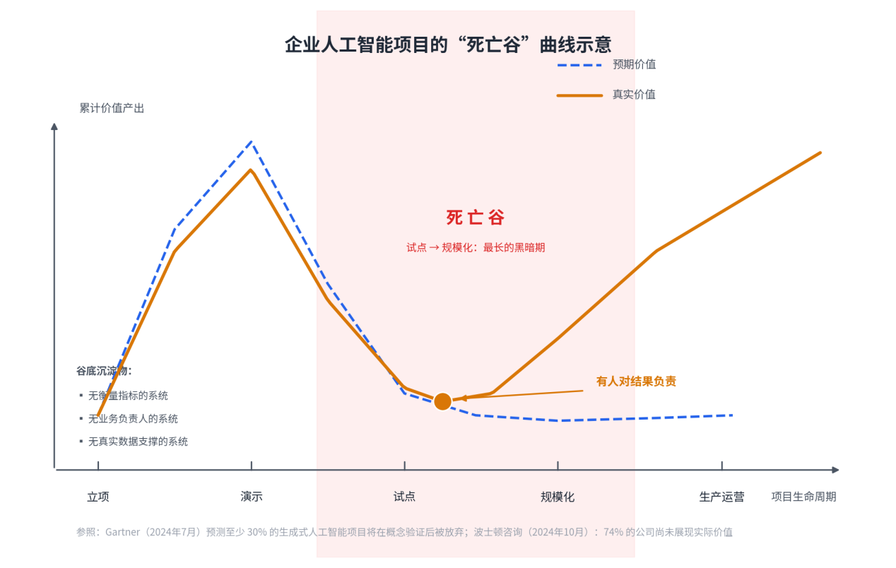
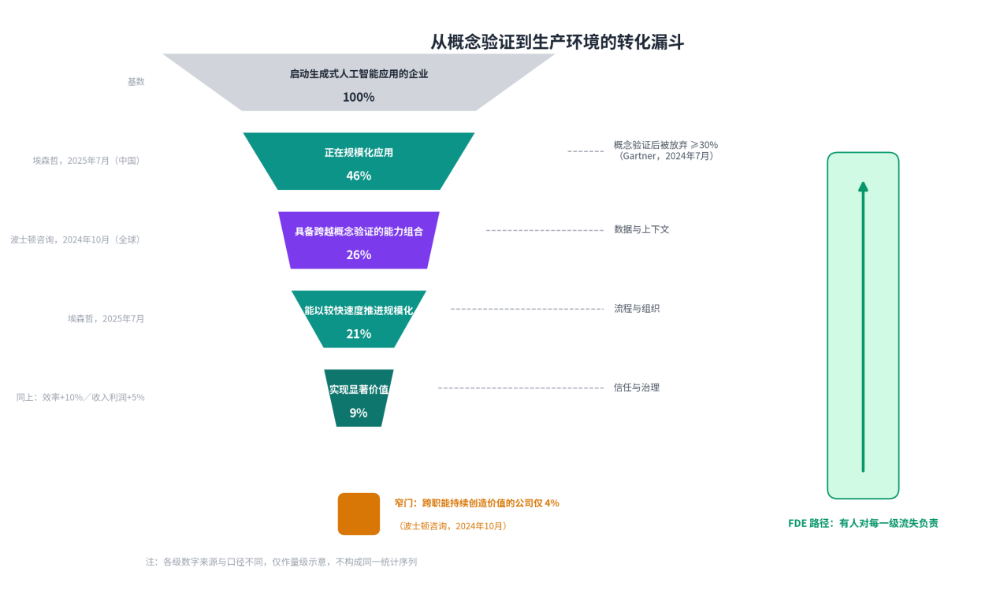
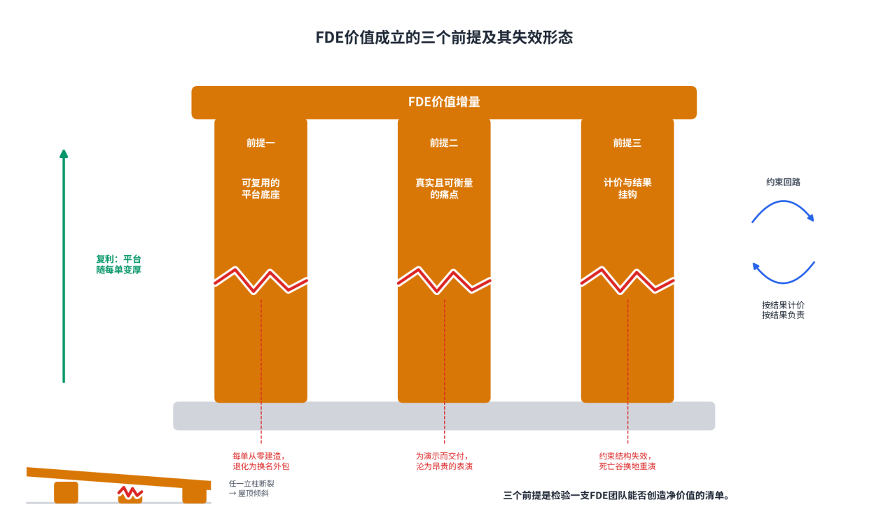
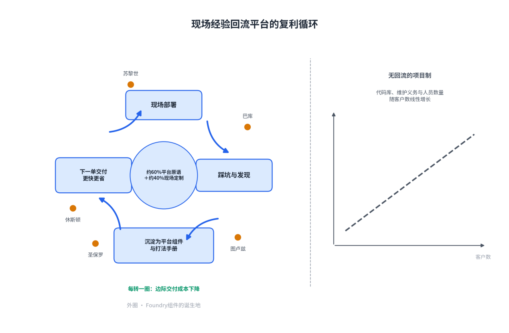
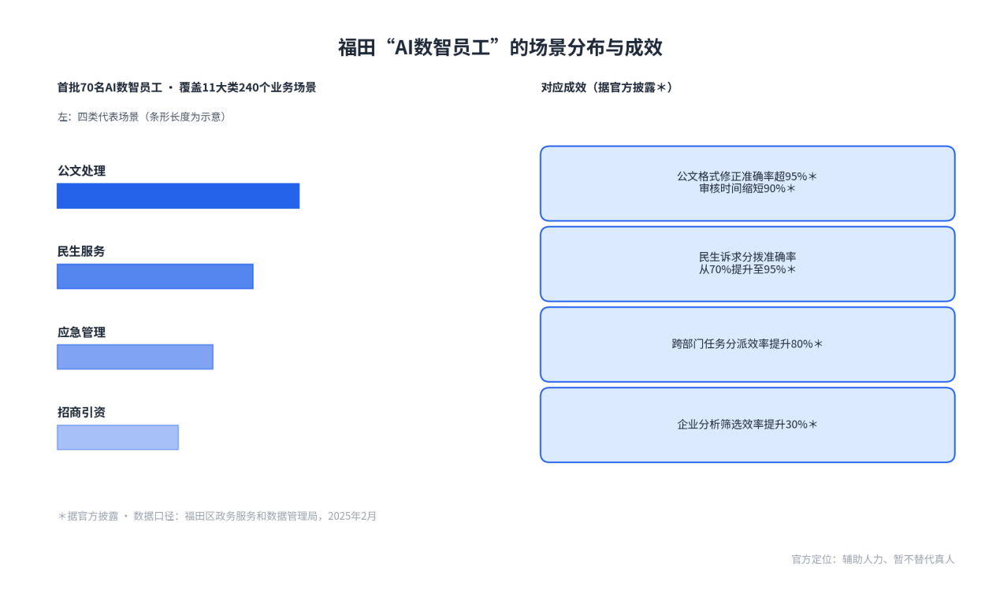

# 第2章FDE的价值论证

**【本章导读】**

本章回答决策者最关心的问题：为什么组织需要为一种昂贵的交付方式买单？先用调研数据呈现企业人工智能项目的“死亡谷”与概念验证转化率的真实现状，说明问题的规模、位置与成因；再把问题还原为三对结构性矛盾——产品通用性与客户个性化、技术可能性与业务可行性、快速交付与长期稳定——解释传统组织手段为何只能治标；最后用政务、金融、制造三个领域的完整案例，检验FDE模式的实际成效与边界条件。本章适合正在评估人工智能投资策略的政企决策者，以及需要向管理层论证交付模式变革的信息化负责人。读完本章，读者应能回答：本组织的项目是否正躺在死亡谷里，值不值得为爬出谷底配置一支对结果负责的工程力量。

## 2.1 为什么组织需要FDE

判断一种新交付组织形态是否必要，依据只有两类：旧方式的失灵是否成规模，新方式的收益是否可核查。本节按这个次序组织证据。第一目呈现人工智能项目在演示与生产之间的“死亡谷”现象；第二目解剖从概念验证到生产环境的转化率问题，并用公开研究归纳障碍的分布；第三目给出FDE价值增量的三组实证，以及这组增量成立的三个前提。

### （1）AI项目的“死亡谷”现象

先看投入的一侧。IDC于2025年4月发布的《全球人工智能和生成式人工智能支出指南》显示，中国市场中生成式人工智能投资的五年复合增速预计达51.5%，明显高于人工智能整体投资的增速水平。资本、算力与预算正在以前所未有的速度进入这个领域。

再看产出的一侧。波士顿咨询公司2024年10月发布的研究报告《价值何在》（Where’s the value in AI?），调研了59个国家、20多个行业的1000名企业高管，结论是：只有26%的公司具备跨越概念验证、产生实际价值所需的能力组合，74%的公司尚未从人工智能的使用中展现实际价值；即便在领先者中，能在跨职能范围持续创造显著价值的也只有4%。投入与产出两侧的公开数据放在一起，落差的规模是清楚的。

投入与产出之间的这段落差，在创新管理研究中有现成的名字。从基础研究到规模化商用之间，存在一段投入持续增加、产出迟迟不出现的地带，大量技术与项目在此夭折，人们称之为死亡谷（Valley of Death）。经典意义上的死亡谷横在技术验证与产品化之间；而本轮人工智能的特殊性在于，技术本身已经跨过了谷——模型在演示环境中的表现足以通过任何一场评审——价值却没有跨过去。本书据此提出一个判断：死亡谷没有消失，它从技术验证阶段整体后移到了组织采纳阶段。谷的一岸是“演示成功”，另一岸是“生产价值”，谷底堆积的是功能齐全、验收通过、却没有进入日常作业的系统。

谷底的位置，可以从失败原因的分布中得到确认。波士顿咨询的同一项研究给出了一个被反复引用的比例结构：人工智能实施的挑战，约70%来自人员与流程问题，20%来自技术问题，只有10%涉及算法本身。Gartner在2025年2月发布的数据管理调研补上了另一半证据：63%的组织没有，或者不确定自己是否拥有面向人工智能的正确数据管理实践；该机构据此预测，到2026年，缺乏“人工智能就绪数据”支撑的项目中将有60%被放弃。两组证据指向同一个事实：把项目死亡归咎于“模型还不够聪明”，与可核查的数据不符。死因判错，对策就会跟着错——如果死因在模型，等待下一代模型是理性策略；如果死因在数据、流程与组织，等待只会让投入继续沉没。

图2-1：企业人工智能项目的“死亡谷”曲线示意

### （2）从PoC到生产的转化率问题

死亡谷里最拥挤的地段，是从概念验证通往生产环境的那一段。行业内给这种停滞起了一个专门的名字：概念验证坟墓（PoC Purgatory）——项目通过了一场漂亮的演示，随后长期停在原地：终止它，缺少失败的确证；放大它，缺少成功的证据，于是以“试点”的身份一年年留在汇报材料里。从概念验证到生产环境的转化率，因此成为衡量一个组织人工智能投资健康度的核心指标，也是FDE价值论证的出发点。

转化率会低到什么程度，已有明确的预测口径。Gartner在2024年7月预测：到2025年底，至少30%的生成式人工智能项目将在概念验证后被放弃。2025年6月，该机构对更新一代的项目形态给出了更不乐观的判断：超过40%的智能体类人工智能项目将在2027年底前被取消。两份预测给出的放弃与取消原因，均落在数据、风险控制、成本与商业价值上——模型在演进，项目的死因清单几乎没有变化，而这份清单上没有一项指向模型能力本身。

把多项公开研究放在一起，可以对规模化路上的障碍做一个归类。表2-1按“数据与上下文、流程与组织、信任与治理”三个维度整理，障碍名称与比例均取自各机构报告的原始表述。

表2-1：企业人工智能项目规模化的五大障碍

| **排序** | **障碍** | **现场表现** | **问题层面** |
| --- | --- | --- | --- |
| 1 | 员工不愿用新工具 | 官方系统空转，员工绕道用消费级产品 | 组织采纳 |
| 2 | 对模型输出质量的担忧 | 业务方不敢把真实决策交给系统 | 信任校准 |
| 3 | 糟糕的用户体验 | 工具脱离既有工作流，使用成本高 | 问题定义 |
| 4 | 缺乏高管支持 | 预算季一到项目先被砍 | 治理结构 |
| 5 | 变更管理困难 | 流程与考核不随系统调整 | 组织现实 |

六项障碍按维度归拢之后可以看到：没有一项归因于模型能力、算力成本或算法先进性。杀死项目的因素集中在数据、流程与治理层面——这正是本书把死亡谷定位在“组织采纳阶段”的实证基础。

把上述数据按项目阶段串起来，可以得到从概念验证到生产环境的转化漏斗，见图2-2。漏斗每一级的流失主因，都落在表2-1的三个维度之内，而不在模型。

图2-2：从概念验证到生产环境的转化漏斗

漏斗图呈现的是流失发生在哪一级，对策也随之清楚：需要有人对每一级的流失主因逐个负责——让验证在真实数据上进行，让立项附带可衡量的成功标准，让风险控制与成本曲线有人看守，让系统进入真实工作流而不是停在演示环境。这些动作分散在不同流失点上，靠任何单一角色都无法覆盖，这正是FDE作为一种组织形态被设计出来的原因。

### （3）FDE带来的价值增量

FDE的价值增量，可以用三组相互独立的证据来说明：一组来自运营现场，一组来自企业年报，一组来自劳动力市场。

第一组证据：价值确认的速度。瑞典支付公司Klarna基于大语言模型的客服助手上线后，公司在第一个月即以官方新闻稿公布运行口径：对话量占客服总量的三分之二，平均解决时长从11分钟压缩到2分钟以内，并预估该助手将为2024年带来约4000万美元的利润改善（公司预估口径，非审计数字）。这个案例对本书的意义不在金额，而在时间尺度——价值在上线的第一个月就被生产环境的数据确认，而不是在一年后的复盘会上被追认。Klarna此后公开修正了路线：根据媒体后续报道与案例复盘资料，公司承认早期过度侧重成本压缩影响了服务质量，重新恢复人工客服招聘，转向人机混合模式。这个修正同样有信息量：以结果衡量的机制一旦建立，偏差会被结果本身暴露并纠正。

第二组证据：规模化的中国样本。招商银行2024年年报披露，全行大模型应用场景超过120个，覆盖零售及对公客户服务、风控、运营、办公等领域，全年智能化应用实现替代工时2600万小时；办公领域的财务报销审核效率提升63%，全年处理无纸化报销单113.81万笔。该行2024年度业绩发布会进一步披露：贷款审批环节每笔贷款处理时效提升54%，大模型应用创造的新生产力相当于全职人力超过5000人。年报口径的数字有两个特点值得注意：一是全部挂在具体业务指标上——工时、时效、处理量，而不是模型参数或调用次数；二是披露载体是对投资者负责的法定文件，数字要经得起审计与追问。这正是“价值从模糊感受变成可核查数字”的样本。

第三组证据：市场侧的投票。招聘网站Indeed的统计显示：2025年4月，全美以前线部署工程师为头衔的在招岗位为643个；一年后的2026年4月增至5,330个，上涨729%。招聘需求的变化通常领先于组织形态的定型：当模型能力的采购不再是瓶颈，瓶颈转为“把模型变成业务结果的人”，岗位市场会先于财务报表做出反应。

三组证据之后，必须同时给出边界。FDE不是对所有组织的答案，本书采纳有条件的价值论：FDE的价值增量真实存在，但成立需要三个前提。其一，有可复用的平台底座，否则每一单都从零建造，模式退化为换名外包；其二，有真实且可衡量的痛点，否则驻场团队再勤奋也只是昂贵的表演；其三，计价与结果挂钩，否则约束结构不成立，死亡谷只是换个地方重演。图2-3把三个前提及其失效形态画在一起。

图2-3：FDE价值成立的三个前提及其失效形态

最后，把FDE与两种既有交付方式放在一起对照，价值增量的位置会更清楚，见表2-2。

表2-2：三种交付方式的价值增量对照

| **维度** | **传统项目制交付** | **SaaS自助式交付** | **FDE交付** |
| --- | --- | --- | --- |
| 衡量标的 | 合同功能清单 | 账号开通与活跃度 | 客户业务结果 |
| 责任终点 | 验收单签字 | 续费提醒 | 指标达成并沉淀能力 |
| 验证环境 | 演示数据、测试环境 | 客户自行摸索 | 客户真实数据、真实流程 |
| 价值确认周期 | 以月或年计 | 不确定，常自然流失 | 以周计 |
| 失败成本归属 | 客户承担 | 客户承担 | 供应商实质共担 |
| 交付物 | 代码与文档 | 产品本身 | 系统加客户团队的能力 |

表2-2的最后一列，就是本节标题问题的答案：组织需要FDE，不是因为市场上又多了一个头衔，而是因为从演示到生产的每一段流失，终于有人以结果的方式负责。前提仍是那三个——底座、痛点、计价；缺了任何一个，最后一列都会退回到前两列的某一种。

## 2.2 FDE解决的核心矛盾

上一节证明了问题的存在，这一节解释问题为什么难治。企业人工智能项目的失败成为常态，不是某个环节的执行失误，而是三对结构性矛盾长期无解：软件的规模经济要求通用，客户的价值实现要求贴身；技术的演进讲可能性，业务的运行讲可行性；价值的兑现要求快，组织的免疫系统要求稳。任何单一部门只能在矛盾的一端用力——产品部门对通用性负责，销售对个性化签单负责，信息部门对稳定负责——于是矛盾在部门之间的真空地带常年无人关注。FDE作为一种组织设计，其特殊性恰在于把矛盾的两端放进同一个角色的职责里，让同一个人同时承受两头的压力，从而在每一次具体取舍中做出全局判断。

### （1）产品通用性与客户个性化的矛盾

软件经济学的第一定律是：毛利来自复制。代码写一次、卖给一万个客户，是软件生意的根基。客户价值的实现却遵循另一条定律：价值长在差异里。每个客户的存量系统、数据质量、业务流程、组织惯性都不同，而人工智能的价值恰恰要在这些差异的缝隙里产生。两条定律相撞，构成企业软件行业几十年的核心矛盾。

互联网创业方法论用产品市场契合（Product-Market Fit，PMF）描述产品对路的时刻：产品对了，市场会自己拉动增长。但PMF有一个隐含假设——市场足够均质，一个产品可以对一万个客户同时“契合”。这个假设在消费互联网大致成立，在企业市场、特别是人工智能时代的企业市场越来越站不住：一个企业客户内部，可能有几百个“人工智能能做点什么”的机会点，形状各不相同，不存在一个预先造好、开箱即用的产品能同时贴合它们。FDE实践者因此把契合的单位从产品与市场，细化到问题与方案——问题与方案契合（Problem-Solution Fit，PSF）：不问“我的产品有没有市场要”，改问“客户这个具体的问题，值不值得、能不能被我们的能力解决”。视角从供给方换到需求方，一次只验证一个具体问题，这正是对“通用性崇拜”的纠偏。

Palantir早年就撞上过这堵墙。从第一个客户走向第二个、第三个时，团队发现每个客户要的东西“细微但关键地不同”。标准解法是提炼共性、做通用产品、对差异说不；但它的客户是中央情报局、联邦调查局和战场上的美军——说不，就等于出局。希亚姆·桑卡尔的解法分两层：技术上，做一个高度可定制的平台，派工程师驻扎现场完成“最后一公里”；财务上，把“为单个客户做定制”从服务成本重新定义为产品发现——工程师在现场踩的每一个坑，都是平台下一次进化的路标。一个名词的更换，改变了资本配置逻辑：别人眼里的成本中心，成了研发中心。

国内企业软件行业把同一对矛盾，演化成了延续十几年的慢性病——“项目制诅咒”：大企业要定制，厂商做一单赔一单，交付完代码离场作废，最后集体沦为“甲方的外包公司”。这组矛盾在财务上的样子，看一眼人均营收就明白：2025年年报，用友人均营收约48万元，金蝶约62万元；同一年，Palantir的人均营收约100万美元——十倍级的人效差。差距的根源不在工程师的勤奋程度，而在定制劳动有没有沉淀为可复用资产。面对通用性与个性化的矛盾，组织实际上只有三条路，表2-3把三条路放在一起对照。

表2-3：通用性与个性化矛盾的三种解法对比

| **维度** | **标准化产品，拒绝定制** | **纯定制，项目制交付** | **平台加前线部署（FDE）** |
| --- | --- | --- | --- |
| 对客户差异的态度 | 说不，让客户适应产品 | 照单全收 | 在共享底座上有选择地满足 |
| 现场劳动的定性 | 不存在现场劳动 | 成本，越低越好 | 产品发现，是研发投资 |
| 毛利结构 | 高毛利，但价值深度有限 | 做一单赔一单 | 前期重投入，靠复用摊薄 |
| 资产沉淀 | 全部在产品里 | 离场即作废 | 共性回流平台，个性留在客户侧 |
| 典型结局 | 进不了复杂行业 | 沦为甲方外包 | 人效与合同额同步放大 |

第三条路的关键技术是比例控制。凯文·白给出过一个示意比例：约60%的能力来自共享平台，约40%按客户场景组合和扩展——认证、数据连接、工作流、权限、评测、界面组件这些可复用的“原语”由平台统一维护，FDE在原语上组装方案，而不是每次从空白代码库开始。这个比例不是行业标准，要点在于定制必须站在共用底座上。判断什么该回流平台，也有一套现场纪律：需求第一次出现，只能叫客户特例；第二次出现，发现两家客户术语不同但底层动作相似；第三次出现，才可能确认它是一项平台能力。过早抽象，会把偶然差异固化进产品；过晚抽象，多支现场团队会重复造轮子。

这套机制的复利效应见图2-4。Palantir的Foundry平台核心组件，诞生于苏黎世、休斯敦、圣保罗、图卢兹、巴库——一张世界地图，每个点都是一次现场创造。通用性与个性化的矛盾没有被消灭，而是被改造成一个正循环：个性化供养通用性，通用性降低个性化的成本。

图2-4：现场经验回流平台的复利循环

### （2）技术可能性与业务可行性的矛盾

人工智能时代最普遍的组织幻觉，是把“模型能做到”当作“业务能落地”。演示环境回答的是可能性问题，生产环境追问的是可行性问题，两者之间隔着四道落差，每一道都只能在现场测量。

第一道是数据现状。OpenAI的FDE负责人科林·贾维斯概括过现场经验：客户在选题阶段描述的问题，常常和地面上真实的数据与系统状况对不上。常见的答案是：数据分散在七个系统里，三个版本对不上，最权威的那份存在某个老员工的私人表格里。在会议室里，这些问题不存在——幻灯片上的数据永远是干净的、打通的、合规的。

第二道是准确率门槛。“99%可用”和“90%可用”之间，隔着数量级的工程投入；而很多业务场景的最优解，其实是90%的自动处理加人工复核。判断这一点需要的不是技术能力，而是对业务后果的理解：写错一句营销文案和判错一笔反洗钱交易，是两个物种的错误，对应完全不同的工程投入与流程设计。坐在总部的架构师算不清这笔账，因为他看不到错误抵达业务现场时的代价。

第三道是经济账。痛点真痛，不等于值钱；算不清账的项目，做了也活不过下一个预算季。NANDA的报告里有个被广泛引用的发现：超过半数的企业人工智能预算投向前台的销售与营销，回报却集中在后台的合同审查、采购、风控这些“不性感”的地方。组织天然倾向于解决“演示效果好的问题”，而不是“值钱的问题”——因为演示效果服务的是内部汇报，值钱与否要到年底算账才见分晓。

第四道是组织采纳。技术可能性每天都在提高，员工的容忍度却在下降：消费级产品把胃口养刁之后，任何不好用的企业系统都会被静默抵制。采购报表上的“已部署”，和一线真实的使用，可以是毫无关系的两件事。

这对矛盾解释了为什么“坐在办公室看演示视频”的决策方式必然失效：可行性问题的答案全部藏在现场，而演示视频只展示可能性。FDE的解法不是请更高明的专家做更远的隔空判断，而是把判断的位置换到现场——让懂技术的人直面数据、直面业务后果、直面用户习惯，在写第一行代码之前先回答“该不该做、做到几分、用什么标准验收”。企业支出管理公司Ramp用学费换来的原则可以作注脚：它给自家FDE定的第一条原则是“永远在选题”，不能对客户要求照单全收；此前团队曾为一个客户做了几周的安卓端功能，交付前才发现这家公司内部强制只用iPhone，几周工作全部作废。选题纪律松懈的代价以周计算；在人工智能项目里，选错题的代价以百万美元计算。

### （3）快速交付与长期稳定的矛盾

企业组织的“免疫系统”以稳定为天职：变更管理流程、安全审查、合规审计，任何新系统动一个接口都要走完以月计的流程。人工智能价值的兑现却以周计：农时不等人，商机不等人，预算季不等人，模型的能力边界每个季度都在移动。快与稳的矛盾，本质是交付节奏与企业组织的“免疫系统”的冲突。这对矛盾有两种常见死法。为快牺牲稳：绕过治理框架强行上线，安全与合规部门秋后算账，项目被一纸公文叫停，还连累后续所有人工智能项目被重点盯防。为稳牺牲快：走完所有流程再动手，十八个月后系统交付时，业务问题已经换了两轮，当初拍板的高管已经调岗，新系统上线即遗产。

FDE的实践给出一条中间路线，可以概括为“读旧写新”。数据层面，深度兼容旧系统：客户的数据在哪里，就从哪里读——哪怕它在一台老式主机里、在共享盘的表格里、在某个古老系统的私有接口里，因为数据是验证价值的前提，而数据永远不会为了迁就新架构而搬家。架构层面，坚决不做旧环境的寄生体：验证期的系统运行在自己可控的边界内，通过接口与旧系统交互，而不是把代码写进旧系统里——寄生越深，方案被推翻重写时的浪费越大，而且写入旧系统要走客户以月计的变更流程，与周级的验证节奏根本冲突。流程层面，顺从人的习惯而非系统的习惯：如果业务用户的核心动作发生在表格和邮件里，新系统的界面就应该出现在表格插件和邮件里，而不是要求用户登录一个崭新的门户。OpenAI在西班牙对外银行的部署，从十二万员工已经在用的ChatGPT界面切入，而不是另起炉灶，就是这条路线的典范。

长期稳定还有更深的一层：系统能不能活得久，取决于人，而不取决于架构图。FDE模式内置两个防单点的机制。其一是结对：重要会议、架构决策至少有第二名工程师理解，配合共享文档、代码审查与轮换，让客户关系从个人英雄变成组织能力——长期驻场的工程师容易把客户的历史妥协当成行业铁律，第二名工程师既是备份，也是追问“这真是必需，还是这家公司恰好如此”的那双眼睛。其二是知识转移：Anthropic与金融技术公司FIS的合作，明确目标是让客户“未来能独立构建和扩展自己的智能体”，把“教会客户”写进合作目标。这两条使FDE与驻场外包形成根本分野：外包越驻越久、人走系统停；FDE做完会走，能力沉淀在系统和客户团队里。国内服务商启盟科技在官网写下的三句话，是迄今最精炼的区隔：FDE按阶段交付、按结果验收，驻场外包按工时结算；FDE带着产品底座来做工程，驻场外包从零现写现改；FDE做完会走，驻场外包人走系统停。

至此，三对矛盾及其解法可以收束为一表，见表2-4。需要强调的是，三对矛盾互为因果：通用性问题不解决，现场定制就没有底座，快交付无从谈起；可行性判断不现场化，快交付交付的就是错的东西；缺乏长期稳定机制，前两对矛盾解决得再好，价值也会在人员流动中流失。FDE是同时向三对矛盾发力的组织设计，这正是它无法被任何一个现有部门兼管的原因。

表2-4：FDE解决的三对核心矛盾总览

| **核心矛盾** | **传统组织的应对** | **为何失效** | **FDE的解法** | **关键机制** |
| --- | --- | --- | --- | --- |
| 产品通用性×客户个性化 | 做通用产品，对差异说不；或照单全收做定制 | 前者进不了复杂行业，后者做一单赔一单 | 平台原语承担约六成，现场定制四成，定制定性为产品发现 | 三次出现才抽象；共性回流平台 |
| 技术可能性×业务可行性 | 总部看演示、审方案后拍板 | 可行性的答案全在现场：数据、门槛、经济账、采纳度 | 判断位置前移到客户现场，先选题再写代码 | 永远在选题；先定衡量标准再动手 |
| 快速交付×长期稳定 | 变更流程卡死，或绕开治理裸奔 | 快死于一纸公文，慢死于时过境迁 | 读旧写新：数据兼容、架构隔离、习惯顺从 | 结对与知识转移；做完会走 |

## 2.3 典型场景与案例分析

本书提出的三对矛盾，落到具体行业会换上不同的外壳：政务市场先过合规纪律与采购周期这一关，金融市场先过监管审计与数据敏感这一关，制造市场先过物理世界硬约束这一关。以下六个案例全部可公开核查，分别检验FDE模式在三种土壤里如何成立、成效几何、边界何在。这些项目大多不以FDE为名，但其交付动作——嵌入真实业务、公布可核查的量化成效、把现场能力沉淀为平台——逐一命中了FDE方法的核心。

### （1）政务领域的FDE实践

政务是检验交付方法论最严苛的市场之一：数据不能离开指定环境，采购以年度预算与招投标为周期，容错率接近零，且决策链长，业务负责人与系统使用人常常分离。在这种土壤里，演示文稿与概念验证的说服力有限，唯一有效的货币是在客户自己的环境里、用客户自己的数据，跑出可以计入官方口径的结果。深圳福田与北京经开区的两个案例，分别展示了供应方深度嵌入与政府侧组织机制两种解法。

2025年2月，深圳市福田区上线政务大模型2.0版，首批70名“AI数智员工”上岗，涉及11大类，满足240个业务场景使用，覆盖公文处理、民生服务、应急管理、招商引资等政务服务链条。据福田区政务服务和数据管理局介绍，上线后的量化成效包括：公文格式修正准确率超过95%，审核时间缩短90%；民生诉求分拨准确率从70%提升至95%；跨部门任务分派效率提升80%，按时完成率提升25%；招商引资中的企业分析筛选效率提升30%。技术上，该体系以全尺寸DeepSeek R1为核心底座，依托国产算力平台完成本地化训练，数据不出政务环境；机制上，政府部门与技术供应方联合构建“需求—训练—场景应用—迭代”的闭环，并在全国首推政务辅助智能机器人管理制度，明确数智员工“辅助人力、暂不替代真人”的定位。这个案例的印证点有两处：其一，供应方不是交付一套软件后离场，而是与政府共同运营一条持续迭代的场景流水线，技术供应方借此成长为准独角兽企业——嵌入现场同时是供应方的产品化路径；其二，全部成效以区级政府官方口径对外发布，经得起媒体与公众核查，这正是政务市场的信任结算方式。

图2-5：福田“AI数智员工”的场景分布与成效

北京经开区“亦智”平台展示了另一种形态：政府把供需两端的组织方式做成了制度。2023年10月，经开区发布18个智慧城市创新场景需求清单，四十多家企业揭榜，最终联合京东、百度、华为等企业打造首批8个大模型应用场景；2024年6月，“亦智”政务大模型服务平台正式上线，为北京市首个，采用国产自主可控框架，将百度千帆、智谱华章、通义千问等多个参数规模的基础大模型统一纳管，提供一站式监管与即插式调用。运营一年后，官方口径显示：政务咨询准确度提升10%，工作居住证等新办时间缩短20%，市场监管案件处理效率提升3倍以上，投诉举报案件处理周期缩短65%，重点企业月均检查量下降70%以上。这个案例的印证点在于政府侧的组织设计：需求以官方场景清单发布，多家供应商在同一平台上按场景交付，多模型纳管避免了对单一供应商的锁定——采购周期长的老问题，被拆成一个个可揭榜、可验收的小单元。

两个案例合起来，勾勒出政务交付的三条特殊性。第一，数据不出域是硬前提，本地化部署与国产算力不是加分项而是准入条件；第二，采购周期无法压缩，但可以用官方场景清单与揭榜机制把大单拆小，让每个单元独立验证、独立验收；第三，成效必须折算成官方可发布的口径——上得了政府网站与新闻发布会的数字，才是这个市场的硬通货。

### （2）金融行业的FDE应用

金融业的约束集中在两端：强监管要求每一个自动化决策可解释、可审计，数据敏感要求训练与推理不出机构边界；同时金融又是人工智能预算最充裕的行业之一，同业竞争把落地速度变成了硬指标。网商银行与工商银行的两个案例，分别对应两种进入方式：一个把模型嵌入真实风控流程，一个把能力建设成体系化平台。

网商银行2020年9月发布的“大山雀”卫星遥感风控系统，是全国首个将卫星遥感技术应用于农村金融信贷的系统。其做法是把三类原本互不相干的数据接进同一条授信流程：深度学习（Deep Learning）解析卫星图像，识别农作物的种植面积、种类与长势；再结合气候、地理位置、行业景气度等因素，用风控模型预估产量与产值，据此给出授信额度与还款周期；农户在手机上即可获得随借随还、纯信用无抵押的贷款。系统的作物识别准确率在93%以上，第三方机构IDC评价这是其“商用的关键之一”。截至2024年8月底，“大山雀”已识别16大农产品产业，覆盖全国31个省、自治区、直辖市，累计服务178万种植户；其与农业农村部大数据发展中心联合建模的“农户秒贷”项目，入选国家数据局“数据要素×”典型案例。这个案例的印证点在于阈值的含义不同：93%不是实验室指标，而是风控流程里“敢授信”的工程底线——模型必须嵌入真实授信流程，在真金白银的违约风险中接受验证；与部委数据中心联合建模，则是数据敏感环境下嵌入客户数据场景的典型形态。

工商银行走的是另一条路：把分散的现场交付收敛为一套企业级平台。该行2023年建成同业首个全栈自主可控的千亿参数级大模型技术体系“工银智涌”，覆盖算力、算法、数据、工具、安全、应用、生态全栈，包括同业首个自主可控的千卡规模人工智能算力云，形成十余个大模型与两千多个传统模型的协同应用矩阵。据该行2024年年报，这一体系赋能20余个主要业务领域、200余个场景；2025年半年报显示，该行开展“领航AI+”行动，在个人金融、金融市场、对公信贷等领域新增100余个应用场景；2025年3月，该行在同业率先完成DeepSeek开源大模型的私有化部署并接入“工银智涌”矩阵。这套体系还通过科技子公司工银科技对外输出。这个案例的印证点是能力产品化与场景清单化：大型机构内部的交付团队把每一次现场建设沉淀为平台资产，场景数以年报口径逐年公布、接受审计级核查，随后整体系对外输出——“建平台、铺场景、再输出”，正是内部交付体系的产品化路径。

把两个案例放在一起，可以看到金融业的一条共性：这个行业的证据必须可审计。无论是一家互联网银行93%的识别准确率，还是一家国有大行写进年报的场景数，人工智能的投入产出都被纳入了可核查的经营核算。FDE在金融业的价值，一半是交付出来的，另一半是证明出来的。

### （3）制造企业的FDE落地

制造业的核心特征是物理世界的硬约束：产线节拍不等人，质量缺陷直接表现为报废，设备安全没有“下个版本再修”的余地；与此同时，企业最关键的知识沉淀在老师傅的经验与设备传感器数据里，而不在文档里。这两个特征决定了制造业是模型最难进场的行业，也最检验交付组织的成色。

2024年9月6日，宝钢股份与华为合作的热轧自然宽展预测模型正式投入热轧1880产线，实现在线闭环控制——这是华为盘古预测大模型在钢铁制造领域的首个闭环控制验证。热轧带钢的宽度控制是典型的产线级难题：轧制过程以秒计，预测必须实时，误差直接表现为废品。为此，华为与宝钢的数据与人工智能部门、设备部、热轧厂、中央研究院、宝信软件等组成联合专家团队，在348块带钢的轧制过程中全程跟踪验证，确认预测精度与时延响应满足实时控制要求后方才上线。这一合作有明确的组织铺垫：2024年4月宝钢宣布“AI+”数智化转型战略并与华为全领域签约，5月双方共建“钢铁+AI”联合创新中心。此后成效持续扩展：据公开报道，高炉大模型预测一小时后炉温的命中率达95%，热轧产品表面缺陷识别模型半年内准确率提升至96%并复制到多个基地产线，2025年宝钢已上线近300个人工智能应用场景。这个案例的印证点是“模型进物理产线”的真实门槛：实验室指标没有意义，只有通过联合驻场、在真实轧制中逐块验证，模型才有资格进入闭环控制——这正是工程师嵌入客户现场的制造业版本。

三一重工的转型展示了组织级的改造。“灯塔工厂”指世界经济论坛“灯塔网络”（Global Lighthouse Network）评选的智能制造标杆工厂，代表全球制造业数字化转型的领先水平。2021年9月，三一北京桩机工厂入选，成为全球重工行业首家灯塔工厂：世界经济论坛的入选理由是，该工厂利用人机协同、自动化、人工智能和物联网（Internet of Things，IoT）技术，将劳动生产率提高85%，生产周期从30天缩短至7天。2022年10月，三一长沙18号工厂再度入选，入选口径为产能扩大123%、生产率提高98%、单位制造成本降低29%。据媒体报道，18号工厂部署1540个传感器与200台联网机器人，每天产生超过30TB数据，九大工艺、32个典型生产场景实现全自动化。这个案例的印证点在于衡量单位的不同：三一重工的成效口径是整座工厂的产能、周期与成本，而不是某条产线的模型指标——智能制造的交付对象是组织，验收者是独立的第三方评选，这决定了它必然是决策层挂帅的多年期改造，而非一次性的技术项目。

边界条件同样需要交代，本书以原则形式给出：两类制造企业不宜进场。一类是数字化基础不成熟的企业——设备未联网、数据无积累，此时进场的实质是替客户补数年数字化功课，交付周期与预算都将失控；另一类是决策预期错位的企业——期待人工智能直接裁撤岗位而非改造流程，验收标准永远无法对齐。必要性判断先于进场，是FDE纪律的第一条，制造业尤甚。

三个领域的案例可以收束为一张对照表，见表2-5。

表2-5：政务、金融、制造领域FDE案例成效对比

| **领域** | **案例主体** | **核心场景** | **交付节奏** | **量化成效** | **可迁移经验** |
| --- | --- | --- | --- | --- | --- |
| 政务 | 美国海军×Palantir | 潜艇工业基地排产与物料 | 前期嵌入试点后直接进生产 | 排产160小时→10分钟；物料审核几周→1小时；合同4.48亿美元 | 信任复利可换取跳过概念验证的资格 |
| 金融 | 西班牙对外银行×OpenAI | 全员智能助手部署 | 3300账号起步，一年半扩至12万人 | 83%周活；2万多个自建助手；每周人均省约3小时 | 低摩擦工具先进场，用采用率筛选场景 |
| 金融 | FIS×Anthropic | 反洗钱调查智能体 | 嵌入式共同设计 | 调查从数小时→数分钟，决策全程可回放 | 可审计性是强监管行业的准入线 |
| 制造 | 空客×Palantir | A380燃油泵故障定位 | 两周破案，此前自查两年未果 | 保住据报道数百亿美元订单；Skywise接入上万架飞机 | 传感器数据加现场经验，击穿久拖不决的顽疾 |
| 制造 | 约翰迪尔×OpenAI | 精准施药决策 | 评估体系先行，随农时迭代 | 化学品用量最高减70%；2024年省800万加仑；覆盖超500万英亩 | 按启用英亩计费，让价格与价值对齐 |

三个行业，三种土壤，同一套逻辑：死亡谷不是技术问题，是组织问题；FDE不是技术答案，是组织答案。三对矛盾在每个行业改变形状，价值成立的前提却始终一致——可复用的平台底座、真实可衡量的痛点、与结果对齐的计价与验收。六个案例无一例外：亦智的纳管平台与工银智涌的全栈体系是底座，福田的公文与民生分拨、大山雀的授信、宝钢的宽展控制是痛点，官方口径、年报与世界经济论坛的第三方评选则把验收锚定在结果上。对决策者而言，真正的问题从来不是“要不要上人工智能”，而是“要不要为爬出死亡谷，配置一支能对结果负责的工程力量”。答案如果是肯定的，下一个问题自然浮现：这支力量如何在客户现场找到并解决正确的问题——这需要方法论在价值论证之后给出进一步回答。
