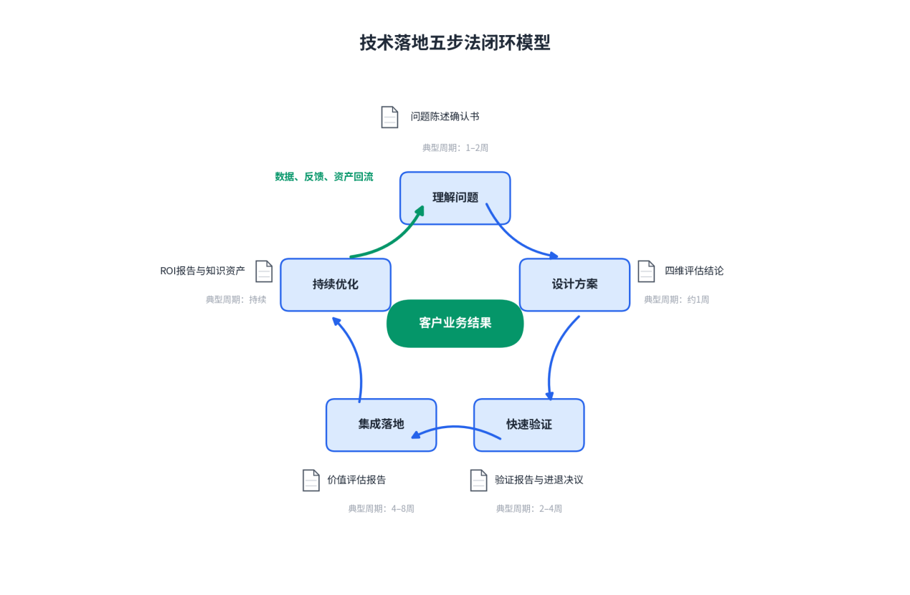
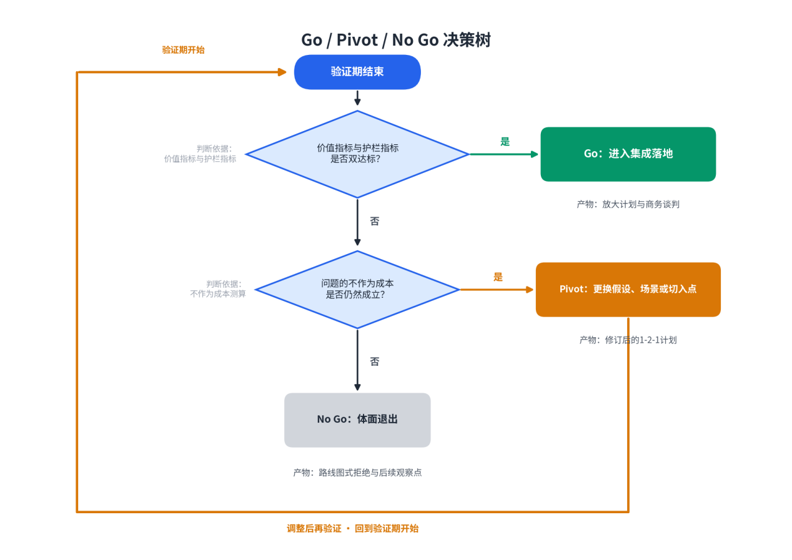
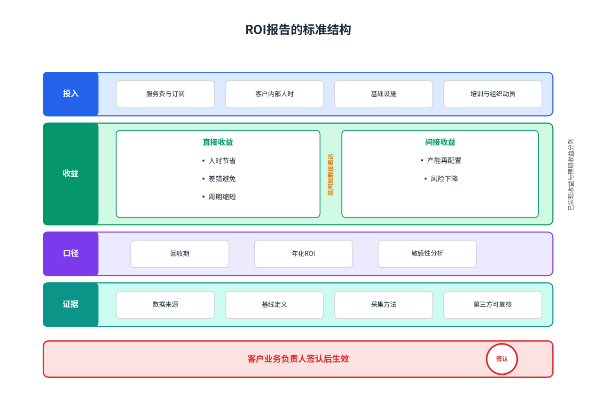

# 第二篇：FDE核心方法论

# 第3章技术落地五步法

**【本章导读】**

本章给出AI项目从进场到结项的完整交付方法：理解问题、设计方案、快速验证、集成落地、持续优化，五步构成一个闭环。每一步回答一个具体问题，并产出一份书面产物：第一步回答“这个问题值不值得、能不能被解决”，产物是问题陈述确认书；第二步回答“哪条路径最划算”，产物是方案评估结论；第三步回答“价值是不是真的”，产物是验证报告与进退决议；第四步回答“怎样进入真实生产环境”，产物是价值评估报告；第五步回答“值多少钱、下一次怎样更快”，产物是ROI报告与可复用资产。本章适合数字化转型项目的决策者、交付负责人与FDE团队负责人阅读，全部工具均可直接套用。

## 3.1 方法论总览

### （1）五步法闭环模型

技术落地五步法把一次AI交付拆成五个首尾相接的阶段：理解问题、设计方案、快速验证、集成落地、持续优化。五步不是线性流程图上的五个格子，而是一个闭环：持续优化阶段沉淀的数据、反馈与资产，回流为下一轮理解问题的输入——同一客户的第二个场景、同一行业的第二个客户，都从这个回流口进入。

闭环设计的依据来自对失败的解剖。麻省理工学院NANDA实验室在《生成式人工智能的鸿沟》报告中，归纳了企业AI项目规模化的五大路障，按出现频率排序：员工不愿用新工具、对模型输出质量的担忧、糟糕的用户体验、缺乏高管支持、变更管理困难。比清单内容更值得看的是缺席项：模型不够聪明、算力不够便宜、技术不够先进，都不在列。杀死项目的因素几乎全部发生在“问题定义”与“组织现实”两个层面，而不是技术层面。五步法的前两步对准问题定义，后三步对准组织现实，中间的快速验证是两组风险共同的闸门。

每一步只有一份书面产物，产物不全，流程不进入下一步：理解问题，产出问题陈述确认书；设计方案，产出候选方案的四维评估结论；快速验证，产出验证报告与Go、Pivot、No Go三选一的决议；集成落地，产出价值评估报告；持续优化，产出ROI报告与分类回流的知识资产。

节奏上，前两步以周计，第三步一到两周，第四步数周到数月，第五步贯穿整个合作周期。前两步耗时占比很小，却决定后三步的方向——这与互联网方法论中问题与方案契合（PSF）先于规模化的纪律同构。

图3-1：技术落地五步法闭环模型

### （2）为什么不能跳过前两步

AI时代跳过前两步的诱惑比以往任何时候都大：编码智能体把原型成本压到以小时计，客户又往往带着写好的方案上门，开口就是“要一个智能客服”“要一个数据平台”。直接开工，看起来是对双方最体面的响应。

三个来自现场的反例足以说明代价。一家做运输与调度的客户交来47页需求文档，需要完整的商业智能工具、14项指标和开发环境。Kepler公司的团队照单全收，花四个月讨论范围、页面和指标，始终没有进入调度员每天工作的地方；直到一名工程师到现场，问出那个改变项目的问题：“下周一早上，你拿到这些信息之后，第一件事是什么？”答案不是分析十四张图表，而是发现异常后通知一个人采取行动。团队随后用四小时做出一条告警消息——47页需求的真实价值，只有“发现延误、通知正确的人、采取替代行动”这一条链。另两个例子更简短：一家日本公司抽调三四名最强工程师攻坚，演示惊艳、领导点头，唯独没人能回答“这套系统的好由什么标准衡量”，半年后项目从汇报材料里悄悄消失；企业支出管理公司Ramp曾应客户要求做了几周安卓端功能，交付前才发现客户内部强制只用iPhone——它此后给自家FDE定下的第一条原则就是“永远在选题”。

跳过前两步的代价结构，是纠错成本随阶段数量级上升：纸面上改一个问题定义，成本是一次会议；代码里改，成本是数周返工；上线之后改，成本是用户信任的破产——AI系统出错往往不报错，只是悄悄变得不靠谱。

前两步省下的还有政治成本。行业研究中一个被反复引用的对比是：与外部专业供应商合作的项目，成功率约为内部自建的三倍。主流解释是，按结果收钱的人输不起，定义错问题的代价由自己买单。前两步的本质，就是把这种“自己买单”的纪律内置到流程里：在错误的问题上，一切执行力都是浪费。

## 3.2 第一步：理解问题

### （1）三问法：System of Record / Cost of Inaction / Day 2

理解问题的产出，是对一个候选问题的完整判断。三问法把判断压缩成三个必须在客户现场回答的问题，任何一问没有答案，这一步都不算走完。

第一问：记录系统（System of Record）在哪？记录系统是组织保存权威业务数据与审计记录的核心系统——月底结账时财务相信的那套余额、审计追问一笔付款时具有证据效力的那套日志、员工离职后收回权限的那个入口，通常都落在ERP、CRM或财务系统里。面对任何候选问题，先问它涉及的事实以哪套记录系统为准、数据接不接得进去、动作写不写得回去。如果答案是“数据分散在七个系统里、三个版本对不上、最权威的那份在某个老员工私人的表格里”——这是现场常态——项目地基就是松的。

第二问：不作为成本（Cost of Inaction）是多少？即这个问题继续存在，客户每个季度损失什么？算法不需要精密：每周吃掉多少人时，折合多少人力成本；出错一次赔多少；省下来的人手能去干什么。“提升客服效率”算不出不作为成本，那是方向不是问题；“客服主管每周一早上花三小时，从四个系统里手动汇总上周的升级工单，而她真正的工作是分析升级原因”算得出。NANDA报告中一个被广泛引用的发现恰好印证了这一问题：超过半数的企业AI预算投向前台的销售与营销，回报却集中在后台的合同审查、采购、风控这些“不性感”的环节——前者演示效果好，后者不作为成本高。算不清这笔账的项目，活不过下一个预算季。

第三问：Day 2会发生什么？假设系统今天上线，明天早上用户拿到结果后的第一个动作是什么？结果触发谁、采取什么行动？答案是“看一看”，这个项目大概率没有Day 2；答案是“发现异常后通知某人采取行动”，价值的兑现链就闭合了。Day 2之问把需求从名词改写成动词：不是“要什么系统”，而是“什么动作会因此发生”。它同时追问运维意义上的第二天：六个月后系统坏掉，谁会接到凌晨两点的电话？没有人认领Day 2的项目，上线之日就是死亡的起点。

三问都必须在客户现场过，不能对着二手信息回答。OpenAI的FDE负责人科林·贾维斯的现场经验是：客户在选题阶段描述的问题，常常和地面上真实的数据与系统状况对不上。

表3-1：三问法决策表

| **追问** | **关键子问题** | **通过标准** | **危险信号** |
| --- | --- | --- | --- |
| 记录系统在哪 | 事实以哪套系统为准；数据接得进吗；动作写得回吗 | 权威数据源唯一、可访问、可写回 | 多系统版本打架；最权威数据在个人表格里 |
| 不作为成本是多少 | 每周多少人时；出错一次赔多少；省下的手去干什么 | 能量化为金额或人时，且客户业务方认账 | 只有“提升效率”一类方向性表述 |
| Day 2会发生什么 | 谁的动作因此改变；出错时谁接手 | 存在明确的动作链与运维责任人 | 答案是“看一看”；无人认领上线后的系统 |

### （2）利益相关方访谈方法论

客户不是一个人。购买者、流程负责人、最终用户、信息部门、安全与法务、高管，对“成功”有六种定义。访谈的第一条纪律是区分“提出需求的人”和“承受工作的人”：管理者说要一个仪表板，周一早上真正操作的人也许只需要一条告警。

第二条纪律是行胜于言。传统调研的信条是“问”，FDE的信条是“看”和“做”，理由有三层。其一，面对全新品类，用户没有参照系来描述需求——Palantir的演示循环之所以有效，恰因为它不问“你要什么”，而是拿出做好的东西让对方说哪里不对；人对“哪里不对”的判断力，远强于对“要什么”的想象力。其二，说的和做的是两回事：一家公司花五万美元采购专业合同分析工具，采购报表上写着“已部署”，而一位资深律师继续用免费的ChatGPT起草合同——理由是买的工具摘要太死板，没法按她的习惯定制。其三，最高质量的调研发生在共同劳动中：验证营里FDE与客户技术人员背靠背写代码的两三天，客户会在调试间隙随口说出关键情报，比如某个字段其实从来没人敢信、某条流程表面走系统实际还是打电话——这些话在正式访谈里永远不会出现。

落地工具是影子学习：跟着真实用户过完他真实的一天。不是采访他，是坐在旁边看他工作——打开哪些系统、在哪些电子表格之间复制粘贴、在哪些环节皱眉、绕过哪些官方流程、什么情况让他拿起电话而不是继续点系统。观察重点是“变通”而不是“流程”：官方流程图告诉你组织应该怎么运转，变通告诉你组织实际怎么运转。员工为什么坚持把数据导出到表格里再算一遍？为什么部门里公认“这张表要找小王”？每一个变通背后都是一个未被满足的痛点。起始问题可以很朴素：“每天早上最烦的事情是什么？”它比“你希望增加什么功能”更接近重复摩擦。

第三条纪律是警惕翻译过的痛点。需求经过信息部门、采购部门、咨询顾问转述，每转一手失真一次——信息部门把业务痛点翻译成技术需求，采购部门把它翻译成合规条目。传统软件项目的灾难往往从这里开始：厂商对翻译件负责，而不是对痛点本身负责。AI提供了一种补救手段：营销技术公司特赞用智能体对企业全员做自主访谈，按每个人痛点差异化沟通，汇总成一张全局诊断图。但机器访谈替代不了工位旁的观察：叹气发生在哪个界面之后，只有坐在旁边的人知道。

### （3）数据探查的实操技巧

在方案设计之前，有两个问题必须用真实数据回答：数据在哪里、什么状态；准确率的门槛是多少。

第一个问题的现场答案经常比想象糟。Palantir早年开发代号Phoenix的系统，为大型金融客户保存海量交易记录，把数据切进按时间分桶的结构以便按期清理——设计在干净样本上完全成立。真实银行数据里存在空日期，系统把空值回退到1970年1月1日，随后尝试为1970年至2013年间每一个十分钟区间创建时间桶，结果生成约230万个数据分区，启动估算需要约14TB内存。这个事故的启发在于：失败不来自高深的分布式算法，而来自一个极普通的脏数据事实——日期可能为空；产品团队以为自己在处理“典型数据”，现场却从不典型。

数据探查清单至少覆盖五项：字段含义与文档是否相符；空值与异常值的比例；历史编码规则是否变更过；数据本身是否记录着错误的流程；同一问题是否存在两个互相矛盾、各自“正确”的答案。最后一项最隐蔽。Salesforce把自家客服智能体当第一客户用了一年，踩过的最大的坑正是这一项：智能体遇到两个打架的答案时会试图调和甚至编造，一份过时又没被链接的旧页面就足以污染回答，逼得他们把公司内部六百多条数据流整合成唯一权威数据源，每个问题只留一个权威答案。

第二个问题决定工程投入的量级。“99%可用”与“90%可用”之间隔着数量级的成本，而很多业务场景里“90%加人工复核”就是最优解。判断这一点需要的不是技术，而是对业务后果的理解：错一次的代价是什么、由谁承担、能不能被复核兜住。

数据探查还要回答权属与权限：谁能批准访问、脱敏怎么定、权限第几天到位。老练的团队把“真实数据访问权限第一天就位”列为进场硬条件——要求先证明能力却拒绝提供真实数据的客户，买到的验证只能是假象。探查的产物是一份数据现状清单：系统、负责人、质量、接入方式、权限路径，它直接圈定方案的可行性边界。

### （4）问题陈述确认书（一页纸模板）

理解问题这一步的关门动作，是把口头共识压缩成一页纸，由双方签认。它的作用在几个月后兑现：没有书面的成功定义，供应商以为“系统已上线”，客户却以为“所有人工都应被替代”，双方都能拿出证据证明自己理解正确。书面标准也是验证的靶子——没有靶子，就无法判断系统是在创造价值，还是仅仅在处理更多对话。

模板九个字段，全部限一页以内：问题陈述，一句话，必须是具体人的具体痛；三问结论，记录系统、不作为成本、Day 2动作链的摘要；利益相关方与拍板人；数据现状摘要；成功标准，对象、行为、基线、目标、时间、边界六要素齐全；反指标；明确不做的清单；客户侧配合条件；下一步决议日期。

两个字段值得单独强调。反指标防止假成功：自动解决率提高，但投诉、返工或风险同步上升，不算成功。不做清单是范围的疫苗：把“本期不做什么”写下来，比写“要做什么”更能防止项目悄悄长大。一个参照实例是某人工智能创业团队（应团队要求匿名，下称N公司）为连锁零售客户写下的确认书：问题陈述是“区域经理无法及时发现三千家门店的经营异常”，成功标准是“每天早上八点推送异常日报，三分钟内可读完，覆盖销售异动、库存异常、投诉激增三类信号，第九十天自然打开率不低于80%”，不做清单里写着“本期不做智能数据分析平台、不做门店端操作功能”。

表3-2：问题陈述确认书一页纸模板

| **字段** | **填写说明** | **填写示例（零售督导场景）** |
| --- | --- | --- |
| 问题陈述 | 具体人的具体痛，一句话 | 区域经理看不过来三千家门店的督导报告，异常发现滞后 |
| 三问结论 | 记录系统、不作为成本、Day 2动作链 | 以门店日报表为准；异常每晚发现一天损失一次补救窗口；早八点读报后电话干预 |
| 利益相关方 | 拍板人、使用人、否决人 | 首席财务官拍板；区域经理使用；信息部门管权限 |
| 数据现状摘要 | 系统、质量、权限路径 | 系统数据晚三天且常错；店长手填表为事实源；权限第一天到位 |
| 成功标准 | 对象、行为、基线、目标、时间、边界 | 三类异常信号；日报三分钟可读；第九十天打开率不低于80% |
| 反指标 | 同步恶化的否决线 | 误报率周均不超过两次；门店投诉零新增 |
| 不做清单 | 本期明确排除的事项 | 不做数据分析平台；不做门店端操作功能 |
| 配合条件 | 客户侧必须兑现的条件 | 业务负责人到场；数据接口人全程陪同 |
| 下一步决议 | 日期与决议人 | 两周后现场演示，当场决定进退 |

## 3.3 第二步：设计方案

### （1）1—3个可选方案的构思方法

方案数量本身就是判断力的体现。只给一个方案，是把选择权连同责任推给客户；给出五个以上，是把没做完的取舍转嫁给客户。一到三个，且方案之间必须有实质差异——同一方案的大杯、中杯、小杯，不算三个方案。

构思从Day 2动作链倒推：把链上每一步按错误代价、结果可验证性、发生频率、所需判断密度评估，决定它由人执行、由AI辅助人执行，还是由AI自动执行加人工复核。三种自动化程度的组合，天然生成三个候选构型：轻方案AI辅助人、中方案AI自动加人工复核、重方案端到端自动化。差异不在功能多少，而在人机边界划在哪里。

方案必须允许被现场事实推翻，小方案往往才是对的。N公司服务那家连锁零售客户时，最初方案是智能数据分析平台；进场两周的影子学习带来一个推翻性发现——区域经理们根本不看公司数据系统里的报表，真正信任的是门店店长每天手填的一张表，因为系统的数据晚三天还老错。团队随即把方案收窄为“门店异常日报”：每天早上八点，把前一天三千家门店的异常信号汇总成三分钟内可读完的日报，推送到区域经理的微信。被砍掉的大方案不是浪费，是方案设计合格的证据。

这一步里FDE的身份是顾问，不只是执行者。客户说“先自动化X”，不必照做：分析历史业务数据，判断哪类请求量大、自动化可行且回报高，再决定先做哪一项。客服智能体公司Decagon面对大型客户第一天抛来的“整个厨房”——多渠道、复杂意图、所有集成、全球语言——做法是从数据中找出最短的价值证明路径，把业务影响、技术可行性、风险和上线速度放在一起排序，而非只响应呼声最高的团队。

### （2）产品能力与客户需求的差异分析（GAP Analysis）

差距分析（GAP Analysis）把客户需求与产品现有能力逐条对照，回答“从确认书到可交付之间隔着什么”。操作形式是一张差异矩阵：左列是从问题陈述确认书拆出的需求条目，右列逐条标注产品现状，并把差距分成三类——配置可弥合，在现有产品界面内即可解决；定制可弥合，需要工程开发；能力空白，在产品路线图之外。

分类决定资源去向。配置可弥合的进交付排期；定制可弥合的进入成本、时间、风险、收益的逐项评估；能力空白的必须当场做出归属决策——说服客户绕行、共同调整需求，还是作为产品投资立项。掩盖能力空白，是方案阶段最贵的撒谎：它不会消失，只会在集成落地阶段以延期和纠纷的形式回来。

差距分析还有第二层用途：它是产品发现的入口。Decagon把现场工作拆成两条线，一条在产品界面内配置智能体的知识、工具、语气与转人工规则，一条把现场需求上游化为产品能力；两条线的协作质量，用一个简单问题检验——同类需求第二次出现时，交付方式有没有改变？该公司早期曾为不同客户反复手写客户关系管理系统的集成，做到约第二十五个时，把它改造成客户可自助完成的连接能力。一次定制不是失败，它常常是产品发现的入口；同一种定制反复出现，却始终没有变成配置项、通用接口或平台能力，才是失败。

表3-3：差距分析差异矩阵

| **需求条目** | **产品现状** | **差距类型** | **弥合方式** | **工作量估算** | **归属决策** |
| --- | --- | --- | --- | --- | --- |
| 按品牌语气应答 | 界面可配置语气模板 | 配置可弥合 | 交付排期 | 2人日 | 立即执行 |
| 调用订单系统查询 | 无现成连接器 | 定制可弥合 | 开发专用连接器 | 15人日 | 评估后执行 |
| 语音渠道实时打断 | 路线图之外 | 能力空白 | 本期绕行：仅文本渠道 | — | 与客户确认排除 |
| 自动发起退款 | 有人工审批组件 | 定制可弥合 | 组件加复核流程 | 8人日 | 评估后执行 |
| 跨区域数据驻留 | 路线图之外 | 能力空白 | 产品投资立项 | — | 上报产品委员会 |

### （3）技术选型原则：选合适的，不是最先进的

验证期技术选型只有一条标准：快而贴合。能不能复用、能不能扩展，是验证通过之后才配考虑的问题。把验证冲刺开成技术选型大会，是这一阶段最常见的自杀方式。

“合适”的第一层含义，是技术路线与准确率门槛匹配。业务后果分析说“90%加人工复核就是最优解”的场景，一套检索增强生成（Retrieval-Augmented Generation，RAG）把企业知识挂到模型回答之前，配上明确的转人工规则，往往就是最优解——不需要最新模型，更不需要全自主的智能体。选型的天花板由业务定，不由技术社区的声量定。

第二层含义，是与客户现有环境相处的方式：数据上兼容旧系统，架构上绝不迁就旧系统，流程上顺从人的习惯。数据在哪就从哪读，哪怕它在老式主机、共享盘表格或没有接口的老系统里——用浏览器智能体模拟人工操作取数，正把这类集成成本数量级地压低。但验证期的系统应运行在自己可控的边界内，通过接口与旧系统交互：验证期方案有一半以上的概率被推翻重写，寄生越深浪费越大；写入旧系统要走客户以月计的变更流程，与以周计的验证节奏根本冲突；保持“可撤离”的姿态，本身就是一种诚实。人的习惯则相反，必须顺从：业务用户的核心动作如果发生在表格和邮件里，界面就应出现在表格插件和邮件里，而不是要求登录一个崭新的门户。OpenAI在西班牙对外银行的部署从十二万员工已在用的ChatGPT界面切入，就是顺从习惯的典范——员工不愿采用新工具在五大路障里排第一，新系统难对付的从来不是技术，是旧习惯。

工具链不必豪华：模型调商用接口或开源模型私有化部署，检索用开源向量数据库，编排用开源框架，界面用最轻的前端模板，足以撑过一次单点验证。

### （4）四维评估框架：成本、时间、风险、收益

候选方案之间的取舍，应当是排序问题而不是辩论问题。四维评估框架把每个方案放在成本、时间、风险、收益四把尺子下逐一度量。

成本要算全：工程投入之外，还有客户的配合成本——数据权限、接口人、安全审查周期——和机会成本。FDE的成本结构是前置的，最优秀的工程师、最贵的差旅、最长的现场投入，全部发生在回款之前；一个方案拖住精英团队三个月，损失的不只是这一单的利润。

时间量的是“到首个价值的周期”，不是项目总工期。以周计与以月计之间，差的不只是速度，还有确定性。美国坦帕综合医院在血液供应商遭到网络攻击时，用几个小时搭出血液库存调配应用，随后供佛罗里达州其他医院复用。

风险列出每个方案最危险的假设，并评估证伪它的成本。收益必须换算成客户的语言：每周省多少人时、折合多少人力成本、避免多少赔付、释放的人手去做什么——训练营收到的量化靶子都是这种形态：“排产冲突降低30%”“库存周转天数缩短15%”。收益说不成这种句子的方案，优先级天然靠后。

四维评估的输出不是一个分数，是三样东西：推荐方案、推荐理由、其余方案的放弃理由。放弃理由要留档——验证阶段一旦走到需要调整路线的岔口，它们是重启判断的存量信息。

表3-4：候选方案四维评估框架

| **维度** | **关键问题** | **度量方式** | **常见失误** |
| --- | --- | --- | --- |
| 成本 | 工程投入、客户配合、机会成本各是多少 | 人时加金额，含客户侧投入 | 只算乙方的工程账 |
| 时间 | 到首个价值的周期是多少 | 以周计 | 用项目总工期冒充价值周期 |
| 风险 | 最危险的假设是什么，证伪成本多大 | 假设清单加验证成本 | 只列技术风险，漏掉组织风险 |
| 收益 | 回收多少不作为成本 | 客户的语言：人时、赔付、产能 | 用“提升效率”一类虚词 |

## 3.4 第三步：快速验证

### （1）1-2-1黄金法则：1个场景、2个指标、1周完成

快速验证阶段的纪律，可以压缩成三个数字：1个场景、2个指标、1周完成。

1个场景，指切口小到价值密度足够高。常见错误是把最小验证理解成“阉割版的大方案”——功能砍掉七成，做得四不像。正确做法是砍覆盖面、不砍深度：不做“覆盖全公司的智能客服”，只做退换货这一类工单，但做到端到端、无人干预；不做“全集团的供应链优化”，只做一条产线的排产冲突，但每周实实在在省下二十个人时。切口要小到业务部门肉眼可见、主动传播。

2个指标，指一个价值指标加一个护栏指标。价值指标回答“有没有用”——解决率、节省人时、周期缩短；护栏指标回答“代价是什么”——错误率、投诉率、转人工率。只设一个指标，团队会把它优化成畸形；设五个以上，等于没有焦点。摩根士丹利的做法值得照搬：从三个具体场景起步，让理财顾问和工程师逐条给模型输出打分，分数直接回流迭代，此后每天把旧考题重跑一遍，防止模型悄悄退步，在质量下滑抵达一线顾问之前拦截。

1周完成，指验证周期以周计、不以月计。Palantir的训练营一到五天，Sierra公开报道的最快上线四周，Decagon的典型部署四到八周。硬期限的意义不在快，而在强迫双方诚实取舍：凡不能在这几周体现价值的部分，都还不是核心价值；六个月的“最小验证”，几乎必然长成什么都想要的大项目——那是概念验证坟墓的又一次开工。一周是标尺不是教条：没有成熟平台底座的团队，可执行版本是两周冲刺——第一周进场、接数据、定指标，第二周把原型接进真实业务流，第十天向业务方演示并当场决定进退。客户侧配套条件有三条：一个能拍板的业务负责人在场；一个懂数据的内部接口人全程陪同；真实数据访问权限第一天就位。缺任何一条，冲刺大概率滑回传统的概念验证。

### （2）识别“最危险的假设”

每个方案都建立在一组假设之上，最危险的那个一旦为假则整个方案归零且当前证据最弱。验证期的工作排序只有一条规则：把它放在第一周验证，而不是把最容易做的放在前面。

常见的高危假设有四类。数据假设：数据存在、够干净、接得进——Phoenix系统死于一个空日期字段，所以训练营把接数据排在第一天。行为假设：用户愿意改变习惯——采购报表上写着“已部署”、律师继续用ChatGPT的系统遍地都是。价值假设：省下的时间真的值钱——真痛但不值钱的项目，活不过下一个预算季。组织假设：有人愿意为Day 2之后负责——项目没有明确的业务方负责人、只有信息部门对接，是最经典的死亡预兆；合规与稳定从来不是做新项目的理由。

测试手段上，老练的团队把“建考题”放在“上线”之前。OpenAI面向企业的部署指南列了七条经验，第一条就是从测试题库开始。考题建得越早，信任破产得越晚。

### （3）PoC设计的实操要点

PoC设计有四条军规。

第一条，真实数据，没有例外。用脱敏样例数据或自构造演示数据做验证，是概念验证坟墓的第一块砖。真实数据里藏着一切魔鬼：字段含义与文档不符、空值、旧编码规则，以及最要命的——数据本身记录着错误的流程。OpenAI内部干脆按这条线划分岗位：解决方案架构师可以用匿名样例数据做演示，FDE必须在客户基础设施上、用客户真实数据写生产代码。在假数据上成立的方案，上线那天就会遇到文档里不存在的字段——那时已付了真价钱。

第二条，启动时写明毕业标准：多少周后、用什么指标、达到什么数值，项目毕业进入付费部署；达不到，双方体面散伙。传统概念验证之所以沦为坟墓——没死透，不能宣告失败；没活成，不敢加大投入——恰恰因为它无限期、无指标、无裁判。

第三条，裁判必须是业务方，且要亲手用。训练营最后两天的产出不是报告，是活的软件界面：业务高管亲手点击，看着AI基于自己公司的数据给出建议。让决策者亲手操作基于自己数据的系统，可行性报告可以省掉大半。

第四条，临时代码按会存活十八个月来写：现场为赶进度写下的临时补丁几乎总会进入生产——有人见过一段临时脚本在近十万人的客户环境里活了一年以上，甚至有了昵称。删不掉的原因很朴素：它真的解决了问题，又被别的流程依赖，没人愿意承担改写风险。“临时”只是写代码那天的心理状态，不是系统的生命周期。快不是不要工程纪律，而是用更小范围保住纪律：清晰的所有者、日志、基本测试、权限边界、退出方案，一样不能少。

### （4）Go / Pivot / No Go决策框架

验证期结束的那场演示，不是给信息部门演示功能，是给业务方演示“你那个问题，现在这样了”，然后当场做三选一的决定。

Go的标准是双重的：两项指标达标，且用户行为真的改变——打开率、主动传播、自发提出的新需求。验证通过的项目不是慢慢长大，而是跳跃式放大。Palantir披露过的节奏是：一家大型医疗公司十二月参加训练营，五周后签下五年期、年合同额2600万美元的协议；一家全球银行试点一个月后先签200万美元初始合同，四个月后扩展为三年期、年合同额1900万美元；连锁药房Walgreens先在10家门店试点，店内运营效率提升30%，随后八个月内推广到4000家门店。客户在几天里已亲眼见过价值，剩下的只是商务流程。

Pivot适用于假设被部分证伪、但问题仍然值钱的情形：换场景、换用户群、换切入点，同时保留已验证的资产——数据连接、评估题库，以及最重要的，已经建立的信任。法律AI公司Harvey的路径可作参照：不做全所铺开，先打透一个全球业务组，让第一批合伙人成为信徒，六个月实战后再横向扩展。Pivot不是失败，是验证的本职产出。

No Go是一种纪律，不是承认失败。成本前置决定了陷入泥潭的代价不是亏一单，而是整支精英团队被拖住、机会成本雪崩。聚焦不动产与设施管理的中国服务商启盟科技，在官网公开劝退三类潜在客户：场景还没验证的、数据一张表就能导出的、只是想了解AI的——理由很直接，FDE是重投入，宁可客户晚一点开始，也不希望客户在错的时机开始。拒绝的执行技巧，是给“现在不做”一个体面的台阶，把它翻译成“什么时候做”：这个场景的数据基础还差三件事，建议先做另一个场景，顺手补齐这三件事，下个季度再来。

图3-2：Go / Pivot / No Go 决策树

## 3.5 第四步：集成落地

### （1）系统集成中的三大挑战

验证通过到生产落地之间，隔着三类问题：系统的、权限的、人的。

挑战一，数据与记录系统的接入。企业的关键数据、权限与审计责任都压在记录系统里。AI可以在邮件和文档里形成很好的建议，但如果最终动作没有写回记录系统，企业仍要靠人手工同步，新的自动化层很快会制造另一套不一致记录。金融业的老式大型机、医疗行业数百家诊所的异构系统，历来是部署的核心战场。客服智能体的场景最能说明难度分层：回答“退货政策是多少天”只需要找到正确知识；真正办理退货，要确认身份、读取订单状态、检查政策、调用后台接口、把结果写回客服系统，必要时完整移交人工——每家企业的政策、系统和风险边界都不同，进入生产前的逐家学习不能省略。

挑战二，权限、安全与责任边界。能完成动作的系统必须被精确授权：读什么、写什么、可调用哪些工具、一次能造成多大影响、何时必须停下来交给人。授权过宽，一次幻觉就可能变成一次真实的资金或合规事故；授权过窄，系统退化成又一个问答框。这一层没有通用答案，只有逐家谈判出来的边界。

挑战三，组织与习惯。技术环境可以强硬，人的习惯必须顺从；集成落地的“最后一公里”不在机房，在工位。N公司的零售项目给出了教科书式的两个动作：系统上线第一周，AI把两家门店的促销高峰误判为异常激增，经理们在群里吐槽——团队没有辩解，48小时内把促销日历接入判断逻辑，并在群里公开致谢报错的那位经理；一位起初冷眼旁观的资深区域总监，被邀请参与评估标准的修订，他的三条经验被写进系统规则，两周后成了系统最卖力的布道者。信任校准与影响者经营，是和接口调试同等重要的集成工作。

表3-5：系统集成三大挑战与对策

| **挑战** | **典型症状** | **对策** | **现场案例** |
| --- | --- | --- | --- |
| 数据与记录系统接入 | 动作写不回权威系统，人工同步制造新账 | 写回记录系统；逐家学习政策与边界 | 客服智能体办理退货的多步链 |
| 权限与安全边界 | 授权过宽出事故，过窄退化为问答框 | 精确授权：读、写、工具、影响上限、升级条件 | 转人工与风险升级规则 |
| 组织与习惯 | 官方系统空转，员工绕道而行 | 信任校准；影响者参与规则修订 | 48小时接入促销日历并公开致谢 |

### （2）Value Demo的设计与呈现

集成落地阶段需要一次正式的呈现：价值演示（Value Demo）。它与功能演示的区别在于裁判与内容——功能演示回答“系统能做什么”，裁判是信息部门；价值演示回答“你那个问题现在怎样了、值多少”，裁判是业务方与高管。

设计原则有四条。其一，用客户自己的真实数据，不用演示数据：震撼的来源不是技术，而是数据来自客户自己的公司。其二，围绕Day 2动作链组织叙事：从痛点场景开始，到动作完成为止，不跑功能清单。其三，给出前后对照：基线是每周一早上三小时手动汇总，现在是三分钟读完的日报——数字必须用确认书里双方签认过的基线，不临时新造。其四，让决策者亲手操作，而不是坐在台下观看：可行性报告的一半内容，可以被一次亲手点击替代。

价值演示的最高境界，是客户替你演示。N公司的系统上线第九十天，日报自然打开率稳定在85%以上；第一百二十天，客户的首席信息官在集团季度经营会上主动展示了这套系统——内部支持者被武装成了销售员。到这一步，续约与扩张已经不再需要乙方的幻灯片。

### （3）用户培训的“三会”原则：会用、好用、离不开

培训的目标分三层递进：会用、好用、离不开。

会用，靠降低首次使用的门槛。培训材料以Day 2动作链为纲，不以功能清单为纲——教用户“早上收到日报后怎么处理三类异常”，而不是“本系统有十四项功能”。入口顺从既有习惯：用户已经在用的界面，就是最好的课堂。

好用，靠持续的信任校准。消费级产品早已把用户的胃口养刁：每天在家用得飞起的人，没法忍受办公室里的“人工智障”。误判发生后的响应速度与姿态，决定信任曲线的走向——48小时内修复、公开致谢报错者，能把一次事故变成一次信任充值。更进一步，把用户的领域经验写进系统规则：当用户发现自己的经验变成了系统的判断逻辑，他就从使用者变成了共同作者。

离不开，靠嵌入例行工作流的关键节点。每天早八点推送的日报之所以离不开，是因为它接管了“一天如何开始”。衡量标准对应三层：打开率与活跃率看“会用”，报错响应与满意度看“好用”，留存与主动传播看“离不开”。

### （4）价值评估报告的产出标准

价值评估报告是集成落地阶段的关门产物，回答“这次落地值不值”。它与账户层面的ROI报告分工不同：一个面向项目，一个面向关系。

产出标准有六项。基线对照：所有改善数字必须与确认书中双方签认的基线对比，不接受“上线后采样”的伪基线。指标达成度：验证期定下的价值指标与护栏指标逐项报告，包括未达标项。用户行为证据：打开率、活跃率、留存——行为数据是最硬的价值证据。业务结果量化：节省的人时、避免的损失、释放产能的去向，全部换算成客户内部口径。定性证据：用户原话、业务主管评价，注明出处。未兑现清单与下一阶段建议：哪部分价值没有兑现、原因是什么、下一步先补缺口还是横向扩张。

纪律只有一条：用客户的语言、客户的数字，写一份客户内部可以流转的报告。它的真正读者不是签合同的采购，而是要在经营会上替这套系统说话的那个人。

## 3.6 第五步：持续优化

### （1）效果跟踪指标体系

上线不是测量的终点，而是测量的起点。效果跟踪至少覆盖三层指标。

使用层：打开率、活跃率、留存率、覆盖人数，回答“还有没有人用”——官方系统空转、员工绕道而行，是部署失败的第一形态。业务层：验证期定下的价值指标进入长期追踪，回答“价值是否持续发生”。护栏层：错误率、投诉、返工、转人工率、风险事件，回答“代价有没有悄悄上升”。

指标体系的要害不在指标本身，而在两个机制。其一，每天重跑旧考题：AI系统不会在某天突然报错，它只是悄悄变得不靠谱，固定题库的日常回归能在质量下滑抵达一线之前拦截。其二，每个指标都有负责人和预警阈值：越线时谁收到告警、多久内响应，要写在纸上。

表3-6：效果跟踪指标体系

| **层级** | **指标示例** | **回答的问题** | **采集方式** | **预警阈值示例** |
| --- | --- | --- | --- | --- |
| 使用层 | 打开率、活跃率、留存率 | 还有没有人用 | 系统日志 | 周活跃下降两成 |
| 业务层 | 解决率、节省人时、周期缩短 | 价值是否持续发生 | 业务系统对账 | 连续两周低于签认目标 |
| 护栏层 | 错误率、投诉、转人工率 | 代价有没有上升 | 质检抽检加客诉记录 | 单周误报超过两次 |

### （2）用户反馈的闭环机制

反馈闭环分四个环节：收集、分诊、修复、回馈。

收集不靠问卷靠现场：使用痕迹、主动报错、定期回访三条渠道并行；最高质量的信息仍然来自共同劳动——正式访谈里客户是被研究对象，警惕而表演，并肩干活时客户是同事，松弛而真实。分诊把问题归到四类：数据、模型、流程、培训，修复路径与负责人完全不同，混为一谈的结果是所有人都以为是别人的问题。修复要承诺时限：误判类问题48小时内给出响应，响应速度本身就是信任资产。回馈是最常被省掉的一环：修复结果要回到报错者面前，公开致谢。报错是信任的表现，沉默才是流失的前兆；一个不再有人报错的系统，要么是完美的，要么是被放弃的——历史上后者居多。

闭环的终点不在工单系统，而在问题的重新定义：Ramp给自家FDE的原则是“永远在选题”，每接一个需求，先收集上下文、验证假设、评估对整体排期的影响。反馈回流为新的问题理解，五步法的环在这里合拢。

### （3）知识沉淀与资产复用

持续优化阶段有一项只对交付方自己负责、却决定团队生死的工作：把一次交付中学到的东西，变成下一次交付的加速度。每个项目周期结束，把新增资产分到四个篮子：客户特有配置，留在客户空间，有版本和测试；行业模式，沉淀为模板、数据模型、评估题库和尽调清单；平台共性，进入产品路线图，成为配置项、接口或平台能力；交付系统，进入团队自己的工具与知识库。

追踪的颗粒度要到手工动作：某个手工步骤出现几次、消耗多少工程时间、抽象之后让多少次部署变快。Decagon反复手写集成到约第二十五个才改造成自助能力——账记得越早，抽象发生得越早。N公司在第一个客户结项时，沉淀了零售行业的数据接入组件、异常信号评估框架和门店场景尽调清单，形成第一份场景打法手册；第二个同构项目的交付周期随即缩短了40%。

行业知识会复利，但要用对方式：它是一组高质量的假设和检查表，帮助团队加速提问，而不是替代现场验证——不能因为前三家金融客户用同一种流程，就假定第四家必然相同。知识沉淀的组织要求只有一条：资产属于团队，不属于英雄。Decagon在约五十人规模时，同一个工程师了解客户、调提示、接接口、补产品功能，靠熟练者的记忆就能运转；一年内增至约五百人后，没人还能掌握全部上下文，优势反过来成了风险。不落到纸面和系统里的知识，会随着任何一个骨干的离开而蒸发。

### （4）ROI报告的标准结构

ROI报告回答“这段合作关系值多少钱”，通常以年度或合同期为周期，是续约、扩张与高管支持的弹药。缺乏高管支持在五大路障里排第四，而ROI报告是高管支持最可持续的供给方式。标准结构四个模块。

投入模块算全成本：服务与订阅费用、客户内部投入的人时、基础设施与安全合规成本、培训与组织动员成本。只算发票金额的投入侧，是在为对方的质疑者递刀。

收益模块分层列示：直接收益，节省人时折合的人力成本、差错与赔付的避免、周期缩短的资金价值；间接收益，释放产能的再配置、风险敞口的下降。全部用区间加假设表达，不编造精确数字。计价模式与价值对齐的项目这一层最好算：按实际启用的英亩数、产线数或门店数收费时，客户付的每一分钱都和他得到的价值对齐。

口径模块写明计算方法：回收期、年化ROI、敏感性分析——人力成本单价、使用率等关键假设变化时，结论如何变化。证据模块附数据来源、基线定义、采集方法，确保第三方可复核。

最后一环是签认：收益数字必须由客户侧业务负责人确认后生效。一份乙方自说自话的ROI报告，在续约谈判桌上的分量为零；一份客户业务负责人签过字的，则是对方内部最有力的销售材料。价值先被亲眼看见，再被白纸黑字算清，最后由客户自己讲给组织听。

图3-3：ROI报告的标准结构
