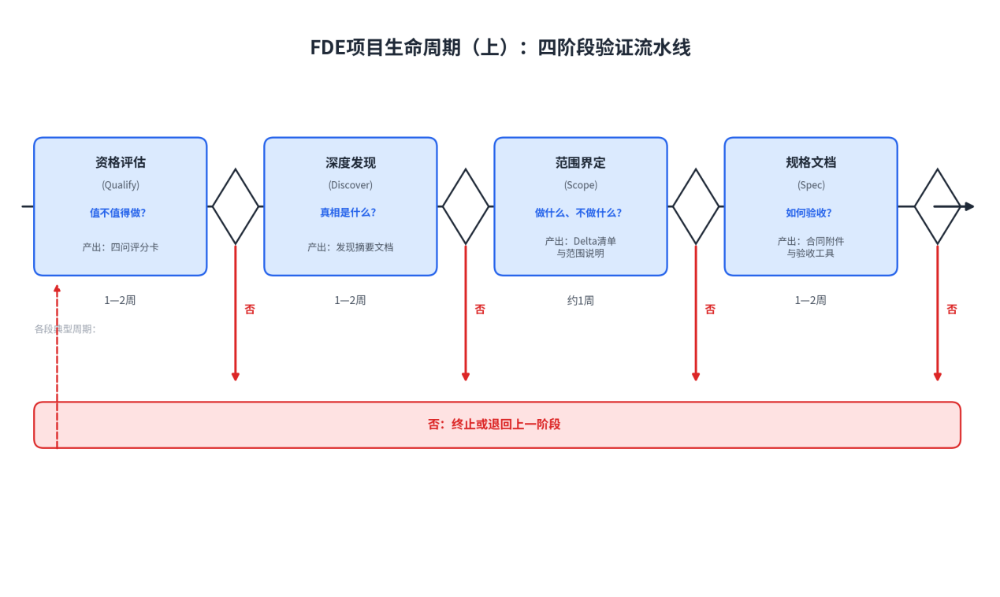
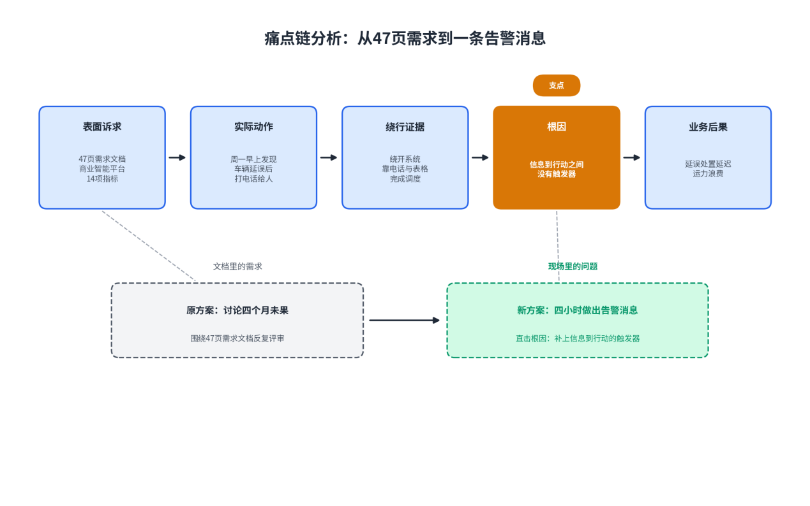
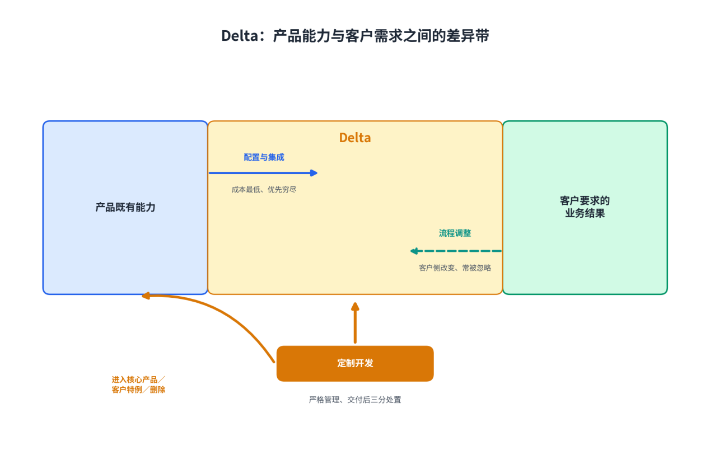
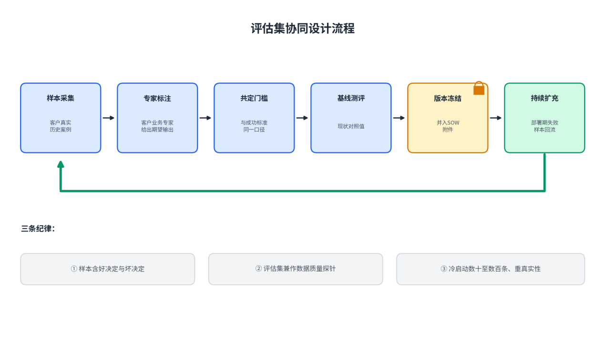

# 第4章FDE项目生命周期（上）：发现与规划

**【本章导读】**

本章回答一个问题：从第一次接触潜在客户，到双方签下一份可执行的规格文档，FDE团队应该做什么、按什么顺序做、做到什么程度才算完成。本章把这段签约前的旅程拆成四个阶段——资格评估、深度发现、范围界定与规格文档，为每个阶段给出决策方法、操作清单与产出标准。本章适合两类读者：信息化企业负责人、FDE团队负责人与售前交付管理者，可把四阶段直接用作作业流程；客户侧的数字化转型决策者，可用自检清单判断组织是否具备引入FDE的条件。项目生命周期进入部署实施后的下半程有独立的方法体系，本章不展开。

传统软件流程把签约前的工作统称为“售前”：听需求、写方案、做演示，目标是合同。FDE模式把这段流程改造成一条四阶段的验证流水线：资格评估回答“这个客户值不值得接”，深度发现回答“真正的问题是什么”，范围界定回答“做什么、不做什么”，规格文档回答“把承诺写成什么样”。顺序不能颠倒：未通过资格评估的客户不值得做发现，没写进规格的口头承诺到部署期都会变成争议。这套纪律存在的理由很朴素：FDE团队的产能极度稀缺，而企业AI项目的失败，大部分在写下第一行代码之前就已经注定。

图4-1：FDE项目生命周期（上）：四阶段验证流水线

## 4.1 资格评估（Qualify）

### （1）FDE资源是稀缺的：什么项目值得接

一支合格的前线部署小分队——一名业务侧加两三名技术侧——同期能高质量交付的项目通常不超过两个。一个客户成功经理能同时服务八到十二个客户，而一名FDE深度嵌入的客户只有一到三个，单个客户的部署往往意味着三十到六十天的每日在场——精英交付产能是天然的稀缺资源。

稀缺产能必须配上经济红线。投资人托马什·通古兹（Tomasz Tunguz）算过一笔直白的账：给一万美元的合同配年薪二十万美元的FDE，账永远算不过来；这个模式大约在单份合同十万美元以上才成立，折算到中国市场，大致对应大几十万到百万元人民币级。红线之下不是没有客户，而是不该用FDE去服务。

比红线更隐蔽的是机会成本：接错一个项目，损失不是“少赚一单”，而是一支顶尖团队被泥潭占用半年——错误的试点烧掉的不只是当期成本，还有团队时间、士气，以及本可以长在正确客户身上的产品复利。因此资格评估的第一问不是“能不能做”，而是“值不值得此刻占用这支团队的产能”。经验做法是把客户放进二维矩阵：灯塔价值（行业信号强度）与学习价值（能沉淀多少可复用能力）。双高客户甚至可以，也应该倒贴资源优先做——Palantir早期免费做试点、烧掉数百万美元，赌的就是这个矩阵；双低的大合同反而最危险：钱看着多，却把精英团队套牢半年。

一个中国创业团队的选择可作对照练习。某企业知识库AI团队（应要求匿名，下称N公司，数字经模糊化处理）初期同时面对三个线索：一家头部券商，预算大但首次会议就要“覆盖全公司”，且没有明确的业务负责人；一家三甲医院，影响力大但数据不出域的限制让交付周期不可控；一家区域连锁零售集团，预算中等，但首席财务官亲自盯项目，痛点具体——3000家门店的运营督导报告，区域经理根本看不过来——数据基础虽乱，但可触及。团队放掉了销售眼中最诱人的券商，选择零售集团：灯塔价值不是最高，但三重检验全过。

资格评估还要警惕一类特殊客户：“需求蝗虫”——预算充足、需求旺盛，却会吸干团队而不产生任何复利。三个识别特征：需求与公司战略方向明显偏离，做了也沉淀不下可复用能力；把FDE当廉价外包使唤，按人头派活而不是按结果对齐；内部政治消耗巨大，主要工作变成帮某个部门证明另一个部门错了。需求蝗虫的合同额往往诱人，而对它们说不的能力，恰是FDE团队最值钱的资产。

### （2）四问决策法：价值、可行性、意愿、边界

把“值不值得接”从直觉变成纪律，需要一张可复用的评分卡。本书建议用四个问题做主干：价值、可行性、意愿、边界。

第一问，价值：痛点是否真实、高频、可量化。真实的痛点能换算成钱——用不作为成本折算：这个问题不解决，客户每个季度损失多少人时、多少收入、多少风险敞口。算不出这笔账的痛点，多半是想象出来的需求。价值维度同时检验合同红线：客户体量能否覆盖高触达交付的成本。

第二问，可行性：真实数据是否可及，系统约束是否可控。可行性不问“做不做得出”，只问验证条件成不成立：客户能否第一天就提供真实数据的访问权限；客户侧发布一个版本要走多久流程——有的组织要走六周，这当场决定验证节奏是否现实；是否存在数据不出域之类的硬约束。

第三问，意愿：客户组织里有没有人真心想赢。三条高危信号中一条即触发深度怀疑：没有明确的业务负责人、拒绝提供真实数据、需求宏大无边。最强证据是能拍板的业务负责人全程在场，并配懂数据的内部接口人。灯塔客户还要加试一条：初期就谈好，成功后他愿不愿意站出来——联合发布案例、行业会议现身说法、接待参访；不愿公开替你说话的灯塔，价值至少打对折。

第四问，边界：这个项目与公司方向是什么关系。每一次承诺都会进入代码库与支持队列，影响下一批客户。Ramp把“永远在界定范围”（Always be Scoping）列为FDE第一原则，其中最具分量的一问是：这个承诺会挤掉队列里的哪一项工作？范围判断因此也是一种投资组合管理——不是判断请求有没有价值，而是判断它是否最值得现在做。

四维各按1—5分评分，任一维度低于3分须书面说明补救措施；另设一票否决线，触及即终止。评分卡的价值不在分数，而在强迫团队把“感觉不错”拆成可以争论的证据。

表4-1：四问决策法评分卡

| **维度** | **核心问题** | **关键证据** | **1分表现** | **5分表现** | **否决线** |
| --- | --- | --- | --- | --- | --- |
| 价值 | 痛点真实、高频、可量化吗 | 不作为成本估算；合同体量 | 痛点笼统，无法换算成钱 | 痛点具体到岗位与时刻，损失可量化 | 合同额低于成本红线，且无灯塔与学习价值 |
| 可行性 | 验证条件成立吗 | 真实数据权限；系统与合规约束 | 只肯给脱敏样例数据 | 真实数据第一天到位，约束全部摸清 | 客户拒绝提供真实业务数据 |
| 意愿 | 谁在为结果负责 | 业务负责人级别与投入时间；内部接口人 | 只有信息部门对接 | 能拍板的业务负责人全程在场 | 没有明确业务负责人，或需求宏大无边 |
| 边界 | 与战略方向一致吗 | 可复用能力清单；机会成本评估 | 纯一次性定制 | 沉淀的能力可服务同类客户群 | 需求蝗虫三特征占两条以上 |

### （3）客户自检清单：是否具备FDE条件

资格评估通常是供应商的动作，但另一半答案在客户手里。大量AI项目失败的根因在买方一侧：买的是“人工智能”这个概念，而不是一个具体业务结果。客户侧决策者在接触任何FDE团队前，应先做一次自我资格审查——不通过不意味着项目不该做，而意味着“还没到时候”：缺什么补什么。

表4-2：客户FDE条件自检清单

| **检查项** | **合格表现** | **危险信号** |
| --- | --- | --- |
| 痛点具体度 | 能说出“谁、在什么时刻、被什么卡住” | 只能说出“想上一个AI平台” |
| 不作为成本 | 现状损失有量化估算 | 从未算过不做的代价 |
| 真实数据意愿 | 愿意提供真实业务数据用于验证 | 只肯提供脱敏样例数据 |
| 业务负责人 | 有能拍板的人全程在场 | 项目挂在信息部门，业务方旁观 |
| 数据接口人 | 有懂数据家底的内部人员全程陪同 | 数据资产底数不清、无人能答 |
| 验证节奏 | 接受以周计的小切口验证与明确毕业标准 | 坚持先签大合同、做完整方案 |
| 成功量化意愿 | 愿意把成功写成一个数并接受检验 | 拒绝定义可验收的指标 |
| 变革准备 | 想过流程改变后相关岗位怎么安置 | 回避讨论“谁的奶酪被动” |

清单里最容易被低估的是“真实数据意愿”。用脱敏样例数据做验证，是概念验证坟墓的第一块砖：真实数据里藏着一切魔鬼——字段与文档不符、大面积空值、遗留的编码规则，最要命的是数据本身记录着错误的流程。在假数据上成立的方案，上线那天就会遇到文档里不存在的字段——那时已付了真价钱。约翰迪尔项目的做法值得对照：客户方把“评审数百个真实作业案例”放在任何建模工作之前。

## 4.2 深度发现（Discover）

通过资格评估的客户，进入一到两周的进场尽职调查：业务侧与技术侧分头进行、每日对表，产出五份地图——数据地图、流程地图、组织地图、系统地图与政治地图。这套尽调看起来像纯成本，账要这么算：两周尽调省下的，是三个月在错误战场上的狂奔。

### （1）结构化访谈：8—10个利益相关方

发现阶段的第一组对话对象，是利益相关方（Stakeholder）——利益会被项目改变或能否决项目的所有人。经验法则是访谈8到10人，覆盖五类角色：发起者（谁提出要做）、买单者（谁批预算）、使用者（谁每天用它干活）、否决者（谁能以技术、安全或合规理由叫停）、知识枢纽（职位不高、但所有人遇到实际问题都去找他的那个人）。每类一到三人——少于8人必有盲区，多于10人尽调期装不下。知识枢纽值得单独标注：他没有职级，却是组织的“活文档”——哪份数据被信任、哪条流程实际打电话，问他都知道；他既是最好的需求来源，也是日后推广的种子节点。

以财务部门为例：应付账款、应收账款、公司卡对账、银行、账单、财务规划分析六位负责人各管一段，流程彼此咬合——应付的付款影响现金预测，应收的回款改变财务规划的判断。只采访一位，就可能优化局部、把等待推给下游。

访谈问法也经过现场检验。前Palantir工程师、Kepler首席执行官加内什（Vinoo Ganesh）建议连续追问三件事：你真正想达到的目标是什么；看到结果之后，下一步具体会发生什么；今天没有这套系统时，你怎样绕过去。再加一个朴素的开场问题：“每天早上最烦的事情是什么？”

但对于访谈本身的价值，两份一线材料存在分歧：一份把结构化访谈当作绘制组织地图的主力，另一份直言“行胜于言”——客户面对全新品类没有参照系来描述需求，说的和做的也常是两回事：律所刚花五万美元买了法律AI工具，律师们实际却在用ChatGPT起草合同。本书采纳的组合是：访谈建立地图与假设，观察与共同劳动校准真相——访谈里听到的一切，都要在现场找到证据。

表4-3：利益相关方访谈矩阵（8—10人配置）

| **角色** | **典型人选** | **访谈重点** | **关键产出** |
| --- | --- | --- | --- |
| 发起者 | 业务副总裁、部门总经理 | 为什么是现在；不做会发生什么 | 项目动机与政治背景 |
| 买单者 | 首席财务官、采购负责人 | 预算逻辑；按什么标准验收 | 价值口径与合同红线 |
| 使用者 | 一线业务骨干2—3人 | 每天最烦的事；现在的绕行办法 | 痛点链原始素材 |
| 否决者 | 信息安全、合规、架构负责人 | 数据边界；审查流程与时限 | 约束清单初稿 |
| 知识枢纽 | 资深员工、“活文档” | 哪个数据被信任；流程为什么是这样 | 隐性流程与暗数据线索 |

### （2）工作流映射与痛点链分析

访谈给出人名与线索，工作流映射给出事实。流程地图要画真实运转图而非流程文件里的版本：文档记录组织希望流程如何运行，现场暴露流程实际如何运行。流程文档通常只记录“黄金路径”，真正决定AI成败的却是边缘情况：信息不全、角色重叠、审批人休假、同一个人两套系统两种拼写。只学到理想流程的AI，异常一来就会停住，或者更糟——自信地做错。一张合格的流程地图至少要容纳四类事实：正式规则（采购金额超限必须升级审批）、系统状态（发票是否已入账）、组织关系（负责人休假时谁替代）、经验判断（哪些供应商字段不全却通常可放行）。前三类容易进入数据库，第四类往往只存在于老员工的习惯里，却恰恰决定AI能否处理真实世界。

画这张图的基本方法，是人类学里的“参与式观察”、丰田生产方式里的“现地现物”，FDE的实践称之为影子学习：跟着真实用户，过完他真实的一天。不是采访，是坐在旁边看他工作：在哪些表格之间复制粘贴、在哪个界面之后叹气、什么情况下放下系统拿起电话。重点观察“变通”而不是“流程”：员工为什么坚持把数据导出到表格里再算一遍？为什么公认“这张表要找小王”？每一个变通背后，都是一个未被满足的痛点、一次系统的失败。流程图上要特别标注三个点位：时间消耗最大、出错代价最大、情绪最激烈的环节——它们通常就是价值的富矿。

访谈与观察的素材，最后用痛点链串起来。痛点链是一条五环节的因果链：表面诉求、实际动作、绕行证据、根因、业务后果。一家运输调度客户交来47页需求文档，需要完整的商业智能工具和14项指标，团队照单讨论了四个月，始终没走进调度员每天工作的地方。直到一名工程师到了现场，问出那个改变项目的问题：“周一早上，你拿到这些信息之后，第一件事是什么？”答案不是分析十四张图表，而是发现车辆延误后，打电话通知正确的人，重新安排货物或运力。团队四小时内做出一条告警消息——它不完整，却直接抵达业务动作：客户当场能判断阈值、接收人与误报。47页文档描述的是一套想象中的分析系统，真正决定价值的只有“发现延误—通知正确的人—采取替代行动”这一条链。

痛点链的根因一层，经常藏在一个“反对者”的日常动作里。另一客户现场，团队要把每天约1TB的CSV迁到更高效的Parquet格式，一位数据质量工程师反对了近一年，只说“不好用”。到现场一看就明白：她每天把CSV下载到电脑上双击打开、抽查几行确认数据是否正常——Parquet对机器高效，却夺走了她最重要的质量控制动作。团队连夜做了一个Parquet查看器，她第二天仍能照旧检查数据，迁移随即获批，流水线从约17小时缩到约2小时。反对者不是不懂技术，她是在保护一个没人注意到的工作环节。这类环节的清单——谁的双击、谁的复制粘贴、谁的电话——就是痛点链最可靠的输入。

图4-2：痛点链分析：从47页需求到一条告警消息

### （3）数据探查与约束识别

数据地图回答五个问题：有哪些数据源、归谁拥有、质量如何、权限归谁管、有没有暗数据——老员工私藏的表格、只在邮件里流转的报表、纸质台账。但更重要的是第六问：哪份数据被信任——几乎每个组织里，官方数据源与员工真正信任的数据源都不是同一个，而要接的是后者。N公司在零售集团的发现很典型：区域经理根本不看公司数据系统的报表，真正信任的是门店店长每天手填的一张表——“系统的数据晚三天，还老错”。推翻最初大方案的，正是这个发现。

数据探查是一份“魔鬼清单”的排查工作：字段含义与文档不符；大面积空值；多年前遗留的编码规则；数据本身记录着错误的流程。还有一种更隐蔽的魔鬼：数据里并存着两个互相矛盾、各自“正确”的答案。Salesforce把自家客服智能体当第一客户用了一年，最大的坑正源于此——智能体遇到两个打架的答案时会试图调和甚至编造，最后逼得他们把六百多条内部数据流整合成唯一权威数据源，每个问题只留一个权威答案。Palantir早年的Phoenix系统提供了另一个方向的教训：系统一接触真实银行数据，空日期被默认成1970年1月1日，时间分桶随即为四十余年间每隔十分钟区间建桶，生成约230万个键空间、启动估算约需14TB内存。失败不来自高深算法，而来自一个极其普通的脏数据事实。要义在于：数据探查必须发生在架构形成之前，琐碎约束错过窗口期就是致命的。

约束识别覆盖三层。系统层：要对接的系统清单及其接口状态、安全与合规边界、变更管理流程——很多项目的时间表在第一天就注定破产，因为没人问清楚客户那边发布一个版本要走六周流程。制度层：记录系统的权威不可绕开——一家花了五年和五百万美元迁移到NetSuite的客户，不会因为AI供应商一句“方案更好”就推倒重来；月底结账信哪套余额、审计时哪套日志有证据效力、离职后权限从哪里收回——这些答案决定了AI的动作最终必须写回哪里。政治层：这个项目动了谁的奶酪，要自动化的目标流程是不是某个部门的权力来源，落地之后谁的工作会显得多余。员工的抵触根源大多不是懒，是恐惧；发现阶段的任务，是提前识别这些恐惧的载体，让方案在范围界定时就为他们安排“生路”，而不是“死路”。

探查动作本身要克制：只接当前问题需要的最小数据集，权限、脱敏、导出方式当场定死——发现阶段不是数据搬家，是验证“数据能支撑价值”这一假设。

### （4）发现摘要文档的产出标准

深度发现的产出物，是一份发现摘要文档。它不是会议纪要，而是后续所有决策的事实基础。合格的发现摘要有四条标准：可决策、可验证、可交接、客户确认。

可决策：读完能直接支撑“做还是不做、从哪切入”的判断，而不是“情况复杂、有待研究”。可验证：每条结论都带来源——谁、在什么场景说的，被引用者日后能认出自己说的话。可交接：一个没到过现场的工程师读完，能理解这个客户的业务怎么运转、钱在哪里、坑在哪里。客户确认：业务负责人逐条确认并签字。这不是客套，而是把“听到的就是想说的”变成双方共同承担的事实基础——日后范围争议出现时，这份文档是唯一的裁判。

内容上至少包含六部分：痛点链陈述（含根因与业务后果）；五份地图的要点；量化基线——现状指标的真实测量值，来自数据探查而非客户自述，是日后成功标准的分母；约束清单（数据、系统、合规、政治四类）；建议的最小切口与初步排除项；风险与退出条件。摘要回答“事实是什么”，提案回答“因此建议怎么做”——顺序颠倒的文档，读起来都像推销。

## 4.3 范围界定（Scope）

发现回答了“问题是什么”，范围界定回答“做什么、不做什么”。这是AI时代最被低估的工程能力：代码生成的成本在断崖式下降，判断什么不值得写的成本没有同步下降。Ramp工程总监梅尔（Leo Mehr）的表述被反复引用：最稀缺的工程能力，是在写代码之前说清楚不做什么。范围界定发生在估工期之前——先确认问题成立、切口正确，再讨论做多久。

### （1）Delta概念：产品能力与客户需求之间的桥梁

企业交付中不存在开箱即等于结果的产品。客户要求的是业务结果，产品提供的是通用能力，两者之间的差值带，本书称为Delta——它源自Palantir的工程理念：差距永远存在，差别只在谁来弥合、用什么弥合。FDE的工程工作，本质上就是桥接Delta。

Delta有三条弥合路径，成本与风险完全不同。第一条是配置与集成：在产品既有能力内完成弥合，成本最低，最值得优先穷尽。第二条是定制开发：产品能力之外、为本次交付新建的能力——它是Delta的主体，也是必须被严格管理的部分。第三条是流程调整：客户侧改变工作方式，让需求向产品能力靠拢——最容易被忽略，却常常是最短路径：从流程里拿掉一步多余的审批，比为它写一个自动化模块更便宜。

Delta清单是差距分析的产物，逐项列出：客户要的结果、产品现状、差值、弥合路径、责任方。清单要对照痛点链逐条校验，而不是对照招标书——需求文档写的是被转述过的痛点：信息部门翻译成技术需求，采购部门翻译成合规条目，每转一手失真一次。

定制开发部分还背着一条产品纪律：本次新建的每一项能力，交付后要三分处置——进入核心产品、留作客户特例，还是尽快删除。Palantir首席技术官香卡尔（Shyam Sankar）把FDE称为“伪装的产品战略”：现场不是产品完成后的交付末端，而是产品发现自己应该成为什么的地方。本书采纳这一定位：Delta清单的归宿是产品路线图，而不是项目归档目录。前十个客户在事实上参与塑造产品，定制部分一旦无纪律堆积，产品就会被带向没有普遍性的方向。

图4-3：Delta：产品能力与客户需求之间的差异带

### （2）最小有价值架构（MVA）的设计原则

范围落定之后，架构问题要换一种问法：不是“最好的架构是什么”，而是“让价值在真实环境里真实发生一次，最少需要哪些架构决策”。这个最小集合，本书称为最小有价值架构（Minimum Valuable Architecture，MVA）。它与产品级架构的区别不在大小，在裁判：产品架构对长期演进负责，MVA对这一次验证负责——验证通过之后，它的大部分要么被产品化重写，要么被拆除。

最常见的错误是把MVA做成“阉割版大方案”：功能砍掉七成，做得四不像。正确做法是只砍覆盖面、不砍方案深度：不做“覆盖全公司的智能客服”，只做退换货这一类工单、但端到端无人干预；不做“全集团供应链优化”，只做这条产线的排产冲突、但每周实在省下20个人时。切口要小到价值密度足够高，高到业务部门肉眼可见、主动传播。

表4-4：MVA设计原则与常见误区

| **原则** | **核心要求** | **常见误区** |
| --- | --- | --- |
| 真实数据先行 | 架构的第一块砖是真实数据通道，没有例外 | 先用演示数据跑通，上线前再换真数据 |
| 读旧写新 | 数据上深度兼容旧系统，架构上绝不迁就 | 把代码写进旧系统，变成旧环境的寄生体 |
| 砍面不砍深 | 缩小覆盖范围，保持单点端到端的深度 | 功能按比例缩水，处处半成品 |
| 顺从人的习惯 | 界面出现在用户已有的工具里 | 要求用户登录一个崭新的门户 |
| 临时构件按18个月寿命设计 | 清晰所有者、日志、基本测试、权限边界、退出方案 | “先跑起来再说”，把试点写成维护债务 |
| 测量通道内建 | 每条价值主张预留计数与取数接口 | 验证结束时只剩“感觉不错” |

六条原则各有来历。真实数据先行：OpenAI内部按这条线划分岗位——解决方案架构师可用匿名样例数据做演示，FDE必须在客户基础设施上、用真实数据写生产代码。读旧写新：验证期方案有一半以上概率被推翻重写，寄生越深浪费越大；写入旧系统要走以月计的变更流程，与周级验证节奏根本冲突。顺从人的习惯：OpenAI在西班牙对外银行的部署，从12万员工已在用的ChatGPT界面切入而非另起炉灶。临时构件的寿命：一段为赶进度随手写的Groovy脚本，在近十万人的客户环境里活了一年以上——“临时”只是写代码那天的心理状态，不是系统的生命周期。测量通道内建：没有它，验证结束时无法向验收交差。

### （3）定义成功标准：可验证、可测量、可验收

范围界定阶段的最后一项产出，是成功标准。它要过三关。

可验证：测量方法与数据源事先写明。验证方案里要写清验收指标、测量方法、基线数据与每一阶段的退出机制——在被过度承诺伤害过的企业市场里，敢被检验是最稀缺的诚意。

可测量：基线、目标值、统计口径三者齐备。一份合格的表述长这样：“八周内，把你行反洗钱调查的平均处理时间从4小时降到15分钟，释放的调查产能相当于现有团队的2.5倍。”基线来自数据探查而非估计；操作上有一条硬习惯：把单点问题写成一句话，把验收指标写成一个数。

可验收：明确裁判与验收时刻。裁判必须是业务方而非信息部门；最好的验收动作，是让决策者亲手操作系统处理真实业务，可行性报告因此可以省掉大半。验收时刻与流程也要写死：在哪一天、由谁、按什么流程判定通过。

成功标准还有一面镜子：不作为成本——“不做会发生什么”。这笔账在范围阶段算不清，交付之后也算不清。同时要警惕虚荣指标：登录次数、演示掌声、仪表板数量都不是结果；结果是一个业务动作的变化——延误被更快处置，工单不再经过人手。

### （4）“明确排除”是范围管理的核心

范围文档里价值最高的部分，往往不是“做什么”，而是“不做什么”。范围压缩不是降低客户价值，而是删除与目标无关的实现——它问的不是“最多能做什么”，而是“哪一组最少工作足以改变结果”。

Ramp的一段经历是完整教材。团队为一家客户开发移动报销，两名FDE工程师临时学习iOS与Android开发，连续数周把两个版本都做了出来。直到向客户索取Android测试用户名单时，团队才听说这家企业的设备管理政策强制使用iPhone——Android用户不是很少，而是根本不存在。浪费并非来自技术难度，而是没人验证最基础的使用环境：客户说“移动端”，工程师脑中浮现“两大平台”，真正的约束却是“公司配发的受管iPhone”。范围界定的纪律，就是把未经验证的名词逐个拆开：移动端是哪一种设备，集成是哪一组动作，“实时”究竟需要多少秒。

排除项必须写进文档，与目标同等地位，固定覆盖五类：不覆盖的用户群与场景、不对接的系统与数据源、不承诺的指标与性能、不承担的职责（如客户内部的变更管理与培训）、本期不处理的例外流程。评估一份范围文档的质量，可以反过来数它的排除项：一份什么都答应的方案，等于什么都没界定。

时间盒也是排除的一种。验证周期应以周计而不是以月计，截止时间的意义不在快，而在强迫双方做诚实的取舍：凡不能在这几周里体现价值的部分，都还不是核心价值。六个月的“最小验证”，几乎必然长成什么都想要的大项目。周期上限、毕业与散伙两种后续，都要写死——写得含糊的验证方案，等于给概念验证坟墓签发开工许可。

排除的商业价值常被忽略：明确的排除项是二期合同的种子——写进文档的“暂不”，远比口头敷衍体面。

## 4.4 规格文档（Specification）

范围谈定之后，要把它定型为具有合同效力的文本。多数技术团队写的同类文档都在犯同一个错误：通篇讲“厂商要做什么”，而不是“你将得到什么”。规格文档阶段的任务，是把发现与范围的全部结论变成一份可执行、可验收、可追责的合同文本，外加一套质量裁判工具与一张分阶段部署地图。

### （1）SOW（工作说明书）的编写指南

工作说明书（Statement of Work，SOW）是FDE项目的核心合同附件。好的SOW遵循严格的倒金字塔结构。

第一层，业务结果，一段话说完，必须是客户语言，例如“八周内，把你行反洗钱调查的平均处理时间从4小时降到15分钟”——没有这一句，客户的高管看不进后面的内容。第二层，价值验证路径：写明验收指标、测量方法、基线数据与每一阶段的退出机制，传递的信号是“敢被检验”。第三层，交付方法：双方怎么做。技术方案在这里才登场，要让非技术读者也能跟上——架构图配业务注释，里程碑配决策点；还要写明客户配合事项（数据权限到位时间、关键人员投入时间），一来排雷，二来筛选客户。第四层，风险与对策：成熟的买家选供应商，看的正是他敢不敢把死法说清楚——数据质量不达标、关键人员变动、准确率达不到门槛，各自怎么办。这一层是整份文档的信任放大器。

表4-5：SOW结构模板

| **章节** | **内容要点** | **常见错误** |
| --- | --- | --- |
| 业务结果 | 一段话、客户语言、可量化的结果承诺 | 以“项目背景”开篇，通篇厂商视角 |
| 价值验证路径 | 验收指标、测量方法、基线、各阶段退出机制 | 指标无基线，退出机制缺失 |
| 交付方法与里程碑 | 架构图配业务注释、里程碑配决策点 | 技术细节淹没业务读者 |
| 客户配合事项 | 数据权限、接口人、关键人员投入时间 | 默认客户“自然会配合” |
| 评估与验收 | 评估集使用规则、验收流程与裁判 | 验收标准引用模糊 |
| 风险与对策 | 数据、人员、准确率三类风险及预案 | 回避风险，只写光明面 |
| 商务条款 | 分阶段报价、与毕业条件挂钩 | 一次性总价，与价值脱钩 |

买方标准也在变硬：人力资源软件公司Rippling把“供应商必须投入专属工程资源”写进硬性选型标准；协同文档公司Notion的招标书最后一条是——不只要一个供应商，更要一个能一起共建的团队。验证方案敢写多狠，取决于背后的账算得多清。

### （2）评估集（Eval Set）的协同设计

AI交付物与上一代软件最大的区别，是质量不能靠功能清单验收。评估集（Evaluation Set，Eval Set）因此成为规格文档的关键附件：一组取自客户真实业务、带期望输出的样本集合，是交付物质量的裁判工具——它把“好用”这个形容词，变成一组可以逐条打分的样本。

评估集必须在签约前完成协同设计：它是验收指标的技术化身。签约之后再补，验收就退化成“演示时看起来不错”；在合同里写明评估集、通过门槛与测量方法，验收就从主观印象变成机械执行。

协同设计分六步。第一步，样本采集：从客户的真实历史业务中取样，约翰迪尔项目把“评审数百个真实作业案例”放在任何建模工作之前。第二步，客户专家标注期望输出——这是客户专家参与交付的最深接口，标注本身就把隐性经验变成组织资产。第三步，双方共定通过门槛，口径与成功标准一致。第四步，基线测评：用同一套样本测出现状对照值。第五步，版本化冻结，并入SOW附件。第六步，部署期持续扩充：边缘案例与失败样本不断回流，评估集随交付生长。

两条纪律决定评估集的成色。其一，样本要同时包含历史上的好决定与坏决定；只喂“通过样本”，系统学到的是“把答案写得像应该通过”，而不是把事做对。其二，把评估集当作数据质量的探针：标注阶段最常暴露的是两个互相矛盾、各自“正确”的答案——这比任何模型指标都更早指出，需要先定唯一权威数据源。规模上，冷启动数十到数百条真实样本足以支撑第一次基线测评，真实性远比数量重要；每条样本可配评分检查项：真实用户、当前绕行、成功指标与非目标。

图4-4：评估集协同设计流程

### （3）部署策略的分阶段规划

规格文档的最后一块，是把签约后的旅程预先分阶段：验证期、试点期、扩展期，每一阶段都写清范围、目标指标、双方投入、毕业条件与退出机制。

验证期以周计，行业参照值很窄：Palantir的训练营一到五天，Sierra公开报道的最快上线案例四周，Decagon的典型部署四到八周。试点期打透一个业务单元：Harvey不做全所铺开，先打透一个全球业务组，让第一批合伙人成为信徒，六个月实战后再横向扩展；这套“先十家、后四千”的节奏，对应到中国语境，是先拿下一个事业部、厂区或区域公司，用使用数据去敲集团的门。扩展期的样本是连锁药房Walgreens：先在10家门店试点，店内运营效率提升30%，然后八个月内推到4000家门店，端到端工作流每天自动处理原本要人工做出的约3840亿次决策。验证通过的项目不是慢慢长大，是跳跃式放大：一家大型医疗公司12月参加训练营，五周后签下五年期、年合同额2600万美元的协议。

表4-6：分阶段部署规划

| **阶段** | **时间尺度** | **范围** | **验证目标** | **毕业或退出条件** |
| --- | --- | --- | --- | --- |
| 验证期 | 一至八周 | 单点问题、最小数据集 | 价值在真实环境发生一次 | 指标达标进入试点；不达标按退出机制终止 |
| 试点期 | 三至六个月 | 一个业务单元端到端打透 | 生产环境稳定运行、用户自发使用 | 单位经济成立、出现内部倡导者，进入扩展 |
| 扩展期 | 六个月以上 | 跨部门、跨区域复制 | 复制成本递减、价值随规模放大 | 任一单元未达标则回退，不强行铺开 |

分阶段规划还要过一道产能纪律：永不承诺超越产能的并行——每个项目都背着一整套客户语境，切换一次就要重新加载；宁可让销售把“档期排到下个季度”当稀缺性卖，也别让团队在三个客户之间疲于奔命。

至此，生命周期的上半程闭环完成：资格评估守住产能，深度发现锁定真问题，范围界定压缩出可验证的切口，规格文档把承诺变成可执行的文本——上半程的每一项纪律，都是下半程少走的弯路。
