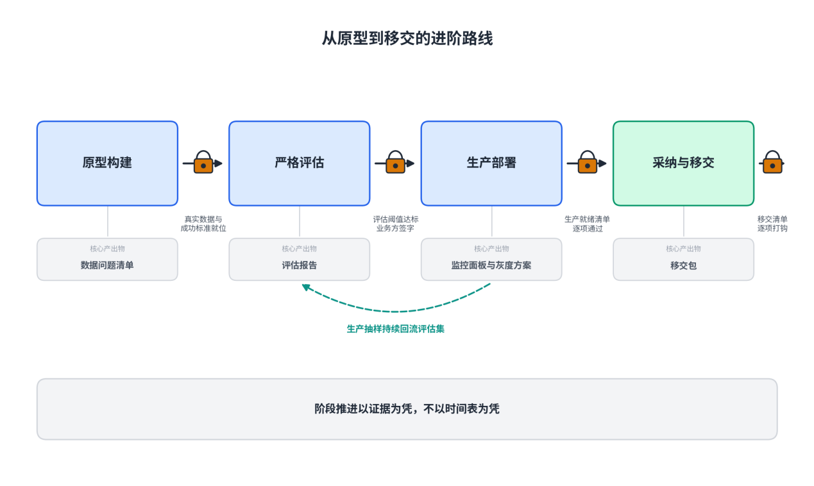
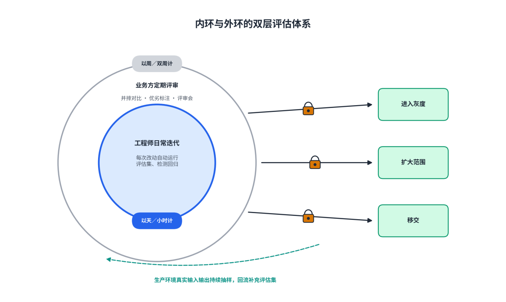
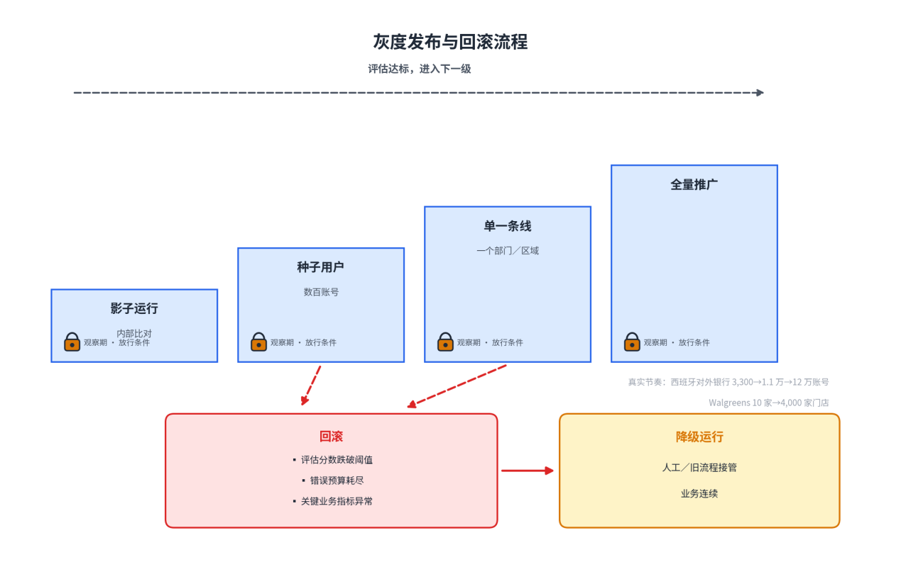
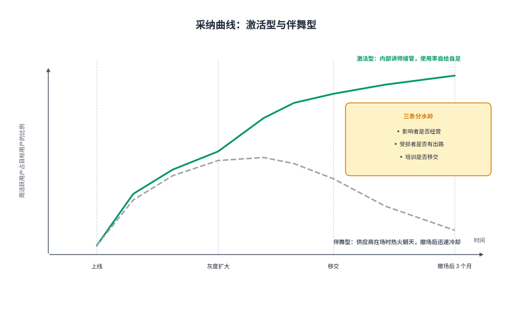

# 第5章FDE项目生命周期（下）：构建与交付

**【本章导读】**

方案已定、合同已签，项目进入真正决定成败的阶段：做出原型，评估质量，送进生产，让用户用起来，把运营责任完整移交。本章回答四个问题：原型怎样构建才能暴露真问题而非掩盖问题；评估体系怎样设计，“好”才有一把双方认可的标尺；生产部署需要哪些就绪条件与长期保障；采纳与移交怎样完成，系统才不会在团队撤场后迅速冷却。适合项目决策者、FDE团队负责人与客户方技术管理者阅读。

## 5.1 原型构建（Prototype）

FDE项目进入构建期后的第一个产物是原型——不是演示会上的幻灯片，而是一个能在客户真实环境里运行、处理真实业务的最小系统，其完整形态是最小可行部署（Minimum Viable Deployment，MVD）：用最小的工程投入，在客户的真实环境里，对真实的痛点，验证一次价值的真实发生。原型阶段的全部纪律都服务于一个目的：尽早暴露真问题。一个在十个客户那里验证成功的方案，在第十一个客户那里照样可能失败——数据基础、组织惯性、痛点的形状都不同。价值没法从上十个客户那里继承，只能在这一个客户身上重新验证。

图5-1：从原型到移交的进阶路线

### （1）用真实数据，不做“干净样本”

原型构建的第一条军规：真实数据，没有例外。用客户提供的脱敏样例数据，或工程师自己构造的演示数据做验证，是概念验证坟墓的第一块砖。真实数据里藏着一切魔鬼：字段含义与文档不符、三成的空值、三年前的编码规则，以及最要命的——数据本身记录着错误的流程。Salesforce把自家客服智能体当第一客户用了一年，踩过最大的坑就是这个：智能体遇到两个打架的答案时会试图调和，甚至编造，一份过时又没被链接的旧页面就足以污染回答，逼得他们把公司内部六百多条数据流整合成唯一权威数据源，每个问题只留一个权威答案。

“干净样本”让一切看起来可行；危险在于，在假数据上成立的方案，上线那天就会遇到文档里不存在的字段——而那时已经付了真价钱。领先团队把这条写进岗位定义：OpenAI内部按数据真实性划分两个岗位——解决方案架构师可以用匿名样例数据做演示，FDE必须在客户的基础设施上、用客户的真实数据写生产代码；Palantir的训练营把“客户必须带自己的真实业务数据来”写进规则；约翰迪尔项目把评审数百个真实作业案例放在建模之前。

落地层面只有一条硬杠：真实数据的访问权限在项目第一天就位，而不是“正在走流程”。配套的还有客户侧三个角色：一个能拍板的业务负责人、一个懂数据的内部接口人、一份第一天就开放的数据权限。

### （2）数据问题清单的动态记录

数据治理没法在开工前一次性做完，它会贯穿项目始终——很多人工智能项目干到最后，主体工作其实就是治理。连Palantir自己都在这事上栽过：内部一个系统被230万个数据条目撑爆内存，复盘的第一句话是，团队从未见过这个系统真正要处理的数据。

管理这条长战线靠一个朴素但极少被认真执行的机制：数据问题清单。原型期每发现一个数据问题——字段缺失、口径冲突、版本混乱、权限悬空——就登记入册，标注严重度与责任方，设定解决期限，每周复核。清单的价值在于把“数据很差”这种模糊抱怨，变成一张可以逐条销号的工作表：哪些问题阻塞原型，哪些可以绕行，哪些必须交还客户的数据团队，一目了然。

更重要的是，这张清单是后续所有阶段的地基：评估集的样本构成来自清单登记的缺陷分布，生产就绪检查的数据项来自清单未销号的风险，移交时客户接手的第一份资产也是清单的终态版本。

表5-1：数据问题清单的标准模板

| **字段** | **填写要求** | **示例（示意）** |
| --- | --- | --- |
| 编号与发现日期 | 按发现顺序编号，便于追溯 | DQ-017，3月12日 |
| 数据域与来源系统 | 问题所在的数据表、接口或文档 | 供应商主数据，ERP导出表 |
| 问题描述 | 具体、可复现，禁止“数据质量差”式表述 | “供应商编码”字段约三成为空，新旧两套编码并存 |
| 影响面 | 阻塞哪些功能或评估样本 | 影响对账类工单输出，约占日单量两成 |
| 严重度 | 阻塞／高／中／低四档 | 高 |
| 责任方与解决期限 | 写明客户方或供应商方及截止日 | 客户数据团队，4月1日 |
| 状态与处理记录 | 未处理／处理中／已销号／接受绕行 | 处理中：先以新编码为准，旧编码映射表补齐中 |

### （3）原型作为学习工具，而非交付承诺

原型期最重要的产物不是软件，而是学习。前Palantir工程师Barry回忆，公司在客户试点上烧掉过数百万美元，很多试点利润率“字面是负无穷”，但管理层把它记在研发的账上而不是成本的账上——每一次实施，一是构建与学习的机会，二是生意。

原型期要学的东西有四类：工作流的真相（那个没人写进文档的实际流程）、数据的真相（清单上逐条登记的缺陷）、组织的真相（谁会支持、谁会抵抗），以及“好”的定义（业务专家判断输出优劣的隐性标准）。

原型最大的风险是被误读为交付承诺。业务方看过流畅的演示，容易把原型当成准生产系统；几个月后才发现，供应商以为“智能体已上线”，客户却以为“所有客服都应被替代”。Decagon的教训是，最早几次对话就要把成功标准写清：支持哪些渠道、改善哪些意图、转人工率与解决率的目标各是多少、哪些情况明确不在第一阶段。书面标准能防止双方几个月后各自拿出证据，证明自己理解正确。

编码智能体的普及让这层纪律更紧要：定制实现第一版的成本被压得很低，“代码已经有了”本身就会成为上线理由。原型不是缩小版的正式系统，而是一次有截止时间的实验——验证周期以周计，凡不能在这几周里体现价值的部分，都还不是核心价值。演示不是给信息部门看功能，而是给业务方看“你那个问题，现在这样了”，然后当场决定放大、调整，还是散伙。

## 5.2 严格评估（Evaluation）

原型证明“能做”，评估回答“做得够不够好”。传统软件的质量只有两种状态：功能对或错，测试过或不过。人工智能系统的质量却是连续的、概率的、场景相关的。更关键的是，“好”的定义权在业务方：模型觉得完美的回答，业务专家可能一眼看出外行。没有评估这把标尺，部署期的迭代就是蒙眼狂奔——调了半个月，质量是升是降，没人说得清。

### （1）评估体系的层级设计：内环与外环

成熟的评估体系是双层结构。

内环是工程师的日常评估：每次改动都自动跑一遍评估集、检测回归，节奏以天甚至小时计。它支撑的是部署期的热修复（Hotfix）文化——像抢修线上事故一样响应用户的每个小抱怨：上午业务用户说“这个输出少了供应商编码字段”，下午字段就加上了。内环保证速度，回答的问题是“这次改动有没有把系统改坏”。

外环是业务方的定期评审：并排的输出对比、简单的优劣标注、周期性的评审会。外环保证方向，回答“系统离业务认可的好还有多远”。评审者必须包含业务方——摩根士丹利给系统打分的不是工程师，是天天用它的理财顾问。外环同时是阶段门禁：只有外环确认达标，系统才有资格进入下一个部署梯次；而业务方看着系统在自家案例上一次比一次答得好，信任的积累是亲眼所见，而非汇报所得。

指标本身也要分层，防止用活动量冒充结果。Cognition的部署工程团队把指标拆成三层：运行次数与估算的“有效工程小时”，只能说明系统很忙；项目交付周期，看工作是否真的提前结束；被合并进主干的代码变更，只有组织真正接受的产出才算结果。三层要连起来看：大量运行却没有产出，说明系统在反复试错；产出增加而周期不变，瓶颈已转移到审查与协调。

图5-2：内环与外环的双层评估体系

### （2）评估集的生产：真实客户标注示例

评估集不能靠工程师编，必须来自客户的真实业务素材——这一步的本质，是把业务专家的隐性判断力显性化为可执行的标尺。约翰迪尔是标杆：OpenAI的FDE跟着农艺师下地，先一起评审数百个真实作业案例、建起定制评估体系，再快速迭代模型，还必须赶上农时，错过播种季就是错过一年。

评估集的生产是一条四步流水线。取样：从真实业务素材中抽取样本，覆盖高频、高风险与边缘情形——数据问题清单里登记的缺陷分布是最好的取样指南。标注：业务专家对每条样本给出优劣判定与理由，标注成本必须低到专家愿意参与，并排对比、一键标注。版本化：评估集与标注标准是系统配置的一部分，可测试、可比较、可回溯——Decagon把智能体的“大脑配置”拆成四层：知道什么、能做什么、怎样表达、何时停下，每一层都对应可版本化的配置项。回流：上线后从生产环境持续抽样，新发现的失败案例回到评估集。

评估集上线后不是静态资产，而是持续生长的标尺。一家法律科技公司把它做成了闭环：系统追踪合同条款抽取的召回率，每个漏检自动生成标注样本、进入每晚的微调任务——一个月内关键条款召回率从92%升到98%，服务没有中断一天。

表5-2：评估集标注示例（某客服智能体项目节选）

| **编号** | **输入摘要** | **系统输出** | **业务专家标注** | **判定与失败类型** |
| --- | --- | --- | --- | --- |
| E-102 | 客户要求退一笔超过30天的订单款 | 引用标准退货政策直接拒绝 | 超期订单应转人工协商，不应直接拒绝 | 失败·流程越权 |
| E-113 | 客户询问发票抬头修改 | 给出修改路径并附所需材料 | 正确 | 通过 |
| E-127 | 客户同时询问两款产品的保修差异 | 只回答了第一款产品 | 漏答第二问 | 失败·多意图遗漏 |
| E-145 | 客户情绪激动，投诉重复扣费 | 核对订单并给出退款时限 | 应先安抚并升级，语气与路由均不当 | 失败·风险升级缺失 |

来自现场的评估信号高保真也高噪声：失败可能来自模型缺陷，也可能来自错误配置、权限缺失或组织流程。FDE的任务是给失败建立形状——在哪类场景出现、前置条件是什么、多少客户重复遇到、修复后能解锁什么——而不是把每次失败原样转发给产品团队。

### （3）通过/失败阈值的协商确定

阈值不是工程问题，是谈判问题。定高了，项目永远上不了线；定低了，上线那天就是失信那天。

协商从锚点开始，锚点必须是现有流程的基线——人工处理的准确率、时长与成本——而不是演示效果。基准成绩与生产能力之间的距离往往以年计：Cognition的Devin在2024年发布时，公开软件工程基准上的成绩只有13%，穿过两年产品迭代才变成企业愿意依赖的生产能力。用演示分数定阈值，是把起点错当终点。

阈值要分级而不是一刀切：灰度准入阈值（达到即可小范围上线）、全量达标阈值（达到才扩大覆盖）、优秀线（续约与扩购的叙事素材）。分级让“先上线再调优”有了制度化通道，也让每一级的责任清晰可辨。客服软件公司Intercom的人工智能客服走的就是这条爬坡路：第一代平均只能解决23%的会话，更换底层模型后升到51%，再针对具体客户深度定制，最高到86%。

协商还要把场景差异摆上台面：同一个“修改预订”，在邮件渠道可以等待几分钟并请求补充信息，在实时语音里却要控制沉默、确认身份、处理口音——同一个功能，不同渠道的阈值应分别写定。所有阈值还须落进书面文件：最初几次对话定下的成功标准、工作说明书（SOW）里的验收指标、评估报告里的复核周期。没有写下来的阈值，等于没有阈值。

表5-3：通过／失败阈值协商示例（客服智能体项目，数字为示意性协商结果，非行业基准）

| **指标** | **人工流程基线** | **灰度准入阈值** | **全量达标阈值** | **复核周期** |
| --- | --- | --- | --- | --- |
| 会话解决率 | 人工全部解决，单通成本约12元 | ≥40% | ≥70% | 每两周 |
| 错误回答率 | 人工差错约3% | ≤5% | ≤3% | 每两周 |
| 高风险动作人工把关率 | 100% | 100%（不协商） | 100%（不协商） | 持续 |
| 平均响应时长 | 约4分钟 | ≤90秒 | ≤45秒 | 每月 |

### （4）评估报告的标准格式

评估报告是阶段门禁的通行证，也是项目最重要的组织记忆。

标准格式有七个要件：结论放在第一页，达标、不达标还是有条件达标，一句话说清；评估集版本与样本量；指标结果与基线对比；失败案例分析（类型分布与典型案例）；回归检测（老毛病有没有复发）；风险与建议；签字确认——业务方评委署名。没有业务方签字的评估报告，在续约谈判桌上没有分量。

报告的受众是分层的：业务高管只看第一页结论，业务专家钻失败案例，工程团队看回归明细。格式因此必须稳定：章节结构、指标口径、样本版本规则每期一致，期与期之间才可比较。口径漂移的报告比没有报告更糟糕，因为它制造“正在进步”的幻觉。

上线不是评估的终点。生产环境里持续采集真实输入输出，定期抽样评估，分数一旦下滑立即告警——这把质量从上线前的一次性验收，变成贯穿生命周期的持续看护。Anthropic自家客服从2024年上线起持续调优，解决率升到79%；Salesforce把自家客服智能体调了整整一年，才把“答不上来”的比例从三成压到一成以下。

表5-4：评估报告的标准格式

| **章节** | **内容要点** | **主要受众** |
| --- | --- | --- |
| 一、结论 | 达标／不达标／有条件达标，一句话结论与关键数字 | 业务高管 |
| 二、评估集版本 | 样本量、版本号、本期新增样本来源 | 工程团队 |
| 三、指标结果 | 各阈值指标实际值，与人工基线、上一版本对比 | 全体 |
| 四、失败案例分析 | 失败类型分布、典型案例、根因初判 | 业务专家 |
| 五、回归检测 | 历史已修复问题是否复发 | 工程团队 |
| 六、风险与建议 | 未覆盖场景、数据问题清单联动项、下一步动作 | 全体 |
| 七、签字确认 | 业务方评委与交付负责人双签 | 治理方 |

## 5.3 生产部署（Deployment）

通过评估，系统拿到了进入生产的资格。但上线不是演示的放大，而是责任形态的改变：从此系统的每一次输出都进入真实业务决策，一次错误的库存建议造成的损失，可能抹掉系统一年的收益。企业用户对“慢”的容忍度高，对“不可靠”的容忍度趋近于零——系统错一次，故事会在部门里传三个月；做对一百次，没人记得。生产部署的全部工作，是把“可信”从个人担保变成工程制度。

### （1）生产环境就绪检查清单

上线前的最后一道关口，是一张逐项打钩的就绪检查清单。清单文化的价值，在于把“依赖个人经验”变成“依赖组织记忆”：检查项不因人而异，每项都要求负责人署名与可查验的证据，不以口头一句“应该没问题”通过。

清单至少覆盖十一项：身份与权限（谁能访问什么，最小授权）；数据来源（口径、权威版本与责任人）；版本管理（模型、提示词、配置的版本与回退点）；监控（关键指标看板与告警触达）；评测（生产抽样的频率与阈值）；错误预算（Error Budget，允许系统在一段周期内出错的最大额度，耗尽即冻结新功能、集中修复）；回滚方案（回退路径与演练记录）；人工接管（高风险场景的人机切换机制）；支持时段（值班表与响应承诺）；所有者（每个模块写得出名字）；变更流程（后续改动的审批路径）。对智能体系统还要加一条：保存任务轨迹、工具调用与关键决策依据，使失败可以复盘——“模型偶尔会错”不能成为模糊豁免。

就绪检查的最大不确定项通常是集成。集成工作在多数项目计划里被写成一行“系统对接：2周”，然后在执行中膨胀为四个月——它既是技术考古，又是组织政治，还得管数据治理。正确的姿势是把集成当战役打：进场时就画出系统地图，集成风险分级排期，最硬的骨头最早啃。

也不是所有遗留系统都值得正面集成：有些适合只读快照、夜间同步的“影子读取”，有些适合过渡期保留人工的“人工摆渡”，有些干脆宣告隔离。工程师的自尊心总想攻克每一座堡垒，FDE的判断力恰恰体现在选择战场——项目要的是客户结果，不是技术全胜。

表5-5：生产环境就绪检查清单（节选）

| **检查域** | **检查项** | **通过证据** | **责任人** |
| --- | --- | --- | --- |
| 安全 | 身份、权限、数据脱敏 | 权限矩阵与渗透测试记录 | 安全负责人 |
| 数据 | 来源口径与权威版本 | 数据问题清单销号记录 | 客户数据团队 |
| 版本 | 模型与配置可回退 | 版本库与回退演练记录 | 工程负责人 |
| 监控 | 指标看板与告警 | 看板上线、告警触达测试 | 运维负责人 |
| 评测 | 生产抽样评估机制 | 抽样评估周报样例 | FDE负责人 |
| 错误预算 | 额度与冻结规则 | 书面规则与双方确认 | 双方项目经理 |
| 回滚 | 回退路径与演练 | 演练记录与回退耗时 | 工程负责人 |
| 人工接管 | 人机切换机制 | 高风险场景接管演练 | 业务负责人 |
| 支持 | 值班与响应承诺 | 值班表与升级路径 | 交付负责人 |
| 所有者 | 模块责任到人 | 责任矩阵签字 | 双方项目经理 |
| 变更流程 | 后续改动审批路径 | 变更流程文档 | 客户IT负责人 |

### （2）安全、可靠性、监控、支持的完整保障

清单守住的是上线那一天，长期可信靠的是四道工事。

第一道：明确服务等级协议（Service Level Agreement，SLA），并让它可见。承诺不只写在合同里，还要做成客户自己也能看的监控面板——把“系统很稳”从需要辩白的立场，变成客户随时可查的事实。

第二道：为人工智能的概率性设计护栏。工程上接受系统不可能百分之百正确，产品上管理这个现实：模型拿不准的输出必须标注或转人工；高风险动作保留人在回路（Human-in-the-Loop，HITL）把关；模型每次大更新，必须重新过一遍评估，防止老毛病复发。在金融、医疗这类场景，可审计性不是加分项，是准入证——Anthropic与金融机构的合作把“可审计、可追溯”作为核心设计，每个智能体决策都能回放证据链。

“人来确认”还有一个反直觉的失效模式：确认一多，人就不看了。Anthropic公布的遥测数据显示，用户会批准约93%的权限请求，审批疲劳让监督形同虚设；一次内部演习里，一封“帮忙跑一下这个”的钓鱼邮件，25次尝试成功了24次。所以护栏的另一半是不依赖人的注意力的系统边界：默认拒绝，出事也翻不了墙。高风险内容场景则把边界前置到上线之前：TIME为年度人物做交互式人工智能体验，先让红队（Red Team，模拟攻击者做安全测试的团队）模拟了数千种攻击手法才放行。

第三道：值班与响应，让客户感觉到供应商一直在。凌晨两点系统挂了，FDE的反应速度就是客户对这段关系的体感温度。铁律要落到机制：值班轮换、事故复盘，以及每次事故后给客户的诚实通报——企业客户能接受事故，不能接受隐瞒。

第四道：容量与成本跑在用量曲线前面半步。客户业务旺季来临前，容量、限流、降级预案已经就位——在客户还没感觉到慢的时候，就把慢消灭掉。可靠性资源也要分级投放：核心交易链路按最高标准守护，报表与探索性功能大方接受降级。均匀的平庸可靠，不如集中在命门上的诚实可靠。

### （3）灰度发布与回滚策略

对概率性系统，全量上线是一种不必要的豪赌。成熟的做法是灰度发布（Gray Release）：让系统先在小范围真实用户中运行，用真实行为验证质量，再按梯次逐步放大。灰度的本质，是用小半径的错误换大半径的信任。

梯次设计通常分四级：影子运行（系统输出仅供内部比对，不触达用户）；种子用户（影响者与高容忍度用户第一批使用）；单一条线（一个部门、区域或品类全量）；最后才是全组织推广。每一级设观察期与放行条件，未达标就停在原地。灰度不是慢，是把一个不可逆的决策，拆成一串可逆的决策。

西班牙对外银行是梯次节奏的教科书：2024年5月只发出3,300个账号让种子用户自己玩，员工自发创建2万多个定制助手、约4,000个被高频使用；数据公布后账号扩到1.1万，2025年12月官宣覆盖25个国家、12万名员工——每一步扩张都发生在上一步的使用数据公布之后。连锁药房Walgreens走的是同一节奏：先在10家门店试点，店内运营效率提升30%，八个月内推到4,000家门店。

回滚策略要和灰度方案同时设计，而不是出事后再补。三条纪律：触发条件预先写死——评估分数跌破阈值、错误率耗尽错误预算、关键业务指标异常，任一触发即回滚；回滚动作必须演练过——没演练过的回滚方案只是愿望；降级方案保业务连续——回滚不等于服务中断，系统退回人工流程或旧流程，业务照常运转。

图5-3：灰度发布与回滚流程

## 5.4 采纳驱动与移交（Adoption & Handoff）

系统上线，走完的只是行政流程；用户用起来，项目才算活着。麻省理工学院NANDA实验室的报告里有一组数字：只有约四成企业为员工提供官方的人工智能工具订阅，而多达九成员工日常在用个人消费级工具干活——大量企业的真实状态是“双轨制”：官方系统空转，影子人工智能（Shadow AI，员工绕开公司官方系统、用个人工具干活的现象）横行。系统上线了，采纳却从未发生。FDE模式的终点比采纳更远一步：把运营责任完整移交，让系统在团队撤场后依然被使用。

### （1）变更管理：如何让用户真正用起来

采纳最大的阻力不在技术，在组织。上述报告归纳的企业部署路障里，“员工抵触”与“变更管理”合计占了近半壁江山。让系统跑起来，工程师就够了；让人的行为改变，需要变更管理（Change Management，亦译“变革管理”）——一套动员整个组织的经营方法，核心是三组人物的经营。

支持者：内部盟友。每个成功部署的背后都站着一个客户内部的支持者：他真心相信这件事，愿意押上信誉开路。经营要点是给他材料、给他战功、给他安全感——失败时供应商顶在前面。家居零售商Lowe’s把这条做成了制度：每个人工智能项目必须落入“顾客怎么买、门店怎么卖、员工怎么干活”三类之一，且必须有高级副总裁级的业务负责人背书，否则不立项。

影响者：非正式的意见领袖。资深分析师、车间老师傅、部门里“问他就行”的人，不掌权力，但掌握信任：一句“这玩意儿还真行”，抵过管理层三封全员邮件。采纳期要刻意经营这批人：第一批试用、认真对待每条吐槽、把采纳建议显性化——“这个字段是按王师傅的意见加的”。设备管理公司Jamf是个极端样本：全公司16个部门推广后，推动最广泛采用的工具是一位业务同事花不到45分钟搭出来的——过去同类项目要一个团队做三个月。门槛降到这个程度，影响者就从口碑节点变成直接的建设者。

受损者：方案触动的利益群体。自动化必然重新分配工作，而重新分配必然制造受损者：被压缩存在感的审批岗、被穿透信息壁垒的部门。成熟的变更管理提前设计受损者的出路：把被释放的人力导向更高价值的工作并公开承诺不裁员，把“守门人”转型为“教练”——老师傅的经验用来训练系统。这既是人道，也是功利：抵抗的成本，远高于安抚的成本。

落到动作上，降门槛有四件武器：寄生在用户已有的界面里——Lowe’s把店员的人工智能助手装进他们手里已有的手持终端，铺到1,700多家门店，累计回答逾500万次提问；默认值里藏激活率——预置模板、预填示例、预设引导；把“问人工智能”翻译成“点按钮”——高频场景封装成一键动作，Salesforce两个月就把问答智能体封装进自家帮助站，如今76%的咨询无需人工介入就解决；先做副驾驶再谈自动驾驶——约翰迪尔至今保留农艺师的最终决策权，让用户在一次次确认中建立信任校准。

中国企业的对应样本也在出现。得物把万人规模公司的转型拆成三步：先达成共识、降低门槛，让所有人先用起来；再把场景按容错空间分类，容错大的先行；最后设知识运营小组，把专家的隐性经验搬进系统——共识、场景、知识，顺序不能反。票务平台Vivid Seats则展示了客户侧全员动员：产品、客户体验、工程三个团队全部压上，从启动到上线不到四周，问题解决率提升40%，客户满意度提升35%。

变更管理的终极检验标准只有一个：团队撤场后，系统是否依然被使用。在场时热火朝天、撤场后迅速冷却，那不是激活，是伴舞。

图5-4：采纳曲线：激活型与伴舞型

### （2）移交通常的产出物：Handoff Pack + 产品备忘录

移交的载体是移交包（Handoff Pack）——一套让客户组织能独立运营系统、让供应商内部能继承现场知识的打包产出物。移交的时机有硬前提：评估达标、使用稳定、客户接手人到位，缺一就是甩锅。

移交包的第一层面向客户，包含五类资产。系统文档：以任务而非功能组织（“如何处理一笔异常退款”，而非“退款模块功能说明”），并嵌入产品、在用户卡住的地方就地出现。配置与版本：客户应当真正“拥有”自己的系统——能看懂行为从哪里来、政策变化时能自行修改、能追踪某次决策的依据；一个由大量隐藏提示词和没人敢动的补丁构成的黑箱，不是交付物，是人质。评估资产：评估集、阈值约定与历史评估报告，让客户能自己判断系统表现。运营手册：监控面板、告警响应流程、值班表。关系地图：内部讲师名单、影响者社群、升级路径。

培训是移交包里最容易被省掉，也最能决定成败的一项，结构是“培训培训师”：识别客户组织里的热情分子，培养成内部讲师与答疑人，给予认证、专属支持通道与曝光机会。Anthropic与FIS合作的核心设计就是这条：转移知识，让FIS能独立构建和扩展自己的智能体。培训本身要分层：管理员深度培训，普通用户场景化培训（30分钟封顶），高管一句话培训。说到底，供应商真正要培训的只有一类人——会去培训别人的人。

移交包的第二层面向供应商内部，通常以一份产品备忘录沉淀：这次部署学到的，哪些是所有企业都会遇到的共性，哪些是一名用户的特殊习惯；哪些临时绕行方案指向产品缺口；某个能力缺口影响多少部署、多少收入。一次性资产按四个篮子分类回流：客户特有配置留在客户空间，行业模式沉淀为模板与评估集，平台共性进入产品路线图，交付系统进入团队自己的工具链。Decagon早期为不同客户反复手写与客户关系管理系统的集成，做到大约第二十五个时，团队把它改造成了自助方式——回流不是情怀，是一笔账：手工动作出现多少次、消耗多少工程时间、抽象后让多少部署变快。

表5-6：移交包（Handoff Pack）内容清单

| **类别** | **产出物** | **验收标准** |
| --- | --- | --- |
| 文档类 | 任务式操作手册、常见问题库 | 新用户不看培训能完成高频三件事 |
| 配置类 | 系统配置、提示词与流程的版本库 | 客户工程师能独立修改并回退 |
| 评估类 | 评估集、阈值约定、历史评估报告 | 客户能独立跑通一次完整评估 |
| 运营类 | 监控面板、告警与值班手册 | 告警能触达客户方值班人员 |
| 关系类 | 内部讲师名单、影响者社群、升级路径 | 每个使用部门至少一名答疑人 |
| 培训类 | 分层培训材料、内部讲师认证记录 | 内部讲师完成至少一轮独立授课 |
| 内部类 | 产品备忘录、回流资产台账 | 每条现场证据有归类与负责人 |

### （3）持续运营责任的定义与交接

移交不是责任的消失，而是责任的重排。核心动作是把“谁在什么时间对什么负责”写成文字：客户方承担日常运营、一线答疑与内部讲师机制；供应商方承担二线支持、模型更新与评估看护；双方共同承担定期的价值对齐。每一格都要有名字——“双方共同负责”却没有名字的格子，等于没人负责。

持续看护的头号敌人是质量漂移：业务在变、数据在变、模型在更新，系统输出质量便缓慢下滑，信任随之缓慢塌方——等塌方被管理层注意到时，通常已经晚了。对抗漂移靠的不是一次性修对，而是让系统每天都在自行修对。

第二号敌人是价值蒸发：系统还在跑，但没人记得它解决了什么问题——立项的业务问题解决后，若没人持续向组织，尤其是新上任的管理者重述为什么有这套系统，价值叙事就断了档。对策是把价值组织化：价值数据定期全员通报，成功案例在客户内部会议反复讲述，把系统写进标准作业流程——替换它就得改写流程，它就成了组织的固定资产。

第三号敌人是支持者离场。防御工事要修在三处：关系网格化——一个支持者之外，至少再发展两条独立的关系线，检验标准是任何单个人离开，信息通道都不中断；离场做成仪式——为离开的支持者举办得体的“功成”仪式，第一时间以“帮助继任者快速出成绩”为切入点启动交接。

持续运营责任还包括知道何时体面退出：使用量重度下滑、濒临停用时，高管层的坦诚对话——还值不值得继续——有时会得出体面的退出或降级。保住关系与口碑，就为未来的重逢留了门。FDE交付的从来不只是一套系统，而是一段以结果为凭证的长期关系；移交完成的那一刻，这段关系才算真正开始接受时间的检验。
