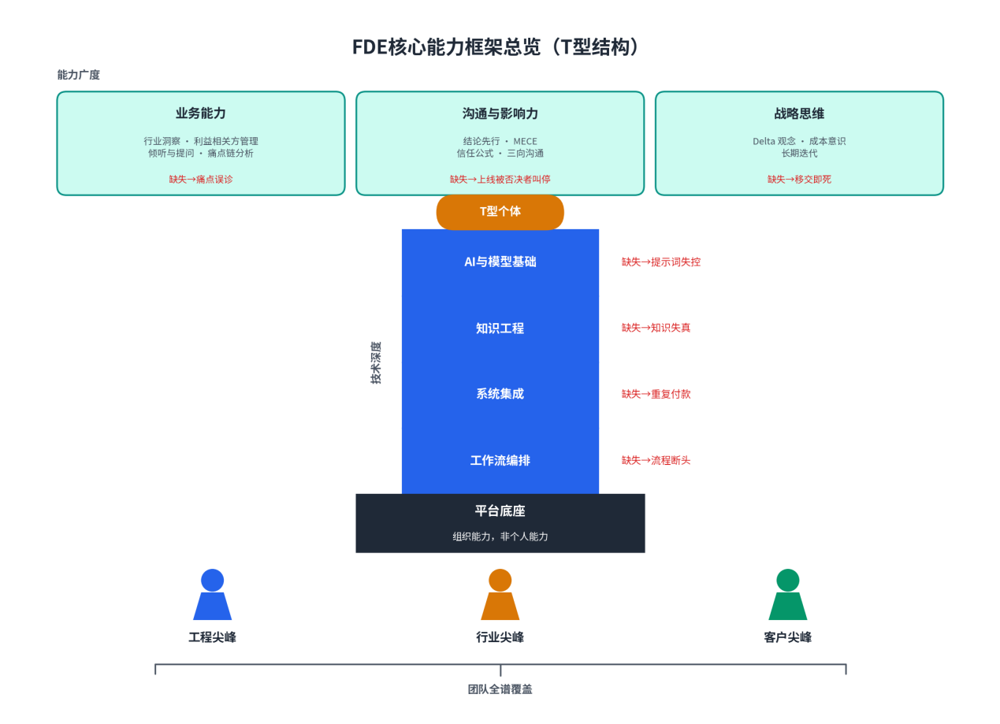
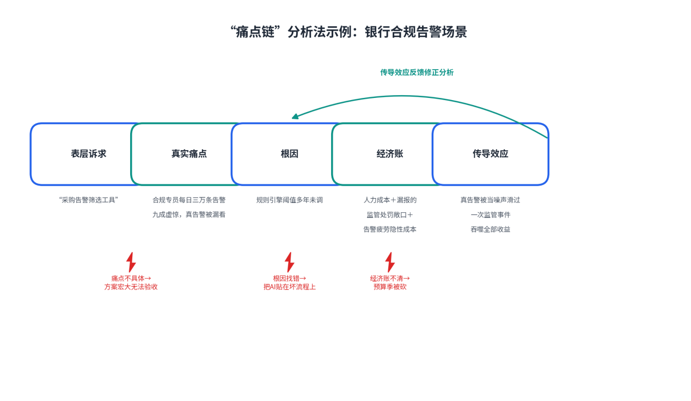
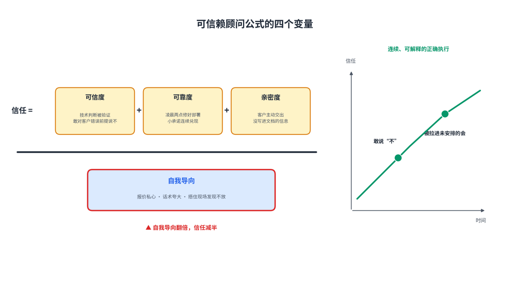
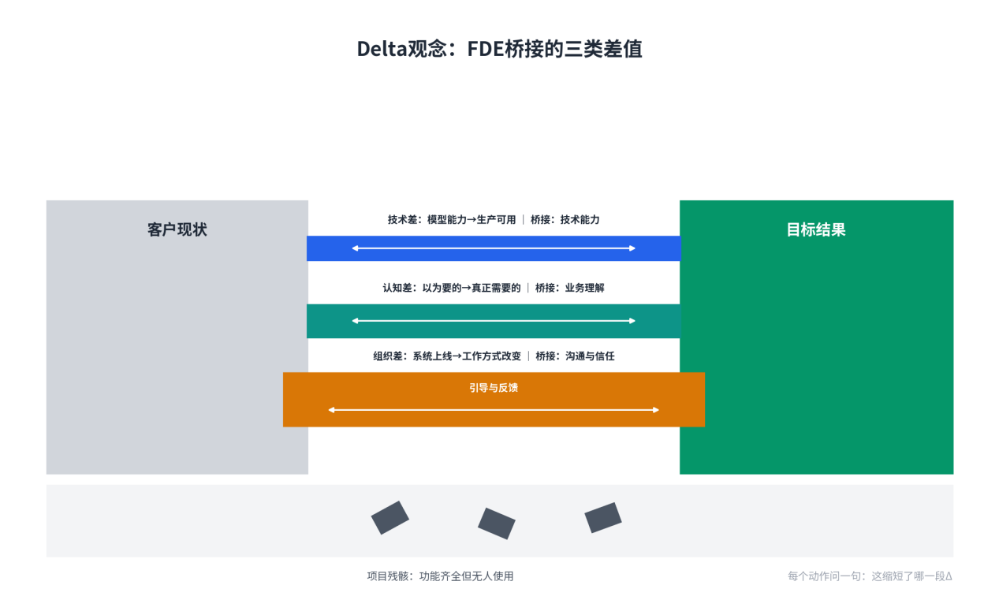

# 第6章FDE的核心能力框架

**【本章导读】**

本章回答三个问题：一名合格的FDE究竟需要会什么；组织在招聘、评估与配置团队时，如何识别这些能力；哪一块短板缺失，会在客户现场酿成哪一类交付事故。全章把能力框架拆成四层：技术能力、业务能力、沟通与影响力、战略思维。写作立场是技术决策者的视角，而非工程师教程——每个技术点都落在“FDE为什么需要它、组织如何评估它、缺了它会出什么交付事故”上，不展开编程细节。本章适合正在组建或评估FDE团队的首席技术官、技术副总裁、信息技术总监与人力资源负责人阅读，也可直接用作FDE岗位能力模型与面试题库的设计底稿。

## 6.1 技术能力（硬技能）

本节按三段式展开每一项技术能力：为什么需要、如何评估、缺失事故——技术决策者不需要自己会写编排代码，但必须能回答这三个组织问题。

两份参考材料在能力结构上存在一处值得交代的分歧。一份强调个体的宽度：FDE必须是能在客户现场独立解决全栈问题的技术通才；另一份明确反对“独角兽式”招聘，主张不必要求一个人五项满分，可以用工程尖峰、产品尖峰、行业尖峰与客户尖峰搭配成队。两种观点各有支持者：前者来自Palantir早期的岗位形态，后者来自规模化团队的招聘现实——两端兼精的候选人极其稀缺，按“独角兽”画像招人，招来的往往是简历包装师。本书采纳的立场是：通才是个人发展的目标结构，组合是组织设计的默认结构——评估个人用T型标尺，配置团队允许尖峰互补，但全团队合在一起必须覆盖图6-1的全部能力域，任何一域整体缺席都是确定性的交付风险。

图6-1：FDE核心能力框架总览（T型结构）

### （1）AI与模型基础：Transformer、提示工程、上下文窗口

FDE不需要会训练模型，但必须摸得准大模型的脾气，这落在三个抓手上。

Transformer是这一切的底座。理解架构的目的不是推导公式，而是预判失效模式：概率生成意味着输出天然带有编造倾向，模型不会对“自己不知道”自觉；注意力机制意味着上下文越长，关键信息越可能被“读到但忽略”。这些判断直接决定FDE把模型放在流程的哪个位置、在哪些节点留人工校验、对哪类输出要求溯源。不懂架构的团队只能凭演示效果下注，进了生产环境才知道赌注是什么。

提示工程（Prompt Engineering）是把业务规则翻译成模型可稳定执行指令的手艺。在FDE场景里，提示词装的不是聊天技巧，而是客户制度里的审批阈值、例外条款与口径定义——提示词质量就是交付质量的一部分。由此引出一条管理要求：提示词必须像代码一样管理，有版本、有评审、有回归测试；无人维护的提示词，输出会随业务漂移悄悄失真。

上下文窗口（Context Window）是模型的工作台，决定一次能装下多少业务材料。但“装得下”不等于“读得进”：材料越多，关键信息被淹没的风险越高，调用成本也随长度水涨船高。流程自动化公司Varick的FDE遇到过典型一幕：把约150页客户材料上传给通用模型，等待很久，得到的分析冗长且抓错重点。问题不在模型，在于上下文不是文档堆——可用上下文需要实体一致、关系明确、时间与权限可追踪。窗口管理的手艺，在于决定什么该进、什么该留、什么该检索时再放。

组织如何评估？面试不考反向传播，考判断力：给一个模糊的真实业务问题，看候选人能否预判模型在哪类输入上失效、如何设计提示词结构、对上下文做何种取舍。OpenAI与Palantir的FDE面试有个标志性环节叫“问题拆解”：六十分钟不写一行代码，只看候选人怎么追问、怎么界定范围、怎么在混乱里建立秩序。落地标尺只有一条：能否把“模型偶尔会错”翻译成“在哪类输入上、以多大代价出错”。

缺了这项能力的事故，最常见的是提示词失控：制度文档整本塞进提示词，输出的审批指引漏掉强制会签节点，上线后由内审部门发现。另一类是失效模式误判：凭演示效果承诺“准确率没问题”，生产环境的第一批真实输入就把幻觉放大成业务错误——客户对系统的信任，往往只有这一次机会。

### （2）知识工程：本体建模、Graph RAG、向量检索

模型懂“应付账款通常怎样运作”，不懂“这家公司的应付账款今天怎样运作”。知识工程填的就是这条缝，它有三个层次。

本体（Ontology）是把企业的数据、逻辑与动作建模成一套机器可读的语义表示：有哪些业务实体，实体间是什么关系，每个动作的前置条件与权限是什么。Palantir平台的核心正是这个东西——让人工智能在“懂业务”的地基上运行，而不是在文档堆上猜测。对FDE而言，本体建模是进场后的第一项知识工作：流程地图至少要容纳四类事实——正式规则（金额超过多少必须升级审批）、系统状态（发票是否已经入账）、组织关系（负责人休假时谁能替代）、经验判断（哪些供应商字段不全却通常可以放行）。前三类容易进数据库，第四类只存在于老员工的习惯里，却恰恰决定智能体能否处理真实世界。

向量检索（Vector Retrieval）解决“从海量非结构化文档里找出相关片段”的问题：把文档切片转成向量，按语义相似度取回，是RAG的第一公里。检索错了，生成再强也是错——多数RAG项目的质量瓶颈不在模型而在检索，切片策略、命中率、权限过滤都比调提示词更常被忽视。工程上，这一层通常由向量数据库（Vector Database）承载——企业为模型准备的“可查询记忆”。

图检索增强生成（Graph RAG）把知识组织成实体与关系的图，让检索沿关系多跳行走。它擅长“哪些事实必须先成立”这类问题：一个审批必须发生在另一个审批之后；会议笔记里的“Sarah”、邮件签名里的全名与聊天工具里的昵称是否同一个人；一次流程修改会不会制造无法结束的环。Varick的工程团队为此训练模型使用实体消歧、发现冗余循环等专用工具——先找到正确的上下文，再写出有用的分析。

组织如何评估？让候选人为一个真实业务域（如“从采购到付款”）在白板上画出实体关系草图，十分钟就能看出他是否建模过业务；再追问向量检索与图检索各自的失效场景——前者语义相近但关系错误，后者建模成本高、覆盖难以求全。成熟的答案不是“哪个更强”，而是“先用向量落地，按问题复杂度引入图”。

缺了这项能力的事故都有具体的形状。同一供应商在系统里留下两条拼写不同的档案，智能体当成两家，重复付款在月底对账时才暴露——对财务场景，一次重复付款或错误入账的代价远高于回答不够漂亮。模型引用去年的负责人，把审批请求发给已离职的人。更隐蔽的一种：所谓“知识库”只是又一批散文式文档，模型每次请求都重新猜测流程结构，答案每天都不一样。

### （3）系统集成：API、MCP、CLI、UI自动化的选型

几乎所有FDE项目的第一周都在和集成层搏斗。从业者的经验之谈是：企业数据问题里九成五是接入、清洗、关联，根本不是分析；项目进度的七成卡在这一层，但演示里看不见它。集成通路的选择决定项目的进度、可维护性与安全边界。

可选的通路有四条。应用程序编程接口（Application Programming Interface，API）是首选：有契约、有版本、有完整日志。模型上下文协议（Model Context Protocol，MCP）由Anthropic于2024年提出并开源，让智能体以统一方式连接外部工具和数据源，是四条通路中最“AI原生”的一条；但它生态尚新，权限与安全模型仍在完善，采纳时应把它当作连接标准，而不是安全边界。命令行界面（Command-Line Interface，CLI）是面向工程师系统的结构化通道，许多内部工具没有开放接口，却有可解析的命令行输出。最后是界面自动化——模拟人操作图形界面，脆弱、维护成本高、界面一改就失效，但常常是老旧系统唯一的通路，只能作为最后手段并加足监控。

选型之上还有一条不可谈判的约束：记录系统的权威。一家客户告诉Varick，他们花了五年和五百万美元迁移到NetSuite——若有供应商说“方案很好，但你得先迁出来”，答案几乎一定是否定。智能体必须在既有系统之上工作：继承原有权限，区分读取、建议与执行；写入前检查前置状态，写入后留下审计记录；出错时能暂停、回滚或交给人。表6-1给出四条通路的对比。

表6-1：系统集成四条通路的选型对比

| **通路** | **稳定性** | **可审计性** | **实施与维护成本** | **典型适用场景** | **主要风险** |
| --- | --- | --- | --- | --- | --- |
| API | 高：有契约与版本管理 | 高：调用日志完整 | 中 | 现代软件即服务产品、开放接口的核心系统 | 接口覆盖不全、速率限制、供应商变更 |
| MCP | 中高：协议统一但生态年轻 | 高：工具调用显式留痕 | 中低：连接标准化后边际成本低 | 智能体需统一接入多种工具与数据源 | 权限模型尚待完善、服务器质量参差 |
| CLI | 中：输出可解析但无正式契约 | 中：需自行补日志 | 低 | 面向工程师的系统、无开放接口的内部工具 | 输出格式随版本变动、交互式命令难自动化 |
| 界面自动化 | 低：界面改动即失效 | 低：操作留痕弱、取证难 | 高：长期维护负担重 | 无任何接口的遗留系统，最后手段 | 静默失效、权限边界模糊、升级脆弱 |

组织如何评估？一道面试题足够：“面对一个没有接口的老系统，你怎么办？”成熟的候选人给出的是降级序列——先争取API，再评估MCP封装，再退到CLI，最后才考虑界面自动化——并能说清每一步的代价与监控补偿。危险信号是脱口而出“自研一套中间库”：绕开记录系统另建一套，等于制造第二套没有证据效力的账。

缺了这项能力的事故，典型形态是静默失效：界面自动化直连核心系统执行写入，一次例行的界面升级后，机器人开始把金额写进错误的字段，业务照常运转，直到月底对账才发现账目对不上。这类事故的共同点是没有死在演示里，而是死在生产环境的第三个月。

### （4）工作流编排：LangGraph、Dify等工具的使用

FDE交付的不是一次性脚本，而是要在客户环境里持续运行的流程。编排（Orchestration）就是把模型调用、工具调用、人工审批节点、重试与回滚组织成一张可观测、可维护的图。Palantir一位工程师的婚礼笑话是最好的警示：他随手写的一段临时脚本，原本只为处理一次数据保留问题，十二个月后已运行在这家近十万人的企业多处，团队不得不长期支持。每个现场工程师都见过同一种命运——越是解决了真实痛点的临时东西，越不可能被轻易移除。编排决策因此就是技术债（Technical Debt）决策：今天选的运行时，就是三年后维护团队的手铐。

当前两类主流工具的定位差异清晰。LangGraph是代码优先的智能体编排框架，把流程建模为图与状态机，分支、循环、并发与人在回路（HITL）节点都可以精细编程，适合复杂逻辑与多智能体协作。Dify是低代码可视化编排平台，拖节点、连边、填参数即可搭出标准的RAG与对话类流程，业务人员可以参与搭建与调优，适合快速验证与标准化场景。选型对比见表6-2。

表6-2：LangGraph与Dify的定位差异

| **维度** | **LangGraph** | **Dify** |
| --- | --- | --- |
| 定位 | 代码优先的智能体编排框架 | 低代码可视化编排平台 |
| 控制粒度 | 细：图、状态、分支、循环均可编程 | 中：以可视化节点的组合为主 |
| 主要使用者 | 工程师 | 工程师与业务人员协作 |
| 优势场景 | 复杂分支、多智能体、精细人审节点 | 标准检索与对话流程、快速验证 |
| 主要局限 | 需要工程能力维护，对业务方不透明 | 复杂定制受平台约束，深度调试受限 |
| 移交友好度 | 取决于客户的工程团队厚度 | 客户业务方可直接参与维护 |

选型有一条常被忽略的硬约束：客户接手维护的能力。交付团队撤场之后流程归谁维护，决定了编排层该用代码还是低代码——重型框架做的简单流程，客户无人会改，移交即死；低代码平台硬撑的复杂流程，调试黑盒无法复盘，第一次异常就停摆。生产环境还有一条底线：任务轨迹、工具调用与关键决策依据都要留痕，使失败可以复盘；“模型偶尔会错”不能成为模糊豁免，概率系统更需要清楚的风险边界。

组织评估这项能力，不该问“会不会用某个工具”——工具每年都会换——而该问“什么情况下不用某个工具”。

四个技术域的事故形态汇总为一张对照表，它也是一张团队体检表：哪一列事故眼熟，哪一列能力就需要补课。

表6-3：技术能力缺失与典型交付事故对照

| **能力域** | **组织评估要点** | **缺失时的典型交付事故** |
| --- | --- | --- |
| AI与模型基础 | 能否预判模型失效模式并设计防护 | 提示词失控：输出漏掉强制审批节点，成本说不清花在何处 |
| 知识工程 | 能否为真实业务域画出实体关系图 | 同人异名导致重复付款；知识库只是文档堆，答案每天不一样 |
| 系统集成 | 能否给出通路降级序列并说清代价 | 界面自动化静默写错字段，月底对账才发现；绕开记录系统制造第二套账 |
| 工作流编排 | 能否讲清工具边界与移交约束 | 临时脚本十二个月后仍在生产运行无人敢动；重型框架移交即死 |

## 6.2 业务能力（软技能）

技术能力决定FDE能做什么，业务能力决定他做的事对不对。一位一线从业者的话被广泛引用：“模型通常是最干净的部分。难的是找到那个没人写进文档的工作流、人们真正信任的那个数据源，以及知道流程为什么是那样的那个人。”Varick的创始人Moza把同一判断说得更直白：执行正迅速变便宜，下一道瓶颈是理解业务。这一节的四项能力，全部围绕“理解业务”展开。

### （1）行业理解与业务洞察

业务的差异往往不在行业层面就能解决。同样是销售部门，医疗公司的客户资格、合规要求和采购周期，与软件公司的线索分配和续费动作完全不同；同样是应付账款，两家企业的发票容差、供应商例外和审批层级也可能完全不同。行业理解的价值因此很具体：让FDE在第一次访谈时问对问题，在设计阶段预判合规约束，而不是在验收阶段被一条从未听说的行业规定打回重做。

Palantir对业务侧角色有个微妙的期待：既要有深厚的行业知识，又要敢当“叛逆者”——看得出客户现状的荒谬之处，敢推动十倍级，而不是百分之十的改良。行业理解因此不是背诵惯例，而是知道哪些惯例值得打破：只有懂例行逻辑，才能分辨“这是合规要求”与“这只是二十年的习惯”。

组织评估这项能力，看两个时点。面试时，在“问题拆解”环节观察候选人能否问出行业特定的约束：面对银行问出审计与留痕，面对制造问出产线节拍与安全，面对政务问出数据不出域。入职后，看他能否在两周内摸清客户行业的“行话”与“钱流”——钱从哪来、到哪去、卡在哪。两周不是苛刻：按结果收钱的团队，耗不起按季计的学习曲线。

缺了这项能力的事故，形态是“正确的方案，错误的土壤”：把上一个客户的流程模板照搬到新行业，功能全部实现，验收时才发现漏了行业强制的留痕与审批要求，整体返工——按结果收费的结构里，这类事故的账单记在交付方自己头上。

### （2）利益相关方管理：从排斥到共赢

客户不是一个人。购买者、流程负责人、最终用户、信息技术部门、安全、数据、法务和高管，对“成功”有完全不同的定义。成熟的FDE组织把利益相关方地图列为进场后的标准产物：先画出谁拥有预算、谁每天使用、谁能否决、谁在失败时承担代价，再为每个人记录目标、权限、担忧、成功指标与当前替代办法。

地图上最容易看错的一格，是“提出需求的人”与“承受工作的人”的区分。销售或管理者说要一个仪表板，星期一早上真正操作的人也许只需要一条告警。对翻译件负责而不对痛点负责，是传统软件项目灾难的起点。

从排斥到共赢的转化，靠的不是话术而是利益设计。现场最常见的两种排斥：客户信息技术部门把FDE视为威胁——新系统恰恰证明旧系统的失职；一线员工担心被替代——自动化程度越高，自己的位置越悬。化解的路径也具体：让否决者尽早进场，把安全与合规审查标准变成设计输入；让一线用户成为第一批小胜利的主人，功能发布会上的演示者是他而不是FDE。Palantir当年的行为标杆是“法国侍者”：嵌在服务流程里，把客户从“他们以为自己要的”引导到“真正对他们好的”——引导的前提是对方愿意跟你走，而意愿来自利益结构，不来自说服力。表6-4把四类角色与转化策略放在一起。

表6-4：利益相关方地图的四类角色与转化策略

| **角色** | **要回答的问题** | **典型排斥动机** | **从排斥到共赢的策略** |
| --- | --- | --- | --- |
| 预算拥有者 | 谁付钱、用什么标准验收 | 担心项目失控成为自己的政治负债 | 验收标准前置，用经济语言定期对账 |
| 日常使用者 | 谁每天操作、负担落在谁身上 | 新工具添乱，旧经验被否定 | 让他参与设计，第一批小胜利记在他名下 |
| 否决者 | 谁能以安全、合规、架构理由叫停 | 事后才知道，被迫用否决行使存在感 | 早期接触，把审查标准变成设计输入 |
| 代价承担者 | 失败时谁挨板子 | 收益归别人，风险归自己 | 给出风险边界与回滚承诺，先保他不受伤 |

缺了这项能力的事故，教科书形态有两种。一种是只采访一个部门：优化了局部步骤，把等待与风险推给下游，跨流程的账算下来是负的。另一种是上线前夜被安全部门叫停——项目在立项第九个月才第一次见到它的否决者。两种事故的共同点是：技术方案没有问题，问题在没有方案的那个人。

### （3）倾听与提问的艺术

最有价值的发现往往来自“看”，不是“问”——这是FDE像人类学家的一面。实践手册的纪律因此是：能现场观察就不要只访谈。公司的文档通常只记录黄金路径，真正决定自动化成败的却是边缘情况：信息不全、角色重叠、审批人休假、两套系统里同一个人的两种拼法、某个部门临时绕过正式规则。

访谈的提问清单也因此反直觉。不要只问“下一步是什么”，要问“出错时怎样办”“上一次例外发生在什么时候”“如果这个人休假呢”。每个变通背后都是一个未被满足的痛点：员工为什么坚持把数据导出到表格里再算一遍？为什么部门里公认“这张表要找小王”？为什么明明有数据系统，决策会前总有人手动核对数字？这些问题问出的，正是流程地图上只存在于老员工习惯里的第四类事实：经验判断。

倾听还有一层纪律：警惕翻译过的痛点。需求如果经客户信息部门、采购部门、咨询顾问转述，每转一手就失真一次——信息部门把业务痛点翻译成技术需求，采购部门把它翻译成合规条目。FDE的第一要务，是绕过翻译件，直达疼痛的神经末梢。

组织评估这项能力，用模拟访谈就够：安排一位扮演“客户”的面试官，故意给出模糊、矛盾、夹带私货的叙述，看候选人先问约束还是先给方案。危险信号是带着方案找问题——拿着现成智能体寻找使用场景的团队，最终只会在旧流程上增加一个新的聊天入口。

### （4）“痛点链”分析法

痛点不是孤立的点，而是一条链。本书把这条链拆成五个环节，逐环验证，任何一环断裂，项目就会漂向不可证伪。

第一环，表层诉求。客户说出口的通常是方案而不是痛点：“我们需要一个告警筛选工具。”诉求要记录，但不能照单全收。第二环，真实痛点。检验标准是两个“具体”——具体的人、具体的痛：“提升客服效率”不是痛点，是方向；“客服主管每周一早上要花三小时，从四个系统里手动汇总上周的升级工单，而她真正的工作应该是分析升级原因”，这才是痛点。第三环，根因。症状与病因要分开：告警淹没人力，根因可能不是缺工具，而是规则引擎的阈值多年未随业务调整。第四环，经济账。很多痛点是真痛，但不值钱；算不清这笔账的项目，做了也活不过下一个预算季。第五环，传导效应。流程不是彼此独立的线：一个环节的局部优化，可能把等待或风险推给下游，跨流程观察才能看见真正的账。

以某大型银行的合规场景为例。该银行合规团队每天人工核对约三万条交易告警，其中九成是虚惊。表层诉求是“采购一套智能告警筛选工具”；沿链追问，真实痛点是合规专员的注意力被噪声淹没，真正的风险告警反而漏看；根因是规则引擎的阈值多年未调，误报率随业务规模膨胀；经济账包括三笔——核对人力、漏报引发的监管处罚敞口、告警疲劳的隐性成本；传导效应是整条链上最危险的一节：长期九成虚惊训练出的肌肉记忆，让真告警也被当成噪声滑过去，一次监管事件就吞噬前面省下的全部人力。这条链也指明了断点：痛点若不具体，方案必然宏大而无法验收；经济账若算不清，项目活不过预算季；根因若找错，就等于把人工智能贴在一条坏流程上，自动化得越快，错得越稳定。

图6-2：“痛点链”分析法示例：银行合规告警场景

## 6.3 沟通与影响力

技术与业务能力决定FDE能交付什么，沟通能力决定交付物能不能穿过组织落地。Palantir的招聘标准说得直白：“候选人的表达力、清晰度和沟通自如度，要让我乐于让他主持一场与客户的会议。”这一节给出三件经过验证的工具与一套分对象的策略。

### （1）金字塔原理：结论先行（BLUF）

金字塔原理（Pyramid Principle）由咨询顾问芭芭拉·明托系统提出，核心结构是结论先行、以上统下、归类分组、逻辑递进。结论先行（Bottom Line Up Front，BLUF）则源自美军的文书传统：第一句话必须是结论，理由与细节按听众的耐心依次展开。两者是同一条纪律的两种表述：把最重要的信息放在听众注意力最高的位置。

这项能力对FDE不是修辞训练，而是交付纪律。高管的时间以分钟计，评审会上前三十秒定生死；客户会议需要有人主持，主持就是控制结论、证据与行动项的出场顺序。技术成就必须换算成客户语言走完“最后一公里”——“把查询优化了40%”是工程师语言；“把查询优化了40%，这让客户的分析师每天提前两小时拿到报表，团队处理量翻了三倍”才是FDE语言。人工智能行业也观察到同一现象的镜像：前沿模型写长分析往往非常详细，却缺乏咨询顾问式的取舍。机器尚且要被专门训练这种取舍，对人更该列为评估项。

组织评估很简单：让候选人用三句话汇报项目状态，第一句必须是结论；再让他说清本月最大的风险，听他把它放在第几句。缺了这项能力的事故有两种形态：汇报从背景讲起，十分钟没到结论，决策者失去耐心；更危险的一种是风险被埋在细节里，爆雷那天管理层第一次听说——此后这个团队说的每一句话，都会被客户先打个问号。

### （2）MECE原则：确保没有重叠或遗漏

相互独立完全穷尽（Mutually Exclusive Collectively Exhaustive，MECE）是结构化分解的基本功：把一个问题拆成若干部分时，部分之间不重叠，合起来无遗漏。它听起来像咨询顾问的案头美学，在交付现场却是实打实的防事故装置。

MECE的第一个用武之地是流程分解。成熟做法是对流程每一步评估四项——错误代价、结果可验证性、发生频率、所需判断——再据此把每一步归入三类：风险可控、规则清楚、结果容易验证的交给智能体完全自主；高频但有风险的走人在回路，智能体准备材料、人类批准关键动作；低频、高风险、高判断密度的保留人工。这个三分法的价值不在分类本身，而在“每一步都有归属”：重叠意味着两个模块对同一步骤负责，出问题时互相等待；遗漏意味着边缘情况无人认领，智能体在异常处停住，或者更糟，自信地做错。

第二个用武之地是指标设计。成功指标与反指标必须同时存在且互不重叠：自动解决率提高，但投诉、返工或风险也提高，就不算成功。组织评估看候选人画出的第一棵问题树：分支是并列还是纠缠，枝叶合起来是否罩得住树干。缺了它的事故形态是两本账：两个团队对同一项指标都有解释权，顺利时抢功、失利时推责；或者流程图上一片祥和，第一次例外发生才发现没有负责人。

### （3）可信赖顾问公式：Trust = Credibility + Reliability + Intimacy / Self-Orientation

《可信赖的顾问》（The Trusted Advisor）一书把信任拆成一个公式：信任等于可信度、可靠度与亲密度之和，除以自我导向。四个变量在FDE现场各有精确对应。

可信度（Credibility）来自专业判断被反复验证，其中最有分量的一次，是敢对客户的错误前提说不——诚实证明判断独立。可靠度（Reliability）来自小承诺的连续兑现。从业者圈子里流传一句话描述这种担当：“部署在凌晨两点挂了。你不提工单，不怪别的团队，不回去睡觉。你修好它。句号。”亲密度（Intimacy）来自信息的共享深度：客户敢不敢把没写进文档的东西告诉你——没人写进文档的工作流、真正信任的数据源、流程为什么是这样。自我导向（Self-Orientation）是唯一的分母：报价里的私心、话术里的夸大、把现场发现攥在手里不回流的行为，都会被现场敏锐地读出来，并把分子上的全部积累一次除光。

这个公式的组织含义在于：信任不是态度问题，是结构问题。组织信任不是在培训会上宣布出来的，而是通过连续、可解释的正确执行建立的。可观察的信任指标也很具体：客户是否主动提供“没说出口的信息”，是否允许FDE参加原本没安排他的内部会议。

图6-3：可信赖顾问公式的四个变量

### （4）向下、同级、向上沟通的策略

FDE的“上下级”不在自己公司的组织架构里，而在交付现场的关系网里。向下，是客户的一线使用者与己方驻场工程师；同级，是客户的信息技术、安全部门与己方的产品团队、销售；向上，是客户高管与己方管理层。三个方向的语法完全不同，用错方向是沟通事故的主因，策略对照见表6-5。

表6-5：向下、同级、向上沟通策略对照

| **方向** | **对象** | **对方的核心关切** | **语言与载体** | **典型错误** |
| --- | --- | --- | --- | --- |
| 向下 | 一线使用者、己方驻场工程师 | 别给我添乱，别让我背锅 | 操作语言：手把手演示、可回退的小步切换 | 只讲愿景，不解决眼前麻烦 |
| 同级 | 客户信息技术与安全部门、己方产品与销售人员 | 权责边界，功劳归属 | 技术事实加利益对齐：审查标准前置，回流有署名 | 绕过对方流程制造既成事实 |
| 向上 | 客户高管、己方管理层 | 结果、风险、钱花得值不值 | 结论先行加经济语言：一页纸，首句即结论 | 从背景讲起，十分钟没有结论 |

向下沟通的关键词是尊重存量：老师傅的经验是这个组织真正的数据库，新系统要先证明它能装下这些经验，而不是宣布这些经验过时。同级沟通的关键词是利益结构：激励设计在这里比话术重要——让FDE背硬性销售指标，会把行为引向签单而不是结果，同级之间所有的协作诚意都会被这个分母除光。向上沟通的关键词是结论与风险前置：高管需要的第一句话是“现在是什么、要什么决策”，风险早报是本分，晚报是事故。

## 6.4 战略思维框架

前三层能力回答“把事做对”，战略思维回答“做对的事”——它决定FDE个人与组织把时间、金钱和信任投在哪里。

### （1）Delta观念：聚焦“桥接”价值

希腊字母Δ在科学与工程中表示差值。Delta观念就是把FDE的价值定义为桥接差值：客户现状与目标结果之间隔着一条沟，FDE卖的既不是技术也不是工时，而是桥本身。这条沟由三类差值构成，每一类都对应前面的一种能力。

技术差，是模型能力与生产可用之间的距离，桥接它的是技术能力。认知差，是客户“以为自己要的”与“真正对其好的”之间的距离，桥接它的是业务理解。组织差，是系统上线与工作方式改变之间的距离——里程碑不在系统上线那天，在客户团队改变工作方式那天，桥接它的是沟通、信任与变更管理。

Delta观念的实战用途是做减法。每个动作都问一句：这缩短了哪一段Δ？打磨一个没人用的功能，三段Δ一段也没缩短，就是纯成本。Palantir把这套逻辑沉淀为组织分工的比喻：FDE在客户现场修出一条条通往价值的“碎石路”，产品团队判断哪些碎石路值得拓宽硬化，变成服务下十个客户的“柏油路”——当事人后来用一句话概括整个模式：把不可规模化的事，规模化地做。对决策者而言，Delta观念也是验收FDE组织的最简标尺：看它的周报里记录的是“做了什么”，还是“哪一段差值被缩短了”。

图6-4：Delta观念：FDE桥接的三类差值

### （2）成本意识与商业思维

FDE是昂贵的资源，昂贵资源的第一守则是不能平均分。选择值得深度部署的客户要看三个条件：问题价值足够高，客户愿意开放真实流程与数据，需求可能代表更广的市场——仅有大合同而没有合作意愿，团队会被困在信息不全的承诺里。这是成本意识的第一个层次：机会成本，选错战场的代价不是这个客户赔了，而是排队的灯塔客户没了。

第二个层次是工程成本。人工智能时代的交付成本结构里多了算力这一栏：上下文长度直接决定调用成本，检索策略、缓存与模型分档都是真金白银的工程决策，“成本与速度的工程优化”早已是这个岗位的日常手艺。

第三个层次是收费结构倒逼的成本纪律。按结果收钱的团队，定义错问题的代价由自己买单——于是销售不敢过度承诺，交付不敢范围蔓延，因为“没人用”要自费。商业思维的最后一块是会说“不”：判断一个项目不该做的理由，与判断该做的理由同样值钱。组织评估这项能力，就问一个问题：“请讲一个你拒绝过的项目，以及拒绝的理由。”答不上来的人，要么没算过账，要么没护住过团队。

### （3）长期视角与持续迭代

成熟组织用复利指标同时审视四组数字：客户结果（采用、业务指标、稳定性与满意度）、交付速度（从问题确认到首个价值的时间）、产品回流（多少重复需求成为平台能力）、组织韧性（一名成员离开后能否接手）。四组数字可以合并成一个很有力量的总问题：第十次部署是否比第一次更快、更稳、更少依赖特殊人物？如果答案长期是否定的，增长只是项目数量增加，而不是能力复利——收入随人头线性增长，正是FDE组织失败的经济学定义。

长期视角有两条具体的操作纪律。第一条是沉淀：打法手册、组件库、部署检查清单，以及把“某个客户的解法”改写为“一类客户的模式”的写作习惯——这一层最容易被忽视，但它决定团队能否摆脱线性增长。第二条是渐进的放权：流程重构不是把十一步点击粗暴压成一个按钮，而是先保留关键检查点，让智能体承担准备、匹配和重复执行，让人类在高风险动作上确认，等评测和运行记录积累起来，再逐步扩大自主范围。旧流程除了完成任务，还让员工看见控制点——知道什么时候能检查、什么时候能撤回、出了错该找谁；把步骤减到一个按钮，也可能把可理解性一起删除。信任按节奏生长，自主权按证据扩大。

回到本章开头的框架。四个技术域、四项业务能力、三件沟通工具、三种战略思维，合起来是一支FDE团队的能力全谱。个人的理想画像是五项兼具：能写生产代码，能把模糊问题拆成最小结果，能与技术和非技术人沟通，能在压力下承担端到端责任，能从单个案例看出可复用模式；组织的理性默认则是组合覆盖，用结对与统一工程门槛保持质量。最危险的招聘描述，是列出十年经验的“独角兽”，却不解释公司用什么平台、流程和团队支撑他。能力框架的真正用途，从来不在纸面上评价个人，而在两个组织动作里：把表6-3当作团队体检表定期对照，把图6-1的全谱当作招聘与补位的清单。下一个项目进场之前，先问一句——这张谱上，哪一格是空的？
