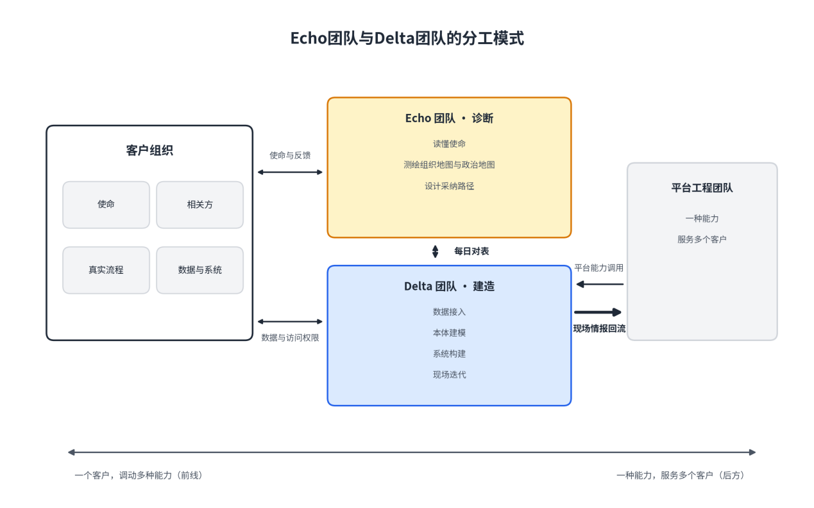
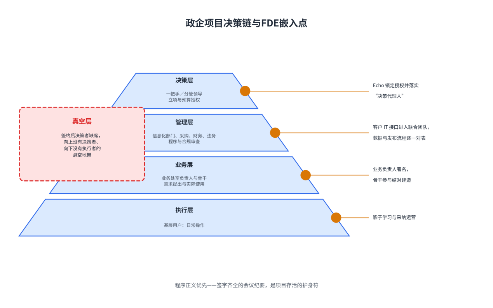
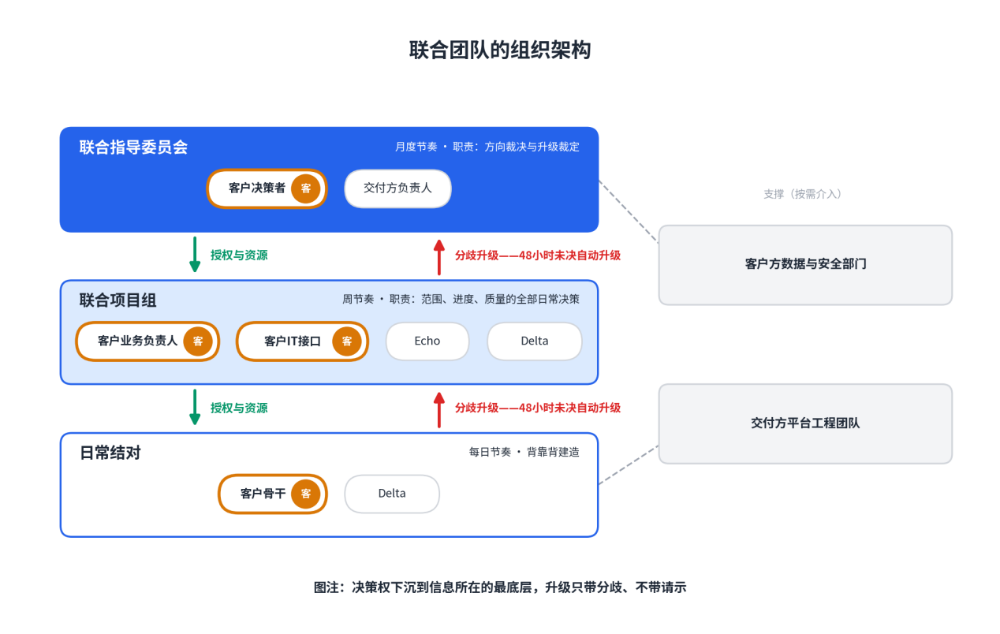
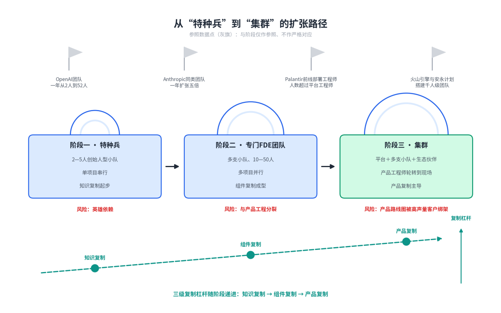

# 第三篇：FDE团队的组织与管理

# 第7章FDE团队的组织设计

**【本章导读】**

本章回答四个组织问题：一支FDE团队内部怎样分工——Palantir的Echo与Delta双人组合、单人模式与“铁三角”最小配置各自在什么条件下成立；这套诞生于美国情报与商业现场的分工模式，搬到中国的政企与民企土壤上需要做什么改造；客户为什么必须编进团队、以什么角色和权责编进来；团队规模多大合适，又怎样从一支特种兵小队扩张为集群而不稀释战斗力。本章适合正在组建或重组FDE团队的首席技术官、技术副总裁、信息化部门负责人、团队负责人与人力资源负责人阅读；面向政企读者的改造方案集中在7.2节与7.3节。

## 7.1 FDE的团队结构

组织设计要回答的第一个问题不是招多少人，而是工作怎样分。FDE的现场工作包含两类性质相反的活动——诊断与建造：诊断要求悬置判断、长时间倾听，建造要求快速收敛、当天出活。本节讨论的三种基本结构——双人组合、单人模式、三人配置——都是对这对矛盾的不同解法。

### （1）Echo与Delta的分工模式详解

Palantir把这对矛盾制度化为一个双人组合：部署战略师，内部代号Echo（回声）；前线部署工程师，内部代号Delta（三角洲）。Echo团队负责读懂客户的使命、各相关方与采纳路径，Delta团队负责技术实现——一个诊断，一个建造，缺一不可。

产品能力与客户需求之间的差异带，工程语境里常以希腊字母Δ标记；Palantir给驻场工程师的命名取的正是这个差值义：Delta团队的全部工作，就是在差异带里施工，把“平台能做的”与“这个客户要的”之间的差值，在客户现场填平。Echo与Delta的分工，则是把“测量差异”与“填平差异”拆成两个专业。

这套分工在进场尽调里看得最清楚。写第一行代码之前，团队要画齐五份地图：数据地图、流程地图、组织地图、系统地图、政治地图。Echo主拿组织地图与政治地图——谁发起、谁买单、谁否决、谁是无冕之王；Delta主拿数据地图与系统地图——哪个数据源真正被信任、发布一个版本要走几周流程；流程地图由两边合画，分头测绘、每日对表，通常一到两周。这笔账要这么算：两周尽调省下的，是三个月在错误战场上的狂奔。

双人组合之外还有第三个支点：后方的平台工程师。Palantir官方博客《Dev versus Delta》（开发工程师对三角洲）一文给出的划分是——平台工程师负责“一种能力，服务多个客户”，Delta负责“一个客户，调动多种能力”；Echo横向拉通，保证前线要调用的能力与后方在建设的能力是同一张地图。三者的兵力配比本身就是组织信号：2016年之前，Palantir的前线部署工程师人数超过了平台工程师——一家软件公司，大半兵力在“前线”。

为什么诊断与建造最好分人，而不是找一个全才一肩挑？因为两种认知姿势互相干扰。诊断要求追问“使命”而非“需求”——写在需求文档里的，是痛点被转述过的版本；建造要求收敛——Palantir老兵库雷希把这条纪律讲成一句糙话：“去他的可泛化性”，先把眼前这个客户救活。坐在客户现场，当天要交的版本永远比“再访谈三个人”更紧迫——不分人的团队里，建造的紧迫性必然吃掉诊断的重要性，最后得到一个技术成立、问题错误的标准答案。

图7-1：Echo团队与Delta团队的分工模式

表7-1：Echo团队与Delta团队的职责对照

| **维度** | **Echo团队** | **Delta团队** |
| --- | --- | --- |
| 核心问题 | 打哪场仗、怎么让人用起来 | 怎么把系统造出来、跑起来 |
| 主要职责 | 读懂客户使命与相关方；测绘组织地图、政治地图；设计采纳路径 | 测绘数据地图、系统地图；数据接入与本体建模；构建并迭代系统 |
| 工作对象 | 人：决策者、业务骨干、无冕之王 | 系统与数据：接口、权限、遗留环境 |
| 典型背景 | 咨询顾问、行业专家、客户侧明星用户 | 全栈工程师、解决方案架构师 |
| 衡量口径 | 采纳率、决策层信任、续约基础 | 生产可用性、交付周期、客户可独立使用 |
| 失败形态 | 诊断错：技术成立、问题错误 | 建造错：方向正确、系统不可用 |

### （2）SoloFDE的适用场景

双人组合是不是铁律？单人前线部署工程师（SoloFDE）——一名工程师独立承担一个客户现场的诊断与建造——在两种情形里长期存在：创业早期的“创始人型”部署，客户少、产品未定型，最强的工程师或创始人直接下场；以及平台成熟后的标准化场景，诊断工作已被打法手册与组件库前置完成，现场只剩建造。

两份参考材料在这一点上立场不同。一份把Palantir的双人组合描述为“缺一不可”的制度安排；另一份把创始人直接部署列为三种正当团队形态之一，并认为关键人风险可以用结对与文档对冲，而非一律禁止单人。两种观点各有支持者：前者来自高复杂度客户的交付现实——情报机构、军方、顶级律所的现场，诊断本身就是全职工作；后者来自创业公司的资源约束。本书采纳的立场是：单人模式是特定条件下的正确选择，不是砍成本的默认选项；判断依据是问题边界、平台厚度与客户接口成熟度，唯独不是人头预算。

表7-2给出适用条件与禁用信号。其中最硬的一条禁用信号是政治地图复杂：诊断工作量大的现场，单人必然顾此失彼——他不是不想做组织工作，而是版本期限不允许。

表7-2：SoloFDE的适用条件与禁用信号

| **类别** | **条目** | **说明** |
| --- | --- | --- |
| 适用条件 | 问题边界清晰 | 单一切口，六周左右可以收口，有明确可验证结果 |
| 适用条件 | 平台底座厚 | 连接器、评估框架、部署模板现成，现场不从零写代码 |
| 适用条件 | 客户接口成熟 | 有明确接口人，数据可及，安全审查路径清楚 |
| 适用条件 | 决策人单一可直达 | 一个人能拍板，不需要穿越多层级审批 |
| 适用条件 | 场景属验证性质 | 目标是跑通首个价值闭环，而非多部门推广 |
| 禁用信号 | 需求模糊 | 需要大量访谈与组织诊断才能定义问题 |
| 禁用信号 | 多部门博弈 | 政治地图复杂，需要专人经营相关方 |
| 禁用信号 | 无在位决策代理人 | 决策者签字后缺位，升级路径悬空 |
| 禁用信号 | 知识无法备份 | 无结对、无文档，关键上下文只在一人脑中 |
| 禁用信号 | 客户买的就是“有人驻场” | 采购目的本身是人头，单人模式沦为驻场外包 |

SoloFDE的头号风险叫关键人风险：这个人知道客户内部缩写、历史妥协、谁拥有批准权，也知道系统里哪些“临时”代码不能动；他一旦离开，团队面对的是一片没有地图的生产环境。对冲办法不是加人，而是结对的最小剂量：两个人不必全程投入相同工时，但重要会议、架构与决策至少有第二人理解，再配合共享文档、代码审查与轮换。结对还有一个隐蔽收益：长期驻在一个客户里的工程师，容易把客户的术语与历史妥协当成行业事实，第二名工程师的追问——“这真是行业必需，还是这家公司恰好如此”——正是把客户特例提炼为平台能力所需要的距离。

即便名义上的“单人”，实践中也很少真是一个人。一支中国创业团队进场零售集团时，编制是两名工程师加一名行业顾问：工程师建造，行业顾问做Echo的工作——前两周不写一行产品代码，跟着区域经理巡店。Solo的合理含义是“一个人对结果负全责”，而不是“一个人干所有的活”。

### （3）“铁三角”的最小团队配置

商务型、产品型、工程型三型配成的“铁三角”，是FDE组织的完整最小单元；双人组合与单人模式，都可以看作它在特定条件下的压缩形态。本节回答展开形态的问题：最小配置要几个人、人从哪里来、按什么口径考核。

先看为什么双人组合之上还需要第三个顶点。Echo与Delta覆盖了诊断与建造，但“打完留下什么”没有人负责——把现场解法回流平台、沉淀为组件与打法手册，是产品型顶点的职责；缺了它，双人组能打胜仗，却留不下资产，组织就退回收入随人头线性增长的项目制。商务型顶点则负责“打哪场仗、什么叫赢”：选题、计价、续约与决策层关系。三个顶点对应三个问题——值不值得打、怎么打、打完留下什么。

表7-3给出最小配置。人数答案是3到5人：一名商务型（可以半仓，同时服务两到三个客户）、一名产品型、一到两名工程型。兼任有一条硬约束：工程型不可兼商务型——同一个人既谈判边界又动手建造，建造的紧迫感会持续压过边界感，结果必然是范围失控；产品型与Echo的角色则可以兼任，两者工作对象相同、节奏相近。

表7-3：“铁三角”最小团队配置

| **顶点** | **核心职责** | **最小人数与兼任规则** | **主要人才池** | **考核口径** |
| --- | --- | --- | --- | --- |
| 商务型 | 选题与计价、决策层关系、续约与扩购 | 1人，可半仓服务2—3个客户；不可由工程型兼任 | 咨询顾问、行业销售、客户经理 | 选题命中率、续约与扩购额 |
| 产品型 | 问题拆解、现场资产回流平台 | 1人，可与Echo角色兼任 | 产品经理、行业专家、客户侧明星用户 | 复用率：进入组件库与平台的现场解法数 |
| 工程型 | 建造与守护系统、对客户知识转移 | 1—2人；不可兼商务型 | 全栈工程师、解决方案架构师 | 生产可用性、交付周期、客户可独立使用 |

人从哪里来？从业者经验里转化率最高的三个池子：大厂的解决方案架构师——懂技术、见过客户，缺对结果负责的经验，是工程型的好苗子；咨询公司的技术顾问——懂业务、能讲，缺动手，是商务型与产品型的来源；客户侧的明星用户——最懂痛点，挖过来就是Echo的天然人选。慎用纯后台研发，不是能力问题，是他们离客户的现实太远，现场判断力得从零长。

招聘口径上，两份材料给出的是同一条军规的两面：不要求一个人五项满分——可以用工程尖峰、产品尖峰、行业尖峰、客户尖峰搭配成队；但工程门槛一分不能降——为了“善于面对客户”而降低工程标准，平台很快会用维护事故收回这笔账。最危险的招聘描述，是列出十年经验的“独角兽”，却不解释公司用什么平台、流程和团队支撑他。

考核按顶点分口径：商务型看选题命中率、看续约与扩购；产品型看复用率——多少现场解法进了组件库与平台；工程型看生产可用性、交付周期与客户团队能否独立使用。任何一条单独拎出来当全队指标，都会把行为引向错误的方向——只考续约，团队滑向销售；只考交付周期，团队滑向外包；只考复用率，现场就没人肯啃硬骨头。

## 7.2 Echo与Delta是否适合中国国情？

先给结论：分工的逻辑通用，岗位的形态必须改造。Echo与Delta回答的是“诊断与建造分离”，这个命题在任何一个客户复杂的市场都成立；但它默认的三个前提——决策链短、客户为结果买单、平台底座现成——在中国市场上一个都不稳。中国是全球最特殊的企业软件市场：这里有最勤奋的交付工程师、最苛刻的定制化需求和最深的“项目制诅咒”。改造要从决策链开始。

### （1）政企项目的决策链特点

政企客户的决策链有四个结构性特征。其一，层级长：一个信息化项目要依次穿过业务处室、信息化部门、分管领导、一把手四级，采购还另有财务、法务与监督程序；每一级都有否决权，没有任何一级单独拥有决定权。其二，授权高度集中：立项与预算实质上是“一把手工程”，顶层授权一旦获得，执行层一路畅通，反之处处是玻璃门。其三，集体决策、个体免责：程序正义优先于结果正义，一份签字齐全的会议纪要，比一个好用的系统更能保护经办人。其四，预算年度制：项目必须活在预算周期里，跨年度的不确定性由供应商承担。

这条决策链对分工的冲击是直接的：Echo的工作量比美国市场大一个量级。组织地图的测绘对象从几位副总裁变成一整套科层体系；采纳路径的关键不再是“用户爱不爱用”，而是“程序上立不立得住”；政治地图里还多出一类“沉默多数”——不反对项目、但也不为项目负责的人。

处理不好是什么下场，一线执行者的记录足够具体。一个千万级国企项目，大老板签完合同就没了下文，项目里没有真正负责的人，FDE被架在真空层——向上没有决策者，向下没有执行者，最后只能靠研究“汇报逻辑”来争取验收。这类项目的死因不是技术，而是签约时没有人把“项目期内持续在位的决策代理人”落实下来——政企人员的轮岗与调动是常态，没有代理人安排，决策链随时会断在半空。

正面样本同样存在。上海一家顶级三甲医院与华为联合打造临床级病理大模型：16张GPU卡、两个月完成百万级病理切片训练，数据准备周期缩短八成，模型覆盖全国每年约九成癌症发病的癌种。这场联合部署能跑通的组织前提，写在院长发布会上的公开表态里：“我们只用经得起验证的技术”——一把手背书，把层层审批压缩成一次授权。政企项目的Echo，第一要务就是在签约前完成这种授权的锁定与代理人的落实。

图7-2：政企项目决策链与FDE嵌入点

### （2）客户关系驱动与能力驱动的平衡

改造不是纸上推演。中国市场已经出现四条真实路径，各自回答了Echo/Delta本土化的一个侧面。

大厂路径。字节跳动旗下的火山引擎2026年专门成立FDE团队，深入行业与标杆客户深度共创；总裁谭待在公开采访中的表述，与本书的定义几乎逐字呼应：“FDE不是销售，也不是售前，他们必须具备很强的技术落地能力，特别是人工智能代码的落地能力。”团队刻意配置多元行业背景——让生物工程出身的人去对接生物医药行业——目前已覆盖汽车、医疗、教育、金融、半导体等重点行业；2026年7月，又与咨询巨头安永签署战略合作，计划搭建千人级FDE团队。大厂的优势是平台底座厚，挑战是销售体系与“交付是成本中心”的财务惯性——FDE团队能否获得“现场即研发”的组织地位，决定了它是真FDE还是换名字的售前支持部。

先行者路径。启盟科技在官网写下了目前国内对FDE最精炼的定义性区隔：一，FDE按阶段交付、按结果验收，驻场外包按工时结算；二，FDE带着产品底座来做工程，驻场外包从零现写现改；三，FDE做完会走，能力沉淀在系统和客户团队里，驻场外包越驻越久、人走系统停。钱拓科技把这套模式搬进对合规最敏感的金融业，沉淀出三阶段方法论：场景诊断一到两周（识别价值最高的三到五个核心场景并量化投资回报）、嵌入式交付八到十六周（从模型选型到生产集成）、生产部署与持续演进，并把“数据不出域”写成对金融监管环境的在地适配。2026年年中，一篇从业者长文《硅谷今年最火的岗位FDE，我们闷头干了三年》在国内圈层被大量转发，它给出的衡量标准与本书一致：“不是写了多少代码、交了几份文档，是这套系统到底有没有人在用、客户的生意有没有变好”——“上线不算完，他得一直待到这套系统变成客户的日常、客户自己的人能接手”。

小团队路径。一支中国人工智能创业团队的180天复盘（应团队要求匿名，数字做了模糊化处理，比例关系与决策逻辑保持真实），演示了最小编制的完整打法：两名工程师加一名行业顾问，放弃预算大的头部券商，选择首席财务官亲自盯项目、痛点具体的区域连锁零售集团——3000家门店的运营督导报告，区域经理根本看不过来。方案收窄为一个“门店异常日报”：每天早上八点推送、三分钟读完。第90天，日报自然打开率稳定在八成半以上；第120天，客户的首席信息官在季度经营会上主动展示这套系统。第二个同构客户的交付周期比第一个缩短了四成——复制的飞轮，转出了第一圈。

供给端也在跟进。上海2025年底首开FDE专题培训班之后，2026年2月又开出面向产业工程师的转型专班，聚焦智能制造、金融、医疗三个行业，首期报名超过200人，全年计划三期，并已列入市级专业技术人才知识更新工程——岗位进入政府人才工程目录，意味着本土化已经不是实验，而是议程。

### （4）本土化调整建议与变体

综合四条路径，Echo/Delta模式的本土化改造落在四个变体上，对照见表7-4。

| **维度** | **美国原版做法** | **中国本土化变体** | **背后的国情约束** |
| --- | --- | --- | --- |
| 岗位设置 | Echo为专职部署战略师，签约后介入 | Echo前置到签约前测绘决策链；行业顾问加客户经理混合编制 | 政企决策链长，授权需在售前锁定 |
| 计价方式 | 订阅制、按量计费、成果分成 | 混合制：阶段验收付款，价值指标写进验收条款，再签订年度运维演进合同 | 客户习惯买断加项目制验收，采购程序刚性 |
| 平台底座 | 平台现成，现场只做“最后一公里” | 先把高频定制沉淀为可复用组件，再谈前线部署 | 大量公司“有现场、没平台”，定制无法摊薄 |
| 人才供给 | 高薪从顶尖工程师中选拔 | 重新为存量交付工程师定价；政府培训与企业内养并行 | 数十万工程师困在人天计价体系，价格信号失真 |

表7-4：Echo/Delta模式的中国本土化变体

变体一，Echo前置且扩编。政企市场里，Echo必须在签约前进场测绘决策链，工作周期从项目阶段扩展到销售阶段；人选上，行业顾问与客户经理的混合编制，比纯美国版的部署战略师更可落地。老牌厂商的观察印证了这一点：SAP大中华区总裁原欣在播客访谈中谈到，前线部署工程师和传统ERP顾问的角色正在融合，眼下最缺的是“既有产品工程能力、又深入理解业务的复合型人才”。

变体二，计价混合制。美国市场可以接受订阅制、按量计费甚至成果分成；中国客户的肌肉记忆是“买断加项目制验收”。可行的过渡形态是三段式：按阶段验收付款，顺应采购习惯；将价值指标写进验收条款，把成果基因注入交易；再签一份年度运维与演进合同，逐步培育续约意识。一步到位照搬按解决量收费，在多数行业会死在采购科。

变体三，先补平台底座，再谈前线部署。FDE的经济学依赖“平台底座加现场定制”，而中国大量软件公司的问题恰恰是“有现场、没平台”——每单都是从零写代码的人力生意。对于这些公司，比学FDE形式更重要的，是把最高频的定制先沉淀为可复用组件；没有复制杠杆，FDE在中国只会沦为“名字好听的驻场外包”——这正是本土先行者把“带产品底座”写进定义的原因。

变体四，用人才重估对冲组织惯性。中国工程师文化——能吃苦、响应快、全栈通吃、习惯在客户现场解决问题——恰恰最贴近FDE的要求；过去二十年，这类人才被困在人天计价的体系里，价格信号长期低估他们。重估的空间有多大，财报里有锚点：2025年年报，用友人均营收约48万元，金蝶约62万元；同一年，Palantir的人均营收约100万美元——十倍级的人效差。谁能把交付工程师的人均产出从“人天”定价拉到“结果”定价，谁就同时改写这数十万人的市场价格，和这门生意的财务结构。

## 7.3 客户加入FDE团队的设计

FDE团队最反直觉的一条组织原则：编制表里要有客户的人。这里说的不是“搞好客户关系”，而是把客户侧的三类人——业务负责人、IT接口、决策者——正式编进联合团队，给角色、给权责、给决策机制。

### （1）为什么需要客户参与团队才有权威性？

客户参与不是姿态，而是三种权威性的来源。

知识权威。真实流程只存在于客户员工的肌肉记忆里，外部人靠访谈问不出来。那家零售集团项目里，团队用影子学习才发现：区域经理们根本不看公司数据系统里的报表，真正信任的数据源是门店店长每天手填的一张表——因为“系统的数据晚三天，还老错”。这个发现直接推翻了最初的大方案，项目收窄为一个“门店异常日报”才活了下来。没有客户骨干带路，团队会在官方流程图上建造一座漂亮的空中楼阁。

政治权威。组织行为学里少有的可靠杠杆是：人们不会反对自己参与建造的东西。同一个项目里，一位资深区域总监起初冷眼旁观，团队请他参与评估标准的修订，他的三条经验被写进系统规则——两周后，他成了系统最卖力的布道者。反面解剖同样现成：一家制造企业的人工智能项目死于第9个月——立项时业务部门无人署名；演示成功、验收通过之后，真实数据接进来，使用率阴跌，预算季一到合同被连根拔掉。没有事故，没有争吵，只是没有人替它说话。缺了业务负责人署名的项目，演示成功也活不过预算季。

验收权威。客户内部的权力结构往往是三层错位的：顶级律所里，合伙人买单但不干活，律师助理干活但不买单，知识管理律师两边不沾、却看得见两边的盲区。法律人工智能公司Harvey的部署团队为三层人分别设计演示——给合伙人看“这单生意多赚钱”，给助理看“这周少加三天班”，给知识管理律师看“全所的隐性经验终于有地方沉淀”；所内对接人、市场创新负责人大卫·韦克林成为部署的轴心。一个部署要让三层人都觉得自己是受益者，缺了任何一层，系统就会在对应环节被悄悄搁置。

客户参与的极限形态，是从“被交付”变成“自己建造”。美国佛罗里达州的坦帕综合医院曾与供应商共建的脓毒症预警工具，被监管机构归类为受监管的医疗器械而停用；医院的选择是在平台上自己动手重建，由首席数字与创新官斯科特·阿诺德牵头。到2025年年中，这套自建系统已挽救569条生命，患者住院时长缩短三成。当客户的人成为建造者，“权威性”就不再是问题——系统本来就是他们自己的。

### （2）客户角色的定义：业务负责人、IT接口、决策者

联合团队里，客户侧必须落座三个角色，定义与缺席代价各不相同。

业务负责人：痛点的所有者，对业务结果负责。他的第一条义务是署名——制造企业之死的复盘教训只有一句：业务负责人署名与真实数据到位，要从进场尽调的建议项变成硬门槛。选人时还要区分“提出需求的人”和“承受工作的人”：管理者说要一个仪表板，星期一早上真正操作的人也许只需要一条告警。正确人选往往在后者之中——职位不一定高，但所有人遇到实际问题都去找他。

IT接口：数据、权限、安全审查与发布流程的守门人。他决定的不是系统能不能建，而是节奏——很多项目的时间表在第一天就注定破产，因为没人问清楚：客户那边发布一个版本，要走六周流程。IT接口必须尽早进入联合团队；进场尽调的数据地图与系统地图，应由他和Delta共同确认签字。

决策者：预算与升级路径的所有者。他的核心义务是在关键节点到场——评估标准确认、上线决策、验收；政企项目还要额外锁定“项目期内持续在位的决策代理人”，并写进合同或正式纪要。决策者长期缺席是最贵的一类组织风险：真空层里的团队，交付越好，死得越安静。

三个角色各建一份档案：目标、权限、担忧、成功指标与当前替代办法。这份档案不是入场仪式，而是联合团队的运行基础——每一次范围讨论、每一次验收分歧，都回到这三份档案上裁决。

### （3）联合团队的组织架构

联合团队的架构是三层嵌套，见图7-3。

图7-3：联合团队的组织架构

顶层是联合指导委员会：双方决策者加项目负责人，月度节奏，职责只有两项——方向裁决与争议升级的最终裁定；政企项目中，这一层必须包含有签字权的分管领导，或其书面授权的代理人。

中层是联合项目组：客户业务负责人、IT接口，与Echo、Delta同席，周节奏，管范围、进度与质量的全部日常决策。这一层的座位安排本身就是组织设计：客户角色不是“被汇报对象”，而是有表决权的组员。

底层是日常结对：客户骨干与Delta背靠背工作。它的极致形态是几天内建成的信任——训练营模式里，第2到3天工程师与客户技术人员背靠背写代码，把大模型接进真实业务流；第4到5天，高管亲手操作系统、当场拍板。常态项目里，这种结对以周或月计：Databricks的工程师嵌入美国一家产权保险公司时，客户方主管数据与人工智能的副总裁回忆：“他们几乎每天和我们一起开会，一起写代码，一起debug。”最终项目在平台上微调开源模型，约50张GPU跑训练，微调周期从两个多月压缩到两周；总账是成本降低七成、工期缩短七成五、数据提取量提升十倍。

三层架构的运行诀窍是节奏错开：月会不讨论细节，周会不等待月会，结对层每天自行其是——决策权下沉到信息所在的最底层，升级只带分歧、不带请示。

### （4）权责划分与决策机制

联合团队最常见的溃败不是吵架，而是权责模糊下的慢性失速：数据迟迟不到位、验收标准悄悄漂移、上线决策无限期推迟。对策是把权责写成矩阵。借用项目管理中的责任分配矩阵（Responsible、Accountable、Consulted、Informed，RACI）——执行、担责、咨询、知会四类标记，表7-5给出联合团队的标准划分。

表7-5：联合团队权责划分RACI矩阵

| **事项** | **客户决策者** | **客户业务负责人** | **客户IT接口** | **Echo** | **Delta** |
| --- | --- | --- | --- | --- | --- |
| 场景选择与立项 | A | R | C | R | I |
| 数据接入与权限开放 | I | C | A | C | R |
| 评估标准制定 | A | R | C | R | C |
| 范围变更审批 | A | R | C | R | C |
| 上线决策 | A | R | R | C | R |
| 验收与续约 | A | R | C | R | I |

注：R＝执行，A＝担责，C＝咨询，I＝知会。每行有且仅有一个A——担责人唯一，是这张矩阵不可妥协的纪律。

三个决策机制与矩阵配套运行。其一，分层决策：例行事项归联合项目组周会，跨部门协调与资源事项归指导委员会；原则只有一条——48小时未决事项自动升级，不沉淀、不私了。其二，变更走流程：范围变更必须执行变更管理程序，双方书面确认后生效；口头答应的需求一律不算数——这条纪律保护的既是客户的预算，也是团队的排期。其三，全程留痕：政企环境里，会议纪要加签字是项目存活的护身符；程序正义补足了，结果正义才有机会被看见。

数据权属要在开工前一次说清：数据不出域，客户数据留在客户空间，客户的特有配置有版本、有测试；交付方沉淀的是行业模式与平台共性，不是客户数据本身。权属清楚，联合团队里的客户角色才敢真正放手参与——这是权责设计的地基。

## 7.4 团队规模与扩张策略

### （1）单项目团队的最佳规模

经验区间是2到5人。下限来自双人组合的纪律：诊断与建造不能长期由一人兼任，除非满足SoloFDE的全部适用条件；上限来自沟通成本——超过5人，现场知识就需要转述，而FDE模式的第一原则恰好是消灭转述。

案例里的规模也稳定在这个区间：Palantir早期的最小作战单元是双人组合，中国创业团队进场零售集团是3人，OpenAI组建团队时是2名工程师起步。约束产能的还有一个更硬的数字：一支小分队同期最多高质量交付两个项目，再多，每个项目都会退化成“到场但不解决问题”。规模该膨胀还是该拆分，看三个信号：会议多于建造；客户开始分不清谁负责什么；现场知识开始需要转述。出现任何一个，正确的动作是把团队拆成两支小队，而不是继续加人。

规模扩张之前，先算清一笔账。以10人小队为例：拆成三支小队，一年大约深度服务10到15个客户。成本端，美国市场一个满负荷FDE的年成本往50万美元靠，10人就是500万美元；中国市场折算，大几百万到上千万人民币。收入端，深度服务项目按单合同10万到30万美元计，一年收入100万元到450万美元——头两年多半盖不住美国口径的成本，换成中国口径才勉强打平。这就是FDE生意头两年的常态：纯人力期，毛利率两到四成。扭亏的杠杆只有三个：复用率压单项目工时，计价档位抬客单价，续约率让第二年的收入不再需要第一年的成本——三个杠杆各抬十个百分点，毛利率大致能从三成爬到六成。每一个扩张决定，都该先过这台计算器。

### （2）从“特种兵”到“集群”的扩张路径

团队形态的演化有三个阶段，见图7-4。阶段一，特种兵：创始人型小队，客户少、产品未定型，最强的工程师或创始人直接下场；优点是学习极快，风险是英雄依赖与无边界承诺。阶段二，专门FDE团队：客户与模式增多，有了明确的负责人、方法论与平台接口；优点是连续责任，风险是与产品工程分裂成“接需求”和“做正事”两类人。阶段三，集群：自助能力成熟，产品工程师轮转参与客户，专门FDE保留在最复杂的场景，同时借生态伙伴放大半径。选择形态的标准不是潮流，而是产品成熟度、客户复杂度与知识回流速度。

图7-4：从“特种兵”到“集群”的扩张路径

扩张的速度可以很快：OpenAI的前线部署团队一年内从2人涨到52人、铺进全球十座城市；Anthropic的同类团队一年扩张五倍；Databricks把专业服务整体改组为前线部署团队；火山引擎与安永计划搭建千人级团队。但两条纪律决定扩张是增值还是稀释。

纪律一，兵力上前线可以超过后方，但平台沉淀必须同步跟上。Palantir在2016年前就让前线部署工程师人数超过了平台工程师，前提是平台持续收编现场成果。反面的边界很直白：如果每名FDE都从零开始为客户写一套独立软件，这家公司拥有的不是FDE团队，而是一家开发外包公司。FDE人数增加不是平台成熟的替代品——越早获得客户，越容易被短期交付牵着走；必须留出明确预算把重复部分抽回平台，否则维护负债随收入同步增长，先吞掉利润，再吞掉团队的耐心。

纪律二，人靠养不靠招。设计过Palantir轮岗培养计划的工程师把话说得很绝：“你没法靠招聘建出真正的FDE组织，只能养出来。”传统工程岗位刻意把工程师和客户的现实隔开，现场判断力在办公室里长不出来——Palantir前后把250多名工程师成批送进真实客户部署，才撑起扩张的人才供给。集群化的最后一块拼图是生态：把团队嵌入式地进驻伙伴体内，借伙伴几十年攒下的客户关系规模化铺进大企业——走到这一步，伙伴网络传播的已不只是口碑，而是你驻在对方办公室里的人。

### （3）多项目并行管理

多项目并行的可行性，不取决于管理技巧，取决于复制杠杆的级数。杠杆分三级：知识复制（打法手册）、组件复制（工具与代码）、产品复制（平台能力）。三者的分工是：手册管判断——什么情况怎么办；组件库管手艺——能直接拿来用的工具；平台管能力——不需要人到场的功能。三者齐备，新小队两周内就能达到老团队八成的战斗力；三者缺一，每多并行一个项目，质量就摊薄一分。

排期纪律：按战略价值与学习价值排，不按合同金额排。那支创业团队放弃预算大的券商、选择痛点具体的零售集团，守的就是这条纪律——排期表一旦向合同金额低头，团队就会被最大的客户拖进最深的定制，复制杠杆再也转不起来。

资产回流要靠机制，不靠自觉。每个项目结束一个周期后，把新东西分进四个篮子：客户特有配置，留在客户空间，有版本和测试；行业模式，沉淀为模板、数据模型、评测集与方法；平台共性，进入产品路线图，成为原语、界面或接口；交付系统，进入FDE自己的工具、知识库与自动化。四个篮子的账要记成回流账本：模式出现次数、影响客户、当前临时绕行方案、通用化方案、所有者与截止时间——没有账本，回流就停在口号上。

表7-6：多项目并行的管理机制

| **机制** | **做法** | **防什么** |
| --- | --- | --- |
| 排期纪律 | 按战略价值与学习价值排序，不按合同金额 | 被大客户拖进深度定制，复制杠杆停转 |
| 三级复制杠杆 | 手册管判断、组件管手艺、平台管能力 | 新小队战斗力从零起步 |
| 四篮子回流 | 客户配置、行业模式、平台共性、交付系统分类沉淀 | 现场经验消散在单个项目里 |
| 回流账本 | 记录出现次数、影响客户、通用化方案、所有者与时限 | 回流停在口号 |
| 复利指标 | 客户结果、交付速度、产品回流、组织韧性四组同看 | 项目数量增长掩盖能力停滞 |

最后，用复利指标审视整个组合：客户结果、交付速度、产品回流、组织韧性四组指标同时看。其中最有力量的一个总问题是——第十次部署是否比第一次更快、更稳、更少依赖特殊人物？如果答案长期是否定的，增长只是项目数量的增加，不是能力的复利。

这也是本章全部组织设计的终极判据：双人组合还是铁三角，2人还是200人，单项目还是多项目——每个选择的正确性，都只能用同一个问题检验：这个团队打的是一仗，还是在为后面一百仗修弹药库。
