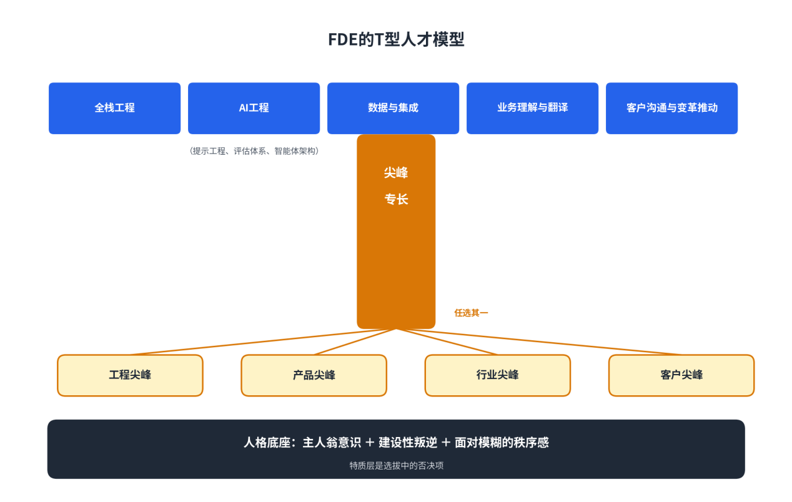
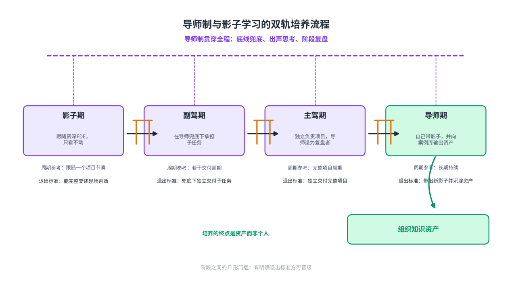
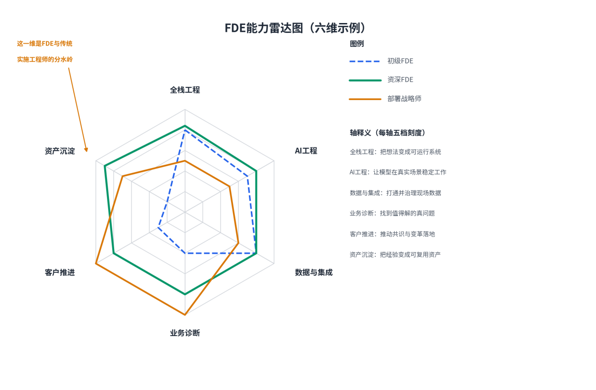
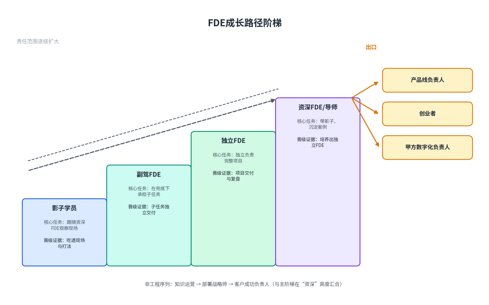
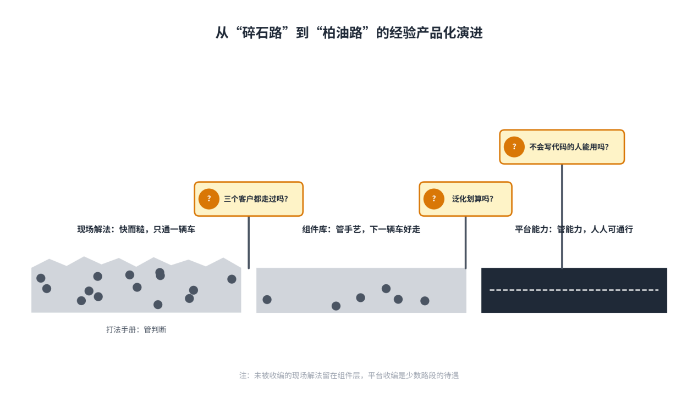

# 第8章FDE的选拔与培养

**【本章导读】**

FDE是软件行业最难招聘的岗位之一：它要求一个人在两个通常此消彼长的维度——工程硬实力与面对客户的软实力——上同时优秀。设计过Palantir轮岗培养计划的维努·加内什（Vinoo Ganesh）说得直白：真正的FDE组织招不出来，只能养出来。本章回答三个问题：什么样的人值得选进来——人才画像、来源适配、面试设计与红旗信号；进来之后怎样系统地养——导师制、影子学习、能力雷达、实战带教与认证评估；个人经验怎样沉淀为组织资产——技能包、CLI、子智能体与钩子的沉淀机制、项目经验产品化、内部案例库。本章主要面向信息化企业负责人、FDE团队负责人与人力资源部负责人，可作为搭建FDE人才体系的操作底稿。

## 8.1 人才画像与选拔标准

FDE难招，难在双重优秀。前Palantir工程师Barry把标准说透了：Palantir招FDE，要的是“能进谷歌或脸书的工程师”——因为他们是去客户现场建造系统的，不是去调参数的；但光有技术远远不够，前线部署的人还需要创造力、判断力和面对客户的魅力。这一节把这句话展开为可执行的选拔标准。

### （1）FDE的“T型人才”要求

业界对FDE人才结构的通行描述是T型人才（T-Shaped Talent）：横向是足够宽的知识面，纵向是至少一根足够深的专长支柱。

横向的一撇，是全栈通才能力。FDE不必是某个领域最深的专家，但必须能在客户现场独立解决全栈问题：写得了代码，调得了接口，懂数据管道，能上云，摸得准大模型的脾气，还得懂企业环境的“水电煤”——单点登录、权限体系、合规认证。横向还包括业务理解与客户沟通：把业务问题翻译成技术问题，把技术方案翻译成高管能懂的话，把现场经验翻译成团队能复用的知识——这三种“翻译”手艺，恰是这个岗位最稀缺的部分。

纵向的一竖，是一根立得住的专长支柱。编程智能体公司Cognition的选材标准提得更精确——“T型而带尖峰”：横向要求客户沟通、业务、流程和技术理解，纵向可以来自不同强项。产品经理背景的人，如果擅长判断产品怎样嵌入流程，可以在产品设计上形成尖峰；创始人型人才习惯在模糊条件下跨职能推进；深技术工程师则能在陌生代码库与客户会议之间自如切换。不要求每个人在所有维度同样强——业务感可以在现场逐步培养，技术可信度却很难只靠话术替代。

宽度与深度之外，还有一层人格特质：主人翁意识，外加一点“叛逆”。从业者圈子里流传一句话：“部署在凌晨两点挂了。你不提工单，不怪别的团队，不回去睡觉。你修好它。句号。”Palantir对业务侧角色还有一个更微妙的期待：既有深厚的行业知识，又敢当“叛逆者”——看得出客户现状的荒谬之处，敢推动十倍级而不是百分之十的改良。

综合多家头部机构的从业者说法，理想的FDE画像可归纳为五项能力：能写生产代码；能把模糊问题拆成最小结果；能与技术和非技术人沟通；能在压力下承担端到端责任；能从单个案例看出可复用模式。不必要求每个人五项满分——可以用工程尖峰、产品尖峰、行业尖峰和客户尖峰的搭配组队，再用结对与统一的工程门槛守住质量底线。

图8-1：FDE的T型人才模型

### （2）不同来源候选人的适配性（研发/算法/售前/产品）

FDE在招聘市场上几乎不存在“成品”，候选人必然来自相邻岗位的转化。按企业招聘的实际漏斗，候选人主要来自研发、算法、售前、产品四类背景，适配性各不相同。

后台研发工程师的优势是工程功底扎实，代码质量与系统直觉是四类中最好的；缺口同样明显——传统工程岗位刻意把工程师和客户的现实隔开，他们大多没有面对过“需求文档与真实工作完全两回事”的场面，现场判断力得从零长。对这类候选人，重点考察的是沟通意愿而非沟通能力：意愿可以长成能力，没有意愿的能力在客户现场是负数。

算法工程师熟悉模型能力边界与评估方法，这是AI交付的硬通货；但算法岗位的训练容易形成“指标中心”的思维惯性——把准确率数字当终点，而客户现场要的往往是“九成准确率加人工复核”的业务最优解。考察重点是：能否接受“模型通常是最干净的部分”这一现实，愿不愿意把主要精力花在数据接入、清洗、关联这些演示里看不见的工作上。

售前与解决方案架构师是最接近FDE的来源：懂技术、见过客户、会讲方案，从业者经验里转化率最高。但售前的工作闭环止于签单，FDE的工作闭环终于客户结果——两类人隔着一道“责任鸿沟”。考察重点是：过往项目里有没有为上线之后的结果负过责，还是习惯性地“交付即撤离”。还要警惕一类变形：把销售话术能力误认为客户能力——FDE需要的不是说服客户，而是敢对客户的错误前提说不。

产品经理懂业务、擅长拆解模糊需求，产品判断力是稀缺资产；缺口是动手能力——FDE在客户现场没有“提个需求等排期”的退路，必须亲手把第一版做出来。产品背景的候选人如果擅长判断产品怎样嵌入流程，可以在产品设计上形成尖峰，但必须配平工程能力——要么本人具备基础动手能力，要么与工程尖峰结对入场。

表8-1：四类来源候选人的适配性对比

| **来源背景** | **现有优势** | **主要缺口** | **重点考察** | **培养路径** |
| --- | --- | --- | --- | --- |
| 后台研发 | 工程功底、代码质量、系统直觉 | 客户现场经验为零，技术语言未换算 | 沟通意愿、对模糊需求的耐受度 | 先随队驻场做影子学习，再端到端认领小项目 |
| 算法工程师 | 模型能力边界、评估方法 | 指标中心惯性，轻视数据脏活 | 能否接受“模型是最干净的部分” | 参与一次完整的数据接入与评估集建设 |
| 售前/架构师 | 懂技术、见过客户、会讲方案 | 责任闭环止于签单 | 是否为上线后的结果负过责 | 从价值演示延伸到生产部署全程负责 |
| 产品经理 | 业务理解、模糊需求拆解 | 动手实现能力 | 能否亲手做出第一版 | 与工程尖峰结对，补基础工程训练 |

四类来源之外还有两个值得留意的池子：咨询公司的技术顾问——懂业务、能讲，缺的是动手；客户侧的明星用户——最懂痛点，在客户组织内有天然威望，挖过来就是部署战略师角色的天然人选。电商公司得物在万人规模的人工智能转型中设立专门的知识运营小组，钻进业务团队搬运隐性经验，用的正是这类“能把人的事理顺”的人才。

### （3）面试设计：案例面试与情景模拟

FDE面试的灵魂是案例面试（Case Interview）：用“问题拆解”代替八股。Palantir与OpenAI的标志性做法是，抛给候选人一个模糊、庞大、带着真实业务毛边的问题——“某银行合规团队每天人工核对三万条交易告警，九成是虚惊，你怎么办”——然后观察六十分钟，几乎不写代码。考察的不是答案，而是过程：先问清约束再动手没有，区分根因与症状没有，记不记得系统另一端坐着一个真实用户，能不能清楚地讲出取舍。

同一道题，好坏答案的差距清晰可见。危险的答案直奔技术：“上个分类模型。”三句话就露了底——没问告警怎么产生、误判的代价谁承担、合规官信什么。好的答案从提问开始：虚惊的判定规则是谁定的？漏放一条真告警谁负责？现有流程哪一步最慢？然后给出最小切口——“先不做判定，只做预排序，把最像虚惊的排到最后，人先核对高危的”；最后主动交代取舍——“误报还在，但人力省一半，而且每条建议都可追溯”。按照候选人的普遍反馈，最常见的失误是把这场面试当纯软件工程师面试来准备；它筛的，是能对着一团迷雾先拆出结构的人。

案例面试之外，还要设计情景模拟（Situational Simulation），把“面对客户”从口头描述变成可观察的行为。三种有效的情境设计：其一，模拟客户会议——面试官扮演坚持要加一个没人用功能的高管，观察候选人是顺从、硬顶，还是把对话引回业务目标；Palantir在这个环节的招聘标准是，“候选人的表达力、清晰度和沟通自如度，要让我乐于让他主持一场与客户的会议”。其二，模拟故障现场——给出上线系统半夜告警、客户在群里发火的剧本，观察候选人的第一反应是排查、安抚还是甩锅。其三，模拟复盘——请候选人“讲一个真实的失败”。Palantir系的面试官对这道题有执念：这个工作的本质就是在不确定中前进，不承认失败的人，没有进化能力。

行为问题不应单设一轮，而要嵌进技术轮。Palantir会在每个技术轮里嵌入约二十分钟的行为问题，并且明确会拒掉技术很强但文化不合的候选人——文化项里最重要的一条，是面对模糊时的秩序感。

表8-2：案例面试题库的结构设计

| **题型** | **示例题目** | **考察点** | **危险信号** | **合格表现** |
| --- | --- | --- | --- | --- |
| 问题拆解 | 银行合规团队每天人工核对三万条告警，九成虚惊，怎么办 | 先问约束再动手；区分根因与症状 | 直奔“上个分类模型” | 从提问开始，给最小切口，主动交代取舍 |
| 模糊定义 | 设计一个把城市紧急呼叫路由给正确响应者的系统 | 在迷雾中建立结构的能力 | 当纯软件设计题来做 | 先界定用户、约束与成功标准 |
| 结果换算 | 介绍一个你做过的技术优化 | 技术成就换算成客户语言 | 只有“查询优化了40%” | 说清“谁因此每天提前两小时拿到报表” |
| 情景模拟 | 客户高管坚持要加一个没人用的功能 | 拒绝的勇气与引导的技巧 | 顺从照做或生硬顶回 | 把对话引回业务目标与代价 |
| 失败复盘 | 讲一个你主导过的真实失败 | 诚实度与进化能力 | 讲成变相自夸或诿过他人 | 讲清教训如何改变了下一次行动 |

### （4）识别“伪FDE”的红旗信号

选拔是双向的：企业要识别不适合做FDE的候选人；候选人与审计自身团队的企业负责人，也要识别挂着FDE头衔的“伪FDE”。红旗信号分候选人侧与岗位侧两组。

候选人侧的信号，Palantir产品与工程负责人麦格鲁划得最早。FDE团队要两种人——“领域叛逆者”：懂行业但不迷信行业惯例；“原型快手”：速度优先于完美，接受第一版要扔掉重写。反过来，两类在传统工程文化里受宠的人，恰是这个岗位的危险信号：把代码优雅置于客户结果之上的“工匠”，和把客户每句话当圣旨的“忠诚执行者”。再加三条可操作的红旗：简历里每项技术成就都止步于工程师语言，走不完到客户语言的“最后一公里”；讲不出一次真实的失败；对出差与驻场强度毫无心理准备——这个岗位四分之一到一半的出差是常态，OpenAI的招聘启事里明确写着出差最高可达50%，工作节奏被客户的紧急程度而不是自己的排期定义。

岗位侧的信号更隐蔽，因为“伪FDE”往往是组织问题而非个人问题。一块简单的试金石是看薪酬包：薪酬结构里有没有销售提成——提成占比高的，多半是售前换了个时髦头衔。健康的结构是“工程师薪酬＋与公司经营指标挂钩的浮动奖金”：Palantir的奖金常与客户扩展等经营指标挂钩，介于工程奖金与销售佣金之间；风投机构a16z的建议是激励与客户经理对齐，但别让FDE背硬性销售指标——那会把行为引向签单，而不是结果。再问三个问题就能验明正身：你们的产品平台是什么——没有平台底座的FDE，是纯人力外包；现场学习怎么回流产品——请对方讲一个最近从现场沉淀为产品功能的实例，讲不出来就有问题；FDE向谁汇报——向产品或工程线汇报，通常意味着模式被认真对待；向销售线汇报，则要小心沦为售前的人力池。

头衔通胀是最直观的红旗。2026年上半年的国内招聘市场，同一头衔底下的价差足以说明问题：字节跳动给豆包的FDE开到3.5万到7万月薪、15薪，蚂蚁数科4万到6万、15薪，智谱的FDE负责人6万到8万；而一家唐山的工业软件公司招“人工智能交付工程师（FDE）”，要求硕士、驻场制造业，月薪8000到1.6万——与头部岗位的价差最大近十倍。价差背后是平台底座、客户质量、计价模式的差：按结果收钱的公司在为判断力定价，按人头收钱的公司只是在为驻场工时定价。

表8-3：“伪FDE”的红旗信号清单

| **类别** | **红旗信号** | **典型表现** | **验证方法** |
| --- | --- | --- | --- |
| 候选人 | 工匠倾向 | 把代码优雅置于客户结果之上 | 案例面试中追问“为什么不肯为客户妥协这一版” |
| 候选人 | 忠诚执行者倾向 | 把客户每句话当圣旨 | 情境模拟中观察其能否对客户说不 |
| 候选人 | 只有工程师语言 | 技术成就讲不出客户结果 | 要求把简历每行换算成业务语言 |
| 候选人 | 讲不出真实失败 | 失败故事实为变相自夸 | 追问细节与教训的后续应用 |
| 岗位 | 薪酬含高比例销售提成 | 行为被引向签单而非结果 | 直接询问薪酬结构 |
| 岗位 | 无平台底座 | 一切从零定制，按人头计价 | 询问平台与可复用资产 |
| 岗位 | 现场学习无回流机制 | 经验随人走，项目结束即清零 | 要求举出一个沉淀为产品的实例 |
| 岗位 | 向销售线汇报 | FDE沦为售前人力池 | 询问汇报线与考核指标 |

## 8.2 培养体系设计

选人只是起点。设计过Palantir轮岗培养计划的维努·加内什把话说得很绝：“你没法靠招聘建出真正的FDE组织，只能养出来。”原因很简单：传统工程岗位刻意把工程师和客户的现实隔开，现场判断力在办公室里长不出来，课堂培训也灌不出来——它只能在真实客户、真实事故、真实后果里长出来。这一节给出“养”的四层体系。

### （1）“导师制”与“影子学习”

培养体系的两根支柱是导师制（Mentorship）与影子学习（Shadowing）。

导师制解决的是“判断有人兜底”。合格的FDE导师不是答辩评委，而是交付负责人——通常由最资深的交付团队负责人担任，本人手里必须有真实项目，否则教出来的只是二手经验。导师的职责有三项：替学员守住客户关系的底线——学员可以犯错，不能让客户的信任买单；在关键决策点做“出声思考”，把脑子里的判断过程外化给学员看——为什么这个需求要拒、为什么那个集成要绕开；主持阶段性复盘，把“发生了什么”提炼成“下次怎么认出来”。Palantir的双人组合本身就是带教结构：部署战略师与前线部署工程师两人一组，一个诊断、一个建造，新人在组合内观察老手如何与客户周旋，比任何课程都快。

影子学习解决的是“体感先于理论”。新人以影子身份跟随资深FDE经历完整的客户周期——旁听客户电话，记的不是功能请求，而是“这个人一天是怎么过的”；跟着真实用户过完他的一天，看真正被信任的数据源是哪一份、绕行的变通发生在哪一步。影子学习的纪律是“只看不动”的阶段要足够长：未经观察就急于表现的新人，最容易在不懂组织政治的现场踩雷。姿态上有一条铁律——先做仆人，再做导师：进场初期若带着“拯救者”的姿态，一切情报通道都会关闭；先帮客户的分析师修一个数据问题、帮信息部门补一份接口文档，用“笨事”换来“这个外来者是自己人”的身份认证，之后说的话才有重量。这条纪律对学员同样成立。

两种机制要衔接成一条流水线：影子学习在前，建立体感；导师制贯穿全程，兜底判断；然后影子逐步变成副驾，副驾变成主驾，主驾背后重新站一个影子——培养体系的闭环就此形成。

图8-2：导师制与影子学习的双轨培养流程

### （2）FDE能力雷达图与成长路径

培养目标需要一张可度量的地图。把人才画像的五项能力与岗位工具箱的五层结构合并，可以得到FDE能力雷达的六个维度：全栈工程——在客户环境独立交付的手艺；AI工程——提示工程、评估体系、智能体架构；数据与集成——管道、连接器、权限与治理；业务诊断——把业务问题翻译成技术问题，找到真正值钱的问题；客户推进——沟通、培训与变革推动；资产沉淀——把现场经验写成打法、组件与产品信号。

图8-3：FDE能力雷达图（六维示例）

雷达图的用法有三条纪律。第一，用于诊断而非选拔——没有人的六维是满的，团队用搭配补全，个人按缺口定制成长计划。第二，评估周期以项目为单位而非以季度为单位——FDE的能力长在项目里，一个完整部署周期结束才评一次。第三，六维里只有“资产沉淀”维有否决权——一个从不动笔沉淀的高产FDE，对组织是负债而非资产，因为他制造的是下一年的单点依赖。

成长路径则要给候选人一个看得见的阶梯。入口是影子学员，经由副驾、独立交付，走到资深FDE与导师。再往上，出口隐约有三条：回流产品线——把现场熬成平台的人，是产品负责人的天然候选；自己创业——Palantir出来的产品经理将近三分之一离职后创了业，FDE的日常训练几乎就是创始人训练的完整预演；去甲方——客户组织最缺的，恰恰是懂乙方套路的人。不写代码的人同样有入口与阶梯：部署战略师、变更管理与培训设计、知识运营等角色，要求的恰是运营、咨询、内容出身者的老本行——把人的事理顺。

图8-4：FDE成长路径阶梯

### （3）实战项目中的“带教”机制

带教的载体只有一个：真实项目。Palantir的轮岗培养计划（Project Frontline）把工程师成批送进真实客户部署，先后250多名工程师经这条路上了现场，校友如今散在OpenAI、xAI、Anduril等公司。这个计划最关键的一处改进，是把轮岗岗位与工程师回去要造的产品对齐——先当用户，再当建造者，现场经验因此不会漂在空中。

对没条件搞轮岗的公司，加内什留下过一份六个月的自助培养清单，可以直接改造成带教大纲：头两周旁听客户电话，记的不是功能请求，而是“这个人一天是怎么过的”；第二个月端到端认领一次客户事故；第三个月去现场，找一个一天之内能修的小痛点、当周修掉；最后几个月，维护一份周更的《我从客户身上学到的东西》。这份清单的编排暗含节奏设计：先观察、再担责、再立功、再沉淀——四步的顺序不能反。

带教机制要成立，组织上要配三条纪律。第一，真实责任而非模拟练习：学员必须端到端认领有真实后果的任务——一次客户事故、一个小痛点修复——模拟环境练不出“凌晨两点部署挂了你修好它”的肌肉。第二，带教容量写进排期：一支小分队同期能高质量交付的项目数有硬上限，把学员塞进已经满负荷的项目，带教必然退化为“自己看文档”。第三，学习产出资产化：学员的周报不是写给导师的作业，而是案例库的候选素材——《我从客户身上学到的东西》到期末，应能直接改写进场景手册。

生态合作里已经出现带教的工业化形态：编程智能体公司Cognition把一支嵌入式FDE团队常驻全球信息技术服务巨头Cognizant，职责就是三件事——项目筛选、工程师带教与成效度量，借伙伴几十年攒下的客户关系，把产品规模化铺进医疗、金融与保险行业的大企业。带教从内部机制变成可对外交付的能力，这是培养体系成熟的标志。

### （4）认证体系与能力评估

认证的意义是把“能打仗”从口碑变成凭证。行业里已有参照：Anthropic与金融服务技术公司FIS合作的核心设计是“转移知识，让FIS能独立构建和扩展自己的智能体”，配套机制是识别客户组织里的热情分子，培养成内部讲师与答疑人——给予官方认证、专属支持通道，以及在高管面前的曝光机会；埃森哲与Anthropic的合作，则把三万名顾问送进了Claude认证体系。这些是面向客户与伙伴的认证；面向FDE团队内部，认证要解决的是另一件事：为能力分级，让任务分配与薪酬有客观锚点。

本书建议的内部认证分四级。一级为学员级，认证证据是完成影子周期并通过案例答辩——答辩题沿用案例面试的结构，但题目取自本公司真实项目；二级为交付级，证据是独立负责过一个完整部署周期，且客户侧有可引用的结果；三级为导师级，证据是带出过至少一名通过二级认证的学员，且名下有负责的场景手册；四级为资产级，证据是沉淀过被三个以上项目复用的打法、组件或产品信号。认证证据必须全部来自现场产物——客户结果、学员成长、复用资产——纸面考试在这个岗位没有意义。

能力评估则要与认证解耦、以团队为单位运转。成熟的FDE组织至少同时看四组指标：客户结果——采用、业务指标、稳定性、风险与满意度；交付速度——从问题确认到首个价值、从首版到生产的时间；产品回流——多少重复需求成为平台能力、自助功能或标准评估；组织韧性——一名成员离开后能否接手，知识是否成对共享。一个很有力量的总问题是：第十次部署是否比第一次更快、更稳、更少依赖特殊人物？如果答案长期是否定的，增长只是项目数量增加，不是能力复利。

评估纪律上有一条红线：能力评估绝不能与失败复盘挂钩。一旦复盘影响绩效，人们就会开始修饰失败——而修饰过的失败毫无教学价值。复盘的“责”应重新定义为“是否诚实完整地提取了教训”；一个诚实复盘的失败项目负责人，对组织的贡献可能大于一个侥幸成功的。

## 8.3 知识沉淀与复用

选人养人解决的是“人”的复制，知识沉淀解决的是“经验”的复制。前Palantir工程师Barry把分界讲得最狠：“如果你不把现场学习转化为产品资产，你得到的只是一堆定制项目。”这一节讲三层沉淀机制：给机器用的资产、给产品用的资产、给人用的资产。

### （1）Skill、CLI、Subagent、Hook的沉淀机制

AI编码工具生态的成熟，给打法手册提供了一个全新的去处：从“给人读的文档”升级为“给Agent用的资产”。四类机制各有分工。

技能包（Skill）沉淀“打法”：把一个场景的交付套路封装为供Agent重复调用的能力包——包含指令、工具和执行步骤。它比一次性提示词更稳定，但仍需要权限、输入边界和结果验证。“金融反洗钱场景的尽调打法”写进文档是手册，封装成技能包，就是任何团队成员的Agent都能当场调用的老师傅。

CLI工具沉淀“手艺”：把重复的交付动作固化为团队内部命令——环境初始化、部署检查、数据探查、评估集回放。部署阶段的检查清单不应是文档里的建议，而应是任务系统里的硬关卡；CLI就是硬关卡的执行器。

子智能体（Subagent）沉淀“专门判断”：把某类重复出现的专业判断，封装为可被主智能体调用的子智能体——尽调清单审查、安全问卷的预答（高效团队维护的安全白皮书，能让多数问卷的八成内容直接复制粘贴，这一步完全可以交给子智能体起草）、复盘纪要的结构化提取。软件工程公司Varick为自家FDE造智能体的三阶段路线是完整参照：先做参与助手，读会议笔记与文档、回答“这个流程由谁负责”；再做工作流助手，嵌入交付平台、在搭建流程时提醒遗漏的边缘情况；最后走向自主维护助手，接管琐碎变更请求，让FDE把时间留给访谈、判断和重构。

钩子（Hook）沉淀“纪律”：把流程规则变成事件驱动的自动触发——新项目进入尽调阶段，系统自动弹出该客户类型的尽调清单；复盘会议结束时，手册更新是必填产出。知识不嵌入流程，就只是考古资料；钩子就是让流程自己执行手册的机制。

表8-4：四类知识资产的沉淀机制

| **机制** | **沉淀对象** | **资产形态** | **典型用途** | **失效风险** |
| --- | --- | --- | --- | --- |
| 技能包（Skill） | 场景打法与流程 | 指令＋工具＋执行步骤的能力包 | Agent直接调用某场景交付套路 | 边界与验证缺失导致误用 |
| CLI工具 | 重复交付动作 | 内部命令与脚本 | 环境初始化、部署检查硬关卡 | 与平台版本脱节 |
| 子智能体（Subagent） | 专门化判断 | 可被调用的角色智能体 | 尽调审查、安全问卷预答 | 语料过期，判断漂移 |
| 钩子（Hook） | 流程纪律 | 事件驱动的自动触发 | 尽调弹清单、复盘必填手册更新 | 触发点设计不当沦为打扰 |

### （2）从“碎石路”到“柏油路”的演进：项目经验产品化

麦格鲁用过一个道路的比喻描述经验的分层：前线部署工程师在客户现场修出一条条通往价值的碎石路，解决眼前的问题；组件团队把碎石路铺上路基，让下一辆车好走；平台团队把反复碾压的路段浇成柏油路，从此人人可通行。对应到资产形态，就是三级杠杆：打法手册管判断——什么情况怎么办；组件库管手艺——能直接拿来用的工具；平台管能力——不需要人到场的功能。三者齐备，一支新组建的FDE小队才能在两周内达到老团队八成的战斗力——这就是复制的真实含义。

不是所有碎石路都该浇成柏油路。判断哪条路值得硬化，靠“产品化四问”。第一问：这个现场解法是“个性”还是“共性”？判断标准是同类问题是否在三个以上客户那里独立出现过——三个客户的相同痛点是产品信号，一个客户的特殊要求可能只是怪癖；Palantir的经验法则，是让“多支前线团队的重复造轮子”自然暴露共性。第二问：泛化的代价是否小于收益？现场代码“快而糙”，泛化的成本往往高于写第一版；算不过账的，留在组件层，不要强行平台化——平台里的每一个能力，都是终身维护承诺。第三问：它能否被不会写代码的人使用？现场工具的使用者是工程师，平台能力的使用者是所有人；智能体公司Decagon让运营用自然语言定义操作流程，抽象层一旦选对，使用人群就能扩大百倍。第四问：收编之后，现场还有空间吗？平台收编得太多，现场团队就退化为配置员，FDE模式的灵魂——现场创造力——就死了；收编得太少，规模化的杠杆又起不来。Palantir的解法是保持前线对基地的激进授权：高层只定目标，打法归现场。

这套机制最壮观的成果是Palantir的Foundry平台：核心组件诞生于苏黎世、休斯敦、圣保罗、图卢兹、巴库等天南海北的客户现场，各地工程师为解决本地问题各自造的工具，经过数年的自然选择与平台化收编，最终长成统一的产品。方向反过来也成立：现场让平台更扎实，扎实的平台让现场敢接更远的活——这台飞轮的转速表，就是“每个后续客户的定制量递减”。

图8-5：从“碎石路”到“柏油路”的经验产品化演进

### （3）内部案例库的建设方法

给人用的资产，最终汇成内部案例库——多数团队管这个叫打法手册。而多数团队的打法手册，写完那天就是阅读量最高的一天。要避免这个结局，案例库必须具备三个属性。

第一属性：长在流程里，而不是躺在知识库里。一个只能在文档系统里被搜到的手册等于不存在。有效的做法是把它嵌入工作流——新项目尽调阶段，系统自动弹出该客户类型的尽调清单；部署阶段，检查清单是任务系统里的硬关卡；复盘阶段，手册更新是必填产出。这条路的尽头，是流程开始自己执行手册：企业支出管理公司Ramp的工程团队让AI助手先与客户经理做多轮澄清、再起草需求文档，据其披露，省下了约两成的需求界定时间。

第二属性：按“场景”而非“功能”组织。失败的手册按公司组织结构写——“交付流程”“技术规范”；成功的手册按客户场景写——“金融反洗钱场景打法”“制造业排产场景打法”“律所知识库场景打法”。法律AI公司Harvey在律所场景的打法能复制到普华永道、佳利，靠的就是把第一个客户（年利达）的经验，写成了可继承的场景资产。

第三属性：它必须“活”——有负责人、有版本、有折旧。每个场景手册指定一个负责人（通常是最资深的那支交付团队），每个项目结束后强制回看更新，每半年做一次整体检修——删掉过时的、合并重复的。没有负责人的手册，一年后新人照它做，会踩进早已修掉的坑——这比没有手册更糟。

案例的入库流程可以借鉴“回流账本”的做法：每个项目结束一个周期后，把新东西分到四个篮子——客户特有配置留在客户空间；行业模式沉淀为模板、数据模型、评估集和方法；平台共性进入产品路线图；交付系统进入FDE自己的工具与知识库。账本记录每个模式出现的次数、影响的客户、当前绕行方案、通用化方案、负责人和截止时间。失败案例要走另一条通道：复盘无罪化保证教训被诚实提取，教训结构化保证它可检索、可执行，适度外传则把学费变成行业信任——敢于公开解剖失败的团队，传递的信号是“这个行业的弯路，学费已经付过了”。

| **序号** | **套件** | **内容要点** |
| --- | --- | --- |
| 一 | 典型痛点与契合检验要点 | 该场景最常见的痛点形态，以及值不值得做的检验要点 |
| 二 | 尽调清单 | 该场景特有的高危信号与必问问题 |
| 三 | 数据与集成的已知雷区 | 历史项目踩过的数据坑、集成坑 |
| 四 | 评估与验收的指标模板 | 可直接套用的评估集结构与验收口径 |
| 五 | 变更管理的角色地图 | 该场景客户组织中典型的关键角色与阻力点 |
| 六 | 计价与扩容的参考结构 | 该场景通行的合同结构、计价档位与扩容路径 |
| 七 | 历史复盘的教训库 | 成功与失败项目的结构化教训，含失败解剖 |

表8-5：场景案例库的“七件套”结构

案例库、培养体系与选拔标准合起来，构成FDE组织的人才闭环：选拔标准定义“选什么样的人”，培养体系回答“怎样养成”，案例库保证“人走了经验还在”。这个闭环转起来的标志，就是那句可以年年追问的话——第十次部署，是否比第一次更快、更稳、更少依赖特殊人物。
