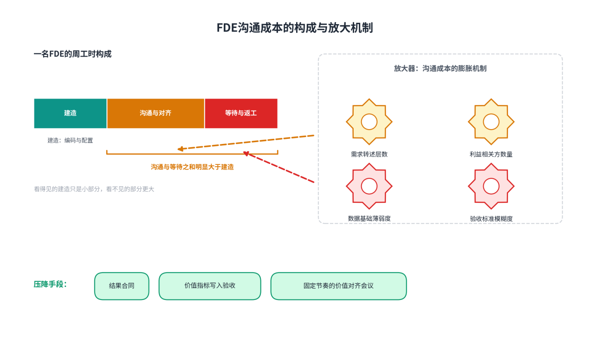
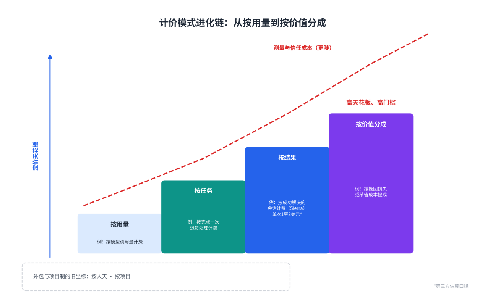
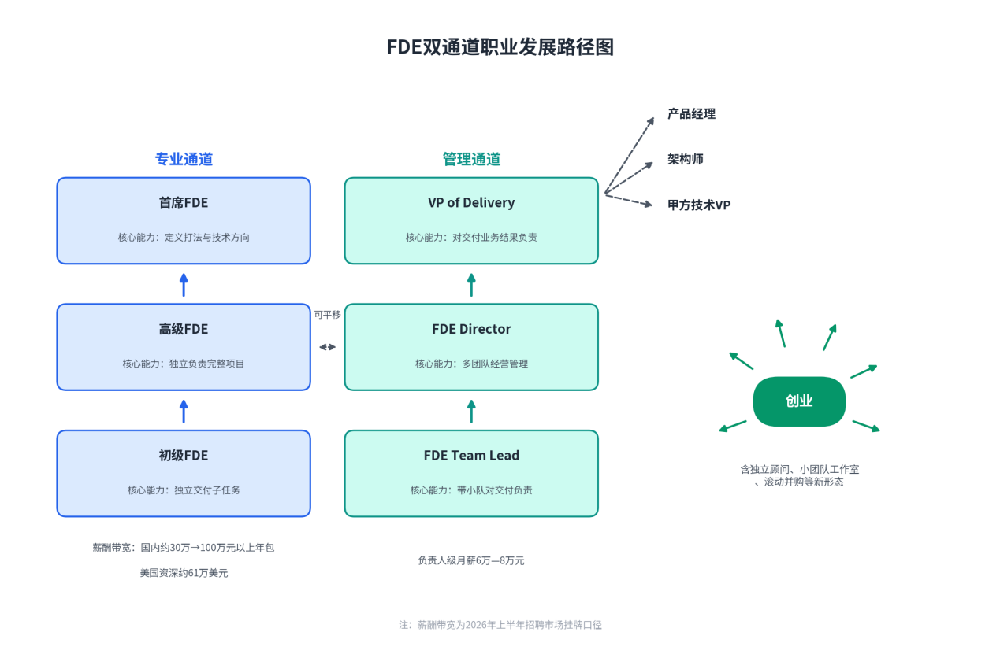

# 第9章FDE的绩效、成本与激励

**【本章导读】**

FDE模式面对的最后一个，也是最尖锐的问题，是一笔账：把昂贵的工程师送进客户现场，这门生意到底算不算得过来？本章回答四个问题——一支FDE团队的真实成本由什么构成，哪些成本藏在预算科目之外；收入侧有哪些计价与回报模型，客户的投资回报率（ROI）该如何测算；怎样设计激励机制，让工程师的行为与客户的结果同向；以及这个新兴职业的专业、管理与交叉上升通道。本章适合信息化企业经营者、FDE团队负责人、人力资源负责人，以及需要判断“该不该为FDE服务付这笔钱”的采购决策者阅读。建议手边备一支笔：本章的每一张表，都可以替换成自己组织的数字重新算一遍。

## 9.1 FDE的服务成本核算

FDE模式最常见的质疑，指向它的成本结构。国内有创业者公开发问：“FDE很难成为一个好的商业模式——做浅了，模型厂商自己会做；做深了，本质上还是外包，交付成本高且难以规模化。”国外也有类似警告：有高德纳（Gartner）分析师预测，2028年前70%的企业将因供应商成本过高与内部技能空心化，被迫放弃由FDE主导的智能体方案；面向首席信息官的科技媒体则提醒，这个模式里最有结构性的问题，是“前线部署的成本到底谁在付”。质疑无法靠口号回应，只能靠核算。把成本逐项拆开，才能看清哪些是模式固有的，哪些是管理不善堆出来的。

### （1）成本构成的全面拆解：人力、差旅、基础设施、沟通

一名满负荷FDE的年度全成本，由五块构成。

第一块是人力薪酬，也是绝对主体。2026年初的市场锚点：Palantir的FDE年总薪酬中位数约21.5万美元，头部人工智能实验室的中级FDE约38.5万美元、资深约61万美元，Anthropic的岗位底薪在20万到30万美元之间。按中级口径加上福利、差旅与工具链分摊，美国市场一名中级FDE的满负荷年成本往50万美元靠。中国市场2026年上半年的人民币定价：头部大厂与人工智能公司的FDE岗位年包大致30万到100万元出头，加上社保、福利与各类分摊，满负荷年成本按本书推算在大几十万到一百多万元人民币之间。同一头衔底下价差极大——有工业软件公司以月薪8000到1.6万元招聘驻场“FDE”，与头部岗位相差近十倍。价差背后不是头衔，而是平台底座、客户质量与计价模式的差。

第二块是差旅驻场。从业者社区的共识是，四分之一到一半的出差时间是常态，OpenAI的招聘启事明确写出差最高可达50%。差旅的显性支出有限，真正的代价在隐性侧：差旅强度与值班负荷是FDE倦怠与离职的首要驱动。团队烧干了，前面所有经营指标都是烟花。

第三块是基础设施：云资源、模型调用费、开发工具链、安全合规环境。其中模型调用按量计费，是随客户用量增长的变动成本——用量越成功，账单越大。成本规划必须与用量曲线同步，永远跑在曲线前面半步，否则“成功”会在续约季变成刺客。

第四块是沟通与对齐：需求澄清、利益相关方对齐、验收往返、知识转移。它不出现在任何预算科目里，却通常吃掉FDE工时的最大份额，在成本核算中必须单列一类，而不是揉进人力成本里糊涂带过。

第五块是售前与空档。免费验证的工程师投入是实打实的成本：Palantir的训练营（客户带真实数据进场、一到五天做出可部署原型的免费验证形式）从2022年的不足百场做到2025年高峰期日均近6场，以每场投入数名顶尖工程师数日计，是一年数千万美元级别的免费投入。这笔投入应计入获客成本（Customer Acquisition Cost，CAC），而不是摊进交付毛利——它本质上是用工程师费用替换销售费用，且工程师费用能沉淀为产品。此外，项目之间的空档期让“满负荷”永远只是理想状态。

五块成本汇总之后，要经过一道除法才有经营含义：一个满负荷FDE同时只能服务三到五个客户，深度嵌入时只有一到三个。除下来，单个部署摊到的年交付成本约7.5万美元起；按薪酬口径自算，区间在7.5万到17万美元之间。这个宽区间，是一切定价讨论的成本基准线。

表9-1：FDE服务成本构成拆解（以一名满负荷FDE的年度全成本为口径）

| **成本项** | **主要内容** | **美国市场量级** | **中国市场量级** | **核算要点** |
| --- | --- | --- | --- | --- |
| 人力薪酬 | 底薪、奖金、社保与福利 | 中级年总薪酬中位数约38.5万美元，资深约61万美元 | 头部岗位年包30万至100万元出头 | 福利与分摊通常再加两至三成 |
| 差旅驻场 | 交通、住宿、驻场补贴 | 出差占工作时间四分之一至二分之一为常态 | 频次相当，单日成本低于美国 | 隐性代价是倦怠与离职，须计入团队续航指标 |
| 基础设施 | 云资源、模型调用费、工具链、安全合规环境 | 随客户用量增长的变动成本 | 同左 | 成本规划必须跑在用量曲线前面半步 |
| 沟通与对齐 | 需求澄清、利益相关方对齐、验收往返、培训 | 无独立预算科目，常占工时最大份额 | 同左，且客户数字化基础更薄弱时进一步放大 | 最大隐性成本，靠契约化机制压降 |
| 售前与空档 | 免费验证、训练营、项目间隙 | 训练营免费投入一年数千万美元级 | 付费诊断可部分回收 | 计入获客成本，不摊入交付毛利 |
| 合计 | 单人满负荷年成本 | 往50万美元靠 | 大几十万至一百多万元人民币（本书推算） | 除以同时服务的3至5个客户，得单个部署成本 |

### （2）沟通成本是FDE最大的隐性成本

沟通成本值得独立核算，因为它的规模超出了多数管理者的直觉。两组来自交付一线的经验数字可作坐标：有从业者估算，写代码大约只占问题本身的两成；企业数据问题里九成五是接入、清洗、关联，项目进度的七成卡在这一层——而这些工作几乎全部以沟通为前提：先弄清数据在谁的系统里、口径以谁为准、权限找谁批，然后才轮得到工程。

沟通成本由“四种形态”构成。

一是需求澄清。客户带来的往往是方案而不是问题。一个真实的对照：某客户带着47页需求文档而来，最终上线的系统，核心只是每天早上推送一条消息。把47页文档还原成一条消息之间的全部工作——访谈、现场观察、流程还原、反复确认——都是沟通成本。

二是利益相关方对齐。客户不是一个人：购买者、流程负责人、最终用户、信息技术、安全、数据、法务和高管，对“成功”各有定义；提出需求的人与承受工作的人，常常不是同一批人。每多一个需要对齐的对象，沟通成本就上一个台阶。

三是验收与汇报往返。在组织权责不清的客户那里，这块成本会失控。有国内一线执行者亲历过一个千万级国企项目：大领导签完合同便没了下文，项目里没有真正负责的人，FDE被架在“向上没有决策者、向下没有执行者”的真空层，最后只能靠研究“汇报逻辑”来争取验收。此时沟通不再是交付的手段，而成了交付物本身——这是沟通成本最病态的形态。

四是知识转移与培训。交付的终点是客户能自己运转，分层培训、“培训培训师”、任务化的文档体系，都是必要但不便宜的沟通投入。

沟通成本可怕在放大机制，而不在基数。四个放大器：需求转述的层数、需要对齐的利益相关方数量、客户数据基础的薄弱程度、验收标准的模糊度。四个放大器都在高位时，沟通成本可以吞掉项目毛利的大头。

压降沟通成本，靠的不是“多开会”，而是把高成本的口头对齐，转化为低成本的书面契约：一页纸的结果合同（客户、销售、产品与工程共同签认的成功定义）、写进验收条款的价值指标，以及固定节奏的价值对齐会议。好的机制把沟通从“反复解释”变成“一次写清”。

图9-1：FDE沟通成本的构成与放大机制

### （3）成本分摊模型：项目制、订阅制、混合制

成本发生在交付侧，分摊方式却由收费结构决定。三种主流模型的差别，本质是收入现金流与成本现金流的匹配方式。

项目制：按阶段验收、一次性付款。它顺应了中国客户“买断加实施”的采购习惯，但有一个结构性缺陷——项目的成本离场即作废，无法摊薄。软件产品化摊薄的是研发费用，订阅制在线软件摊薄的是销售费用，唯有项目制公司两头不沾：每一单的收入都是新的，每一单的成本也是新的。

订阅制（Subscription）：客户按年或按月定期付费。收入平滑可预测，资本市场给的是软件的估值倍数。代价是交付成本前置、收入后置，前几年账上必然难看；且在中国市场，企业客户对订阅制的接受度至今有限，“按项目验收付款”仍是肌肉记忆。

混合制：按阶段交付验收（顺应项目制习惯），价值指标写入验收标准（注入按结果收费的基因），再签一份年度运维与演进合同（培育续约意识）。对多数中国场景，这是现实解——纯订阅制是理想，混合制才是活路。

选择模型时，还有一层很少有人细算的后果：计价结构对财务报表的影响。按结果收费（Outcome-Based Pricing，客户为“被解决的问题”而非软件使用权付费）把原本由客户承担的使用风险接到了供应商肩上：客户用得少，收入就少，而工程师成本一天不少。收入确认时点、应收账款天数、现金流可预测性，全部变差。定价空间是用波动换来的——选择高档计价结构之前，先确认现金流储备换得起。衡量这门生意的长期健康，可以看客户终身价值（Lifetime Value，LTV）与获客成本之比：企业级生意的健康线一般在3以上；FDE模式获客成本前置，早期可能低于2，必须配合净收入留存一起读才有意义。

表9-2：三种成本分摊模型对比

| **维度** | **项目制** | **订阅制** | **混合制** |
| --- | --- | --- | --- |
| 收费结构 | 按阶段验收、一次性付款 | 按年或按月定期付费 | 阶段验收付款，加年度运维与演进合同 |
| 现金流特征 | 集中于验收节点，波动大 | 平滑、可预测 | 主干项目制，长尾订阅 |
| 中国市场接受度 | 高，顺应“买断加实施”的采购习惯 | 有限，仍在培育 | 较高，主流过渡形态 |
| 收入质量 | 离场即作废，无法摊薄 | 经常性收入，估值倍数高 | 运维部分沉淀为经常性收入 |
| 主要风险 | 收入不可预测，续约无保障 | 交付成本前置，早期亏损 | 结构设计复杂，须防“名为混合、实为人天” |
| 适用情形 | 单一项目、预算制客户 | 平台成熟、续约意识强的客户群 | 中国企业级市场的现实解 |

### （4）给客户的报价策略

报价首先是个结构问题——收什么、何时收、与什么挂钩——然后才是数字问题。六条纪律。

第一，锚点先于报价。免费验证期就要持续谈论价值（“这套系统本月为你们释放了约120个人时”），报价单出现时，客户心里已有锚点；免费期只谈功能不谈价值，报价单就是一个突兀的惊吓。

第二，赚“确定性”的溢价。免费验证溶解了“你们行不行”的疑虑之后，客户买的不再是一场赌局，而是一份已被亲眼验证的确定性——确定性是可以溢价的。Palantir把销售周期从九到十二个月压到数周，靠的正是这个：不说服客户，让客户用自己的数据说服自己。

第三，分层报价，给每一档一个体面的出口。对需求宏大但模糊的大客户，先卖一份两到三周、固定收费的付费诊断，产出场景优先级报告与数据准备度清单；诊断通过，再签最小可行部署（MVD）；验证成功，再谈全面部署与年度演进合同。连诊断都不肯付费的客户，本来也不该做。

第四，守住成本红线。单份合同10万美元起步，是一条有代表性的红线——按单个部署7.5万到17万美元的全成本区间，10万美元正好卡在盈亏平衡的位置。低于红线的报价，不是让利，是亏损换名单。

第五，用“劝退”保护报价体系。场景未验证的不接、数据基础不具备的不接、只想了解人工智能的不接。国内有服务商把劝退写成明文机制：宁可客户晚一点开始，也不在错的时机开始。劝退短期看是放弃收入，长期看是保卫成本结构与口碑。

第六，让计价结构讲对“关系故事”。客户用量超预期，是定价心理学的考场：惩罚式超量计费讲的是“盯着你”，客户会为不超额而主动压抑使用，使用率下降，价值缩水，续约时双输；阶梯降价、超量预警加主动升舱、把架构优化省下的成本主动算给客户听，讲的是“和你一起长大”。帮客户省钱与等客户超量，是两类完全不同的供应商——前者在续约时收获的信任溢价，远超那笔费用。

表9-3：报价策略决策表

| **客户情形** | **推荐报价结构** | **定价依据与纪律** |
| --- | --- | --- |
| 战略行业首单、灯塔价值高 | 主动承担风险：“做成了再收钱”，或象征性收费 | 免费验证换获客与背书；失败也沉淀资产，但须预设毕业日与转化机制 |
| 价值可清晰量化 | 基础费用加价值指标挂钩浮动 | 确定性溢价；评估体系即计费地基 |
| 需求宏大但模糊 | 先卖两到三周固定价付费诊断 | 诊断把宏大需求熬成清晰场景；不肯付诊断费的客户本不该做 |
| 预算制政府与国企客户 | 按预算科目拆分、按验收节点分期 | 顺应预算与验收制度；价值证据须在预算编制前到位 |
| 续约与扩容客户 | 阶梯价加主动升舱加年度演进合同 | 把超量从罚单变成勋章 |
| 数据基础不具备 | 劝退，或先签数据准备度辅导 | 守住单合同成本红线，保卫口碑 |

## 9.2 FDE的收入与回报模型

收入侧的总原则只有一句：FDE模式的收入，归根到底是价值创造的结果。计价方式决定能分到其中的多大比例，回报模型决定这个比例是否经得起客户财务负责人的追问。

### （1）收费标准设计：按人天、按项目、按价值分成

三种主流收费模式，代表计价单位与客户价值的三种距离。

按人天计价，是外包的老计价方式：按工程师人头乘天数收钱。它的问题不在价格高低，而在激励错位——供应商做得越快、收入越少，客户买得越久、付得越多。国内先行者把区隔写得很直白：FDE按阶段交付、按结果验收，驻场外包按工时结算；FDE带着产品底座来做工程，驻场外包从零现写现改；FDE做完会走，驻场外包越驻越久、人走系统停。

按项目计价，以里程碑和阶段交付物为单位，计价开始绑定交付物。但它有两个软肋：验收标准模糊时，“交没交”会退化成关系谈判；范围蔓延时，供应商要么亏损，要么陷入变更扯皮。

按价值分成（Value-Based Pricing），是计价进化链的顶端：按为客户创造的财务价值提成——省下的成本、追回的收入、释放的产能。它最贴近价值，也最难执行：需要客户开放财务数据、需要抗周期的信任、需要极强的价值测量能力，目前只在深度绑定的高客单价场景出现。

三种模式之间，还藏着一条更细的进化链：按用量（按模型调用量计费，清晰可测，但追踪的是成本而非价值——用量大可能是价值高，也可能是系统低效）→按任务（按“完成一次退货处理”计费，计价单位有了业务含义）→按结果（按“成功解决的会话”计费，执行难点在归因）→按价值分成。智能体公司Sierra是按结果收费的标本：按“已解决的会话”收费，第三方估算其年合同门槛约15万美元起，含部署费首年预算常见20万到35万美元，单次成功解决的定价在1到2美元——客户每一分钱，都对应一次“问题真的被解决了”。

选择档位的判断原则是：计价单位越贴近客户价值，定价天花板越高，测量与信任成本也越高。支撑高档计价的底层设施是评估体系——技术评估体系，同时就是计费基础设施。落到合同里，一个能执行的按结果条款至少写清五件事：指标定义（什么叫“解决”）、基线与测量窗口、判定方与数据源（以双方共认的仪表盘为准，而非供应商单方报表）、争议仲裁，以及最常被漏掉的流产条款（客户数据基础不达标、指标无法测量时，费用与责任如何分担）。缺了任何一件，“按结果收费”就会退化成“按关系收费”。

图9-2：计价模式进化链：从按用量到按价值分成

表9-4：三种收费模式对比

| **维度** | **按人天** | **按项目（阶段验收）** | **按价值分成** |
| --- | --- | --- | --- |
| 计价单位 | 工程师人头乘天数 | 里程碑与阶段交付物 | 为客户创造的财务价值 |
| 供应商激励 | 工期越长收入越高（与客户错位） | 按期交付，但怕范围蔓延 | 与客户利益同向 |
| 测量与信任成本 | 极低 | 中：验收标准须前置谈判 | 高：归因、基线、双方共认的数据源 |
| 定价天花板 | 低，被外包市场价格锚定 | 中 | 高，上限是客户价值本身 |
| 现金流特征 | 稳定但天花板低 | 节点集中 | 随结果波动，回款随验收起伏 |
| 适用条件 | 补充性人力、极早期探索 | 中国市场主流形态 | 深度绑定、高客单价、财务数据可开放 |

### （2）政府项目的特殊考量：预算制与验收制

政务与大型国企项目，运行在两套与商业企业不同的制度上：预算制与验收制。这两套制度不改变价值逻辑，但彻底改变了经营节奏。

预算制意味着采购决策被锁在年度预算周期里。错过一个预算季，再等一年——企业客户流失剧本里那句“明年再看”，在预算制下被制度化。经营含义是倒排：价值证据必须在预算编制之前进入支持者手中，而不是在合同到期之前。季度价值报告、年度成效白皮书，本质上都是为预算编制会议准备的弹药。

验收制意味着回款被锁在验收节点上。三条纪律。其一，验收标准前置谈判：把价值指标写进验收条款，在签约时而非验收时完成，并约定双方共认的数据源与判定方。其二，单点防断：政府与国企轮岗频繁，“支持者一动，合同就悬”的概率远高于民营企业。关系必须网格化——一个支持者之外，至少再发展两条独立的关系线；同时把系统的价值从“支持者的政绩”改写为“组织的资产”，让任何新上任的负责人在第一周就形成“这系统是这里的固定资产”的印象。其三，现金流条款匹配：政务项目回款周期长、安全与合规审查环节多，报价必须把资金成本计入，避免验收前垫资过大。

还有一个签约前的检验：确认这个项目里“有真正负责的人”。预算充足、需求旺盛，都不足以构成进场理由——决策者缺位的项目，验收成本会吞掉全部毛利。Palantir早年做政府项目时大量采用“做成了才付钱”的安排，底气来自对交付能力的自信；但那是它选择客户的自由，不是它迁就烂客户的义务。

### （3）企业级项目的ROI测算方法

企业客户的财务负责人，在续约与扩容时通常只问三个问题：这东西现在带来了什么？停了会失去什么？明年为什么要多付？投资回报率（ROI）测算，就是把这三个问题提前答完。

一个经得起追问的测算，有四道工序。

第一，基线先行。没有改造前的数据，就没有改造后的价值证明；而基线只在项目启动那一刻存在，错过永不再来。项目启动第一天，就采集工时、错误率、处理量的基线。

第二，收益分类，硬软分账。硬收益包括：人力工时释放（工时乘完全人力成本）、错误与返工损失减少、处理量提升对应的产能释放、回款与周转加速。软收益包括决策质量、员工体验、合规风险下降——软收益单列呈现，不进入ROI公式，否则测算会在财务桌上失去信用。

第三，成本全口径。除了支付给供应商的合同费，还要计入客户侧投入：数据准备与信息技术配合的内部工时、培训与变更管理成本。只按合同口径算的ROI注定虚高——被财务负责人当场拆穿一次，信任很难重建。

第四，分档呈现。按保守、基准、乐观三档给出结果，并公开每档的折算假设：工时节省按多少比例转化为有效产出，损耗减少按多少置信度计入。敢于给出保守档的供应商，反而拿得到定价权。

指标口径另有纪律：与客户共建三到五个关键绩效指标（Key Performance Indicator，KPI），双方共认——客户不认的指标，算出花来也没有谈判效力。引用任何效率数字前，先问清三件事：分母是什么、判定窗口多长、谁来判定。口径不清的86%，不如口径清楚的51%。这套测算不应在续约前临时抱佛脚，而要固化为季度业务回顾（Quarterly Business Review，QBR）的固定议程：讲客户的语言（“本季度为你们节省了多少工时”，而非“本季度供应商上线了什么功能”），让客户的业务方当主角，以“下一季度的价值计划”收尾。出版公司Wiley的季度故事是范本：213%的ROI、季节性客服上岗培训提速一半，外加一个意外收获——工单分类数据让它能拿着周转时长向分销商问责。这样的季度回顾，客户的高管会自己搬椅子来听。

### （4）成功案例：投入30万，年节省400万的ROI解析

“投入30万、年节省400万”是FDE叙事中广为流传的一类数字。它的量级合理，但口径必须拆开。以下构造一个带完整假设的测算示例，演示这类数字应当如何被严谨地算出来。请注意：本例为测算示例，所有假设均为演示性设定，不对应任何真实客户。

客户设定：某连锁零售集团（化名），约3000家门店、100名区域经理。痛点：区域经理的运营督导靠手工汇总门店数据、制作周报，异常发现滞后。项目：门店运营智能督导系统，6周完成最小可行部署，12周全面推广，首年含运维演进。合同价30万元。

节省项的毛值拆解（年化）：

1. 工时释放：100名区域经理，人均每周节省3小时（手工汇总与周报制作），按人力完全成本每小时160元、每年50个工作周计，240万元。

2. 损耗减少：门店异常（库存积压、促销断货）的发现从平均3天缩至当天，按历史损耗数据测算，年减少损耗120万元。

3. 差旅与会议优化：部分巡店与运营会议远程化，年节省40万元。

三项毛值合计400万元——“年节省400万”就是这样来的。但毛值不是可入公式的值，还要过三道折算：工时释放按50%计入（员工省下的时间不会全部转化为产出，五折是财务上可辩护的口径），得120万元；损耗减少按80%置信度计入（部分损耗受季节与促销扰动，归因不可能百分之百干净），得96万元；差旅节省全额计入，40万元。折算后可入公式的年化收益：256万元。

成本端全口径：供应商合同费30万元；客户侧数据准备与信息技术配合工时折算约15万元；培训与变更管理约5万元。合计50万元。

于是三种口径的ROI：供应商合同口径，(400−30)÷30 ≈ 1233%——这是宣传稿最爱的口径，也最不可信；全口径基准档，(256−50)÷50 = 412%；全口径保守档（收益再打五折），(128−50)÷50 = 156%。基准档投资回收期：50÷256×12 ≈ 2.3个月。

表9-5：智能督导项目ROI测算表（测算示例，假设均为演示性设定）

| **类别** | **项目** | **关键假设** | **金额（万元人民币/年）** |
| --- | --- | --- | --- |
| 投入 | 供应商合同费（MVD＋部署＋首年运维） | 固定总价 | 30 |
| 投入 | 客户侧数据准备与信息技术配合 | 内部工时折算 | 15 |
| 投入 | 培训与变更管理 | 内部工时折算 | 5 |
| 投入合计 | — | — | 50 |
| 节省（毛值） | 区域经理报表工时释放 | 100人×3小时/周×50周×160元/小时 | 240 |
| 节省（毛值） | 门店异常损耗减少 | 异常发现从平均3天缩至当天 | 120 |
| 节省（毛值） | 巡店与会议差旅优化 | 部分巡店远程化 | 40 |
| 节省毛值合计 | — | — | 400 |
| 折算后计入 | 工时项按50%、损耗项按80%、差旅项全额 | 财务可辩护口径 | 256 |
| ROI（基准档） | (256−50)÷50 | 全口径 | 412% |
| ROI（保守档） | (128−50)÷50，收益再减半 | 全口径 | 156% |
| ROI（宣传口径） | (400−30)÷30，毛值比合同费 | 不推荐 | 约1233% |
| 投资回收期 | 50÷256×12，基准档 | 全口径 | 约2.3个月 |

这个示例有三点值得记住。其一，“30万对400万”的冲击力来自口径差——严谨的算法把收益从400万折到256万、把成本从30万加到50万，结论依然成立，而且立得住。其二，真实世界的锚点支持这个量级：法律人工智能公司Harvey的深度用户平均每周节省11小时，Wiley报出213%的ROI，OpenAI与约翰迪尔的合作把化学品使用减少最高70%——高质量FDE部署的回报以倍计并不夸张，夸张的是不做折算与全口径的宣传。其三，ROI测算的终点不是说服，而是资产：每个项目的价值数据沉淀进公司的价值度量系统，跨客户聚合之后，才能回答“哪类场景的价值密度最高、销售火力该引向哪里”。数据不会在谈判桌上凭空出现，它在交付的第一天就要开始采集。

## 9.3 激励机制设计

薪酬结构是角色定义的一部分：给钱的方式，会影响人的行为。招聘市场上有一个被反复验证的试金石：看一个FDE岗位的薪酬包里有没有销售提成——提成占比高的，多半是售前换了个时髦头衔。

### （1）短期激励：项目奖金与里程碑奖励

短期激励的通行结构，是“工程师薪酬加与经营指标挂钩的浮动奖金”。Palantir的奖金常与客户扩展等经营指标挂钩，介于工程奖金与销售佣金之间——这个“介于之间”的位置是精心设计的：离工程奖金太近，现场与经营脱钩；离销售佣金太近，行为滑向签单。

设计要点在挂钩对象。项目奖金不该挂在“上线”上——上线不算交付完成，客户团队改变工作方式那天才算。更可取的挂钩物，是价值实现时间（Time to Value，TTV，从进场到客户获得第一次可衡量价值的时间）、激活率、评估达标率这类结果指标。里程碑奖励同理：奖金节点应对应“价值指标达成”，而不是“功能清单打勾”。收费一旦与结果绑定，交付团队的全部行为都会重新排序——没人会再花三周打磨一个没人用的功能，因为“没人用”要自己买单。激励设计要做的，就是把这条收费逻辑复制到个人薪酬里。

### （2）长期激励：客户续约分成、知识资产共享

长期激励解决的是“FDE凭什么为两年后的事负责”。两个抓手。

续约分成。企业级生意里，获取一个新客户的成本是留住一个老客户的数倍，而续约的成本趋近于零；FDE对续约的实质影响又远大于销售。让FDE分享净收入留存（NRR）的增长，逻辑上成立。但要设两道隔离：分成基数是“续约与扩容的实际回款”，不是“新签合同”；分成比例有上限，与销售佣金物理隔离。激励与客户经理对齐是对的，让FDE背硬性销售指标则会把他变成售前。

知识资产共享。FDE模式区别于外包的灵魂，是现场学习回流为产品资产。如果沉淀没有回报，团队就只交代码、不交资产。机制上，组件入库、打法手册更新、评估集贡献应计入个人绩效，并按复用次数计奖——按入库数量计奖，只会催生凑数式沉淀。历史上最壮观的回报是Palantir的Foundry平台：核心组件诞生于苏黎世、休斯敦、圣保罗、图卢兹等天南海北的客户现场，自下而上长成，最终反哺为年收入数十亿美元的产品。最早的建造者，理应在这台机器里有名有分。创业公司场景下，股权与期权是更直接的长期绑定，归属节奏宜与交付经营指标双挂钩，避免与现场贡献脱钩。

表9-6：FDE激励组合设计表

| **激励工具** | **时间跨度** | **挂钩指标** | **主要风险** | **防线** |
| --- | --- | --- | --- | --- |
| 项目奖金 | 项目周期 | 里程碑验收、价值实现时间、激活率 | 赶工牺牲质量 | 验收指标双方共认 |
| 里程碑奖励 | 节点 | 价值指标达成（非上线） | 指标博弈 | 主指标配反指标 |
| 续约分成 | 年度 | 净收入留存（NRR）、续约回款 | 行为滑向签单 | 比例上限，与销售佣金隔离 |
| 知识资产奖励 | 季度/年度 | 组件复用次数、手册与评估集贡献 | 凑数式沉淀 | 按复用次数计奖，不按入库数量 |
| 股权期权 | 多年 | 公司经营结果 | 与现场贡献脱钩 | 归属节奏与交付经营指标双挂钩 |
| 成长与影响力 | 持续 | 复杂项目机会、对外分享、方法论署名 | 不可量化而被忽视 | 写进晋升标准与授权清单 |

### （3）非金钱激励：成长机会、行业影响力

FDE是软件行业少数能同时积累技术、商业与客户资源的岗位。从业者社区对这个岗位的讨论有一种少见的诚实：有人把它当品牌跳板，有人说它是挂着酷头衔的咨询——两种说法都对，区别在于，公司是把现场学习回流到产品，还是把人当人天在卖。

成长机会是最硬的非金钱激励。FDE的日常训练，是在资源受限、需求模糊、关系复杂的环境里，端到端做出一个有价值的东西并让人用起来——这几乎是创始人训练的完整预演。Palantir走出了密度惊人的创业者群体：将近三分之一的产品经理，离职后自己创了业。给优秀FDE的激励，应包括独立扛下复杂项目的机会、接触客户高管的场合，以及“前线对基地的激进授权”——高层只定目标，打法归现场。对顶尖工程师，自主权本身就是薪酬。

行业影响力是第二层：对外分享案例的资格、技术内容中的署名、行业会议的讲台、方法论里的命名。这些资产的共同点是可携带——它们跟着人走。这反而降低了离职博弈的对抗性：公司为员工的行业声望投资，员工为公司的事业期投入负责。

还有一条容易被归类错误：倦怠管理是激励的基础设施。出差强度、值班负荷、离职率与倦怠预警信号，必须进入团队的周检视。激励设计得再巧，烧干的团队也接不住。

### （4）避免“过度激励”与“激励错位”

激励设计的失败，有两种典型死法。

激励错位，是挂错了钩。对个人：按代码行数、工单关闭数考核，会把活动量伪装成结果——人工智能时代，写代码的成本在坍塌，产出的数量不再是约束，产出的对错才是。对团队：让FDE背硬性销售指标，行为滑向签单；按人天向客户收费，供应商反而因“做得快”受损。检验方法是一个反向问题：这个指标被刷爆的时候，客户的结果变好了吗？答不上来，就是错位。防线是反指标制度：自动解决率提高，但投诉、返工或风险也提高，就不算成功——任何主指标，都必须配一个不许恶化的反指标。

过度激励，是剂量过了线。浮动占比过高，会扭曲专业判断——该对客户说“不”的时候，奖金会让人说“是”；单一指标的重奖，会诱发刷量，激活率变成打卡率。两种毒性在项目制环境里被放大：验收压力集中在节点上，短期激励若与“验收通过”直接挂钩，汇报工程就会压倒交付工程。

激励还有一个更深层的分歧，值得摆到桌面上：FDE究竟该归属工程线还是市场线，两种安排各有支持者——归属市场线，激励天然靠近佣金，灵活但容易售前化；归属工程线，激励靠近工程奖金，稳健但可能远离经营结果。本书采纳折中方案：组织上向产品或工程线汇报，保证角色不被销售目标吞没；激励上与客户经理对齐经营指标，但不背硬性销售指标。给钱的方式定义角色，而角色的纯度，是FDE模式最昂贵的资产。

## 9.4 上升通道与职业发展

这个职业给“熬”定价：客户信任、行业判断、跨组织的威望，都随工龄复利。但前提是身处一家把现场学习当资产的公司——否则熬出来的，只是工龄。

### （1）专业路径：初级FDE→高级FDE→首席FDE

专业通道的分级不看工龄，看三种能力台阶。

初级FDE：在双人组合或导师带教中承担建造任务，能在既定的问题定义下独立交付模块。核心训练是三种“翻译”的基本功：把业务问题翻译成技术问题，把技术方案翻译成高管能懂的话，把现场经验翻译成团队能复用的知识。

高级FDE：独立对一次端到端交付负责——能与客户共同定义“什么叫成”，能设计评估体系，能对错误的需求说不。对应的市场价格带宽：国内约60万到100万元以上年包，美国资深FDE年总薪酬约61万美元。

首席FDE：方法论的定义者。设计计价结构与验收标准，代表公司的技术信誉，拥有拒绝订单的权力，并把个人经验沉淀为组织打法。检验标准是一句反问：这个人离开现场时，留下的是一堆项目，还是一台机器？

### （2）管理路径：FDETeam Lead→FDEDirector→VP of Delivery

管理通道同样三级，每级的经营对象不同。

FDETeam Lead：带两到三支小队。一支小分队同期最多高质量交付两个项目，Team Lead对排期、质量与复盘负责——排期本身就是战略：按战略价值与学习价值排期，而不是按合同金额排期。这一级必须保留现场手感：脱离现场的交付管理者，判断力会以季度为单位退化。

FDEDirector：对一个行业或一个区域的交付经营负责，经营对象是一个指标组合：交付毛利率、净收入留存、交付资产复用率与现场到产品的回流速率。他要回答的经营问题是：毛利率是否随平台沉淀逐季爬升——毛利率不上升的FDE组织，是咨询公司。

VP of Delivery：把交付部门从成本中心，经营为利润中心与情报中心，管理一台三层飞轮——现场探测真实世界，平台放大探测结果，产品沉淀持续生息。中国市场已给这条通道定价：头部人工智能公司的FDE负责人，月薪挂牌6万到8万元。

管理通道特有的陷阱，是组织位置的尴尬：交付经营得好，功劳归产品；经营得差，问题归交付。破解之道是把交付的经营指标做成公司级报表，让毛利率与续约率的曲线自己说话。

图9-3：FDE双通道职业发展路径图

### （3）交叉路径：FDE向产品经理/架构师/技术VP的跃迁

FDE的能力结构——技术深度、业务判断、客户信任——在三个相邻岗位上高度稀缺，构成三条交叉跃迁线。

向产品经理：把现场熬成平台的人，是产品负责人的天然候选。他见过十个客户的同一个痛点，对“该做什么、不做什么”的直觉，是钱买不来的。

向架构师：本体建模、评估体系、企业系统集成，是稀缺的复合经验；在客户环境里做过的架构取舍训练，让FDE出身的架构师更少过度设计。

向甲方技术VP：这是方向感最被低估的一条。甲方最缺的，恰恰是懂乙方套路的人——知道供应商的报价里哪一段是水分、验收标准该怎么写、知识转移该锁死在合同的哪一条里。从乙方交付负责人转任甲方技术决策者，完成的不是转行，而是视角的合流。

### （4）跨行业与创业机会

跨行业迁移的底气，来自行业知识的复利与核心能力的通用。金融、制造、零售的现场各不相同，但问题定义、评估体系、变更管理的手艺是相通的；在一个行业攒下的判断，是下一段旅程的资本。跨行业迁移的正确姿势，是带着方法论进场、以新手姿态学行业——顺序反了，就成了空降兵。

创业是这条职业线上密度最高的出口。FDE的日常，就是创始人训练的完整预演；智能体公司Decagon与Sierra的核心团队，都出自Palantir的前线部署岗位。更激进的新形态也在出现：有从业者提出滚动并购路线——不卖工时，直接把客户公司买下来，用同一套方法论改造，再收购下一家，把“交付能力”变成“拥有生意”。这条路能否走通尚无答案，但它提醒每一个算账的人：当一门手艺能持续创造数百万量级的年价值时，它的拥有者迟早会问——为什么只收30万。
