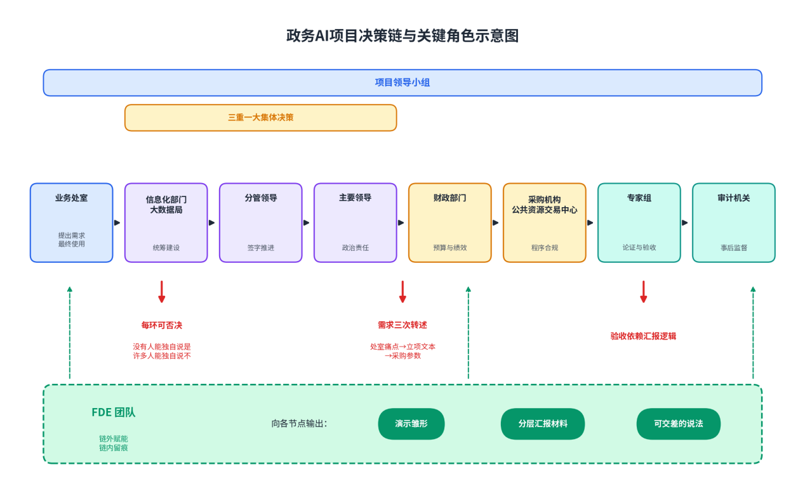
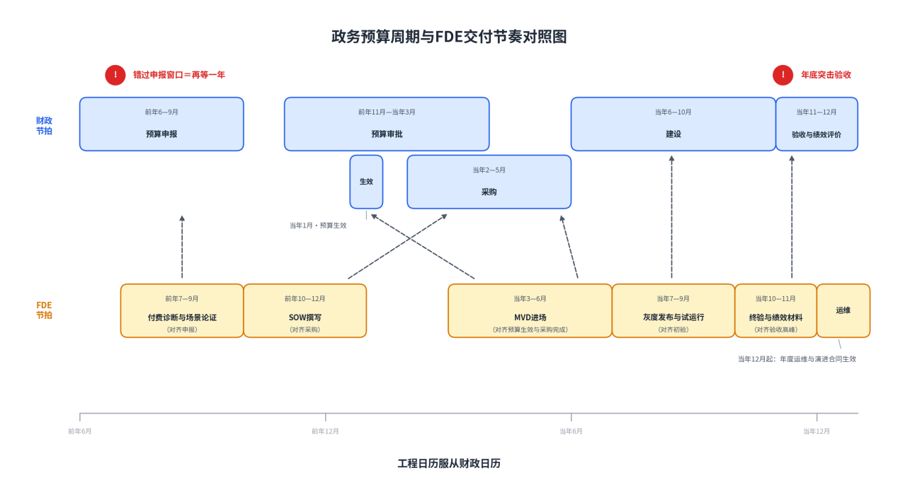
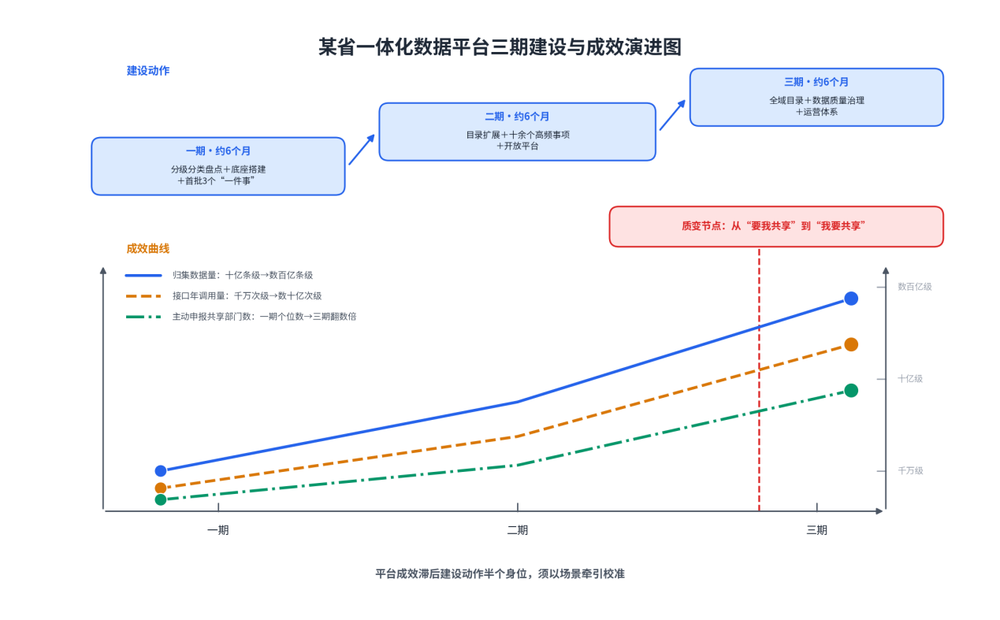

# 第四篇：FDE在政企场景的实战指南

# 第10章政府信息化场景

**【本章导读】**

政府部门是FDE模式的出生地：Palantir的工程师文化，正是在情报机构的保密墙内被逼出来的。但政务场景也是这套模式压力最大的考场——合规是法定底线而非谈判筹码，“客户”是一条多层级决策链而非一个拍板的人，预算与采购按年度节拍运转，验收之后还有审计。本章回答四个问题：政务数字化有哪些不同于企业市场的结构性特征；FDE在敏感数据、团队协同、政务云部署、验收审计四个环节如何适配；三个化名实战案例各做对了什么。本章首要读者是政府信息化部门负责人，也适合承接政务项目的交付团队负责人对照自检。

## 10.1 政务数字化特征

在企业市场，FDE要翻越的是“采购、法务、安全审查”三道闸门；在政务市场，这三道闸门全部升级为法定制度，且背后多了一道企业市场没有的终极闸门——政治责任。理解政务场景，要从三组结构性特征入手：合规的强度、决策的形状、资金的节拍。

先建立一个基本判断：政府是“产品化交付无解”的典型市场。法律、医疗、金融、政府这四类市场共享三座大山——保密制度、数据不出域、关键用户自主权——产品进不去，只有人进去，系统才进得去。FDE模式与政府市场纠缠了二十年：从情报机构的保密信息室，到海军的造船厂，这套方法论本来就是在政务土壤里长出来的。中国政务市场的土壤成分不同，但结构相似。

### （1）强合规与安全要求

政务信息化项目的合规，不是验收前补的一套材料，而是从立项第一天起就必须满足的制度栈。这个栈有四层。

第一层是等级保护。《中华人民共和国网络安全法》第二十一条确立网络安全等级保护制度，业界通称等保（网络安全等级保护）；其核心标准GB/T 22239—2019《信息安全技术 网络安全等级保护基本要求》于2019年12月1日起实施，标志“等保2.0”落地。保护等级分五级，多数承载公共服务、涉及公民信息的政务系统定在第三级及以上——定级、备案、建设整改、等级测评、监督检查，五个环节一个不能省。一个常被乙方忽视的事实：等保测评通不过，系统不允许正式上线，验收无从谈起。

第二层是密码合规。《中华人民共和国密码法》2020年1月1日起施行，其第二十七条要求关键信息基础设施运营者开展商用密码应用安全性评估，即密评（商用密码应用安全性评估）。2023年11月1日起施行的《商用密码应用安全性评估管理办法》把要求落到节奏上：重要网络与信息系统须同步规划、同步建设、同步运行密码保障系统，建成后每年至少开展一次密评。对AI项目的直接含义：传输加密、存储加密、身份认证要采用合规的商用密码，密钥管理体系要经得起评估——模型服务对外暴露的接口同样在评估射程之内。

第三层是数据与个人信息保护。《中华人民共和国数据安全法》2021年9月1日起施行，第二十一条确立数据分类分级保护制度，重要数据目录管理制度随之建立；《中华人民共和国个人信息保护法》2021年11月1日起施行，政务部门处理公民个人信息同样受其约束。政务数据的特殊性在于“天然的敏感性”：人口、法人、证照、不动产、健康、信用——这些数据正是AI应用最想要的燃料，也是保护要求最严格的资产。与数据安全法同日施行的《关键信息基础设施安全保护条例》，则把公共服务等领域的关键系统置于更高保护要求之下。

第四层是技术路线的自主可控。信创（信息技术应用创新）要求政务系统的芯片、操作系统、数据库、中间件逐步替换为自主可控产品。对AI项目，这层要求直接改变技术选型：模型要在国产算力上跑得动，基础软件要在信创目录内找得到。这条约束必须在架构设计的第一天就写进去，而不是部署前一周才发现。

四层合起来，构成一个与企业市场性质不同的合规环境：企业合规是商务条件，可以谈判、可以分期；政务合规是法定底线，没有谈判空间，只有满足与否。应对之道的内核与企业市场相通，但强度加倍——把合规当作交付的一部分提前设计：合规材料产品化（预置的等保测评证据链、密码应用方案模板、数据处理说明），安全白皮书常备常新，用响应速度证明安全成熟度。企业安全问卷的八成内容，可以从维护良好的白皮书中直接取答；在政务场景，这个比例只会更高。

表10-1：政务AI项目主要合规要求清单

| **合规事项** | **依据（施行时间）** | **核心要求** | **对FDE交付的影响** | **通关要点** |
| --- | --- | --- | --- | --- |
| 等保定级与测评 | 网络安全法（2017-06-01）；GB/T 22239—2019（2019-12-01实施） | 定级、备案、建设整改、等级测评、监督检查；政务系统普遍三级及以上 | 架构须满足安全区域边界、审计、入侵防范等要求；未通过测评不得上线 | 定级在立项期完成；按测评项预留证据链（日志、审计记录） |
| 密评 | 密码法（2020-01-01）；《商用密码应用安全性评估管理办法》（2023-11-01） | 同步规划、同步建设、同步运行；建成后每年至少评估一次 | 传输、存储、身份认证采用商用密码；模型服务接口纳入评估范围 | 密码应用方案先行评估；密钥管理体系独立设计 |
| 数据分类分级 | 数据安全法（2021-09-01） | 分类分级保护；重要数据识别与目录管理 | 训练语料、评估集、日志按级别差异化管控 | 进场先做数据分级盘点，再定技术方案 |
| 个人信息保护 | 个人信息保护法（2021-11-01） | 最小必要、法定职责边界、敏感个人信息从严 | 涉及公民信息的场景需做影响评估与脱敏设计 | 能不采的不采，能脱敏的脱敏 |
| 关键信息基础设施保护 | 《关键信息基础设施安全保护条例》（2021-09-01） | 重点行业关键系统更高保护要求、检测评估 | 涉及关基的项目安全要求整体抬升一档 | 尽早确认系统是否落入关基范围 |
| 信创适配 | 信创（信息技术应用创新）相关政策 | 基础软硬件自主可控 | 芯片、操作系统、数据库、中间件选型受限；模型须适配国产算力 | 架构设计第一天写入信创约束，选型先做兼容性验证 |

表注：涉及国家秘密的信息系统另有分级保护要求，本表不展开。

### （2）多层级决策链

企业客户再复杂，通常存在“一个能拍板的人”；政府客户的决策单位不是一个人，而是一条科层链条。以一个地市级政务AI项目为例，链条上至少站着八类角色：提出需求的业务处室，统筹建设的信息化部门（大数据局或信息中心），签字的分管领导，负政治责任的主要领导，管钱的财政部门，管程序的采购管理机构与公共资源交易中心，把关的专家论证与验收专家组，以及事后的审计机关。重大信息化项目还要通过“三重一大”集体决策程序，往往设项目领导小组，以会议纪要的形式推进。

这条链有三个力学特性。

第一，没有人能独自说“是”，但许多人能独自说“不”。链条上任何一个环节的合理疑虑——安全、程序、价格、舆情——都足以让项目暂停。企业销售教科书里的“搞定关键人”在这里失效，因为根本不存在单一关键人。

第二，需求在转述中层层失真。业务处室的痛点，经信息化部门转写为立项文本，经采购文件转写为技术参数，到乙方手里已是第三手信息；而系统做成什么样，最终要回到业务处室的日常里被检验。失真的代价由整条链分摊，但引爆点在最后一环。

第三，验收取决于“汇报逻辑”而不仅是系统本身。一位一线从业者亲历过一个千万级国企项目：大领导签完合同便没了下文，项目里没有真正负责的人，交付团队被架在“向上没有决策者、向下没有执行者”的真空层，最后只能靠研究汇报逻辑来争取验收。这个案例的教训不是“学写汇报”，而是：在政务场景，让每一层决策者都获得“可交差”的说法，本身就是交付物的一部分。

FDE的适配动作随之确定。其一，利益相关方地图要画到决策链的每一个节点，尤其要标出“影响决策的非决策者”——业务处室里资历最深、说话最管用的老科长，评审专家组里被同行信服的技术权威。其二，把演示循环当作需求探针。Palantir早年面对的是“不能问的用户”：情报分析员不会告诉你他怎么工作。创始团队的办法是做一个演示样品送上门，挨一顿批，记下每一条意见，改完再送上门——复杂领域的客户，在看到能用的东西之前，不知道自己要什么。政务用户的表达约束不如情报机构严苛，但“看菜下饭”的认知规律相同：给处室看一个能跑的雏形，比读一百页需求文档更快逼近真实需求。其三，把汇报材料做成正式交付物：面向领导小组的季度简报、面向财政的绩效说明、面向审计的留痕文档，与代码一并纳入版本管理。

图10-1：政务AI项目决策链与关键角色示意图

### （3）预算周期与项目制管理

政务项目的资金按年度节拍运转。《中华人民共和国预算法》规定预算年度自公历1月1日起至12月31日止，而预算编制提前一年启动：各预算单位年中申报下年度项目预算，经财政部门审核、人民代表大会批准后执行，年底决算并接受绩效评价。一个项目错过申报窗口，通常意味着再等一年；年底则集中出现“突击执行、扎堆验收”的景象。财政资金当年有效、结转受限的硬约束，决定了政务交付的日历不是由工程规律排出来的，而是由财政节拍排出来的。

采购程序是第二道节拍器。《中华人民共和国政府采购法》列举公开招标、邀请招标、竞争性谈判、单一来源采购、询价及经认定的其他采购方式，公开招标是主流；信息化服务类项目近年多用经认定的竞争性磋商。程序的刚性带来一个常被技术团队忽视的后果：需求必须以“可评标”的形式表达。评标办法里的每一项分值，都是验收时的潜在条款；工作说明书（SOW）写得越像可核验的清单，后期扯皮越少。《国家政务信息化项目建设管理办法》进一步要求政务信息化项目统筹规划、集约建设、共享协同——重复造轮子的立项，在审批端就会被拦下。

项目制管理构成第三道节拍：立项、采购、建设、初验、试运行、终验、绩效评价与审计，按阶段推进，按阶段拨款。这与中国企业市场的既有现实同构——客户的肌肉记忆是“买断加项目制验收”，而项目制公司最难受的地方在于成本离场即作废，无法摊薄。

FDE的适配，是把交付节奏嵌进财政节拍，而不是与之对抗。

立项窗口期（年中至年末）：配合甲方完成下年度预算申报，产出可行性论证素材与场景优先级报告——这正是“付费诊断”产品的天然位置：两到三周、固定费用，把宏大需求熬成一个清晰的第一场景；连诊断都不愿付费的项目，本来也不该投。

采购期：把工作说明书（SOW）写成可评标、可验收的条款，分阶段验收对应财政拨款节点。

建设期（新预算年度上半年启动最理想）：以最小可行部署（MVD）抢在年内形成初验条件；初验后利用试运行期完成灰度发布与指标采集。

验收与绩效期（第四季度高峰）：提前备齐测评、审计、绩效三套材料，避开年底扎堆。

跨年衔接：以年度运维与演进合同承接订阅制基因——按阶段验收付款顺应采购习惯，价值指标写进验收条款注入成果基因，年度运维合同培育续约意识。一步到位照搬按解决量收费，在多数政务场景会死在采购科；混合制才是活路。

图10-2：政务预算周期与FDE交付节奏对照图

## 10.2 FDE在政务场景的适配

特征认清之后，是四个具体的适配动作：数据怎么碰、队伍怎么带、系统放哪里、验收怎么过。

### （1）敏感数据处理与隐私保护

政务数据的处理原则，可以压缩成一句话：默认所有数据都敏感，然后按分级证明它不敏感。数据安全法确立的分类分级制度，是这句话的制度底座；项目层面可执行的分级，通常落在四档：可公开数据、内部数据、敏感数据、核心数据。不同档位对应不同的处理边界，而边界的总闸门是“数据不出域”——数据不离开甲方指定的环境。金融业的本土FDE服务商已把这条写进方法论，政务场景只会更严。

落到AI交付的工程细节上，有四条操作纪律。

第一，训练与推理不出域。模型私有化部署在政务云或部门专网内，开源模型权重进场、数据与梯度都不出域；调用外部模型接口处理政务数据，在多数场景下直接出局。

第二，评估集在域内构建、域内封存。评估集是验收的尺子，也是敏感数据的容器——真实工单、真实案卷、真实人口记录的抽样，必须按源数据同等密级管理；评估集一旦离开域内，验收的可信度和数据的保密性会同时崩塌。

第三，日志、提示词与上下文同样是数据。企业级软件工厂的实践已经提示：代码、运行日志乃至提示上下文本身都可能是敏感数据，客户必须控制数据流向与留存周期。政务场景要把这条升级为显式条款：模型交互日志存多久、谁能看、能否用于模型改进，全部写进数据处理协议。

第四，最小权限是职业操守而不只是技术规范。能不看的字段不看，能脱敏的样本脱敏，能用一个科室数据验证的不碰全库。这条纪律做不到位，丢的不只是一个项目，而是整个政务市场的入场券。

表10-2：政务数据敏感分级与FDE处理策略表

| **数据级别** | **典型内容** | **存储与传输** | **FDE使用边界** | **脱敏与留痕要求** |
| --- | --- | --- | --- | --- |
| 可公开数据 | 政策文件、办事指南、已公开统计 | 政务云公有区 | 可用于演示与通用知识库 | 无特殊要求，注明来源 |
| 内部数据 | 内部流程记录、非涉密业务台账 | 电子政务外网、访问控制 | 域内使用；样本出域须审批 | 操作留痕；外发样本去标识化 |
| 敏感数据 | 个人信息、证照、不动产、健康、执法记录 | 政务云专属区/专网，商用密码加密 | 最小必要；训练推理不出域；评估集域内封存 | 字段级脱敏；全量访问审批与审计日志 |
| 核心/重要数据 | 重要数据目录内数据、大规模人口法人库 | 按目录与专项要求，从严管控 | 原则上不直接用于模型训练；仅经批准的派生指标可用 | 一事一议；专项评估与备案 |

### （2）与政府部门IT团队的协同

政府信息化部门的团队现实，乙方必须有清醒认识：编制有限、一人多岗、运维靠外援，对厂商既依赖又戒备——怕被技术绑架，怕出事故担责，怕“建得起、养不起”。带着“拯救者”姿态进场的团队，第一道门就过不去。

健康的协同关系，建立在三条原则上。

一是做赋能者，不做取代者。交付的终点是甲方团队自己能转：知识转移要写进合同条款，而不是停留在口头承诺。模型公司与金融机构的合作提供过参照——嵌入的目标被明确写成让客户“未来能独立构建和扩展自己的智能体”。把“教会客户”写进合同，短期看削弱了不可替代性，长期看是对“供应商锁定”质疑最有力的回应；在政务市场，这份承诺还直接关系到项目能否通过可持续性审查。

二是混编作战，而不是外包接力。FDE与甲方信息化人员组成联合工作组：联合排期、双向周报、结对构建。甲方工程师全程参与数据接入、评估集建设与灰度决策——他们既是学员，也是系统未来的主人；乙方则通过混编获得最稀缺的东西：对部门数据家底与内部流程的第一手认知。

三是移交从第一天规划。移交包不是验收前补的文档，而是随版本生长的资产：架构决策记录、运维手册、故障处置预案、分层培训材料。培训要分三层——面向领导的“看得懂的成果汇报”，面向业务人员的“用得上的操作训练”，面向运维人员的“接得住的技术移交”。三层缺一，系统就会在乙方撤离后慢慢失活。

表10-3：FDE与政府部门IT团队的协同界面表

| **环节** | **政府IT团队职责** | **FDE职责** | **协同机制** | **主要风险与对策** |
| --- | --- | --- | --- | --- |
| 立项与方案 | 业务需求确认、预算申报、内部协调 | 场景诊断、可行性论证、SOW技术条款 | 联合工作组、场景优先级评审 | 需求转述失真→以演示雏形校准 |
| 数据准备 | 数据资源授权、分级盘点、口径裁定 | 数据接入、质量探查、分级建议 | 数据分级联合评审 | 数据权责博弈→以场景牵引替代行政命令 |
| 构建与试运行 | 环境保障、安全审查、业务试用组织 | 模型与系统构建、评估集建设、灰度发布 | 结对构建、双向周报 | 安全审查滞后→预答白皮书与证据链前置 |
| 验收与移交 | 组织验收、绩效自评、运维接管 | 测评配合、移交包、分层培训 | 联合验收演练、运维跟班 | 人走系统停→知识转移写入合同并验收 |
| 运营期 | 日常运维、推广、续约决策 | 远程支持、季度演进、价值复盘 | 年度运维与演进合同 | 供应商锁定质疑→能力沉淀在甲方 |

### （3）政务云环境的部署策略

政务云（Government Cloud）是由政府统一建设或采购、供各级部门集中部署信息系统的云计算基础设施，通常依托电子政务外网运行，与互联网逻辑隔离。对AI项目，政务云是默认选项，但不是无条件选项——部署策略要在三种形态间做选择。

一是政务云集中部署。优点是合规路径最短：云平台本身已经过等保测评，部门系统可复用部分测评结论；运维集约，符合“集约建设”的政策导向。约束同样明显：GPU算力资源稀缺，需要向云主管部门专项申请，排队周期以月计——这笔资源必须纳入项目排期的关键路径，模型还没影，算力申请就该递上去。

二是部门专网私有化部署。数据密级高、实时性要求高或业务连续性要求强的系统选这条路：模型、数据、算力全部在部门边界内。代价是全套安全设施自建自测，等保与密评的工作量整体上移，且运维能力必须随系统一并交付。

三是混合部署。通用能力与敏感负载分离：政策问答、公文辅助等低敏负载放政务云，涉及敏感数据的分析推理留在专网，中间经安全边界交换。混合形态最贴近多数AI应用的真实需求分布，但架构复杂度与安全评估面都最大。

信创约束横贯三种形态：芯片选型决定推理框架，操作系统与数据库决定基础软件栈，商用密码决定加密实现。务实做法是在最小可行部署（MVD）阶段就按目标形态做兼容性验证，而不是先在宽松环境里跑通、再到信创环境里重交学费。

表10-4：政务AI系统三种部署模式对比表

| **维度** | **政务云集中部署** | **部门专网私有化部署** | **混合部署** |
| --- | --- | --- | --- |
| 适用负载 | 低敏、通用型应用（政策问答、公文辅助、知识检索） | 高敏、强实时、涉核心业务系统 | 通用能力与敏感负载并存的多数AI应用 |
| 合规路径 | 复用云平台等保结论，路径最短 | 全套自建自测，工作量最大 | 分区定级，评估面最大 |
| 算力获取 | 云主管部门统一申请，排队以月计 | 自行采购，受信创与预算约束 | 两侧分别解决 |
| 数据边界 | 数据上云，依赖平台安全域隔离 | 数据不出部门边界 | 敏感数据不出域，派生结果跨边界交换 |
| 运维模式 | 平台集约运维+部门配合 | 部门自运维（须随系统交付运维能力） | 混合运维，界面须提前划清 |
| 典型风险 | 算力排队拖期；多租户隔离疑虑 | 成本高、能力沉淀难 | 边界交换点成为安全与责任模糊区 |

### （4）验收标准与审计要求

政务项目的验收是双层结构：程序性验收看文档、测评、等保、密评、第三方测试报告是否齐备；实质性验收看功能、性能与效果是否达标。常见做法是初验后设试运行期，期满再组织终验——这个制度空档，正是灰度发布的天然容器：初验以功能完整性为准，试运行期分批放量、采集运行指标，终验以试运行证据为准。AI项目应当主动把灰度发布计划写进验收方案，把制度空档变成方法优势。

AI项目验收的真正难题，是效果指标难以在合同里一次写死。解法是把评估集升格为验收载体：合同附件中封存评估集及其构建方法，验收时在封存评估集上复测，指标口径与基线数据事先三方签认。这套做法把“AI效果说不清”转化为“在同一把尺子上复测”——尺子本身可审计，测量过程可回放。涉及决策建议类系统，还应保留完整的人机交互与采纳记录：每一次模型建议、每一次人工修改、每一次采纳与否，都是事后审计与责任界定的证据。在强监管行业，每个AI决策都得向监管者解释清楚，解释不了就进不了场——政务场景同理，可回放、可追溯不是加分项，是准入线。

审计是政务项目区别于企业项目的最后一道关。审计机关关心两件事：程序合规（立项、采购、变更、验收各环节留痕）与资金绩效（钱花出去，效果在哪）。这要求交付团队从第一天起就把“留痕”当工程纪律：会议纪要、变更单、测试记录、指标基线，全部版本化归档。绩效层面，可衡量的结果承诺是甲方最好的防护——采购最难审批的是“说不清会得到什么的支出”，而写得清、测得到的结果承诺，让“买贵了”的指控无从成立。这句话对甲乙双方同样成立。

表10-5：政务AI项目验收与审计要点清单表

| **阶段** | **验收/审计要点** | **责任界面** | **需备材料** | **常见失分点** |
| --- | --- | --- | --- | --- |
| 初验 | 功能完整性、文档齐备、等保/密评进展 | 建设单位组织、专家组评审 | 需求对照表、测试报告、安全测评材料 | 文档后补、与系统实际不一致 |
| 试运行 | 灰度计划执行、运行指标采集、用户反馈闭环 | FDE主导、甲方业务处室参与 | 灰度记录、运行月报、问题处置台账 | 试运行空转，指标无基线 |
| 终验 | 封存评估集复测、价值指标核对、移交包审查 | 专家组评审 | 评估集与复测记录、指标基线三方签认件、移交包 | 指标口径模糊，复测不可重现 |
| 绩效评价 | 财政资金使用绩效 | 财政部门/第三方 | 绩效自评报告、量化效益证据 | 只有上线事实，没有效果证据 |
| 审计 | 程序合规留痕、资金合规、资产移交 | 审计机关 | 全流程会议纪要、变更单、合同与支付凭证 | 变更无审批留痕，口头决策 |

## 10.3 实战案例

三个案例分别对应三种典型政务场景：面向市民的服务运营、面向部门的数据底座、面向决策的内部系统。案例均经化名与模糊化处理，数字为量级口径，价值在决策逻辑而非精确数值。

### （1）某市智慧政务项目

某副省级城市，政务服务便民热线年呼入量数百万至上千万件（量级口径，下同），工单分拨长期依赖座席人工判断：一张工单该派给哪个部门、哪个层级，靠的是老师傅的经验。错分的代价直接可见——工单在部门间来回退转，平均签收时长以小时计，遇职能交叉事项退单率居高不下；市民端的体验，则是“反映的问题被踢皮球”。

项目的决策链是教科书式的：热线管理机构提需求，市大数据局统筹立项，财政核预算，竞争性磋商采购。FDE团队在立项前一年介入，先用三周做了一份付费场景诊断：从两年历史工单中抽样复核，量出三个数——人工一次分拨准确率约七成多、跨部门退单占比接近两成、六成以上工单集中在二十来个高频事项。诊断报告直接成为预算申报的论证素材，也锁定了第一刀切在哪：不做大而全的“热线智能化平台”，只做工单智能分拨与相似工单推荐一个切口，八周做出最小可行部署（MVD）。

合规与部署按最严口径起步：等保三级定级与密评方案评估在MVD期间同步推进；系统部署在市政务云的GPU资源专区，算力申请在合同签订当月即提交，没有让它拖进关键路径；全部工单数据不出域，评估集从两年历史工单中抽取、经业务处室人工复核标注后域内封存。

激活走标准的灰度路径：前四周系统只推荐不自动，每条建议附相似历史工单与依据，座席可一键采纳或驳回——驳回样本当日回流评估集；准确率稳定在九成以上并持续两周后，才对二十来个高频事项开启自动直派。这个“先辅助、再自动”的顺序，换来的是座席群体从戒备到依赖的态度反转。

试运行三个月后的量级成效：一次分拨准确率从人工约七成多提升至九成以上，退单率下降约一半，平均签收时长从小时级压缩到分钟级；覆盖座席数百人，释放的接办产能相当于现有班组的可观增量（口径为试运行期与基线期对比，含业务增长因素，未做严格因果剥离）。终验时，封存评估集复测记录、灰度台账与绩效自评三套材料一次通过；次年，年度运维与演进合同把场景扩展到智能回访与满意度分析。

| **指标** | **基线（人工分拨）** | **试运行期末** | **变化** |
| --- | --- | --- | --- |
| 一次分拨准确率 | 约七成多 | 九成以上 | 显著提升 |
| 跨部门退单率 | 接近两成 | 下降约一半 | 明显改善 |
| 平均签收时长 | 小时级 | 分钟级 | 数量级压缩 |
| 覆盖范围 | 座席数百人 | 全员+二十余个高频事项自动直派 | 分批灰度达成 |
| 建设周期 | — | 诊断3周+MVD 8周+灰度8周 | 约5个月形成初验条件 |

表10-6：某市智慧政务热线项目关键指标成效表（量级口径）

### （2）某省一体化数据平台

某省启动一体化政务数据平台建设时，面对的是省级政府共同的家底：数十个省级部门、数百个业务系统、数据各自沉睡；“数据多跑路、群众少跑腿”的要求提了多年，卡在同一个地方——部门的数据权责博弈。共享靠行政命令推不动：给什么数据、什么口径、什么频率，每个部门都有一本自己的账。

项目由省大数据发展领导小组统筹，分三期立项，总周期约十八个月。FDE团队与省大数据局混编成联合工作组，打法定为三句话：分级先行、场景牵引、以用促建。

分级先行。进场头两个月不做集成，做全省政务数据的分级分类盘点：按数据分类分级制度，把目录内数据划成四档，逐档定共享边界与审批流程。这一步看似慢，实则把后续每一次数据争议都变成了“按已定规则办”的技术问题，而不是每次重开的政治谈判。

场景牵引。平台不做“先归集、后找用”，而是倒过来：锁定企业开办、不动产登记、医保异地结算等若干个跨部门高频事项，以事项为单元拉通数据链路——一个“一件事”要哪几个部门的哪几项数据，就接哪几项，接完即用，用中校验质量。这背后是本体思想的政务版：把数据库里的表，还原成“人、企、事、物”这些业务对象，让权限与应用围绕同一组对象运转，而不是让业务人员直面表名与字段。

以用促建。每打通一个事项，即在政务服务网上线一个可感知的办事改进——材料免提交、证照免携带、表单免重复填。部门共享数据第一次与“自己名下的考核亮点”挂上钩，博弈的姿态随之松动。

十八个月后的量级成效（项目验收口径）：归集数据达数百亿条级，数据目录数万级，共享接口年调用量数十亿次级；首批高频事项平均申请材料压减三至五成，部分事项实现“零材料”。更具指标意义的是结构变化：三期立项时，主动申报数据共享需求的部门数量，比一期翻了几倍——从“要我共享”到“我要共享”，靠的不是文件，是跑通的场景。

图10-3：某省一体化数据平台三期建设与成效演进图

### （3）某部门AI辅助决策系统

某省级部门的综合决策支持场景：政策研究与运行分析报告的生产，长期以周为周期——数据分散在若干业务系统与外部统计口径里，分析人员的大半时间耗在找数、核数、整材料上，真正的研判被挤到末端。部门对系统的要求同时写着两条：提效，以及数据不出专网。

这个项目的难处不在技术，而在需求形态：用户说不清要什么。决策支持面对的是开放性任务，领导要看什么、什么算好，没有现成答案。FDE团队采用了最古老的破局法——演示循环：第一周不进数据，先用手工拼的样品给处室看，挨批，逐条记录，改完再送上门；三个循环之后，“要什么”收敛为一个朴素的形态：围绕专题自动汇聚数据与材料、生成带引证来源的报告初稿、支持追问式检索查证。复杂领域的客户，在看到能用的东西之前，不知道自己要什么——这条规律从情报机构的保密室到省级部门的会议室，一字未改。

技术形态随之确定：开源大语言模型私有化部署在部门专网，检索增强生成（RAG）挂接域内数据与材料库，全部引证可回溯到原文位置。评估集由处室业务骨干从历年真实专题中构建，验收复测即以此为尺。护栏设计汲取了一条行业教训：有工程团队公开复盘过一组数字——系统若事事弹窗请求批准，用户会照批约93%的请求，看得越多越不细看，人在回路（HITL）便在疲劳中形同虚设。本项目因此不设普遍弹窗，改为两道真护栏：报告对外报送前必须人工签发；系统按周对产出抽样复核，复核结果回流评估集。全部人机交互与采纳记录留痕，每个建议可回放、可追溯——在强监管与强责任场景，可审计性就是准入线。

上线半年后的量级成效（部门内部统计口径）：专题报告初稿生产周期从周级压缩到天级，分析人员用于检索查证的时间压缩约八成，释放的工时转向研判本身；注册用户覆盖部门内数百名业务人员，周活跃稳定在半数以上。值得记录的是失败项：两类高度依赖跨系统实时数据的专题，因源系统接口迟迟未开放，效果未达预期，验收时被如实写入“不适用场景清单”——诚实报告坏消息，换来了二期立项时部门主动协调数据接口的回报。

| **维度** | **要点** |
| --- | --- |
| 业务条线 | 省级部门综合决策支持（政策研究、运行分析报告） |
| 部署形态 | 部门专网私有化部署，开源大语言模型+RAG，数据不出专网 |
| 需求方法 | 演示循环：样品上门—记录意见—迭代再送，三个循环收敛需求 |
| 护栏设计 | 对外报送人工签发+周度抽样复核，替代普遍弹窗 |
| 验收载体 | 业务骨干构建的封存评估集+可回放交互留痕 |
| 量级成效 | 报告初稿周期周级→天级；检索查证时长压缩约八成；注册用户数百人、周活过半 |
| 如实记录的失败项 | 两类依赖跨系统实时数据的专题效果未达预期，列入“不适用场景清单” |

表10-7：某部门AI辅助决策系统建设要点与成效表（量级口径）

三个案例合看，政务场景的胜负手高度一致：合规前置到立项第一天，决策链的每一环都有“可交差”的说法，小切口配灰度发布，评估集当验收的尺子，知识转移写进合同。这五件事没有一件是新技术，但它们的组合，正是FDE方法论在最严苛考场里的标准答案。
