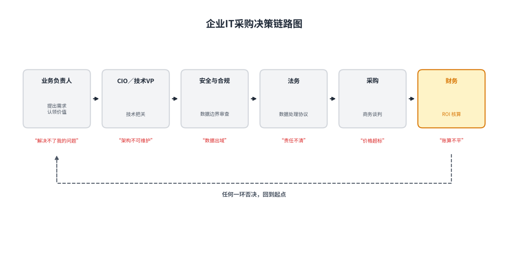
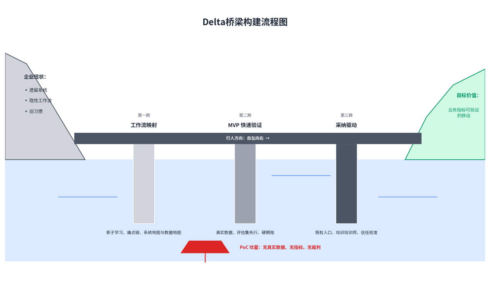
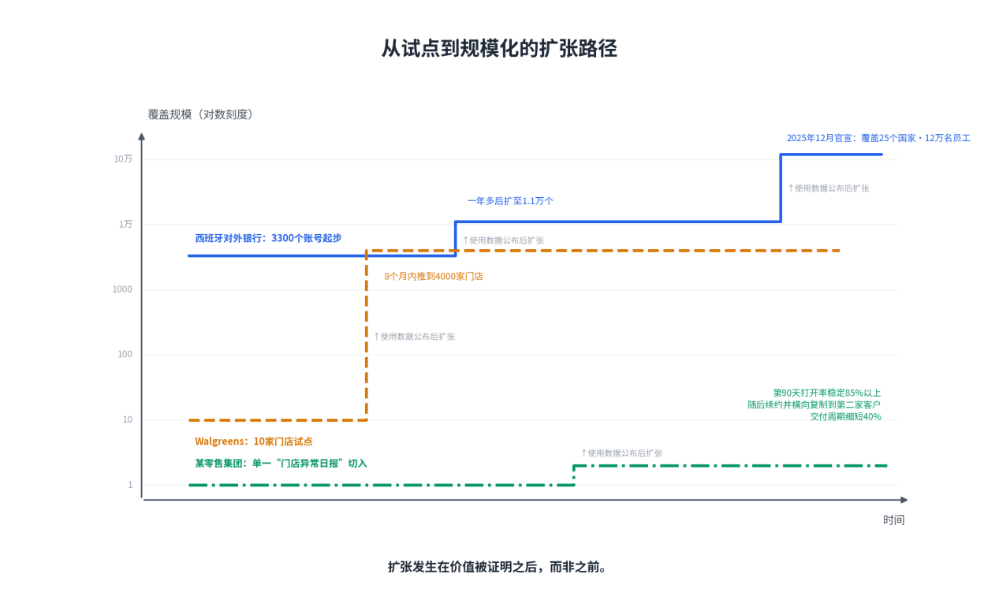
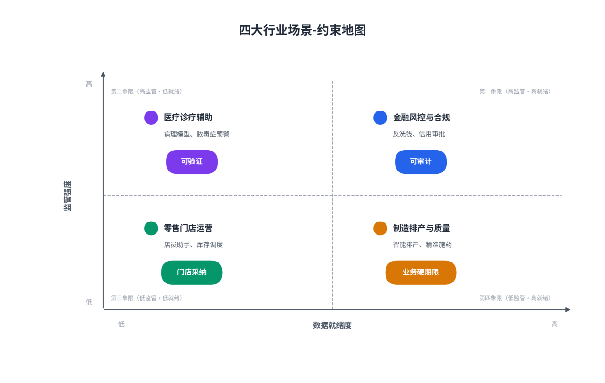

# 第11章企业IT场景

**【本章导读】**

企业IT是FDE模式的主战场，也是这套方法论约束最强、回报最实的一块土壤。本章回答三个问题：企业级IT在价值逻辑、决策链路与技术底座上，与消费互联网有哪些根本差异，这些差异如何规定人工智能交付的打法；FDE如何在企业“今天的现状”与“价值真正发生的状态”之间的差异带上，搭建一座可通行的桥梁；金融、制造、医疗、零售四个行业里，这座桥分别架在什么样的河床上。本章面向企业CTO、技术VP与IT总监：无论你坐在采购桌的哪一侧，读懂对方的决策语法，都是项目活过第一年的前提。

## 11.1 企业级IT特征

### （1）业务价值导向

消费互联网产品的北极星指标是用户规模与使用时长；企业IT的计价单位是业务结果。一套企业系统存在的理由，必须能被翻译成一个业务指标的移动——工时节省、错误率下降、周转时长压缩、资金占用减少。翻译不出来的系统，技术再先进，在财务报表里也只是一项成本。麻省理工学院NANDA实验室2025年发布的《生成式人工智能的鸿沟》报告称，全球企业过去三年在生成式人工智能上投入三四百亿美元，其中95%的项目没能产生任何能写进财务报表的价值。这95%的死因里，模型能力不足排不到前面；排在前面的是同一个结构性缺陷——立项时就没有人认领价值。

解剖这类失败项目，病理高度一致：立项由信息部门牵头，业务部门无人署名；验证在样例数据上跑出漂亮指标；演示会大获成功；真实数据接进来之后使用率阴跌；最后在某个预算季被连根拔掉。整条链上没有一个环节是技术失败，每一环都是价值归属的失败。业务价值导向因此不是一句口号，而是一道开工前的硬检验：这个系统解决的业务问题，有没有一位愿意押上自己信誉的业务负责人？

成熟企业已经把这道检验制度化了。家居零售商Lowe’s规定：每个人工智能项目必须落入“顾客怎么买、门店怎么卖、员工怎么干活”三类之一，且必须有高级副总裁级的业务负责人背书——“他们不入局，我们就不做”。电商公司得物的做法更进一步，把万人规模公司的人工智能转型拆成三步：第一步跟全员达成共识，降低工具门槛，让所有人先用起来；第二步把企业场景按容错空间分成四象限，容错空间大的场景优先交给人工智能；第三步设专门的知识运营小组，钻进业务团队里，把专家的隐性经验搬到人工智能可见的空间。共识、场景、知识——顺序不能反：先有人愿意用，再挑对的地方用，最后让人工智能有米下锅。这两家公司的制度细节不同，底层判断是同一个：企业IT项目的所有权必须长在业务侧，技术侧只负责让它成立。

### （2）ROI驱动的决策逻辑

企业采购不是一次点击，而是一条多角色决策链。业务负责人提出需求并对结果负责；首席信息官（Chief Information Officer，CIO）或技术VP行使技术否决权；安全与合规部门审查数据边界；法务谈判数据处理协议；采购部门压缩价格；财务部门核算投资回报。链条上任何一环都有否决权，却没有一环能单独拍板通过。企业软件九到十二个月的销售周期，耗掉的主要是这条链的接力时间，而不是技术评估时间。

图11-1：企业IT采购决策链路图

投资回报率在这条链上扮演双重角色：既是准入证，也是紧箍咒。立项时，算得清账的项目才能获得预算——这就是为什么老练的团队把“什么叫成”定义在开工之前，把价值靶子写进立项文件。运营期，账单随用量增长，财务的审视同步变严：如果价值叙事跟不上账单增长，“成功”本身反而会成为续约障碍。主动把价值账算给财务负责人看的团队，谈的是明年怎么扩；被叫去解释账单的团队，谈的是要不要砍。

价值怎么算，是一门需要先建的基础设施，三条纪律缺一不可。其一，从第一天就采集基线——没有改造前的数据，就没有改造后的价值证明，而基线只在项目启动那一刻存在，错过永不再来。其二，指标必须与客户共建——客户不认的指标，算出花来也没有谈判效力。其三，克制指标数量——每个客户三到五个核心指标足矣，指标一多，就等于没有指标。

指标克制到什么程度，两份参考材料存在口径分歧。Cognition部署工程负责人Jia Wu主张把指标拆成三层：智能体的活动量、项目交付周期、被合并的拉取请求——三层分开，才能定位瓶颈卡在哪一层；另一种观点则强调对外呈现的指标必须收敛到个位数。两种观点各有支持者，本书采纳“内外分账”的折中：对客户与管理层呈现三到五个业务指标，克制是谈判纪律；工程团队内部用分层指标做诊断，颗粒度是排障工具。对外算大账，对内拆小账，两者并不矛盾。

最后，企业侧的决策者正在形成一种新的警觉。咨询行业一位战略官在面向CIO的科技媒体上提醒：“这个模式里最有结构性的问题，是前线部署的成本到底谁在付——这是CIO该问、但大多没问的问题。”高德纳（Gartner）的分析师则预测，到2028年，70%的企业将因供应商成本过高与内部技能空心化，被迫放弃由前线部署工程师主导的方案（媒体报道中分析师个人观点的口径）。这条预测应该被写进每一个企业IT负责人的谈判清单：接受FDE模式的同时，必须把知识转移、内部团队建设与退出机制写进合同——Anthropic与FIS的合作把“让FIS未来能独立构建和扩展自己的智能体”写进官方声明，正是对这种警觉的预防性回应。判断一笔FDE投入是否划算的标准，不是供应商在场时系统多好，而是供应商撤场后系统还在不在创造价值。

### （3）遗留系统的集成挑战

企业IT与消费互联网在底座上的最大差异，是历史。每个企业IT负责人都面对一批遗留系统（Legacy System）：在企业里运行多年、承载核心业务、没人敢动的老系统——金融业的老式大型机、医疗业数百家诊所的异构系统、制造业几十套各自为政的车间系统。这些环境的共同点：文档过时、接口残缺、懂它们的人已经退休了一半。风投机构a16z在《Trading Margin for Moat》里点破了本质：人工智能需要的上下文——历史记录、业务逻辑、权限体系——全部锁在企业内部，连接它们“从来都不是选择题，而是必修课”。

这场集成大战的第一个战略要点，是把集成当战役打，不当杂务办。集成工作在多数项目计划里被写成一行“系统对接：两周”，然后在执行中膨胀为四个月。错误的根源是把集成当技术杂务——它其实是技术考古、组织政治与数据治理的混合物。正确的姿势：进场尽调时就画出系统地图，把集成风险分级排期，最硬的骨头最早啃——集成的不确定性最大，每推迟启动一天，整个项目的时间表就裸奔一天。

第二个要点：数据问题先于模型问题解决。大量人工智能项目失败的底层原因是“垃圾进垃圾出”——接入了未治理的数据源，同一个文档十个版本随机命中，输出自然不可信。Palantir的解法是本体：先把企业的数据资产建模成带业务语义的层，厘清“哪个字段权威、哪个版本有效、谁有权看什么”，人工智能在这层地基上运行。数据治理贯穿项目始终——很多人工智能项目干到最后，主体工作其实就是治理。美国海军的“造船操作系统”是最壮观的注脚：2025年12月宣布的4.48亿美元合同，覆盖两家大型造船厂、三个海军船坞和一百家供应商；造船业的数据环境是企业资源计划系统、几十年前的数据库与纸质图纸并存的教科书级灾难，而试点阶段，通用动力电船公司的潜艇排产计划从160个人工小时压缩到10分钟以内，朴茨茅斯海军船厂的物料审核时间从几周压缩到一小时以内。先花大力气把数据接进统一的语义层，效率奇迹才可能发生——顺序不能反。

第三个要点是2025年后的新变量：集成工作本身开始被人工智能自动化。没有接口的老系统，用浏览器智能体模拟人去取数；字段映射、格式转换、接口文档解读，大量交给模型处理。Cognition的公开案例里，巴西数字银行Nubank一项原本投入约50名工程师的数据迁移，智能体参与后按公司口径在约三分之一时间内完成；另一家拉美大型银行的税务识别系统迁移，包含COBOL（长期用于银行、保险和政府批处理系统的编程语言）与大型机批处理作业控制语言，所需人力约减少一半。用人工智能来干人工智能部署的活，是这个岗位最妙的复利。

第四个要点最反直觉：知道什么时候绕开，而不是攻克。不是所有遗留系统都值得正面集成，工程师的自尊心总想攻克每一座堡垒，而FDE的判断力恰恰体现在选择战场——项目要的是客户结果，不是技术全胜。实践中沉淀下来的处置模式有四种，适用条件与代价各不相同。

表11-1：遗留系统集成的四种模式对比

| **模式** | **做法** | **适用条件** | **主要代价** |
| --- | --- | --- | --- |
| 正面集成 | 建管道直连源系统，实时读写 | 系统尚有维护方、接口可扩展、数据价值密度高 | 工期长、政治成本高、需长期维护 |
| 影子读取 | 只读快照、夜间同步，不写回 | 源系统脆弱不敢碰、读多写少 | 数据有延迟、只读场景受限 |
| 人工摆渡 | 过渡期保留人工环节搬运数据 | 数据量小、频次低、自动化得不偿失 | 人力持续投入、易出错 |
| 宣告隔离 | 明确告知客户该数据不在项目范围内 | 系统濒临淘汰、接入成本超过价值 | 范围让步，需管理客户预期 |

四种模式没有高下之分，只有适配与否。错误的不是选了“人工摆渡”，而是该隔离的系统正面强攻、该强攻的系统绕道拖延——项目排期的失控，大多源于集成模式的选择错误，而非执行不力。

## 11.2 FDE的“Delta桥梁”构建

企业现状与目标价值之间的距离，本书称之为差异带（Delta）。在企业IT场景里，差异带的河床由三段构成：工作流不明——真实的业务流程从未被完整记录；价值未证——没有人见过这套系统在本企业真实数据上成立；习惯不改——用户的旧工作方式纹丝不动。FDE在这座差异带上架桥，桥梁恰好是三跨：先把真实工作流映射出来，再用最小代价验证价值真实发生，最后驱动组织完成采纳。三跨顺序不可调换——没映射就验证，验证的是想象中的场景；没验证就推采纳，推广的是未兑现的承诺。

图11-2：Delta桥梁构建流程图

### （1）工作流映射与痛点识别

工作流映射的基本功是影子学习：坐在真实用户旁边，看他过完真实的一天。最有价值的发现往往来自“看”，而不是“问”——用户说不清自己的工作流，因为真正的流程从来不在文档里。OpenAI的FDE团队在约翰迪尔项目里就是这么做的：飞到爱荷华州，跟着农艺专家和农场主下地，看他们如何做施药决策、哪些信息真正进入决策、农时这道硬期限如何支配一切。他们要打掉的那个旧流程，原本是农艺师挨家挨户打电话给农户、口头给设备使用建议——这种工作流不会出现在任何文档里，只有下地才看得见。一个中国人工智能创业团队的复盘给出过镜像样本：两名工程师、一名行业顾问进驻一家区域连锁零售集团，前两周没写一行代码，跟着区域经理巡店，发现经理们根本不看公司数据系统里的报表——他们真正信任的数据源，是门店店长每天手填的一张表，因为“系统的数据晚三天，还老错”。这个发现直接推翻了最初的“智能数据分析平台”大方案，项目被收窄为一个小切口：每天早八点，把3000家门店的异常信号汇总成三分钟可读完的日报，推到区域经理的微信里。

从业者中有句被反复引用的箴言，说的就是这套方法的发现对象：“难的是找到那个没人写进文档的工作流、人们真正信任的那个数据源，以及知道流程为什么是那样的那个人。”三样东西，每一样都只能在现场找到。

影子学习的产出不是散点观察，而是一条痛点链。企业里的痛点从不孤立存在，它们连成因果链：系统的数据晚三天，所以经理手工做表；手工做表，所以周报滞后；周报滞后，所以督导失效；督导失效，所以3000家门店的异常没人及时处置。链条上任取一环都是痛点，但只有一环能撬动全链——找到它，就找到了项目的着力点。零售案例里，撬动点不是“让系统数据更准”这种宏大命题，而是“把异常信号每天早八点送到经理手上”这个小切口。得物的知识运营小组干的是同一类工作：钻进业务团队，把专家的隐性经验从个人脑子里搬到人工智能可见的空间——隐性经验被显性化的那一刻，工作流才真正成为可计算的对象。

工作流映射通常在进场尽调阶段完成，与系统地图、数据地图的绘制同步进行，周期一到两周，业务侧与技术侧分头进行、每日对表。它看起来像纯成本，但账要这么算：两周尽调省下的，是三个月在错误战场上的狂奔。对企业IT负责人而言，这一阶段有一个可执行的验收标准：供应商交上来的不是一份功能清单，而是一张标注了痛点链、权威数据源与关键人物的工作流地图。

### （2）MVP的快速验证与迭代

工作流地图画好之后，下一个动作是以最小代价验证价值真实发生。这里需要引入一个本书首次使用的概念：最小可行产品（Minimum Viable Product，MVP）——用最小工程投入做出可运行的产品形态，验证产品假设是否成立。读者应将它与最小可行部署（MVD）对照理解：MVP验证的是产品假设，回答“这个东西有没有人需要”；MVD验证的是部署价值，回答“它在真实环境里能否创造可测量的业务结果”。前者面向的是不确定的市场，后者面向的是一个具体的、真实数据可及的企业客户；前者成立不一定后者成立——消费级产品验证过的假设，到了某家银行的合规环境里可能完全失效。

表11-2：MVP与MVD的概念对照

| **维度** | **最小可行产品（MVP）** | **最小可行部署（MVD）** |
| --- | --- | --- |
| 验证对象 | 产品假设：需求是否存在 | 部署价值：结果是否真实发生 |
| 运行环境 | 可控环境、样例数据即可起步 | 客户生产环境、真实业务数据 |
| 成功标准 | 用户愿意持续使用 | 业务指标出现可测量移动 |
| 典型场景 | 新产品从0到1 | 企业人工智能项目立项验证 |
| 失败含义 | 假设错误，转向或放弃 | 价值未证，停止投入、及时止损 |

在企业IT场景里，MVP的形态与节奏已经被压得很扁。Palantir的训练营把验证做成流水线：客户带着真实数据来，一到五天做出能部署的原型；客服智能体公司Sierra公开的客户数据显示，从启动到上线最快不到两周、最慢六周；Decagon能把简单场景的部署压到15天；票务平台Vivid Seats与Sierra合作，从启动到上线不到四周；DoorDash与外部专家团队用八周完成从方案设计到部署；前述零售案例把验证期定为六周硬期限。把周期压到以周计，靠的不是工程师加班，而是严格的范围纪律与复用的交付资产。

表11-3：MVP快速验证的六周节奏表

| **周次** | **核心动作** | **出口标准** |
| --- | --- | --- |
| 第1周 | 接入真实数据，采集改造前基线，与客户共建评估指标 | 数据管道跑通，基线与指标双方签字确认 |
| 第2—3周 | 搭建最小闭环，端到端跑通单一场景 | 系统在真实数据上产生输出，不追求正确率 |
| 第4—5周 | 对照评估集快速迭代，修复高频错误模式 | 核心指标达到立项时约定的门槛 |
| 第6周 | 价值复盘与去留决策 | 客户业务负责人确认价值成立，或体面止损 |

这张节奏表里最不可妥协的元素有三个。第一是真实数据：客户必须带自己的真实业务数据进场——在假数据上成立的方案，上线那天就会遇到文档里不存在的字段，而那时候已经付了真价钱。第二是评估集先行：先建考题，再训练系统。摩根士丹利的做法是从三个具体场景起步，让理财顾问和工程师逐条给模型输出打分，分数直接回流到迭代里，此后每天把旧考题重跑一遍，防止模型悄悄退步——质量下滑在抵达一线顾问之前就被拦截（待核实）。约翰迪尔项目同样把“评审数百个真实作业案例”放在建模之前，“化学品使用减少最高70%”这个数字不是事后包装的宣传口径，是开工前就与农艺专家共同定下的靶子。第三是硬期限：验证期的意义在于暴露不确定性，期限一松，验证就漂向不可证伪的“探索”——无期限、无指标、无裁判的试点，做着做着就死了。

验证通过之后，迭代才刚刚开始。客服软件公司Intercom的人工智能客服产品，第一代平均只能解决23%的会话，更换底层模型后升到51%，深度定制后最高做到86%；Anthropic自用的客服系统持续调优，解决率升到79%，每月解决约56万次会话；Salesforce把自家客服智能体调了整整一年，“答不上来”的比例才从三成压到一成以下。这组爬坡曲线揭示了MVP方法论容易被忽略的后半句：快速验证买到的是起点，不是终点——价值曲线是用评估集一轮一轮喂出来的，没有评估体系看护的迭代，只是在原地抖动。

### （3）采纳驱动的实战技巧

桥梁的最后一跨是采纳，也是死亡率最高的一跨——“员工不愿采用新工具”在企业人工智能项目失败原因里排第一。采纳工程的总原则只有一条：顺从旧习惯，而不是要求新习惯。如果业务用户的核心动作发生在表格和邮件里，系统的界面就应该出现在表格插件和邮件里，而不是要求用户登录一个崭新的门户。OpenAI在西班牙对外银行从12万员工已有的ChatGPT界面切入，而不是另起炉灶；Lowe’s把店员的人工智能助手直接装进他们手里已有的手持终端，语音就能问商品、问库存，项目负责人把设计纪律说成一句话：“不在卖场地板上待过，就没法为门店团队做设计。”

企业场景的采纳引导，本质上是一场“人传人”的组织工程，成熟实践沉淀为一组可复用的技巧。

表11-4：采纳驱动的实战技巧清单

| **技巧** | **做法要点** | **代表案例** |
| --- | --- | --- |
| 从既有入口切入 | 借用户已在用的界面进场，不新增登录与门户 | 西班牙对外银行从既有ChatGPT界面切入；Lowe’s装进手持终端 |
| 分层培训 | 管理员深度培训；普通用户场景化培训30分钟封顶；高管一句话培训 | 各企业通用结构 |
| 培训培训师 | 培养客户内部讲师，官方认证加专属支持通道，撤场前完成移交 | Anthropic与FIS把知识转移写进合作目标 |
| 影响者经营 | 请无冕之王第一批试用，采纳其建议并显性化署名 | Jamf推广中“推动最广泛采用的不是工程师” |
| 信任校准 | 出错后48小时内修复并公开致谢报错者 | 零售案例接入促销日历化解误判吐槽 |
| 先副驾驶后自动 | 高风险动作保留人工把关，拿一点采纳率换风险可控 | 约翰迪尔保留农艺师终裁权；医院系统提示、医生裁决 |
| 文档以任务组织 | “如何处理一笔异常退款”，而非“退款模块功能说明”；嵌入产品就地出现 | 企业通用标准 |

这套清单里有两条值得展开。其一是“培训培训师”的杠杆：FDE团队终将撤场，培训工作必须在撤场前移交，识别客户组织里的热情分子，把他们培养成内部讲师与答疑人。西班牙对外银行推12万人上线时，靠的不是厂商的培训团队，而是一张全行的“人工智能先锋网络”和一批被同事称为“人工智能极客”的高级用户；埃森哲与Anthropic的合作则是另一个量级——三万名顾问接受系统培训，再把这支队伍带进自己的客户。结构是同一个：厂商真正要培训的只有一类人——会去培训别人的人。其二是信任校准的速度纪律：系统上线第一周几乎必然出错，出错本身不致命，致命的是响应迟缓。零售案例里，系统把两家门店的促销高峰误判为“异常激增”，团队在48小时内把促销日历接入判断逻辑，并在群里公开致谢报错的那位经理——两周后，日报的自然打开率稳定回升。信任要以季度为单位慢慢攒，但48小时的响应能让它不在第一周就塌方。

采纳的终点，是把供应商从系统里拿走。Cognition的部署工程方法论把这一点讲得最透：找到场景之后，要把智能体接入事件与告警，让它自动响应，而不是依赖工程师每天手工触发——“把自己从任务里自动化掉”。真正完成的标志，是客户自己的事件能够稳定驱动系统，结果进入原有工程流程。这同时是对企业IT负责人的验收提示：如果三个月后仍必须由同一个供应商工程师登录、复制提示、点击启动，你买到的不是部署，是续费。组织变快比个人变快更难也更有价值——只有把人工智能接入积压管理、代码审查、发布节奏这些组织流程，并让技术与非技术参与者都能看见和信任结果，个体速度才可能转化为组织速度。

## 11.3 各行业FDE实践

同一座桥梁，架在不同行业的河床上，桥墩的打法各有侧重：金融业的河床是监管，制造业的河床是物理世界的硬期限，医疗业的河床是性命攸关的可验证性，零售业的河床是高度分散的门店网络。以下四个行业剖面，案例全部来自公开可查的真实部署。

表11-5：四大行业FDE实践总览

| **行业** | **代表企业与场景** | **FDE关键打法** | **公开成效** |
| --- | --- | --- | --- |
| 金融 | FIS×Anthropic：金融犯罪侦测智能体 | 工程师嵌入共建、可审计设计、知识转移写入合同 | 反洗钱调查从数小时压到数分钟，首批落地蒙特利尔银行等 |
| 金融 | 摩根士丹利：理财顾问助手 | 评估集先行、顾问逐条打分、每日回归 | 质量下滑在抵达一线前被拦截（待核实） |
| 制造 | 空客×Palantir：A380燃油泵故障排查 | 传感器数据接入平台、现场两周破案 | 原需24个月的问题两周定位；Skywise平台接入上万架飞机 |
| 制造 | 约翰迪尔×OpenAI：“看见即喷”精准施药 | 下田影子学习、评估体系先行、按启用英亩订阅 | 化学品使用减少最高70%，农户互动提升6倍 |
| 医疗 | 坦帕综合医院：脓毒症预警中心 | 供应商工具被停用后在平台上自建、医生终裁 | 截至2025年中挽救569条生命（待核实），住院时长缩短三成 |
| 医疗 | 瑞金医院×华为：RuiPath病理大模型 | 联合打造、百万级切片训练 | 16张GPU两个月完成训练，数据准备周期缩短80% |
| 零售 | Walgreens×Palantir：门店运营工作流 | 训练营验证、10店试点后全网推广 | 试点提效30%，八个月推到4000家门店 |
| 零售 | Lowe’s：店员人工智能助手 | 装进既有手持终端、SVP级业务背书制 | 铺到1700多家门店，累计回答逾500万次提问（待核实） |

图11-3：从试点到规模化的扩张路径

图11-4：四大行业场景－约束地图

### （1）金融行业：风控与合规场景

金融业是FDE模式密度最高的行业，原因有两个：预算厚，且合规门槛挡住了自助式软件。风控与合规是它的两个标志性场景，打法要点各不相同。

合规场景的标杆是Anthropic与金融科技基础设施巨头FIS的共建。FIS服务着全球银行的核心系统，2026年5月发布金融犯罪侦测智能体，首批客户是蒙特利尔银行和Amalgamated银行。这个智能体把反洗钱调查从数小时压缩到数分钟：跨银行核心系统自动汇编证据、按风险排序呈交调查官、全程可审计可追溯。打法上四个动作环环相扣：嵌入而非交付——Anthropic派应用人工智能团队与FDE直接嵌入FIS，与FIS的专家共同设计，而FIS不是终端客户，是渠道级伙伴，智能体将随FIS的产品进入它背后的数百家银行；知识转移作为卖点——官方声明写明目标是“让FIS未来能独立构建和扩展更多智能体”；可审计性作为产品特性——金融合规场景下，监管要求每个决策可回放，“完全可审计、可追溯”被做成核心卖点而非附加功能；生态放大——案例发布同日，配套连接器与“拿来即用”模板同步推出，单个案例立即被抽象为可复制的产品资产。这给所有受监管行业一个模板：别人眼里的合规成本，可以是你的定价理由。

风控与投研场景的要点是评估先行。摩根士丹利从三个具体场景起步，让天天用系统的理财顾问给输出逐条打分，并用每日回归守住质量底线（待核实）。花旗银行把客户信用审批从几小时压到几分钟——人工智能一口气读完信用史、交易习惯、行业风险与关联企业；房贷巨头房利美用人工智能识别抵押贷款欺诈，检出率超过99%，远超原来的规则系统。三个案例的共同前提依然是：先把散乱的金融数据归置成机器能理解的语义层，智能才有地方落脚。

金融业还有一条中国式注脚。本土服务商把FDE模式搬进对合规最敏感的金融业时，沉淀出三阶段方法论：场景诊断一到两周（识别价值最高的三到五个核心场景、量化投资回报）→嵌入式交付八到十六周（从模型选型到生产集成）→生产部署与持续演进，同时强调“数据不出域”。对金融机构的技术负责人而言，这条经验可直接复用：诊断、交付、演进分阶段验收，每个阶段设明确出口标准，比一揽子合同更可控。

### （2）制造业：智能排产与质量预测

制造业的人工智能价值密度极高，但约束也最硬：它打交道的不是信息世界，而是物理世界——船期、农时、产线节拍，全是不可商量的硬期限。

排产场景的壮观样本是美国海军的造船操作系统：潜艇排产计划从160个人工小时压缩到10分钟以内，物料审核从几周压缩到一小时以内。这组数字的启示不在速度本身，而在顺序——先把企业资源计划系统、几十年前的数据库与纸质图纸归置进统一的语义层，奇迹才发生。质量与故障预测场景的祖师级案例是空客：图卢兹工厂里，A380的一个燃油泵故障反复发作，空客自己的工程师查了两年没有头绪；Palantir的人进场，把传感器数据接进平台，两周破案——飞机爬升时燃油晃离了泵体。空客数字化负责人后来公开感慨：“同样的问题，我们以前要花二十四个月。”空客从此把自家数据平台Skywise整个建在合作方平台上，接入上万架飞机、五万多用户，如今有一百五十多家航空公司跑在Skywise上——客户变成了渠道。

智能农机场景展示了制造业打法的完整链条。约翰迪尔要解决的是杂草防治：传统喷药机整田覆盖，成本高、药害重；它的“看见即喷”技术用36个摄像头加机器视觉，在时速12到15英里的行进中只喷杂草，一分钟覆盖三个足球场的面积。OpenAI的FDE团队飞到爱荷华州下田，跟着农艺专家理解工作流与农时约束，与专家一起评审数百个真实作业案例，把“什么是好的施药建议”编码成定制评估体系，然后才开始迭代模型。最终结果：化学品使用量减少最高70%，农户的互动频率提升6倍；收费方式也与价值对齐——不按设备一口价，按实际启用技术的英亩数订阅计费（订阅计价细节为厂商单源口径，待核实）。

把三个案例并排，制造业的三条纪律浮现出来：其一，节奏服从业务节律而非项目排期——农时窗口错过就是一年，船期延误按天计费；其二，评估体系先于模型优化——靶子是开工前与领域专家共同定下的；其三，数据语义层是前置投资——没有它，传感器、排产与图纸数据只是一堆噪声。

### （3）医疗行业：患者预测与诊疗辅助

医疗是价值最重的行业，也是容错最低的行业。这里的FDE实践有一个共同的架构选择：系统提示、医生裁决——人工智能负责把信号更早地送到医生面前，最终决策权始终留在医生手里。

患者预测场景的样本是美国坦帕综合医院。这家医院曾与一家供应商共建脓毒症（一种可致命的全身感染反应）预警工具，工具被美国食品药品监督管理局（FDA）归类为受监管的医疗器械，被迫停用。换作一般客户，故事到此结束；而坦帕综合的选择，是在数据平台上自己动手重建，由首席数字与创新官牵头。到2025年年中，这套自建的脓毒症中心已经挽救569条生命，脓毒症患者的住院时长缩短了三成（待核实）。同一家医院在血液供应商遭到网络攻击时，用平台在几个小时内搭出一个血液库存调配应用，随后交给佛罗里达州供其他医院复用。该院首席数字与创新官在行业大会上的表态，可以当作医疗客户对交付速度的定价：“我们能用几小时、几天解决问题，而不是几个月、几年。”他同时承认平台价格有溢价，“但这溢价值得”——周级的节奏，买的从来不只是快，而是出事当晚手里就有工具的确定性。

诊疗辅助场景的中国样本是上海瑞金医院。2025年2月，瑞金医院发布临床级病理大模型RuiPath，与华为联合打造：16张GPU卡、两个月，完成百万级病理切片的训练，数据准备周期缩短80%。病理是中国医疗资源最紧缺的领域之一——医生缺口巨大，基层医院初诊符合率低——这套模型覆盖了中国每年约九成癌症发病人群罹患的癌种。院长宁光在发布会上的表态，是医疗行业FDE实践的前提条款：“我们只用经得起验证的技术。”

医疗场景的两条纪律由此成立。第一，可验证性是准入证：医疗人工智能的每一个输出都要能给出证据链，“经得起验证”不是修辞，是采购条件——这与金融业的“可审计”异曲同工，只是医疗的验证标准是临床意义上的。第二，数据敏感决定了部署形态：患者数据不出院、训练在本地完成、分级授权访问，这些约束不是障碍，而是架构设计的输入条件。医院技术负责人评估供应商时，可以直接把这两条写进招标书：证据链能力演示前置，数据边界条款先定于商务谈判——顺序反了，项目大概率死在安全审查环节。

### （4）零售行业：智能客服与库存管理

零售业的组织形态决定了它的人工智能打法：成千上万的门店是高度分散的末梢，总部系统与门店现实之间永远隔着一层。FDE在零售行业的核心命题，是把智能送到卖场地板上。

门店运营场景的扩张样本是连锁药房Walgreens：先在10家门店试点，店内运营效率提升30%，然后八个月内推到4000家门店，人工智能驱动的端到端工作流每天自动处理原本要人工做出的约3840亿次决策。库存调度场景的对照样本是快餐连锁Wendy’s：全北美6450家门店的糖浆缺货调度，过去要15名员工查上一整天，接入数据平台后五分钟出方案。店员赋能场景的样本是Lowe’s：助手装进既有手持终端，铺到1700多家门店，累计回答逾500万次店员提问（待核实），其高级副总裁级业务负责人背书制保证了场景始终锚定在卖场真实问题上。

智能客服场景，票务平台Vivid Seats与Sierra的合作是完整剖面：产品、客户体验、工程三个团队全部压上，从启动到上线不到四周，上线后问题解决率提升40%，客户满意度提升35%。更有价值的是后续变化：常规问题被智能体接走后，客户体验团队从“排队灭火”转向根治流程问题；对话数据开始反哺产品——“如果一个月有一万人问同一个功能，我们就能立刻把它排上优先级”。得物的三步走（共识、场景、知识）则展示了零售业态在万人规模组织里的采纳工程：先降门槛，再挑场景，最后靠知识运营小组搬运专家经验。

零售行业的节奏纪律可以概括为一句话：扩张发生在价值被证明之后，而非之前。10家店跑通再谈4000家，单一痛点日报打开率站稳85%再谈续约与横向复制——每一个台阶都由上一个台阶的使用数据铺成。零售企业技术负责人最容易犯的错误，是把“全网推广”写进立项书：门店网络的采纳是逐层发生的，试点店的区域经理、门店店长、一线店员，每一层都要亲眼见到价值，才会把系统当成自己的工具。

四个行业走完，共同的结构清晰可辨：找准一个高价值场景，在差异带上架桥，用可审计的价值证据逐层扩张。行业知识决定FDE进场的位置，方法论决定它能活多久。对企业CTO与技术VP而言，本章的清单可压缩为立项会上的三个问题：这个项目的业务负责人在不在这个房间里？它打算用谁的真实数据、在哪道硬期限之前证明价值？供应商撤场之后，系统由谁接手？三个问题都有答案的项目，才值得进入预算。
