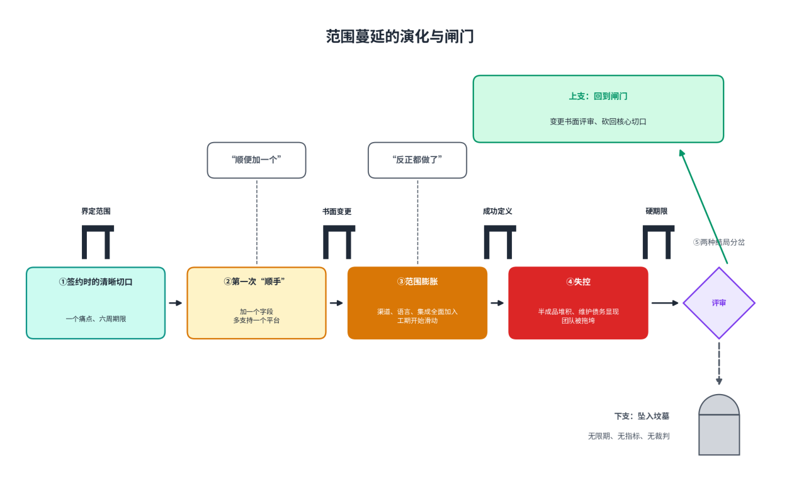
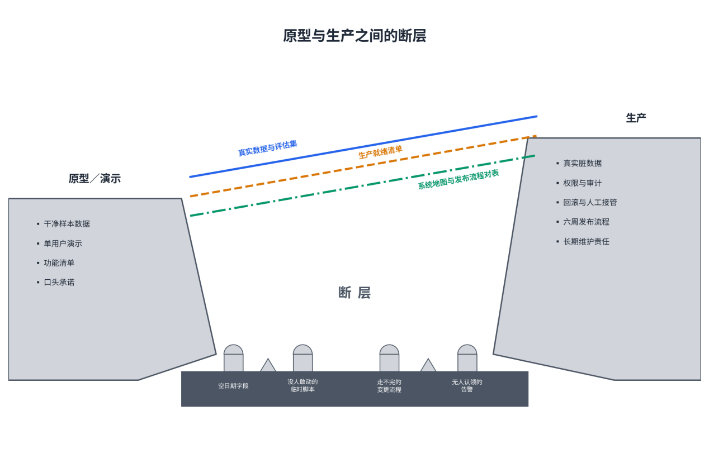
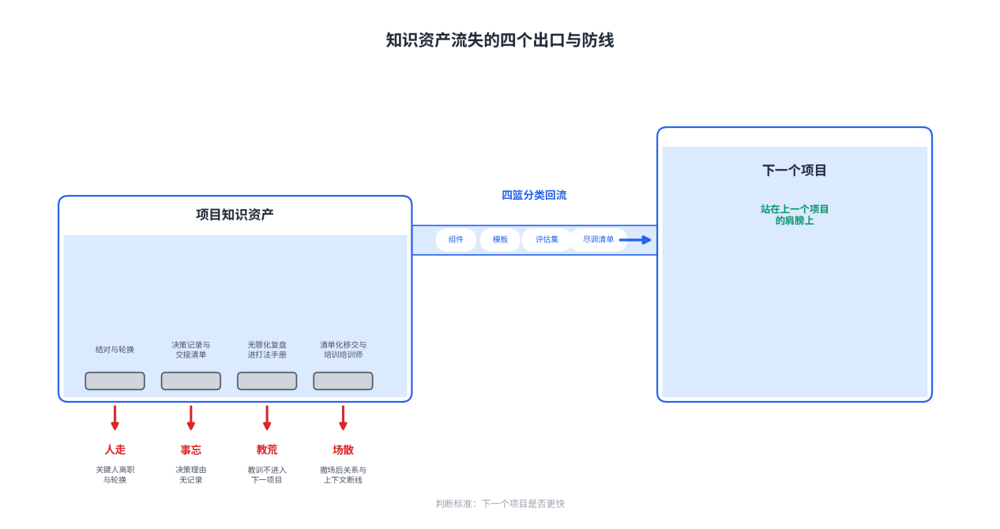

# 第12章FDE常见陷阱与应对策略

**【本章导读】**

一套方法论的价值，一半在告诉人们怎么做对，另一半在标明哪里会做错。本章是一部避坑手册：把一个FDE项目的生命周期切成三段——启动、执行、交付与持续运营——逐段解剖九个高发陷阱。每个陷阱按同一结构展开：真实的失败案例、可观察的症状、可执行的应对策略；章末收束为一张十大避坑清单，供立项评审、月度检视与撤场检查对照打钩。本章适合FDE团队负责人、交付管理者与企业信息化决策者阅读；对于正在评估是否引入FDE服务的甲方读者，这份清单同样是一张供应商成熟度的试纸。本章可以顺序读，更可以当检查表用：立项前对照第一节，执行中对照第二节，撤场与续约季对照第三节。

## 12.1 项目启动阶段的陷阱

失败解剖学有一个反复被验证的发现：多数项目的死期在签约那个月就定好了，后面的月份只是走流程。启动阶段陷阱密度最高，是因为此时埋下的病因——错误的期望、缺席的人、失真的数据——在执行阶段几乎无药可救，只能以更大的代价爆发。

### （1）“万能AI”的期望管理

期望失控是企业人工智能项目的第一块墓地，墓碑上往往刻着同一段剧本：演示惊艳，高管当场拍板，合同数百万美元——九个月后，项目悄无声息地死了：验收单上的功能一项不缺，发票一张不欠，唯独找不出一个还在真正使用它的业务部门。行业调研给出的统计形状是：被调研的企业生成式人工智能项目，约95%没有产生可衡量的财务回报。期望与现实的裂缝来自三个放大器的合流：演示里精心挑选的样本、财经媒体日日翻新的叙事、董事会上“我们的人工智能战略是什么”的追问——三者共同制造一种错觉：人工智能已经无所不能，剩下的只是采购。

期望失控有两种典型死法。一种是期望没有落成衡量标准：项目人人称好，唯独无人能答“好由什么标准衡量”，于是它在汇报材料里一年年“持续推进中”，直到某个预算季被悄悄撤下。另一种是期望在双方之间错位：供应商以为“智能体已上线”就是成功，客户以为“所有客服都应被替代”才算成功。把错位落到纸面上才有解：成功标准必须在最早的对话里就写成文字——做到什么算成，什么情形明确不算这一阶段的任务——书面标准防的不是恶意，而是几个月后双方记忆的各自美化。

把期望管理从公关动作改造成工程动作，核心是四件事。其一，立项前过三关：是不是一个具体的人的具体的痛？解决它值多少钱？以现有的数据现状能做到几分？三关过不了，期望本身不成立。其二，把期望写成可验证的结果合同：对象、行为、基线、目标、时间与边界，外加反指标——自动解决率上升但投诉与返工同步上升，不算成功。其三，演示纪律：用客户的真实数据演示，并主动披露能力边界——靠隐瞒边界换来的合同，会在验收时连本带利讨回来。其四，管住内部放大器：前端销售为卖产品许下的过度承诺，最后都要交付团队来还——供应商内部必须让“说不能”的人拥有否决权。

表12-1：期望管理校准表

| **常见期望误区** | **典型说法** | **现场现实** | **校准动作** |
| --- | --- | --- | --- |
| 人工智能什么都能做 | “先全面铺开，覆盖全公司场景” | 开场就要覆盖所有场景的客户，往往一个场景都没准备好 | 收窄到单一痛点，咬穿一口再咬下一口 |
| 演示能力等于生产能力 | “演示都通过了，直接上线吧” | 演示用干净样本，真实环境有空值、旧编码与矛盾答案 | 用客户真实数据验证，评估集先行 |
| 上线等于成功 | “系统上线即验收” | 上线走完的只是行政流程，三个月后还有没有人用才是裁判 | 验收标准写入行为指标：打开率、周活跃 |
| 人工智能会立刻取代人 | “三个月内裁掉一半坐席” | 能替代的是任务不是岗位；一步到位推进自动化会触发组织抵抗 | 重设人机分工期望：先副驾驶，再谈自动驾驶 |
| 模型越强项目越成功 | “直接上最新最大的模型” | 规模化路障集中在问题定义与组织现实，“模型不够聪明”并不在列 | 把预算与注意力投向选题、数据与变更管理 |

### （2）关键利益相关方的遗漏

客户是一个组织，不是一个人。买单的、拍板的、天天用的、管安全的、走流程的，对“成功”各有各的定义；任何一类被遗漏的角色，都有能力在最意想不到的时刻单独杀死项目。

一个制造业项目的完整解剖，几乎集齐了所有遗漏形态。第1个月，立项就带病：集团发文要搞人工智能，信息技术部门挂帅，业务条线没有一个人署名——项目从第一天起就没有真正的主人，供应商看见了这个信号，装作没看见，因为合同额诱人。第2到4个月，验证期在样例数据上跑出漂亮指标——客户的安全审查不肯放真实数据，项目经理选择先把东西做出来再说。第5个月，演示会大获成功，验收通过。第6个月起，真实数据接进来，模型开始对着三年前的编码规则给出自洽但错误的答案——自洽，所以更难被察觉；业务部门本来就没人认领，现在更没人愿意收拾。第7到8个月，使用率一路阴跌。第9个月，预算季，没有人发起续约流程，系统在一次例行的成本复盘里被关掉——从头到尾，没有过一场像样的争吵。

这种项目的复盘纪要，死因一栏通常写着“客户组织不成熟”。这是修饰过的失败。诚实的复盘是：高危信号在签约前就亮了两条——没有业务负责人署名，没有真实数据到位——每一条都看得见；死期是第1个月就定好的，后面八个月只是走流程。解剖做到这个深度，“业务负责人署名”和“真实数据到位”才会从尽调的建议项，变成下一次签约的硬门槛。

遗漏的形态不止“没有主人”，还有三种更安静的变体。其一是找错主人：下需求的与承受需求的常常不是同一批人——办公室里要的是全局视图，流水线上要的也许只是少点三次鼠标。其二是遗漏沉默的角色：组织里“问他就行”的人不掌权力却掌握信任，一句“不好使”能让采纳率第二天归零；受损者更要提前识别——系统上线演示那天，业务部门在鼓掌，角落里另一个部门的主管一言不发，他要维护的流程正是被自动化掉的那一套。其三是遗漏程序的角色：采购、法务与安全审查是三道绕不开的闸门，大量技术上成功的项目死在“最后一公里”——合同谈崩、数据协议卡壳、安全问卷填到第四个月——而且死得毫无技术尊严。

应对策略是把“找人”工程化为立项动作：画一张利益相关方地图，标出谁发起、谁买单、谁使用、谁能否决、谁是无冕之王，并记录每人的目标、权限、担忧与成功指标；业务负责人署名、真实数据进场，两条作为签约硬门槛；三道闸门的接口人在项目第一周就位；同步测绘政治地图：方案会让谁失去存在感与权力，提前把那个人的新位置设计出来，而不是等他自己发现死路。地图不是一次性文件——项目期间人员会调动，每季度复核一遍。

表12-2：利益相关方遗漏自检表

| **常被遗漏的角色** | **他们定义的成功** | **遗漏的典型后果** | **自检问题** |
| --- | --- | --- | --- |
| 业务方负责人 | 业务指标改善 | 项目沦为无主之地，预算季无人替它说话 | 他是否在立项文件上署名？ |
| 一线最终用户 | 少一步操作、少一次返工 | 系统照单交付，却无人使用 | 周一早上真正操作系统的人是谁，团队见过他吗？ |
| 无冕之王 | 经验被尊重、判断被采纳 | 一句“不好使”，采纳率第二天归零 | 组织里“问他就行”的人是谁，是否已纳入评审？ |
| 受损部门与岗位 | 存在感与出路 | 消极不配合、传播事故案例、验收投反对票 | 方案自动化掉了谁的流程，给他安排了什么新角色？ |
| 采购、法务、安全 | 程序合规、风险可控 | “最后一公里”翻车：合同谈崩、审查卡壳 | 三道闸门的接口人是否已在项目第一周就位？ |
| 高管赞助人 | 可向董事会交代的成果 | 预算季被整体砍掉 | 更高一层是否有人愿意为项目背书？ |

### （3）缺少真实的评估数据

启动阶段的第三种陷阱，是在失真的数据地基上开工。它的危险在于隐蔽：用样例数据验证的项目，每一步都显得顺利——指标漂亮、演示成功、验收通过——直到真实数据进场，假象一次性结清。

失真有三种形态，一层比一层隐蔽。第一层是来源失真：验证只用脱敏样例或自构造的演示数据。真实数据里的魔鬼都很琐碎：对不上文档的字段、成片的空值、没人记得改过几版的编码——在干净样本上成立的方案，一进生产环境就被这些琐碎击穿，而发现时账单早已付清。成熟团队因此把纪律写成一句话：演示可以脱敏，验证必须真实——写生产代码的人，必须进到客户的基础设施里，碰的是客户的真实数据。

第二层是内容失真：同一个问题，企业内部并存着好几个互相矛盾、各自“正确”的答案。系统遇到答案打架时不会举手提问，只会自行调和——调和不动，就开始编造；而污染源往往只是一份没人下线的旧文档。治本只有一条路：为每个问题确立唯一的权威答案，其余版本限期退役。

第三层是裁判失真：考题由交卷的人自己出。准确率由供应商自报、口径由供应商自定，验收就沦为走形式——没有独立标尺的迭代无法证伪：调上两个星期，系统是变好还是变坏，双方各执一词。裁判失真还有一种隐蔽变体：喂给系统的历史样本里只有被批准的决定、没有被否决的教训，系统学到的就是“怎样把请求写得更像应该通过”——它训练出的是迎合，不是判断。

应对策略围绕一条军规展开：真实数据，没有例外——进场第一周就要摸到客户的生产数据。配套动作有三。其一，先建考题再上线：从真实业务素材里长出标准案例，让业务方逐条打分，此后旧考题每天重跑、新错题每天入库——质量滑坡不会以报错的形式出现，它只是安静地变得不可靠。其二，数据尽调前置：哪份数据被员工真正信任、空值率多少、编码规则有几个版本、同一问题存在几份答案，逐项登记成数据问题清单。其三，把数据通路当作签约前提：要求供应商“先证明能力”、真实数据却一寸不放的流程，买到的验证只能是假象——宁可推迟签约，先解决数据通路。

表12-3：评估数据真实性检查表

| **检查项** | **高危信号** | **合格标准** |
| --- | --- | --- |
| 数据来源 | 只用脱敏样例或合成数据验证 | 客户真实业务数据，含脏数据 |
| 数据时效 | 历史快照，编码规则版本不明 | 当前生产数据，规则版本登记在册 |
| 数据缺陷 | 空值率、重复记录、口径冲突未清点 | 数据问题清单逐项登记并销号 |
| 矛盾答案 | 同一问题存在多份各自“正确”的版本 | 唯一权威数据源，每题一个权威答案 |
| 评估标尺 | 准确率由供应商自报，口径不清 | 业务方共建评估集，样本来自真实案例 |
| 样本构成 | 只有被批准的决定，没有被否决的教训 | 好决定与坏决定同时入库 |
| 持续评估 | 上线前测一次即封存 | 每日回归检测，生产抽样持续回流 |

## 12.2 执行阶段的陷阱

执行阶段的陷阱有一个共同特征：它们不来自错误的方向，而来自正确方向上的失控——范围在膨胀、原型在空转、信息在失真。三个陷阱分别对应执行期最容易失守的三条边界：范围边界、工程边界与沟通边界。

### （1）范围蔓延（Scope Creep）

范围蔓延很少以“新需求”的正式面目出现，它更常伪装成顺手小事：“顺便加一个字段”“顺手多支持一个平台”“反正都做了，不如全覆盖”。每一次顺手单独看都合理，合起来就是灾难——工期静悄悄地滑动，半成品悄悄堆积，团队的判断力被一点点稀释。

蔓延的第一推手，是名词的自动补全：工程师听到一个名词，会习惯性地按“完整产品”把它补全——没人追问设备型号、动作清单与响应秒数，范围就悄悄大了一圈。企业支出管理公司Ramp的接需求纪律，是先用六问把请求放回完整上下文：为什么现在需要、不做会发生什么；真正的用户有多少；今天有没有手工替代办法、成本多高；客户自己的技术团队能承担什么；其他在谈客户会不会遇到同一问题；它会挤掉手头队列里的哪项工作。一个周五晚上由销售发来的“重要客户需要SAP集成，能不能尽快做”的请求，走完这六问，答案可能是正式集成，也可能发现短期手工导出已足以支撑试点——六个问题省下的，常常是数周徒劳。

蔓延的第二推手，是大客户的第一天全要：所有渠道、复杂意图、全部集成、全球语言与严格治理，开局就全部摆上桌。Decagon的对策是从中只切最短的那刀——数周内让一组真实用户拿到结果，建立信任后再沿已验证的路径扩张。租车公司Hertz的项目就是这样走的：先打进入站支持流程，智能体连上租赁后台之后，团队发现同一套基础设施还能用于租期将满时的主动续租提醒——客服入口由此长成了收入触点。扩张本身没有错，错的是把扩张当作第一阶段的起点。

蔓延的第三推手，是人工智能编码工具本身。编码智能体把定制功能第一版的成本压到以小时计，“既然一小时能做，为什么不做”成为新的蔓延借口。Decagon的回答值得抄在墙上：一次性方案的真实成本不在第一小时，而在未来——提示词、特殊分支与补丁会叠成黑箱，客户无法理解和拥有自己的系统，下一个客户仍要重做，每次模型或平台更新都可能破坏隐藏依赖。过去，开发成本是范围蔓延的天然阻力；生成速度拿掉了这层阻力，克制就必须从成本约束升级为组织纪律。

对应四道闸门：界定范围是接需求的前置程序，六问问不完不立项；变更走书面程序，任何范围变更评估工期、预算与终身维护成本的三方影响，双方签字生效；成功定义写在前，做到什么算成、什么情形明确不在第一阶段，在最早的对话里落成文字；硬期限倒逼取舍，验证周期以周计而不以月计——不能以周为单位显出价值的部分，先不配叫核心价值。

图12-1：范围蔓延的演化与闸门

### （2）原型与生产的“断层”

演示里惊艳，与生产里可靠，是两件事，中间隔着一道断层。多数项目并不死于原型失败，而是死在断层此岸的幻觉里——把演示的终点，当成了生产的起点。

人工智能把这道断层又加宽了一层。传统软件的演示与生产之间隔着工程，人工智能项目之间还隔着概率：同一个输入，演示那天输出惊艳，上线那天可能平庸——概率性系统的表现，只能在真实分布上长期观察，无法在一次演示里被证明。把演示通过当作接近完工，等于把抽样一次的运气当作系统的常态。

断层的构成，是演示不必回答、生产必须回答的那组问题：演示可以上传一份文档并输出答案；生产系统必须知道谁有权读写、动作怎样回滚、记录留在哪里、失败时由谁接管。这组问题没有一条与模型的聪明程度有关，全部关于权限、流程与责任。原型阶段还有一类隐蔽的“断层移民”——临时补丁：现场为赶进度写下的临时代码几乎总会进入生产，恰恰是解决了真问题的临时代码，最没有可能被删掉。经验法则因此很反直觉：写临时代码时，按它会活十八个月的标准来设计——“临时”只是作者当天的心情，系统并不知情。

跨过断层，靠三件工程纪律。第一，生产就绪清单：身份与权限、数据来源、版本、可观测性、评测、错误预算、回滚、人工接管、支持时段、所有者与变更流程，逐项写明负责人和证据，不以口头“应该没问题”通过。第二，尽早摸清客户的发布地形：有的客户上一个生产版本要走六周变更流程——不知道这件事，项目时间表在开工那天就已经破产。第三，给概率性设计护栏：没把握的输出先标注、再转人，高风险动作由人把关，模型每次大更新都重新过一遍评估——原型可以容忍的侥幸，在生产环境里都是事故的胚胎。

图12-2：原型与生产之间的断层

### （3）沟通断裂与信息不对称

沟通断裂不是“没开会”，而是信息在转述中逐层失真，直到供需双方活在两个版本的项目里。它有三个高发界面。

第一个界面是需求界面：转述失真。客户的真实痛点经信息部门、采购部门、咨询顾问层层转述，每过一手就被改写一次——业务部门的“等报表等不来”，转一手成了“需要一个数据平台”，再转一手成了“需要满足某合规标准”。采购流程走完了，没人再记得最初疼在哪里。开工之前的首要动作，是见到那个真正疼的人。

第二个界面是语言界面：名词打架。不同部门用“客户”“账户”“计费实体”“组织编号”指代看似相似、实际不同的对象——销售关心关系，所以叫“客户”；财务必须知道谁付款，所以叫“计费实体”；数据库里只有“组织编号”。两个部门都说“活跃客户”，分母和时间窗口也可能完全不同。名词不先说清，数据模型、界面和指标会不断打架。修复办法是和客户一起为业务的名词与动词建模——有哪些对象、怎样关联、人可以执行哪些动作——并把这套语言编码进系统。

第三个界面是回路界面：反馈转手。传统回路里，用户反馈要经过客户成功、产品经理、排期，最后才到工程师——每传一手丢一半上下文，等排上期一周过去，用户的心也凉了。健康的部署现场把回路压到以天计：早上听到的抱怨，当天就进行了构建。回路的另一端同样会断：现场情报停在工程师的个人邮箱里，总部的排期决策与客户的真实痛点失联。Ramp的内部实践提供了一个注脚：它的需求入口里，有人附上完整文档，有人只写一句“需要集成”，团队大量时间花在把一句请求补全成可以判断的请求，而不是解决问题本身——后来用智能体自动追问缺失信息，把第一轮往返从以天计压到以秒计。补全上下文可以被工具提速；判断什么值得做，不能。

沟通修复的总原则只有一条：凡是要管三个月以后的对齐，都落成文字——结果合同一次写清成功定义，会议纪要实行确认制，需求、变更与验收全部留痕。口头对齐便宜在当下、昂贵在日后；书面契约昂贵在当下、便宜在日后。

表12-4：沟通断裂修复机制表

| **断裂点** | **典型症状** | **修复机制** |
| --- | --- | --- |
| 业务痛点→技术需求 | 团队对转述层负责，痛点无人负责 | 跳过转述，用影子学习观察真实动作 |
| 用户→工程师 | 反馈排期以周计，上下文层层丢失 | 反馈直达写代码的人，热修复以天计 |
| 销售→交付 | 前端过度承诺，后端交付还债 | 成功定义书面化，销售与交付共签结果合同 |
| 客户高层↔执行层 | 对上找不到拍板人，对下找不到做事人 | 签约时锁定决策代理人，对齐会必须有拍板者出席 |
| 部门↔部门 | 两个部门都说“活跃客户”，分母不同 | 共建业务名词动词表，口径写进数据模型 |
| 现场→供应商总部 | 现场情报停在个人邮箱里 | 汇报半自动化，现场备忘录进共享知识库 |

## 12.3 交付与持续运营的陷阱

系统上线，走完的只是采购与验收的行政流程；项目是否成功，取决于三个月后还有没有人用、一年后还有没有人替它说话。交付与运营阶段的三个陷阱，对应上线之后的三道关口：用户的行为、组织的记忆、时间的侵蚀。

### （1）用户采纳率低下

采纳率低下是所有陷阱里最反直觉的一个：系统功能完好、验收顺利通过，但用户不用。它的阴险之处在于报表可以长期完好：账号百分之百开通，真实使用寥寥无几——度量激活的分母必须是目标用户群，而不是开通的账号数；分母一换，大量名义上活着的部署当场现形。还有更安静的一种衰减：最初那批被培训过的用户一旦离开，使用率会随人员更替一路走低——新用户引导不是上线时的一次性动作，而是一个永不结束的滚动过程。

归因要落到用户侧的三道关。第一关是顺手：新系统比旧习惯多一步，就没人用。第二关是信任：系统错一次，信任就清零——事故的传播永远快过好评，部门里的记忆比日志长久。第三关是相关：用户觉得系统与自己无关，就更不会碰。三关之下还有一层更深的归因：抵触多半不源于懒惰，而源于恐惧——怕被取代、怕被证明无能、怕失去存在的意义。

归因表里还要单列一行“虚假采纳”：使用率数字完好，实际却是打卡式使用——人登录了，活没干。它的典型变体是审批疲劳：系统事事弹窗请求批准，用户就会照批绝大多数请求，看得越多越不细看，“人来把关”在疲劳中形同虚设。所以采纳的度量要看行为深度——自然打开率、主动发起任务的占比、关键功能的渗透，以及最珍贵的一种信号：用户开始脱离培训，自己探索出新的用法。

对策与归因一一对应：对习惯摩擦，把系统长进用户已有的界面，高频动作压缩成一次点击；对信任塌方，评估集每日回归，没把握的输出先标注、再转人，报错后快速修复并公开致谢报错者；对与己无关，让有号召力的人先进来共建，谁提的建议就署谁的名；对政治恐惧，提前为被方案触动的人设计出路；对虚假采纳，把把关的边界下沉到系统层。共同指向只有一个：让“用系统”成为用户阻力最小，而非觉悟最高的那条路。

表12-5：采纳率低下的归因表

| **归因层** | **典型症状** | **对应策略** |
| --- | --- | --- |
| 习惯摩擦 | 要登录新系统、比旧习惯多一步操作 | 长进已有界面，高频动作一次点击 |
| 信任塌方 | 一次错误后使用率阴跌 | 评估集每日回归；没把握的先标注、再转人；报错快速修复并公开致谢 |
| 与己无关 | 系统是“上面要的”，不是“我要的” | 有号召力的人先进来共建，建议署名到人 |
| 能力落差 | 官方工具不如个人消费级工具好用 | 承认双轨制，提供安全可用的官方平台，而非一纸禁令 |
| 政治恐惧 | 消极不配合，传播事故案例 | 受损者出路设计，守门人转型为教练 |
| 虚假采纳 | 打卡式使用、审批疲劳 | 监测主动使用占比；把关边界下沉到系统层 |

### （2）知识资产流失

交付阶段的第二种陷阱，发生在供应商自己的组织里：项目结束了，知识跟着人走了。它的代价不出现在这个项目的损益表里，而出现在下一个项目的成本结构里——每个新项目都从零开始，收入每增长一分，人头就得跟着增长一分，模式原地踏步。判别的方法也简单：翻翻上一个项目留下了什么——如果答案只有一份验收单和几段聊天记录，知识资产就是零。

流失有四个出口。第一出口是人：全部关键知识集中在一名工程师身上，症状很具体——他休假，工单就堆积；他请假，会议就改期；他一旦离职，团队接手的是一个没人敢动的系统。对冲办法是刻意的冗余：关键场景永远有第二个人在场，重要决策永远有第二双眼睛——他既是备份，也是那个负责追问“这是行业规律，还是这家客户的脾气”的人。

第二出口是记忆：决策的理由没人记录。系统为什么这样设计、哪个方案被否决过、当时的约束是什么——这些“为什么”比“是什么”更容易蒸发，而它们恰是下一次判断的依据。

第三出口是流程：教训不进入下一个项目。失败项目的复盘纪要，死因一栏最常写的是“客户组织不成熟”——这是修饰过的失败，毫无教学价值。诚实的复盘必须回答：这个客户类型的高危信号是什么、哪个集成假设被推翻了、哪个评估指标设计错了——答案要变成打法手册里的条目，变成下一个项目的尽调问题。

第四出口是关系：撤场即断线。防御工事是清单化移交与“培训培训师”：撤场前一天，驻场工程师和客户的接手人对照交接清单逐项销号，全部销完，人才离场；把客户组织里的热心人培养成能讲课、能答疑的自己人——交付做到最后，是客户不再需要你。

四个出口之外，还要有一道总闸：项目资产按四个篮子分类回流的纪律。回流的依据不是情怀，而是账——某个手工动作重复了多少次、吃掉多少工程时间、抽象之后能让多少部署提速。知识资产存在与否，不看文档数量，只看一个指标——下一个项目是否因此更快。

图12-3：知识资产流失的四个出口与防线

### （3）项目后的“真空期”

第三种运营陷阱，是项目验收之后、续约决策之前那段无人负责的真空期：系统还活着，但没人喂养它。企业系统的猝死，多半不是技术事故，而是真空期里缓慢失温的结果。

真空期最经典的死法，发生在续约评审会上：新上任的负责人翻到系统那一页，问“这是什么”，满屋子没人答得上来——会用的人不敢替预算说话，能说话的人没用过它。合同到期那天，没有争吵，也没有投诉，只是没有人发起续约流程；服务器还在跑，监控面板上一片绿灯。行业里无数“明明用得很好却被砍”的系统，死于这个剧本。

真空期的形成有三个病因。一是叙事断档：立项时那个非解决不可的问题被解决后，没人再向组织重述这套系统存在的理由——价值不是证明一次就终身有效的，对新上任的管理者尤其如此。二是人的单点：发起、维系、代言系于同一个支持者，他一旦升职、调岗或离开，继任者天然无感，系统被打上“前任政绩工程”的标签。三是缓慢漂移：业务、数据、模型都在变，输出质量一点点下滑，信任一点点流失，等管理层察觉时往往已经晚了。流失因此呈现一种固定形状：先是使用率阴跌，再是例会上有人问“这东西到底值不值”，接着续约被“明年再看”无限推迟，最后在某个预算季被拔掉。

应对真空期，是把“项目结束”重新定义为“运营开始”，动作有四组。关系网格化：主支持者之外，再经营至少两条不经过他的关系线——日常使用者社群是一条，更高一层的高管赞助人是一条。价值组织化：让价值证据定期出现在全员视野里，让成功案例进入内部会议的固定议程，让系统写进作业流程文件——流程文件一旦引用它，替换成本就陡增。离场仪式化：把支持者的离开做成一次“功成”交接，切入点不是“请保留这套系统”，而是“让继任者的第一个成绩来得更快”。预警机制化：把使用、价值、关系、商业四类信号合成健康分，跌破警戒线就分级干预——轻度下滑，内部讲师上门回访；中度下滑，启动专项诊断；重度下滑，高管层介入，坦诚对话还值不值得继续。对话的答案有时是体面的退出或降级——留住关系与口碑，就是为未来的重逢留门。

表12-6：真空期预警指标表

| **信号类别** | **预警指标** | **警戒参考** | **分级干预动作** |
| --- | --- | --- | --- |
| 使用信号 | 周活跃人数趋势 | 连续四周阴跌 | 内部讲师上门回访 |
| 使用信号 | 核心功能渗透率 | 关键功能使用不足三成 | 场景化再培训 |
| 价值信号 | 立项业务指标达成度 | 连续两个季度无改善 | 重述价值叙事，启动专项诊断 |
| 关系信号 | 关键支持者在职状态 | 调岗、离职或失势 | 离场仪式与继任者交接 |
| 关系信号 | 高层接触频次 | 三十天内零接触 | 安排高管价值汇报 |
| 商业信号 | 账单与价值的比率 | 账单增速超过价值叙事 | 主动出具价值账与成本优化方案 |
| 商业信号 | 合同剩余期限 | 不足九十天且未启动续约 | 高管介入，坦诚对话去留 |

## 12.4 十大避坑清单

九个陷阱之外，还要补上一条元陷阱：对失败本身的掩盖。失败在这门生意里不是意外，是必然——从业者的公开回忆里，到处都是大把时间、金钱和差旅费烧出来的烂尾试点。成熟的组织把试点当风险投资来打：多数会死，死完必须复盘，还要对那些撞了车的项目和累垮的工程师说声谢谢——教训是他们买单买来的。掩盖失败的组织，等于把金矿当垃圾埋掉：复盘一旦与绩效挂钩，修饰就开始了；教训不进入打法手册与尽调清单，下一个团队就会在同一个坑里再摔一次。把失败转化为组织资产，机制上有三条：复盘与绩效脱钩，让诚实没有代价；把教训写成可检索的条目，进打法手册与尽调清单，而不是留在纪要里；脱敏之后适度讲出去，让已经交过的学费产生利息。

十条合在一起，构成一张可以在三个时点打钩的清单：立项评审时过第1至3条，月度项目检视时过第4至6条，撤场与续约时过第7至10条。任何一条亮红灯，先处理红灯，再谈进度。

表12-7：十大避坑清单总表

| **序号** | **陷阱** | **典型症状** | **核心对策** |
| --- | --- | --- | --- |
| 1 | 期望失控 | 立项依据是战略焦虑而非具体痛点；成功标准停留在“赋能”“转型” | 立项前三关校准；期望落成含基线、目标与反指标的结果合同；演示用真实数据并披露边界 |
| 2 | 利益相关方遗漏 | 只有信息部门对接；验收时冒出从未见过的部门；预算季无人替项目说话 | 利益相关方地图立项前画齐、每季度复核；业务负责人署名作硬门槛；采购、法务、安全第一周进场 |
| 3 | 评估数据失真 | 只用样例数据验证；准确率自报；无人能答“好由什么标准衡量” | 真实数据没有例外；评估集先行、业务方当评委、每日回归；数据缺陷逐项登记销号 |
| 4 | 范围蔓延 | “顺便加一个”成为常态；工期静悄悄滑动；半成品堆积 | 接需求先过六问；变更书面评审、双方签认；成功定义写明“不做什么”；验证周期以周计 |
| 5 | 原型与生产断层 | 演示通过被认为接近完工；临时脚本无人认领；发布流程最后一刻才摸清 | 生产就绪清单逐项有证据；临时代码按会存活十八个月设计；系统地图与发布流程尽早对表 |
| 6 | 沟通断裂 | 需求层层转述失真；反馈到工程师已隔一周；双方活在两个版本的项目里 | 反馈直达写代码的人；结果合同书面化；共建业务名词动词表 |
| 7 | 采纳率低下 | 官方系统空转、员工绕道而行；使用率打卡化 | 长进已有界面；高频动作一次点击；共建者署名到人；先副驾驶后自动；监测主动使用占比 |
| 8 | 知识资产流失 | 关键知识集中在一个人身上；撤场即断线；下一个项目从零开始 | 关键场景有第二双眼睛；交接清单逐项销号；资产四篮分类回流；培训培训师 |
| 9 | 项目后真空期 | 系统活着但没人喂养；续约会上“这是什么”无人答得上来 | 关系网格化；价值组织化；离场仪式化；健康分级预警 |
| 10 | 失败被掩盖 | 复盘与绩效挂钩；死因写着“客户组织不成熟”；同一个坑摔两次 | 复盘与绩效脱钩；教训结构化进打法手册与尽调清单；脱敏后适度外传 |

这张清单的对策一列，没有一条写着“换更强的模型”。九个陷阱加一个元陷阱，死因几乎全在技术之外：期望与选题、组织与人、数据与知识、时间与关系。这正是避坑手册存在的理由——企业人工智能项目的风险结构里，技术从来不是最脆的那块板。对交付团队，清单的用途是纪律：把每一次“顺便”“应该没问题”“到时候再说”都当作红灯处理。对采购方，清单的用途是试纸：一支交付团队成熟与否，不看它如何谈论成功，看它如何解剖自己的失败。
