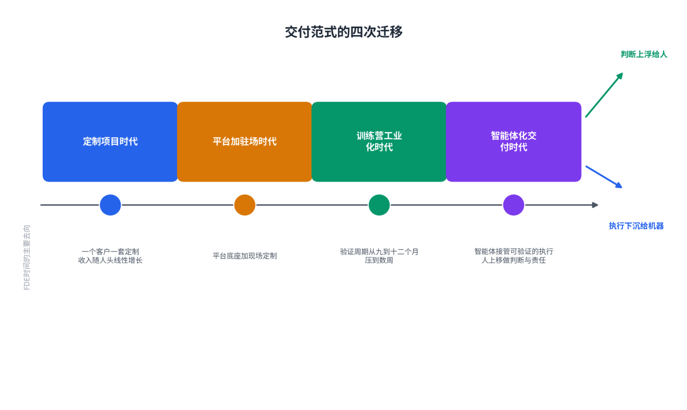
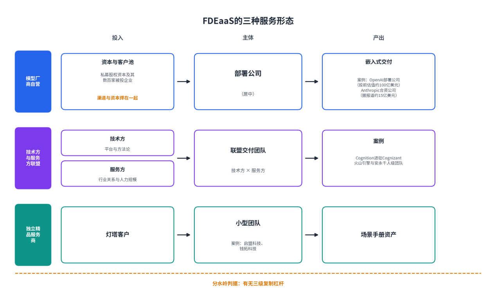
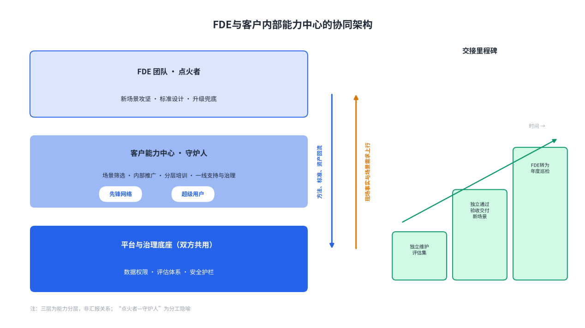
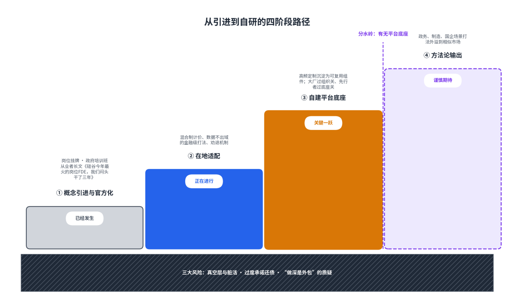

# 第13章AI时代FDE的发展趋势

**【本章导读】**

本章讨论三五年后的FDE会变成什么样，回答三个问题：智能体化人工智能、低代码平台与多模态能力的技术演进，会怎样重写FDE的工作内容；FDE这个角色在向哪里演化——从交付转向赋能、从厂商内部职能转向可独立采购的服务、从单兵嵌入转向与客户内部能力中心的协同；中国市场又会沿什么路径长出自己的FDE形态。本章的性质是展望，立论相应克制：判断只依据头部厂商近三年的公开实践与中国本土先行者的在地探索，凡属预测性说法，一律标明口径。本章适合需要为三五年后组织布局做决策的读者：企业技术负责人、FDE团队负责人与信息化主管部门决策者。

## 13.1 技术演进对FDE的影响

判断技术演进对FDE的影响，首先要排除一个粗糙的提问——“人工智能会不会取代FDE”。从业者内部对此确有分歧，但比分歧更有用的是共识：执行越来越便宜，判断没有同步变便宜。更准确的图景是任务重新分层——技术每前进一步，FDE的工作内容就被重新切分：执行密度高的环节下沉给机器，判断密度高的环节上浮给人。本节按三条线索展开：智能体化、低代码化、多模态化。

### （1）Agentic AI带来的交付范式变革

智能体（Agent）指能在环境中感知状态、调用工具并自主完成多步任务的软件实体；智能体化人工智能（Agentic AI）指以这类实体为主要执行单元、能在较少人工干预下完成长链条任务的人工智能形态。它带来的范式变革，发生在三个层面。

交付的对象变了：从“给人用的系统”变成“替人干活的系统”。只提供软件使用权时，价值难以归因，收费只能按席位；当智能体能直接完成“解决一次咨询”“促成一次销售”，结果变得可测量，按结果收费随之成立——Sierra把它做成了商业模式本身：客户不为软件付费，为“已解决的会话”付费。结果定价把责任推回供应商一侧：必须有人定义什么叫“解决”、度量它有没有发生、在没有交付时解释原因——把模糊的商业承诺翻译成可观察、可审计的系统事件，正是FDE的手艺。

交付的过程本身在被智能体化。上一代交付自动化沉淀了四类静态资产——部署模板、集成组件库、检查清单、自动化汇报；新一代的变化是资产开始自己执行：编码智能体（Coding Agent）把交付推向软件工厂（Software Factory）的形态——信号进入规划，智能体构建，确定性验证把错误送回，发布与监控再产生新信号。这套实践同时给出标尺：代码库能让智能体自主工作多久，取决于可机器读取的确定性验证的密度——类型检查、单元测试、安全扫描、部署检查；这个条件被称为智能体准备度（Agent Readiness）。软件工厂厂商Factory在其客户环境中的估计是：当前端到端自主完成的任务约占15%到20%——单一厂商口径，不代表普遍能力，但它提示了正确的提问方式：不要问“智能体会不会写代码”，要问“这条工作流里有多少步骤能在治理边界内自主完成”。

人的位置整体上移。乐观与谨慎两种口径都有支持者：Factory的首席技术官主张“如果完成能够被验证，许多任务今天就能交给人工智能解决”；同一批材料里的多数团队则只承认资料整理、小型变更与明确实现正在被自动化，上下文发现、范围、架构判断与客户责任仍留给人。本书采纳后一种作为工作判断，同时把前一种留作方向：边界不是固定的能力曲线，而是验证工程不断外推的结果——每多一类可机器读取的“完成定义”，就多一批任务可以下沉。FDE的工作由此向三个高处集中：定义与验证“完成”、处理无法形式化的判断、承担技术与组织的双重责任。

图13-1：交付范式的四次迁移

表13-1：智能体化对FDE工作内容的影响分层

| **层级** | **工作内容** | **智能体的角色** | **现状依据** |
| --- | --- | --- | --- |
| 下沉：可验证的执行 | 环境初始化、标准数据接入、回归测试、周期汇报 | 自主执行，人审异常 | 自动化测试容量提升50倍，支撑以天为单位的迭代（DoorDash） |
| 共驾：有边界的构建 | 流程搭建、集成开发、小型变更 | 智能体起草，人设计任务与验收 | 端到端自主约15%—20%（单一厂商口径） |
| 上浮：难形式化的判断 | 问题定义、范围取舍、评估体系、权责与变革 | 提供材料与选项，判断归人 | 多数从业者一致把这些环节留在人一侧 |
| 新增：对智能体本身的工程 | 定义与度量结果、护栏与审计 | 人是设计者 | 结果定价要求商业承诺可审计化；强监管行业每个决策须可回放 |

### （2）低代码/无代码平台降低FDE门槛

低代码／无代码（Low-Code/No-Code）指以可视化编排与配置替代手写代码的应用构建方式。它从两端同时压低FDE的门槛。

供给端，压低的是FDE自己的实现成本。可视化编排平台让标准的检索增强生成（RAG）与对话流程拖拽可搭；这套思路比名词更老——Palantir早年的Slate工具就允许工程师把组件放上画布、连接已集成的数据源，而最适合拼方案的，正是最懂客户数据的驻场工程师。

需求端，压低的是客户自助的门槛，变化更深远。Decagon把交付经验产品化为智能体操作流程（Agent Operating Procedures，AOP）：客户的客服主管用自然语言写流程——“超过30天的退货，先查会员等级，符合政策就办”——不必再等工程师排期；据报道，Chime解决率做到70%，多邻国分流率达80%，ClassPass客服成本下降95%。Sierra在2026年3月推出“代笔人”（Ghostwriter）：客户上传标准作业流程、历史对话记录甚至一张白板照片，即生成覆盖语音、对话、邮件三渠道、三十多种语言的生产可用智能体——业务人员第一次可以自助造智能体，前线部署团队从“每个都亲手做”变成“验收和兜底”。

边界同样要说清楚：低代码压低的是实现的门槛，压不低判断的门槛。三类工作不因拖拽而消失——问题定义（客户说出的通常是方案而非问题）、评估体系（没有考题，系统无从证伪）、异常与权责设计（边缘情况谁兜底、高风险动作谁批准）。Factory的Epcot警示适用于一切自助化样板：依赖特殊团队、手工数据与例外权限搭出的“未来工作方式”，只是主题公园——参观价值有，复制价值无。低代码扩大的是FDE的杠杆，而不是FDE的替代品：当客户开始自己建造，FDE的角色就从建筑队变成设计院。

表13-2：低代码／无代码平台的能力边界

| **能力域** | **可自助的部分** | **仍需FDE的部分** |
| --- | --- | --- |
| 流程与原型 | 标准流程拖拽编排，一天拼出可交互原型 | 判断哪些步骤该自动化；选题是不是真问题 |
| 评估验收 | 现成指标看板 | 评估集设计：“什么算好”须向专家编码 |
| 数据集成 | 预置连接器对接主流系统 | 遗留系统的非标集成与语义对齐 |
| 异常兜底 | 常规问题自动应答 | 边缘情况的处置责任与升级路径 |
| 治理权责 | 平台内置权限模板 | 数据权属、审批链与变革的在地设计 |

### （3）多模态能力的赋能

多模态（Multimodal）指模型同时处理文本、图像、语音、视频等多种信息形态的能力。它的意义不在技术指标，而在场景版图：企业现实世界的信息大多不是文本——病理切片、田间作物、历史档案扫描件、客服来电的语音、白板上的草图。多模态把FDE可进入的现场，从“文档世界”扩展到“物理世界”。

图像模态已经蹚出三类现场。农田里，约翰迪尔的“看见即喷”用36个摄像头加机器视觉，在时速12到15英里的行进中只喷杂草；OpenAI的前线部署团队跟着农艺专家下田，先评审数百个真实作业案例、编码出评估体系再迭代模型——化学品使用量减少最高70%（2024年省800万加仑除草剂混合液，单源厂商口径，待核实）。病理科里，上海瑞金医院与华为的病理大模型RuiPath用16张GPU卡、两个月完成百万级切片训练，数据准备周期缩短80%，覆盖中国每年约九成癌症发病人群罹患的癌种。档案库里，产权保险公司第一美国有约400万份可追溯至20世纪30年代的保单要逐页分类提取，商用大模型精度不达标，Databricks工程师嵌入客户团队微调开源模型，成本降低70%、工期缩短75%、提取量提升10倍。

语音模态改写的是交互现场。DoorDash的智能客服每天处理数十万通来电，支撑它的是提升50倍的自动化测试容量，否则以天为单位的迭代不敢在这么大的流量上跑。Sierra干脆把岗位命名为“智能体工程师”：语音智能体需要一种特殊的“品味”——什么听起来像人、什么听起来对。多模态交付把评估的内涵，从“答案对不对”扩展到“识别准不准、声音像不像、体验顺不顺”。

影响可以归纳为两条。其一，现场更远了：评估集要建到田间、车间与病理科去，农时、产线节拍、医疗责任，每种约束都无法远程理解——越是物理世界，越需要人到场。其二，考题更厚了：评估集从记录答案对错，扩展到识别精度、时延与交互体验，而“什么算好”的答案依然只长在领域专家身上。多模态没有让FDE可有可无，反而把它的核心手艺——把专家的隐性标准编码成可验证的评估体系——推向更难，也更值钱的地方。

表13-3：多模态能力的FDE场景应用

| **模态** | **代表场景** | **公开案例与量级** | **对FDE工作的新要求** |
| --- | --- | --- | --- |
| 图像（田间） | 精准施药 | 约翰迪尔：36摄像头、时速12—15英里；化学品减量最高70%，2024年省800万加仑（待核实） | 交付节奏服从农时；下田成为进场动作 |
| 图像（医疗） | 病理辅助诊断 | 瑞金医院与华为：16卡GPU、两个月、百万级切片，数据准备周期缩短80% | 与临床专家共建判断标准；审慎节奏 |
| 图像（档案） | 历史文件结构化 | 第一美国与Databricks：约400万份保单，成本-70%、工期-75%、提取量×10 | 商用模型不达标时的微调工程 |
| 语音 | 智能客服 | DoorDash日处理数十万通来电，测试容量提升50倍 | 测试产能先于迭代速度；语音体验入评估 |

## 13.2 FDE的角色演化

技术改写工作内容，组织改写角色本身。三个演化方向同时发生：与客户的关系从“替你做”转向“教你自己做”；能力从内部职能变成可采购的服务；工作方式从单兵嵌入变成与客户能力中心的协同。背后是同一条逻辑：交付的终点不是系统上线，是客户能力的生长。

### （1）从“交付”到“赋能”：培养客户自主能力

“教会客户”正在从职业道德升级为商业设计。Anthropic与金融科技公司FIS的合作，把知识转移写进官方承诺：嵌入的明确目标，是让FIS未来能独立构建和扩展自己的智能体；Decagon的前线部署工程师更多扮演“把客户团队教会用这套系统的人”；Palantir训练营的复利在客户学会之后才开始——市场研究公司J.D. Power学会后，开始给自己的客户办训练营，模式自我繁殖。

驱动转向的是两股方向相反的力。推力来自供给侧的经济学：一个满负荷的FDE只能同时服务三五个客户，靠加人解不开产能约束——三级复制杠杆的第三级消灭的是交付成本本身；客户每多一分自助能力，FDE的杠杆就长一寸。拉力来自需求侧的警惕：高德纳一位分析师预测，到2028年70%的企业可能因供应商成本与内部技能空心化，放弃前线部署工程师主导的智能体方案（媒体转述的个人观点口径，非正式预测报告）。这个预测无论兑现几成，都是对整个行业的警告：让客户感到被绑架的模式，市场会集体反抗；把“教会客户”写进合同，是对锁定质疑最有力的拆解。

赋能有工程化的做法。培训的对象收束为一类人——会去培训别人的人：西班牙对外银行推12万人上线，靠的是全行“人工智能先锋网络”做工作坊、挖场景，加一批“人工智能极客”手把手带人；埃森哲与Anthropic合作培训三万名Claude顾问，再带进自己的客户。撤离标准也随之改写：系统上线不算交付完成，客户自己跑得动才算。

“教会徒弟”会不会饿死师傅？材料的答案相反：客户自主能力越强，平台粘性与横向扩展越快——西班牙对外银行从3300个账号扩展到12万人，Mercado Libre把内部平台向17,000名开发者开放自助。赋能带来的不是生意的消失，而是生意的迁移：从卖工时，到卖平台与判断。

表13-4：客户自主能力成熟度与FDE角色迁移

| **成熟度** | **客户状态** | **FDE的角色** | **收费逻辑** |
| --- | --- | --- | --- |
| 一级：全程代做 | 无接口人，场景未验证 | 全栈交付者 | 按阶段交付、按结果验收 |
| 二级：结对共做 | 有骨干，缺方法 | 教练与结对工程师 | 交付费加能力建设费 |
| 三级：客户主导 | 有能力中心，能自建场景 | 评审者与兜底者 | 平台订阅加专家巡检 |
| 四级：客户自主 | 体系自运转 | 外部顾问，按年巡检 | 年度顾问费加平台费 |

### （2）FDE即服务（FaaS）的可能性

前线部署工程师即服务（FDEas a Service，FaaS）指把FDE能力封装为可独立采购的外部服务：客户不必自建交付团队，按需购买嵌入式的落地能力。它在2026年从概念变成头条：5月，OpenAI成立由自己控股的“部署公司”，联合19家顶级资本，初始投资超过40亿美元，媒体披露的投前估值约100亿美元，并收购约150名部署工程师的咨询公司Tomoro；同一天，Anthropic被曝与黑石集团等组建据报道约15亿美元的企业人工智能服务合资公司。为“派人去客户现场干活”单设百亿美元公司——FDE能力本身已被定价为可交易品。

按主导方与杠杆来源，FaaS呈现三种形态：模型厂商自营——OpenAI模式的创新在资本结构，出资的私募股权巨头手握数百家被投企业，被投企业池就是现成的客户池，据报道承诺五年17.5%的年化优先回报（媒体报道口径，官方未予确认）；技术方与服务方联盟——Cognition把嵌入式团队进驻服务巨头Cognizant，借其数十年客户关系铺进医疗、金融与保险大企业，火山引擎与安永计划搭建千人级FDE团队；独立精品服务商——启盟科技、钱拓科技一类中国先行者，按阶段交付、按结果验收，规模最小，形态最纯。

克制地看，FaaS要跨过的坎与它要解决的问题是同一个：成本结构。派人下现场天然带着人头线性增长的引力——塔塔咨询服务公司是现成的标本：过去十年营收翻倍、员工数几乎翻倍，人均营收停在约4.9万美元。没有平台底座与复制杠杆的FaaS，结局只是换了名字的驻场外包。也有创业者干脆绕开这道题：用“滚动并购”（Roll-up）把客户公司买下来、利益一致地改掉——转型若真有那么大价值，就自己拥有这门生意，而不是卖工时。本书的判断是：FaaS会长期存在，但只在两类玩家手里成立——握有三级复制杠杆的平台型厂商，以及守住灯塔纪律的精品服务商；中间地带的大规模人力堆叠，大概率重演外包业的老故事。

图13-2：FaaS的三种服务形态

### （3）FDE与内部能力中心的协同

FDE终将撤场，而客户组织的人工智能能力必须常设。承接它的组织形态，本章统称内部能力中心——客户企业内部负责人工智能场景筛选、应用建设、治理与推广的常设团队；在部分企业，它叫卓越中心（Center of Excellence，CoE）或转型办公室。FDE与能力中心的关系可以压缩成一句话：点火者与守炉人。

西班牙对外银行的演化是完整样本。OpenAI的FDE进场时，任务只是部署企业版聊天助手：从3300个账号起步，员工自发创建2万多个定制助手，83%的人每周活跃使用；一年半后，体系扩展为覆盖25个国家、12万名员工的网络，银行的目标升级为“建设人工智能原生的全球银行”。放大过程的主力已不是外部工程师，而是两张内部网络——跨部门的“人工智能先锋网络”和被称为“人工智能极客”的高级用户：外部FDE打第一口井，内部能力中心修渠。

协同要落成架构。本书把它归纳为三层：底层是共用的平台与治理底座——数据权限、评估体系、安全护栏；中层是能力中心，负责场景筛选、内部推广、分层培训与一线支持；上层是FDE团队，收敛到新场景攻坚、标准设计、升级兜底。交接不是一次性动作，而是一串里程碑：客户骨干能独立维护评估集；客户团队能独立通过验收交付新场景；任何单人离开，信息通道都不中断。软件工厂的实践补上规模端的理由：一家有4.5万名工程师、数万代码库的客户，依赖厂商人员逐个安装维护的方案无法覆盖——FDE必须帮助客户建立统一治理下自行扩张的部署模型。

中国语境加两条注脚。其一，客户的能力中心往往根本不存在，FDE要帮它从零长出来：识别热情分子、争取专项预算、设计认证与激励——“帮客户建立能力中心”本身成为交付物。其二，在政务与国企场景，能力中心常落在信息化部门身上：它既是甲方又是未来的运营者，赋能对象与验收对象部分重叠——交接标准要写得更早、更硬，否则赋能会在“验收通过”那天自动中止。

图13-3：FDE与客户内部能力中心的协同架构

## 13.3 中国特色的FDE发展路径

中国市场要回答的问题，从来不是“要不要FDE”，而是“在项目制的土地上怎么种FDE”。这里有最勤奋的交付工程师、最苛刻的定制化需求和最深的项目制诅咒，也有与全球同步的落地焦虑。政策、市场与人才三股力量的排布，决定FDE在中国是诅咒的解药，还是诅咒的新马甲。

### （1）政策环境与市场需求

政策端的信号在近两年明显加密。国家层面，2025年8月，国务院印发《关于深入实施“人工智能+”行动的意见》，把人工智能与经济社会各领域的深度融合列为国家行动；数字中国建设、国企数字化转型考核等政策，持续把“落地”而非“研发”推到考核前台。地方层面更具体：上海2025年底首开FDE专题培训班，2026年2月又开出产业工程师转型专班，聚焦智能制造、金融、医疗，首期报名超200人，全年计划三期，已列入市级专业技术人才知识更新工程。一个岗位名称进入政府人才工程，意味着这个概念完成了从硅谷话语到官方目录的转译。

市场端的特殊性在于结构。需求侧，最大的买家是国央企与政府：采购的肌肉记忆是买断加项目制验收，数据敏感度高，决策链条长。供给侧，中国企业软件长期困在“高度定制、强关系、价格战”的非标交付里——行业观察者数出六座大山：白嫖、开源、外包、招标、数科、畸形的市场结构。最直白的对比来自人效：2025年年报，用友人均营收约48万元，金蝶约62万元，同一年Palantir约100万美元——十倍级差距，既是项目制诅咒的财务形状，也是FDE模式在中国最大的想象空间。焦虑则全球同步：被调研的企业生成式人工智能项目约95%没有可衡量的财务回报——客户的心病，就是交付能力的市场。

政策与市场的合力方向一致：都在把“人工智能落地能力”变成稀缺公共品。但也要划清边界——政策能解决人才培训、预算引导与采购偏好，解决不了计价结构与平台底座；这两个坑，只能由市场自己填。

表13-5：中国FDE发展的政策与市场驱动因素

| **类别** | **驱动因素** | **具体表现** | **对FDE的意义** |
| --- | --- | --- | --- |
| 政策 | 国家行动 | “人工智能+”行动意见（2025年8月）；国企数字化转型考核 | 落地能力成为考核对象 |
| 政策 | 人才工程 | 上海FDE培训班与转型专班，首期报名超200人 | 概念官方化；公共供给通道开启 |
| 市场 | 落地焦虑 | 约95%项目无可衡量回报的调研流传 | 客户主动寻找能对结果负责的人 |
| 市场 | 人效差距 | 用友约48万元、金蝶约62万元，对比Palantir约100万美元 | 交付工程师价值重估的空间 |
| 市场 | 项目制惯性 | 买断式采购、验收导向、六座大山 | 混合制计价与平台底座成入场券 |

### （2）本土FDE人才的供给策略

中国的人才命题是一个悖论：最贴近FDE要求的工程师文化就在这里——能吃苦、响应快、全栈通吃、习惯在客户现场解决一切问题；但过去二十年，这类人才被困在人天计价的外包体系里，市场价格信号长期低估他们。FDE概念普及的深远副作用，可能是重新为中国数十万交付工程师定价：当他们知道大洋彼岸的同行拿着38.5万美元的中位数总薪酬，价值坐标会松动。松动已经挂牌：2026年招聘市场上，头部大厂与人工智能公司的FDE岗位月薪大致2万到8万元，高职级年包40万元起，与传统实施工程师拉开数倍价差。

供给可以沿四条通道展开。第一条是存量转化，转化率最高的三个池子是：大厂的解决方案架构师——懂技术、见过客户，缺对结果负责的经验；咨询公司的技术顾问——懂业务、能讲，缺动手；客户侧的明星用户——最懂痛点，是理解客户使命的天然人选。第二条是组织养成。Palantir轮岗培养计划的设计者把判断说得很绝：“你没法靠招聘建出真正的FDE组织，只能养出来”——250多名工程师经轮岗上了现场；没条件轮岗的团队有一份六个月清单：头两周旁听客户电话，记的不是功能请求，而是“这个人一天是怎么过的”；第二个月端到端认领一次客户事故；第三个月去现场找一个一天能修的小痛点当周修掉；此后维护一份周更的《我从客户身上学到的东西》。第三条是公共培训，上海专班证明了政府通道可行，但课程核心必须是现场判断力而非技术课——“某银行合规团队每天人工核对三万条交易告警，九成是虚惊，你怎么办”这类问题拆解题目应成为选拔标配，否则专班只会批量生产证书。第四条是智能体放大：不指望无限招聘稀缺人才，用助手扩大每个FDE能管理的上下文——中国的人才约束更紧，这条通道的边际价值更高。

四条通道之上还有更根本的机制问题：瓶颈不在数量，而在定价与培养机制——人天计价一天不改，最好的交付工程师就一天被当人力卖。SAP大中华区总裁的观察可作佐证：最缺“既有产品工程能力、又深入理解业务的复合型人才”，而落地的最大挑战是组织惯性，不是技术。

表13-6：本土FDE人才供给的四条通道

| **通道** | **来源与方式** | **优势** | **短板与对策** |
| --- | --- | --- | --- |
| 存量转化 | 解决方案架构师、技术顾问、客户明星用户 | 上手快 | 缺结果责任或动手；问题拆解面试把关 |
| 组织养成 | 轮岗进真实部署；六个月自助清单 | 长出真判断力 | 周期长；以客户事故与小痛点为课程 |
| 公共培训 | 政府人才工程、行业专班 | 规模化、官方背书 | 防证书化；以现场实战考核收尾 |
| 智能体放大 | 助手承担资料与零碎维护 | 突破稀缺人才产能上限 | 上下文可追溯；判断仍归人 |

### （3）从引进到自研的路径

把事实按时间排开，一条“引进—适配—自研—输出”的路径隐约可见——与高铁、移动支付的消化再创新之路同构，但节奏更快：本土实践几乎与概念引进同时发生。

第一步，概念引进与官方化，已经发生。2025到2026年，FDE岗位挂牌、培训班进入政府人才工程；2026年年中那篇被大量转发的从业者长文，标题本身就是注脚——《硅谷今年最火的岗位FDE，我们闷头干了三年》：中国不缺原生土壤，缺的是命名与方法论。

第二步，在地适配，正在进行。计价上，订阅制、按量计费与成果分成，撞不上中国客户“买断加项目制验收”的肌肉记忆，可行的过渡形态是混合制：按阶段验收付款，顺应采购习惯；价值指标写进验收条款，注入成果基因；再签年度运维与演进合同，培育续约意识。合规上，本土服务商把“数据不出域”写成金融业方法论的前提，沉淀出场景诊断一到两周、嵌入式交付八到十六周、生产部署持续演进的三阶段打法。客户筛选上，先行者建立了中国版本的劝退机制——场景未验证的不接、数据一张表能导出的不接；连合同都要打印出来用笔圈改的客户，被直接劝回“先买100个账号让全员用起来再说”。

第三步，自建平台底座，是关键一跃，也是最大的未决项。FDE的经济学依赖“平台底座加现场定制”，而中国大量软件公司的真实状态是“有现场、没平台”——每单都是从零写代码的人力生意。对它们，比学FDE形式更重要的是补地基：先把最高频的定制沉淀为可复用组件，再谈前线部署；没有复制杠杆，FDE在中国只会沦为名字好听的驻场外包。路径分野也在这里显形：大厂路径有底座厚度——火山引擎的模型与工具链底座、华为与瑞金医院的联合部署——要过的是组织关：FDE团队能否获得“现场即研发”的地位，而非售前支持部的新名字；先行者路径有组织自觉——把“带着产品底座来做工程”写进官网定义——要过的是底座关：缺资本与平台厚度，精品服务天花板触手可及。

第四步，方法论输出，可以谨慎期待。中国场景的复杂度——政务合规、制造产线、国企组织——反向锻造的打法，对数字化阶段相似的市场有外溢可能；混合制计价与数据不出域适配，本来就是为多数非美国市场准备的答案。

路径之外必须摆上风险。一线报告的图景要糙得多：有的项目里FDE更像乙方外包人力；大老板签完合同就没了下文，工程师被架在没有决策者，也没有执行者的真空层；销售的过度承诺最后都由交付来还。更根本的质疑指向模式本身：做浅了，模型厂商自己会做；做深了，本质上还是外包。这些风险不解除，路径会在第二步停滞。本书的判断保持不变：FDE不会治愈中国企业软件的所有痼疾，但它提供了一次罕见的正名机会——把“贴近客户”从低端外包的标志，重新定义为高端能力的标志。中国有的是愿意下现场的工程师，缺的是另外三样东西：让现场工作产生复利的平台、方法论与计价结构。谁先补齐，谁就有机会在这个全球最大也最复杂的企业服务市场里跑出来。

图13-4：从引进到自研的四阶段路径
