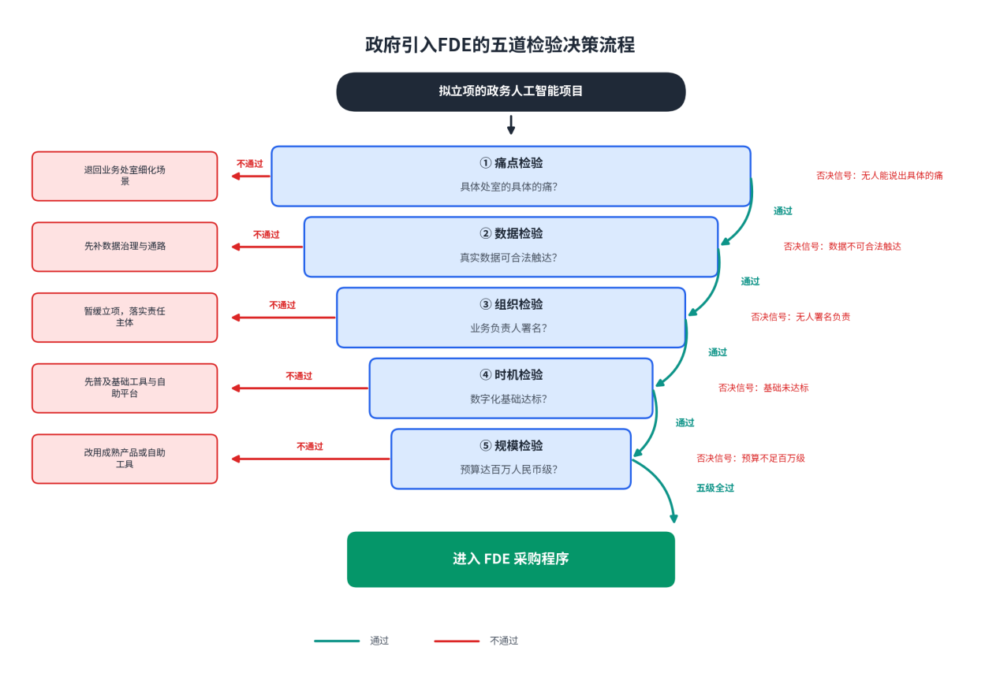

# 第14章对领导者的战略建议

**【本章导读】**

方法论的价值，最终要在两类人的桌面上兑现：政府信息化部门负责人，与企业IT领导者。前者手握公共资金与采购制度，后者手握预算与组织设计权；他们不写代码，但他们的每一个决定，决定了FDE模式在自己的组织里是一次真转型，还是一笔新外包。本章是一部决策备忘录，回答五个问题：什么项目值得引入FDE、采购制度怎么配套、风险怎么管控、自建还是外部采购、投入产出怎么算账；最后落到组织文化——制度可以发文，工具可以采购，文化只能自己长。每一节给出明确判断、对照表与可打钩的量表；章末附一份30/60/90天行动清单，供读完即用。

## 14.1 政府信息化部门负责人的行动指南

政府部门是FDE模式最挑剔的买家：预算来自公共资金，每笔支出都要经得起审计与绩效评价；数据敏感，安全边界由法律划定；项目失败的政治成本远高于商业成本。同时，政务场景又恰好密布着FDE模式最需要的那类问题——城市治理、市场监管、公共服务，高价值、强复杂、没有现成答案。“最挑剔”与“最需要”叠加，决定了政府引入FDE不能靠热情，要靠一套先判断、后采购、再管控的程序。

### （1）如何评估是否引入FDE

评估的第一块基石是一张二维图。横轴是用户技术能力：天天使用系统的业务人员，能否自己消化技术的复杂度；纵轴是产品复杂度：采购的是边界固定的成品，还是高度可塑的平台。四个象限各有适配的交付方式——简单产品卖给技术用户，自助即可；简单产品卖给非技术用户，传统实施足够；复杂产品卖给技术用户，靠文档与开发者支持；唯独“复杂产品乘以非技术用户”的象限，是FDE的核心区。大语言模型与智能体平台把几乎所有政务人工智能项目推进了这个象限：平台“什么都能做”，恰恰因此没人说得清它能为本部门做什么；而真正的使用者是业务处室的公务员，不是工程师。有人必须把平台翻译成业务结果——这个角色就是FDE。

二维图只回答“需不需要”，不回答“该不该现在做”。后者要过四道检验，任何一道亮红灯，引入FDE就是浪费公共资金。痛点检验：是不是一个具体处室、具体岗位的具体痛？“提升全委办局智能化水平”不是痛点，“审批科每天手工核对三百份材料、错一单就要追责”才是。数据检验：真实数据现在能否合法、安全地触达？要求供应商“先证明能力”、真实数据一寸不放的流程，买到的验证只能是假象。组织检验：有没有愿意署名、能拍板的业务负责人？没有署名的项目，从第一天起就是无主之地。时机检验：数字化基础是否达标？一位服务商遇到过这样的客户：老板开口要投100万美元做人工智能，签合同时却把合同打印出来、用笔圈改，连修订功能都不用——这种基础，FDE投进去不会有产出，负责任的建议是先把基础工具普及起来。政务场景同构：业务数据还在纸质台账与私人表格里流转的部门，第一步不是招FDE，是补数据基础。

四道检验全过之后，还有一道规模检验：预算红线。FDE是昂贵的资源，这个模式大约在单份合同10万美元以上才开始成立，折算到中国市场，大致对应大几十万到百万人民币级的项目。给几万元的合同配一支FDE团队，账永远算不过来——小额、标准化的需求，应当用成熟产品或自助工具解决。

图14-1：政府引入FDE的五道检验决策流程

表14-1：引入FDE的四项前置检验

| **检验项** | **关键问题** | **否决信号** | **通过标志** |
| --- | --- | --- | --- |
| 痛点 | 哪个处室、哪个岗位、什么具体的痛 | 目标是“全面推进智能化” | 一句话说清谁在疼、疼到什么程度 |
| 数据 | 真实数据能否合法安全触达 | 只给样例数据，真实数据“再研究” | 数据通路在签约前打通，权限边界书面化 |
| 组织 | 业务负责人是否署名并全程在场 | 只有信息部门对接，处室无人认领 | 署名制落实，验收责任到岗到人 |
| 时机 | 业务数据是否已电子化、可汇聚 | 台账在纸上、数据在私人表格里 | 核心业务数据在线，质量问题可枚举 |

最后一项评估指向政府自己：是不是一个值得优秀供应商服务的客户。FDE供应商内部有一张反向筛选表，三类客户会被拒：没有业务负责人、拒绝提供真实数据、需求宏大无边；预算充足、需求旺盛、却吸干团队又不产生复利的客户，行业里有个难听的名字——需求蝗虫。带着“宇宙级需求、不给数据、无人署名”的组合去招标，筛掉的恰恰是最有本事的供应商，剩下的只有照单全收的人力外包。招标文件怎么写，本身就是在选择供应商池。

### （2）采购与管理的政策框架

政府引入FDE最大的制度摩擦，是采购体系的肌肉记忆与FDE计价逻辑的冲突。现行流程习惯“买断加项目制验收”，审计按人天与功能清单核账；FDE的经济学却是按结果定价。一步到位照搬按解决量收费，在多数部门会死在采购科。可行的政策框架是混合制，由三个部件组成：按阶段验收付款，顺应既有采购与审计流程；价值指标写进验收条款，把结果基因注入交易——验收从“功能清单打勾”改为“业务指标达成”，指标由甲乙双方共建共认，基线数据在启动第一天采集，错过永不再来；主体合同之外附一份年度运维与演进合同，让系统有人持续喂养，也逐步培育按年续约的制度习惯。

围绕混合制，还有五项配套设计。预算科目上，把FDE支出从“外包人力”科目中拆出，列入创新试点或结果采购科目——按人天审计一支对结果负责的团队，从第一天起就把双方逼回外包的老路。资格条件上，把两条写进招标文件：供应商必须投入专属工程资源而非销售顾问，必须带平台底座交付而非从零现写。区分的试金石是三句话：按阶段交付、按结果验收，而不是按工时结算；带着产品底座做工程，而不是从零现写现改；做完会走、能力沉淀在系统和甲方团队里，而不是越驻越久、人走系统停。验收机制上，每个项目锁定3到5个核心指标组合——通常是一个价值指标、一个使用指标、一个关系指标——指标不在多，在双方共认之后能在审计与绩效评价中站得住。数据与安全条款上，写明数据不出域、最小权限、全程可审计；政务云与等保边界内的部署架构，作为合同附件而非口头承诺。退出与移交条款上，把移交包列为付款里程碑：文档、评估集、运维手册、培训记录逐项销号——知识转移不是合作诚意，是合同义务。

表14-2：FDE采购政策框架要点表

| **政策环节** | **传统做法** | **FDE适配做法** | **设计意图** |
| --- | --- | --- | --- |
| 计价结构 | 买断加人天，功能清单验收 | 混合制：阶段付款＋价值指标验收＋年度演进合同 | 顺应采购习惯，注入结果基因 |
| 预算科目 | 外包人力，按人天审计 | 创新试点／结果采购科目 | 避免审计逻辑把项目逼回外包 |
| 资格条件 | 资质、案例、报价 | 专属工程资源＋平台底座，三句话试金石 | 把伪FDE挡在门外 |
| 验收机制 | 功能清单打钩 | 3到5个共建共认的核心指标组合 | 让验收经得起绩效评价 |
| 数据安全 | 原则性保密条款 | 数据不出域、最小权限、可审计写入合同 | 合规前置，不依赖谈判桌 |
| 退出移交 | 验收即结束 | 移交包列为付款里程碑，逐项销号 | 防止人走系统停 |

### （3）FDE项目的风险管控

政府项目的风险管理比商业项目多一条硬约束：失败的解释成本。商业公司烧掉一个试点，代价是钱；政府部门烧掉一个试点，代价是审计问询与问责。因此风险管控不能停留在“出了事怎么办”，而要把“失败可解释、可隔离、可回收”设计进项目结构，分三层展开。

结构层，把试点当风险投资组合管理。单个试点设预算上限与周期上限，毕业标准与散伙标准在方案里同时写死——写得含糊的验证方案，等于给概念验证坟墓签发开工许可。一批试点的正确预期不是个个成功，而是死得早、死得便宜、死得有教训；组合里只要有一两个跑通，方法论与信心就都有了载体。

过程层，管住指标口径与裁判独立性。人工智能项目的验收数字是口径的重灾区：引用任何解决率、分流率之前，先问三件事——分母是什么、判定窗口多长、谁来判定。口径不清的86%不如口径清楚的51%。评估集由业务方共建、业务方当评委，裁判不能是交卷的人；基线数据双方签认，防止验收时各自美化记忆。

组织层，防真空、防锁定、防反弹。防真空的教训来自一线：一个千万级国企项目，大领导签完合同就没了下文，项目里没有真正负责的人，交付团队被架在真空层——向上没有决策者，向下没有执行者，最后只能靠研究汇报逻辑争取验收。对策是署名制加支持者网格：单点是高危，三点成网。防锁定的要点，是在立项时就写明交付的终态：行业的健康标准是客户自己跑得动，而外部预测并不乐观——有研究机构预测，2028年前70%的企业将因成本与技能空心化而放弃FDE主导的方案。知识转移完成、本部门团队能独立运维与迭代，项目才算结束；否则只是供应商的撤离，不是交付的完成。防反弹靠政治地图：方案自动化掉了哪个部门的流程，就给那个部门设计新的位置，而不是等它在验收会上投出反对票。

表14-3：政府FDE项目风险矩阵

| **风险** | **早期信号** | **影响** | **管控动作** | **责任方** |
| --- | --- | --- | --- | --- |
| 组织真空 | 签约后领导不再出现，处室无人认领 | 项目空转，验收靠汇报技巧 | 署名制＋支持者网格，月度向署名领导汇报 | 信息化部门 |
| 指标口径失真 | 准确率由供应商自报 | 验收数字虚高，绩效评价失真 | 口径三问＋业务方评委＋基线签认 | 双方共担 |
| 供应商锁定 | 系统黑箱，文档不全，移交拖延 | 人走系统停，续约被挟持 | 移交包挂钩付款，知识转移写入终态 | 信息化部门 |
| 数据安全越界 | 数据出域诉求，权限申请扩大化 | 合规事故，问责风险 | 数据不出域，最小权限，全程审计 | 安全主管部门 |
| 关键人单点 | 客户只认一个工程师 | 人员变动即断线 | 结对交付，关键场景有第二双眼睛 | 供应商 |
| 政治反弹 | 受损部门消极配合 | 采纳率归零，验收受阻 | 政治地图前置，为受损者设计新角色 | 业务处室 |
| 资金问责 | 试点无限期拖延，死因模糊 | 审计问询，后续预算被砍 | 预算与周期上限，散伙标准写死，复盘留痕 | 信息化部门 |

## 14.2 企业IT领导者的决策框架

企业侧的约束与政府不同：没有审计问责，但有损益表；没有采购科，但有投资回报率（ROI）的追问。本节把三个最常被董事会问到的问题做成决策工具：自建还是买，账怎么算，组织准备好了没有。

### （1）自建FDE团队 vs 外部采购

先摆一组有分歧的证据。行业大样本调研的结论倾向外部：企业生成式人工智能项目中，与外部伙伴合作的成功率约为内部自建的三倍。另一派从业者则公开质疑：FDE做浅了，模型厂商自己会做；做深了，本质还是外包，交付成本高且难以规模化——2028年前七成企业可能放弃FDE主导方案的预测，站在同一侧。两种观点各有支持者。本书采纳的立场是按阶段分治：能力的来源可以外包，能力的内化不能外包。

探索期，外部采购占优。前一到两个场景的目标，是快速验证价值并建立方法论，速度比成本重要；此时自建要同时解决招聘、方法、平台三个未知，失败概率叠加。中国市场的行情也要算进去：FDE岗位月薪挂牌区间大致2万到8万元，高职级年包40万元起——招错一个人的代价，远高于买错一次服务。

扩张期，自建开始占优，判据是两条曲线的走向：交付资产的复用率是否逐季上升，第N个场景的定制量是否显著小于第一个。场景同构、需求持续排队时，外部采购的边际成本不再下降，内化的知识却开始复利。但自建有三条硬门槛，缺一条都别开工。场景密度：一支合格的小分队同期高质量交付不超过两个项目，手里至少要有三个同构场景排队，团队才不会闲置或被切碎。平台底座：没有共享底座，每名工程师都从空白代码库写一套独立软件，这支队伍不是FDE团队，而是一家开发公司——几十个客户之后，维护成本先吞掉利润，再吞掉团队的耐心；底座尚不存在的企业，正确顺序是先把最高频的定制沉淀为可复用组件，再谈自建。人才机制：能招到、更能源源不断养出“写生产代码、进客户会议”的复合工程师——中国工程师能吃苦、响应快、习惯在客户现场解决问题，文化上最贴近FDE；但这类人才过去二十年被困在人天计价的体系里，自建FDE团队的第一笔预算，往往就是重新给交付工程师定价。

无论自建还是采购，选供应商的三条军规通用：看它对结果的定义权——敢不敢把验收指标、基线与退出机制写进合同；看它的底座——交付物站在共享平台上，还是一单一堆新代码；看它的退出诚意——知识转移写不写进合同，敢不敢承诺“让客户能独立建”。多数企业的最优解是混合路径：以采购开场，合同里写明联合团队与知识转移义务，内部工程师与供应商FDE结对交付，项目结束时内部团队能独立运维与迭代——采购本身，就是自建的第一期培训。

表14-4：自建FDE团队与外部采购的对比决策表

| **决策维度** | **自建FDE团队** | **外部采购** | **占优情形** |
| --- | --- | --- | --- |
| 能力沉淀 | 知识与资产完全内化 | 依赖合同条款转移，易打折 | 长期多场景，自建占优 |
| 速度 | 招聘与建平台以年计 | 签约后数周进场 | 探索期抢时间，采购占优 |
| 成本结构 | 固定成本高，边际成本递减 | 单项目价高，无沉没成本 | 场景密度高，自建占优 |
| 人才依赖 | 须持续养出复合工程师 | 依赖供应商人才供给 | 人才市场不成熟，采购占优 |
| 平台要求 | 必须自建或选定底座 | 借用供应商底座 | 无底座时，采购占优 |
| 风险形态 | 养不出团队的组织风险 | 被锁定与能力空心化 | 各有代价，均须条款对冲 |

### （2）FDE团队的ROI评估模型

对财务讲得通的FDE账，分两侧算：分子是价值，分母是全成本，中间隔着时间。

价值侧四类，按可信度排序。效率收益：工时节约乘以完全人力成本——一家跨国银行的全员部署给出的口径是每周每人省3小时，这类指标最容易测，也最经得起复核。成本节约：直接消耗品的下降——精准施药让化学品使用减少70%，属于此类。收入与风险收益：转化率提升、欺诈检出率上升——抵押欺诈检出率超过99%的案例在此列。不作为成本：继续手工与延期的代价，用于回答“为什么必须是现在做”。

成本侧四项，漏掉任何一项，ROI都是虚高：合同支出；内部投入——业务与技术人员的投入时间，这是客户方承担的“培训税”，先为平台付费，再为培养会用平台的人付费；数据准备成本；变更管理成本。

时间侧两条纪律。价值实现时间是生命线：最小可行部署的验证以周计，2到6周；完整部署以月计，1到4个月；这个周期持续变长，是方法论或平台底座出问题的第一信号。基线数据在项目启动第一天采集，错过永不再来——没有基线的ROI，是回忆录，不是账。

评估模型的骨架是四层指标体系：交付层回答项目做得对不对，客户层回答客户活得怎么样，商业层回答生意值不值，组织层回答团队能不能走远。

表14-5：FDE团队ROI评估模型

| **层次** | **核心指标** | **口径要点** | **参考基准** | **异常读数的含义** |
| --- | --- | --- | --- | --- |
| 交付层 | 价值实现时间 | 进场到首次可衡量价值 | 验证2到6周，部署1到4个月 | 持续变长：方法论或底座出问题 |
| 交付层 | 概念验证转化率 | 验证进入付费部署的比例 | 早期5%到10%，优秀约75% | 过低是筛选失职，近100%是只接易单 |
| 客户层 | 激活率 | 目标用户群中稳定使用者占比 | 分母是目标用户群，非账号数 | 长期低迷：名义活着，实际死了 |
| 客户层 | 支持者覆盖 | 活跃盟友的数量与层级 | 单点高危，三点成网 | 单点：续约与推广悬于一人 |
| 商业层 | 净收入留存（NRR） | 存量客户收入的年度变化 | 100%及格，120%优秀 | 低于100%：增长引擎未内生 |
| 商业层 | 交付毛利率 | 收入减交付直接成本之比 | 纯人力20%到40%，平台化后60%以上 | 不上升的FDE是咨询公司 |
| 商业层 | LTV/CAC | 终身价值与获客成本之比 | 健康线3以上 | 早期低于2可接受，须配合NRR读 |
| 组织层 | 定制递减率 | 第N个客户定制量对比第1个 | 逐单显著下降 | 连续三单不降：回流机制失灵 |
| 组织层 | 资产复用率 | 新项目复用已有组件的比例 | 逐季上升 | 持平：团队在重复造轮子 |

使用这张表的三条纪律：每个项目锁定3到5个核心指标组合——一个价值指标、一个使用指标、一个关系指标，胜过铺满一面墙的仪表盘；指标与业务方共建共认，否则在验收与续约的谈判桌上没有效力；每半年检修一次指标体系本身，删除无人看的，补上反复被问的。另加一条反指标纪律：解决率上升但投诉与返工同步上升，不算成功——任何单一指标都要配一个制衡指标，防止团队把数字做漂亮、把方向做错。自建团队的领导者还要记住一句：毛利率与人均产能不上升的FDE团队，是换了名字的实施部。

### （3）组织的FDE就绪度评估

引入FDE之前，领导者需要对组织做一次就绪度评估（Readiness Assessment）：一套结构化自检，回答“这个组织现在接不接得住FDE模式”。就绪度不足时强行引入，等于把昂贵的团队投进沼泽——他们的大量时间会消耗在替组织补基础上，而不是交付价值；失败的账，却会记在模式头上。

就绪度评估覆盖五个维度，每项按1到5分打分。战略与场景：痛点是否具体、业务负责人是否署名、成功标准是否书面化。数据就绪度：真实数据的可及性、权威数据源是否唯一、权限通路能否在签约前打开。组织就绪度：支持者是否成网、政治地图是否测绘、组织能承受多大程度的流程改变。技术就绪度：遗留系统的接口状态、发布流程的真实周期——客户那边发布一个版本要走六周流程这种事，必须在第一天就知道。伙伴与市场：可得供应商的成熟度、平台底座选项、内部接棒人才。

表14-6：组织FDE就绪度评估量表

| **维度** | **核心问题** | **1分表现** | **3分表现** | **5分表现** |
| --- | --- | --- | --- | --- |
| 战略与场景 | 痛点与责任人是否具体 | 目标是“全面推进” | 有候选场景，责任人待定 | 痛点、基线、署名负责人齐备 |
| 数据就绪度 | 真实数据能否合法触达 | 数据在纸上与私人表格里 | 核心数据在线，质量问题未清点 | 数据问题清单在册，通路可开 |
| 组织就绪度 | 变革承受能力 | 无署名者，受损者未识别 | 有高管支持，网格未成 | 三点成网，受损者有新位置 |
| 技术就绪度 | 系统与发布地形 | 接口状态不明 | 系统清单已列，周期未核 | 系统地图齐备，发布周期实测 |
| 伙伴与市场 | 外部供给与接棒人才 | 无候选供应商与人才 | 有候选，未做能力甄别 | 供应商过筛，接棒人选在位 |

量表的用法在分数之外。总分低于15分（满分25），正确动作不是上马，而是补基础：先把数据电子化、把基础工具普及到全员，让组织形成对人工智能的具体体感，再谈深度部署——宁可晚一点开始，也不在错的时机开始。15到19分，单点试点：选一个痛点咬穿，用一个小胜建立组织的信任资产。20分以上，可以谈平台选型与长期结构。就绪度不是一次评估终身有效：产品的复杂度与人员的技术能力都在变，组织在二维图上的位置会移动。评估应当每半年复评一次，与预算周期对齐；复评结果直接决定下一阶段是扩大、维持还是收缩。

## 14.3 建立FDE组织文化

制度可以发文，工具可以采购，文化只能自己长。FDE模式在组织里活不活得下来，最终取决于三件软性的事：组织怎么定义成功，怎么对待失败，怎么积累知识。

### （1）从“项目交付”到“价值共创”的转变

项目交付文化的财务画像，是一组刺眼的人效对比：2025年年报，用友人均营收约48万元，金蝶约62万元；同年，Palantir的人均营收约100万美元——十倍级的差距。差距的来源不是工程师的能力，是成功的定义：一边按验收单结账，交付完成那天，价值创造的义务就结束了；另一边按客户结果结账，上线只是价值创造的起点。从项目交付到价值共创，要改的不是口号，而是成功定义、计价逻辑、客户关系与需求来源四个底层设置。

表14-7：从“项目交付”到“价值共创”的文化转变对照表

| **维度** | **项目交付文化** | **价值共创文化** | **转变到位的标志** |
| --- | --- | --- | --- |
| 成功定义 | 验收单签字、发票开出 | 客户业务指标改善并被日常使用 | 复盘会上先报价值指标，再报功能 |
| 计价逻辑 | 按人天与功能清单结算 | 按阶段验收挂钩价值指标 | 报价单里出现结果承诺 |
| 客户关系 | 供应商管理，防违约 | 联合团队，共担结果 | 甲方工程师与供应商结对排期 |
| 需求来源 | 需求文档层层转述 | 工程师在客户现场发现问题 | 现场观察改写的需求多于文档 |
| 知识归属 | 留在个人与项目档案 | 沉淀为组件、手册与评估集 | 新项目启动先查资产库 |

领导者的抓手有三个。改考核：项目奖金挂在价值指标上，而不是挂在上线——上线不算交付完成，客户团队改变工作方式那天才算；激励指向哪里，行为就流向哪里。改语言与座位：把FDE请进业务会议，把业务负责人请进迭代评审；物理上的混编，是文化混编的先决条件。改用法：买方自己也要完成转变——把FDE当廉价外包按人头派活的客户，买到的就是外包；按结果对齐、开放真实流程与数据的客户，买到的才是这个模式的全部价值。买方的用法，决定买到的价值上限。

### （2）容忍失败与快速学习的文化

试点是人工智能时代的研发单位，而研发的本来面目就是高失败率。业内的公开回忆里，到处是大把时间、金钱与差旅费烧出来的烂尾试点——有公司早期免费做试点烧掉数百万美元，赌的是学习价值。成熟的组织把试点当风险投资组合来打：多数会死，死完必须复盘；还要对那些撞了车的项目和累垮的工程师说声谢谢——教训是他们买单买来的。掩盖失败的组织，等于把金矿当垃圾埋掉。

容错不是口号，是三个可设计的机制。复盘与绩效脱钩：复盘一旦与绩效挂钩，修饰就开始了——诚实的复盘写“当时漏看了什么”，修饰过的复盘写“客户组织不成熟”；让诚实没有代价，是容错文化的第一块地基。快死比慢活值钱：每个试点设周期上限、毕业标准与散伙标准；容忍失败的另一面，恰恰是杀死错误项目的纪律——那些最终被迫整体放弃的企业，大多不是死于敢试，而是死于不敢停：试点在汇报材料里一年年“持续推进中”，直到某个预算季被悄悄撤掉。拒绝计入文化：有服务商把劝退机制写在官网上——场景未验证的不接、数据一张表能导出的不接、只想了解人工智能的不接，“宁可你晚一点开始，也不希望你在错的时机开始”。买方同构：敢于否决错误立项的领导者，和敢于拒绝错误客户的供应商，是同一种纪律的两端。

表14-8：容错与快速学习的机制设计表

| **机制** | **设计要点** | **反模式** | **检验指标** |
| --- | --- | --- | --- |
| 复盘制度 | 与绩效脱钩，聚焦“漏看了什么” | 复盘变追责，死因写成客户不成熟 | 复盘报告中事实与归因的比例 |
| 试点组合 | 预算上限、周期上限、批量管理 | 单点豪赌，无限期续命 | 试点平均周期与单次成本 |
| 毕业散伙标准 | 立项时写死两种结局 | 验收标准随进展漂移 | 按期毕业或按期散伙的比例 |
| 拒绝机制 | 否决错误立项的勇气受保护 | 战略焦虑驱动立项 | 被否决立项的数量与质量 |
| 失败案例库 | 教训结构化、可检索 | 教训留在纪要里无人再读 | 案例库被新项目引用的次数 |

### （3）持续改进与知识共享的机制

FDE模式的灵魂器官是回流：现场学到的东西，能否沉淀为组织的资产。器官是否还在跳动，由四个组织层指标读数：单位时间内从现场沉淀为组件与手册的产出数，新项目复用已有资产的比例，人均产能的逐年走势，以及团队的续航状态——出差强度、倦怠预警与离职率。团队烧干了，前面所有指标都是烟花。围绕回流，机制设计有四条线。

知识线：打法手册、尽调清单与评估集的持续更新。教训要写成可检索的条目，进手册与清单，而不是留在会议纪要里；新项目启动的第一件事是查资产库，而不是开启动会。人才线：导师制与轮岗。行业里最成熟的判断是：没法靠招聘建出真正的FDE组织，只能养出来——一家公司用轮岗计划把250多名工程师送进真实部署，校友后来散落各家人工智能公司。公共政策资源也在就位：上海2025年底首开FDE专题培训班，2026年2月又开出面向产业工程师的转型专班，聚焦智能制造、金融、医疗三个行业，首期报名超过200人，全年计划三期，并已列入市级专业技术人才知识更新工程——领导者应当把这类资源纳入自己的人才计划，而不是关起门从零摸索。复用线：每单交付必须沉淀组件，定制递减率作为硬指标——连续三个项目定制量不降，立即检视回流机制，而不是庆贺收入增长。外传线：脱敏之后适度讲出去；战壕视角的复盘——问题多难、怎么趟过去的——是最便宜的信任资产，也让已经交过的学费产生利息。

把全书的工具收拢成一张行动清单，供领导者上任即查、按季对照。

表14-9：领导者行动清单（30/60/90天）

| **阶段** | **政府信息化部门负责人** | **企业IT领导者** |
| --- | --- | --- |
| 30天 | 用五道检验过筛全部在建人工智能项目；启动就绪度评估 | 完成就绪度评估；盘点在建项目，识别概念验证坟墓 |
| 60天 | 改造一个采购模板为混合制；为一个试点建立指标基线与口径 | 为一个试点锁定3到5个核心指标并采集基线；发文明确复盘与绩效脱钩 |
| 90天 | 完成首个按价值指标验收的项目；移交包条款进入标准合同 | 完成首个最小可行部署验收；拍板自建或采购路径，立项人才计划 |

回到全书的起点：企业人工智能项目的失败率，没有被更强的模型改变；改变它的，是把工程师放到离客户结果最近的位置，并用一整套组织机制托住这个位置。对领导者而言，引入FDE不是一次采购、一次招聘或一次组织调整，而是一次定价权的转移——把交付从人天重新定价为结果。这场转移里，模型是配角，决策是主角。本章的十张图表，是从决策到行动之间全部的可设计距离；剩下的距离，只有领导者自己走。
